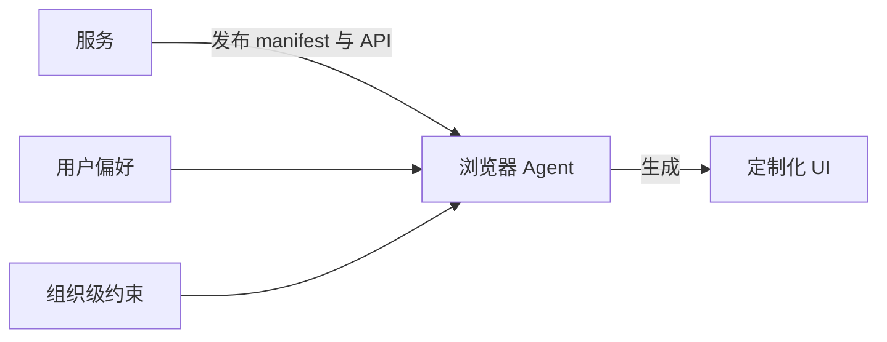

# 如果浏览器替你构建 UI，会怎样？

> 译文说明：本文为对英文文章 _What if your browser built the UI for you?_ 的中文翻译，尽量保留原文的技术语境与口语化表达。
>
> 来源：Jonno White，<https://jonno.nz/posts/what-if-your-browser-built-the-ui-for-you/>
>
> 原文发布日期：2026-04-05

我们正处在前端开发一个真正有点奇怪的转折点上。AI 现在已经能生成完整界面了，LLM 也能推理数据和布局。但即便如此，大多数 SaaS 产品依然在交付手工打造的 React 应用：每个产品都在自己造 UI、自己造无障碍层、自己造主题系统、自己造响应式断点。不是每一个服务都这样，但绝大多数确实如此。

而这背后投入了大量重复劳动，本质上却是在做同一件事：把数据展示给人，再让人完成操作。

我最近一直在反复思考这件事，也做了一个概念验证来测试一个想法：如果 UI 不是由服务端或前端应用构建，而是由浏览器自己生成，会怎么样？

## 现在的状态

整个行业正从多个方向靠近这个想法，但还没有谁真正把它落地到位。

[服务端驱动 UI](https://www.apollographql.com/docs/graphos/schema-design/guides/sdui/basics) 已经存在一段时间了。Airbnb 等公司在移动端率先实践了它，因为应用商店审核周期太长，发布 UI 变更很痛苦。服务端下发一棵描述渲染内容的 JSON 树，客户端只负责照着执行。这很聪明，但真正掌控局面的仍然是服务端。

Google 最近推出了 [Natively Adaptive Interfaces](https://developers.google.com/natively-adaptive-interfaces) ，这是一个借助 AI agent 把无障碍能力从“事后补救”变成“默认能力”的框架。这个方向很对，也确实很酷。但它仍然局限在单个应用的边界内。你的无障碍偏好不会在 Google 的产品和某个项目管理工具之间自动继承。

然后还有这波 [生成式 UI](https://www.copilotkit.ai) 浪潮。CopilotKit、Vercel 的 AI SDK 以及其他一些框架，都在让 LLM 动态生成组件。这些确实是强大的开发工具，但它们仍然只是开发工具。生成发生在构建阶段或者服务端，控制权依然掌握在服务提供方手里。

看到规律了吗？这些方案都把权力留在了服务端这一侧。

## 反过来想

这正是 [adaptive browser](https://github.com/jonnonz1/adaptive-browser) 背后的核心想法：如果生成 UI 这件事发生在你这一侧，会怎样？

服务不再把一个完成态的前端应用交付给你，而是发布一份 manifest，一种结构化的能力描述。它说明自己能做什么、有哪些端点、数据结构是什么样、有哪些可执行动作。你可以把它理解成一种更“语义化”的 API 规范。它不只是说“这里有个 GET 接口”，而是说“这里有一个仓库列表，可以按 star 数和语言排序，还支持创建、删除、加星和 fork”等能力。

你的浏览器拿到这份 manifest，去调用真实 API，获取真实数据，然后基于你的偏好来生成 UI。你的字号、你的配色方案、你偏爱的布局方式（表格、卡片还是看板）、你的无障碍需求，都可以跨所有服务统一生效。

像 GitHub 这样的服务，它的 manifest 大致可能长这样，也就是服务只描述自己的能力，剩下的交给浏览器决定：

```yaml
service:
  name: "GitHub"
  domain: "api.github.com"
capabilities:
  - id: "repositories"
    endpoints:
      - path: "/user/repos"
        semantic: "list"
        entity: "repository"
        sortable_fields: [name, updated_at, stargazers_count]
        actions: [create, delete, star, fork]
```

浏览器接收这些信息，拉取数据，再根据“你是谁”和“你想完成什么”，借助 LLM 推理出最合适的展示方式，生成一个真正为你量身定制的界面。

## 这件事的重要性，可能比听起来更大

我之前在 Xero 做应用商店和集成平台时，持续碰到一个很头疼的问题：每个第三方集成都有自己的一套 UI 习惯。用户每接入一个新应用，就得重新学一套界面。如果 UI 是浏览器基于统一偏好自动生成的，这个问题基本就直接消失了。

不过，真正最大的价值还是无障碍。现在的无障碍更像是后补上的一个功能，而且往往做得并不好。如果 UI 由浏览器生成，无障碍就不再是“一个功能”，而会变成默认前提。你的偏好，比如高对比度、键盘优先导航、屏幕阅读器优化、更大的字体，都可以在所有地方自动生效。不是因为每个开发者都记得实现这些，而是因为这些能力从一开始就内建在 UI 的生成机制里。

个性化也会真正变得属于个人。不是“从开发者提供的三个主题里选一个”，而是“这就是我使用软件的方式，统一适用于所有软件”。

## 但这种取舍也是真实存在的

前端复杂度会显著下降，但复杂度不会消失，它只是被转移到了 API 背后。坦白说，那里的复杂度甚至可能更高。

API 设计会变得重要得多。你不能再随便拼几个 REST 端点就完事。你的 manifest 必须是有语义的，它描述的不只是“数据长什么样”，而是“这些数据意味着什么”。服务之间的数据契约会变得更关键，版本管理也会更关键。



但关键在于，这种取舍会把我们推向一个真正有意思的方向。如果每个服务都必须通过 API 和 manifest 用语义化方式描述自己，那么 API 就会成为产品真正的表层，而不再是前端。真正的产品表面，会变成 API。

而一旦 API 成为产品表层，平台之间如何共享上下文就会变成最有意思的问题。你的项目管理工具知道你在做什么，你的邮箱知道你在和谁沟通，你的代码编辑器知道你正在构建什么。现在，这些工具几乎无法以有意义的方式互相对话，因为它们都被各自的 UI 锁住了。在一个由 manifest 驱动的世界里，这些上下文会通过 API 流动，而你的浏览器可以把它们拼接成一个真正连贯的工作界面。

## 接下来会走向哪里（我的看法）

我觉得，大概再过 3 到 5 年，这件事就会开始变得主流。所需的拼图其实已经都在了：能理解 UI 的 LLM、围绕通过 API 传递 UI 意图而展开的[标准化探索](https://www.builder.io/blog/ui-over-apis)，以及用户越来越强烈的预期，也就是软件应该适应他们，而不是反过来。

在这个世界里胜出的服务，不会是那些手工 UI 做得最漂亮的，而会是那些 API 最好、manifest 最丰富、数据最有价值的服务。前端会从“手工打造的输入”变成“自动生成的输出”。

组织会设定偏好的护栏，例如“员工可以用深色或浅色模式”“高风险操作必须二次确认”“某些字段必须始终可见”，而个人则在这些边界之内继续定制。你的浏览器会变成你的 agent，而不只是一个渲染器。

我做了一个 [adaptive browser](https://github.com/jonnonz1/adaptive-browser) 作为概念验证，来验证这套思路。它使用 Claude，根据 GitHub manifest 和 YAML 形式的用户偏好来生成 UI。现在它还很粗糙，但方向我认为是对的。

前端不会消失。但我们今天理解的“前端开发”很快就会改变。真正有意思的工作，会转向 API 设计、语义化数据契约，以及构建足够聪明、能成为真正用户代理的浏览器。
