# 架构设计阶段图表指南

## 1. 概述

架构设计阶段是软件开发中将需求转化为系统整体结构的关键环节。本指南介绍三类在架构设计阶段最常用的图表：

| 图表类型   | 核心用途               | 适用阶段       |
| ---------- | ---------------------- | -------------- |
| C4 模型    | 多层次展示软件架构     | 架构设计与沟通 |
| 系统架构图 | 自由形式展示系统结构   | 架构概览与方案 |
| 部署图     | 展示软件的物理部署方式 | 运维与基础设施 |

这三类图表的关系：

- **C4 模型**：提供标准化的四层架构视图，适合需要清晰层次和规范的团队
- **系统架构图**：自由形式，适合快速沟通和展示特定架构模式
- **部署图**：关注软件如何部署到基础设施，与 C4 模型的部署图概念一致

## 2. C4 模型

### 2.1 概述

**定义**：C4 模型是由 Simon Brown 提出的一种软件架构可视化方法，通过四个层次的抽象来描述软件系统的静态结构。

**名称来源**：C4 代表四个核心图表层次的首字母：

- **C**ontext（系统上下文）
- **C**ontainer（容器）
- **C**omponent（组件）
- **C**ode（代码）

**核心理念**：

- 不同层次面向不同受众（技术/非技术人员）
- 像地图一样逐层放大，从全局到细节
- 简单易学，开发者友好
- 不依赖特定的工具或符号标准

**层次结构示意**：

```
┌─────────────────────────────────────────────────────────────────┐
│  Level 1: System Context                                        │
│  最高层抽象，展示系统边界和外部交互                              │
│  受众：所有人（技术和非技术人员）                                │
│  ┌───────────────────────────────────────────────────────────┐  │
│  │  Level 2: Container                                       │  │
│  │  展示系统内部的高层架构（应用、数据库等）                  │  │
│  │  受众：技术人员（架构师、开发者）                          │  │
│  │  ┌─────────────────────────────────────────────────────┐  │  │
│  │  │  Level 3: Component                                 │  │  │
│  │  │  展示容器内部的组件划分                              │  │  │
│  │  │  受众：开发者                                        │  │  │
│  │  │  ┌───────────────────────────────────────────────┐  │  │  │
│  │  │  │  Level 4: Code                                │  │  │  │
│  │  │  │  展示组件的代码级实现（通常不画）             │  │  │  │
│  │  │  │  受众：开发者（需要时）                        │  │  │  │
│  │  │  └───────────────────────────────────────────────┘  │  │  │
│  │  └─────────────────────────────────────────────────────┘  │  │
│  └───────────────────────────────────────────────────────────┘  │
└─────────────────────────────────────────────────────────────────┘
```

### 2.2 Level 1: 系统上下文图 (System Context)

#### 目的

系统上下文图是 C4 模型的最高层抽象，展示软件系统的"大图"：

- 定义系统边界
- 识别系统的用户（人员、角色）
- 识别系统依赖的外部系统
- 展示系统与外部世界的交互关系

#### 核心元素

| 元素     | 说明                     | 图形表示       |
| -------- | ------------------------ | -------------- |
| 软件系统 | 被描述的目标系统         | 带标签的方框   |
| 人员     | 用户、角色、参与者       | 人形图标       |
| 外部系统 | 系统依赖的其他软件系统   | 带标签的灰色框 |
| 关系     | 系统与外部元素的交互关系 | 带标签的箭头   |

#### 适用受众

- **技术人员**：架构师、开发者、运维
- **非技术人员**：产品经理、业务方、管理层

#### 示例：电商平台系统上下文

```plantuml
@startuml
!include https://raw.githubusercontent.com/plantuml-stdlib/C4-PlantUML/master/C4_Context.puml

title 电商平台 - 系统上下文图

Person(customer, "顾客", "在线购物的消费者")
Person(admin, "运营人员", "管理商品、订单和用户")

System(ecommerce, "电商平台", "提供商品浏览、下单、支付等功能")

System_Ext(payment, "支付网关", "处理在线支付（微信、支付宝）")
System_Ext(logistics, "物流系统", "提供物流跟踪服务")
System_Ext(sms, "短信服务", "发送验证码和通知")
System_Ext(email, "邮件服务", "发送订单确认和营销邮件")

Rel(customer, ecommerce, "浏览商品、下单、查看订单")
Rel(admin, ecommerce, "管理商品、处理订单")
Rel(ecommerce, payment, "发起支付请求", "HTTPS/API")
Rel(ecommerce, logistics, "查询物流状态", "HTTPS/API")
Rel(ecommerce, sms, "发送短信", "HTTPS/API")
Rel(ecommerce, email, "发送邮件", "SMTP")

SHOW_LEGEND()
@enduml
```

#### Mermaid 简化表示

由于 Mermaid 原生不支持 C4 模型，可使用流程图模拟：

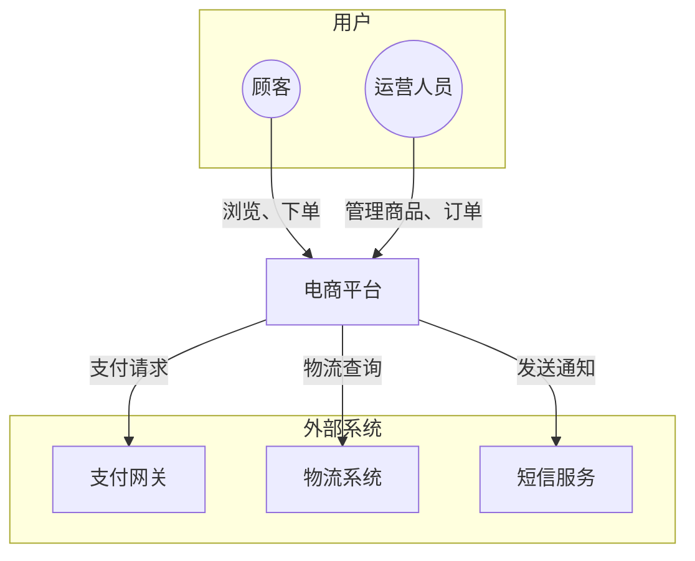

#### 最佳实践

1. **聚焦大图**：不要包含技术细节，关注"是什么"而非"怎么做"
2. **明确边界**：清晰区分系统内外
3. **简化关系**：关系描述使用业务语言，非技术术语
4. **控制元素数量**：外部系统不超过 10 个，过多则分组

### 2.3 Level 2: 容器图 (Container)

#### 目的

容器图放大单个软件系统，展示其内部的高层架构：

- 展示系统由哪些容器组成
- 说明主要的技术选型
- 描述容器之间的通信方式

#### 容器的定义

在 C4 模型中，"容器"是一个可独立运行/部署的单元：

| 容器类型 | 示例                           |
| -------- | ------------------------------ |
| Web 应用 | Spring Boot 服务、Node.js 应用 |
| 单页应用 | React SPA、Vue.js 前端         |
| 移动应用 | iOS App、Android App           |
| 桌面应用 | Electron 应用                  |
| 数据库   | MySQL、PostgreSQL、MongoDB     |
| 消息队列 | RabbitMQ、Kafka                |
| 文件存储 | AWS S3、MinIO                  |
| 缓存     | Redis、Memcached               |
| 搜索引擎 | Elasticsearch                  |

> **注意**：C4 中的"容器"与 Docker 容器不同，是更抽象的概念。

#### 核心元素

| 元素     | 说明                     | 图形表示       |
| -------- | ------------------------ | -------------- |
| 容器     | 应用或数据存储           | 带技术标签的框 |
| 人员     | 直接与容器交互的用户     | 人形图标       |
| 外部系统 | 直接与容器交互的外部系统 | 灰色框         |
| 关系     | 容器间或与外部的通信     | 带协议的箭头   |

#### 适用受众

- 软件架构师
- 开发人员
- 运维人员

#### 示例：电商平台容器图

```plantuml
@startuml
!include https://raw.githubusercontent.com/plantuml-stdlib/C4-PlantUML/master/C4_Container.puml

title 电商平台 - 容器图

Person(customer, "顾客", "在线购物的消费者")
Person(admin, "运营人员", "管理商品和订单")

System_Boundary(ecommerce, "电商平台") {
    Container(web, "Web 前端", "React", "提供购物界面")
    Container(admin_web, "管理后台", "Vue.js", "运营管理界面")
    Container(api, "API 服务", "Spring Boot", "提供业务 API")
    Container(worker, "异步任务", "Python/Celery", "处理异步任务")
    ContainerDb(db, "数据库", "MySQL", "存储业务数据")
    ContainerDb(cache, "缓存", "Redis", "缓存热点数据")
    ContainerQueue(mq, "消息队列", "RabbitMQ", "异步消息处理")
}

System_Ext(payment, "支付网关", "处理支付")
System_Ext(logistics, "物流系统", "物流跟踪")

Rel(customer, web, "使用", "HTTPS")
Rel(admin, admin_web, "使用", "HTTPS")
Rel(web, api, "调用", "HTTPS/JSON")
Rel(admin_web, api, "调用", "HTTPS/JSON")
Rel(api, db, "读写", "JDBC")
Rel(api, cache, "读写", "Redis Protocol")
Rel(api, mq, "发布消息", "AMQP")
Rel(worker, mq, "订阅消息", "AMQP")
Rel(worker, db, "读写", "JDBC")
Rel(api, payment, "支付请求", "HTTPS")
Rel(worker, logistics, "物流查询", "HTTPS")

SHOW_LEGEND()
@enduml
```

#### Mermaid 简化表示

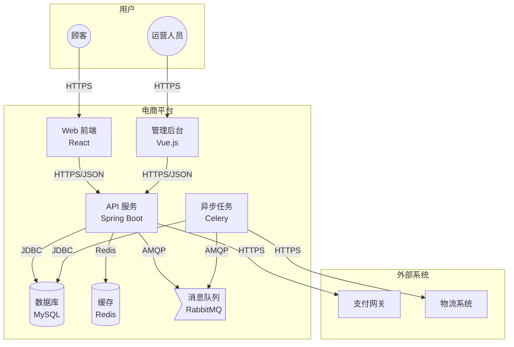

#### 最佳实践

1. **标注技术选型**：每个容器标明使用的技术
2. **标注通信协议**：关系线上标明 HTTPS、gRPC、AMQP 等
3. **不含部署细节**：不包含负载均衡、集群等，这些属于部署图
4. **保持简洁**：单张图不超过 15 个容器

### 2.4 Level 3: 组件图 (Component)

#### 目的

组件图放大单个容器，展示其内部的组件划分：

- 展示容器内部的主要组件
- 说明组件的职责
- 描述组件之间的依赖关系

#### 组件的定义

组件是容器内部的逻辑模块：

| 组件类型   | 示例              |
| ---------- | ----------------- |
| 控制器     | UserController    |
| 服务       | OrderService      |
| 仓储       | ProductRepository |
| 网关       | PaymentGateway    |
| 消息处理器 | OrderEventHandler |
| 定时任务   | InventorySyncJob  |

#### 核心元素

| 元素     | 说明                     | 图形表示   |
| -------- | ------------------------ | ---------- |
| 组件     | 容器内的逻辑模块         | 带标签的框 |
| 容器     | 与组件直接交互的其他容器 | 容器图标   |
| 外部系统 | 与组件直接交互的外部系统 | 灰色框     |
| 关系     | 组件间或与外部元素的依赖 | 箭头       |

#### 适用受众

- 软件架构师
- 开发人员

#### 何时绘制

> **官方建议**：不是每个容器都需要组件图。只在组件图能增加价值时才绘制，对于长期维护的文档考虑自动化生成。

适合绘制组件图的场景：

- 核心业务模块，需要让团队成员理解内部结构
- 复杂容器，需要明确职责划分
- 新成员入职，需要快速了解系统

#### 示例：API 服务组件图

```plantuml
@startuml
!include https://raw.githubusercontent.com/plantuml-stdlib/C4-PlantUML/master/C4_Component.puml

title API 服务 - 组件图

Container_Boundary(api, "API 服务") {
    Component(auth, "认证模块", "Spring Security", "处理用户认证和授权")
    Component(user_ctrl, "用户控制器", "Spring MVC", "处理用户相关请求")
    Component(order_ctrl, "订单控制器", "Spring MVC", "处理订单相关请求")
    Component(product_ctrl, "商品控制器", "Spring MVC", "处理商品相关请求")

    Component(user_svc, "用户服务", "Spring Service", "用户业务逻辑")
    Component(order_svc, "订单服务", "Spring Service", "订单业务逻辑")
    Component(product_svc, "商品服务", "Spring Service", "商品业务逻辑")

    Component(user_repo, "用户仓储", "Spring Data JPA", "用户数据访问")
    Component(order_repo, "订单仓储", "Spring Data JPA", "订单数据访问")
    Component(product_repo, "商品仓储", "Spring Data JPA", "商品数据访问")

    Component(payment_gw, "支付网关", "HTTP Client", "对接支付服务")
    Component(event_pub, "事件发布器", "Spring AMQP", "发布领域事件")
}

ContainerDb(db, "数据库", "MySQL")
ContainerDb(cache, "缓存", "Redis")
ContainerQueue(mq, "消息队列", "RabbitMQ")
System_Ext(payment, "支付网关")

Rel(user_ctrl, user_svc, "调用")
Rel(order_ctrl, order_svc, "调用")
Rel(product_ctrl, product_svc, "调用")

Rel(user_svc, user_repo, "使用")
Rel(order_svc, order_repo, "使用")
Rel(order_svc, payment_gw, "使用")
Rel(order_svc, event_pub, "使用")
Rel(product_svc, product_repo, "使用")
Rel(product_svc, cache, "读写")

Rel(user_repo, db, "读写")
Rel(order_repo, db, "读写")
Rel(product_repo, db, "读写")

Rel(payment_gw, payment, "调用")
Rel(event_pub, mq, "发布")

SHOW_LEGEND()
@enduml
```

#### Mermaid 简化表示

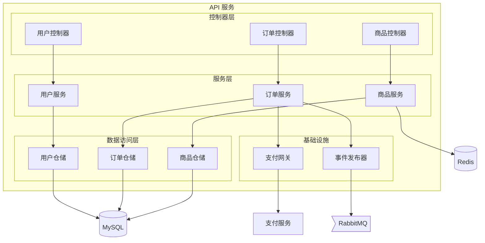

#### 最佳实践

1. **分层展示**：按职责分层（控制器、服务、仓储）
2. **明确职责**：每个组件标注其主要职责
3. **控制粒度**：不要展示太细的组件，保持在模块级别
4. **按需绘制**：只为核心容器绘制组件图

### 2.5 Level 4: 代码图 (Code)

#### 何时需要

代码图展示组件的内部实现，通常是类图或实体关系图。**官方建议**：

> 大多数情况下不需要绘制代码图。如果确实需要，建议从代码自动生成而非手动绘制。

适合绘制代码图的场景：

- 核心领域模型的类设计
- 复杂算法的结构说明
- 设计模式的应用

#### 与类图的关系

代码图本质上就是 UML 类图，参考 [详细设计阶段图表指南](./diagrams-design.md) 中的类图章节。

#### 示例：订单聚合根

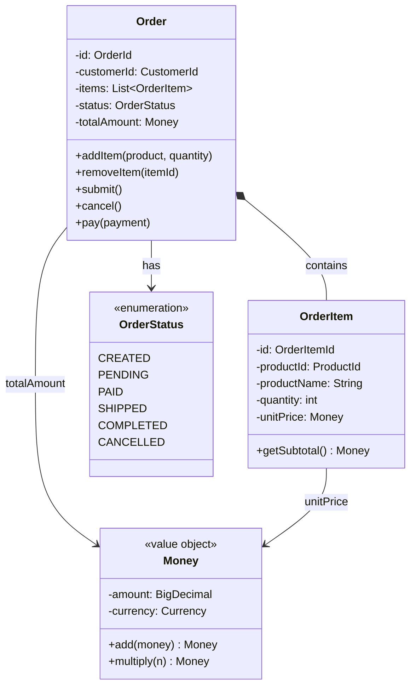

### 2.6 工具与语法

#### PlantUML C4

PlantUML 通过 C4-PlantUML 库提供完整的 C4 模型支持。

**引入库文件**：

```plantuml
' 系统上下文图
!include https://raw.githubusercontent.com/plantuml-stdlib/C4-PlantUML/master/C4_Context.puml

' 容器图
!include https://raw.githubusercontent.com/plantuml-stdlib/C4-PlantUML/master/C4_Container.puml

' 组件图
!include https://raw.githubusercontent.com/plantuml-stdlib/C4-PlantUML/master/C4_Component.puml

' 部署图
!include https://raw.githubusercontent.com/plantuml-stdlib/C4-PlantUML/master/C4_Deployment.puml
```

**核心宏**：

| 宏                     | 用途             |
| ---------------------- | ---------------- |
| `Person(alias, label)` | 定义人员         |
| `Person_Ext()`         | 定义外部人员     |
| `System(alias, label)` | 定义系统         |
| `System_Ext()`         | 定义外部系统     |
| `System_Boundary()`    | 定义系统边界     |
| `Container()`          | 定义容器         |
| `ContainerDb()`        | 定义数据库容器   |
| `ContainerQueue()`     | 定义消息队列容器 |
| `Container_Boundary()` | 定义容器边界     |
| `Component()`          | 定义组件         |
| `Rel(from, to, label)` | 定义关系         |
| `Rel_R()` / `Rel_L()`  | 定义方向关系     |
| `SHOW_LEGEND()`        | 显示图例         |

**完整示例**：

```plantuml
@startuml
!include https://raw.githubusercontent.com/plantuml-stdlib/C4-PlantUML/master/C4_Container.puml

title 系统名称 - 容器图

' 定义人员
Person(user, "用户", "系统使用者")

' 定义系统边界
System_Boundary(system, "系统名称") {
    Container(web, "Web 应用", "React", "用户界面")
    Container(api, "API 服务", "Node.js", "业务逻辑")
    ContainerDb(db, "数据库", "PostgreSQL", "数据存储")
}

' 定义外部系统
System_Ext(ext, "外部服务", "第三方服务")

' 定义关系
Rel(user, web, "使用", "HTTPS")
Rel(web, api, "调用", "JSON/HTTPS")
Rel(api, db, "读写", "SQL")
Rel(api, ext, "集成", "REST API")

SHOW_LEGEND()
@enduml
```

#### Structurizr DSL

Structurizr 是 C4 模型作者创建的专用工具，使用声明式 DSL 定义架构模型。

**基本语法**：

```
workspace {
    model {
        // 定义人员
        user = person "用户" "系统使用者"

        // 定义系统
        system = softwareSystem "电商平台" "在线购物系统" {
            // 定义容器
            webapp = container "Web 应用" "React" "用户界面"
            api = container "API 服务" "Spring Boot" "业务逻辑"
            db = container "数据库" "MySQL" "数据存储" "Database"
        }

        // 定义外部系统
        payment = softwareSystem "支付网关" "处理支付" "External"

        // 定义关系
        user -> webapp "使用"
        webapp -> api "调用" "JSON/HTTPS"
        api -> db "读写" "JDBC"
        api -> payment "支付请求" "HTTPS"
    }

    views {
        systemContext system {
            include *
            autolayout lr
        }

        container system {
            include *
            autolayout lr
        }
    }
}
```

#### Mermaid（有限支持）

Mermaid 原生不支持 C4 模型，但可以使用 flowchart 模拟：

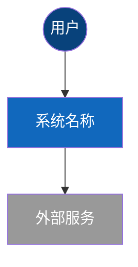

#### 工具对比

| 工具        | 优点                    | 缺点                   | 适用场景     |
| ----------- | ----------------------- | ---------------------- | ------------ |
| PlantUML C4 | 语法成熟、功能完善      | 需要渲染服务           | 正式架构文档 |
| Structurizr | 官方工具、模型驱动      | 学习曲线较陡           | 大型项目     |
| Mermaid     | Markdown 集成、简单易用 | 只能模拟、功能有限     | 快速草图     |
| Draw.io     | 免费、图标丰富          | 手动绘制、无法版本控制 | 一次性展示   |
| Lucidchart  | 协作方便、模板丰富      | 需付费                 | 团队协作     |

### 2.7 最佳实践

#### 通用原则

1. **逐层深入**：从 Context 开始，按需深入到 Container 和 Component

2. **保持一致**：同一项目的所有 C4 图使用统一的命名和样式

3. **适度抽象**：每层图关注该层次的信息，不要跨层混合

4. **面向受众**：
   - Context 图：所有利益相关者
   - Container 图：技术团队
   - Component 图：开发人员

5. **版本控制**：使用文本格式（PlantUML、Structurizr DSL）便于版本管理

#### 元素命名

| 元素类型 | 命名建议           | 示例                 |
| -------- | ------------------ | -------------------- |
| 系统     | 产品名称或业务名称 | 电商平台、支付系统   |
| 容器     | 技术类型 + 功能    | API 服务、Web 前端   |
| 组件     | 职责 + 类型        | 订单服务、用户控制器 |
| 关系     | 动词 + 简要说明    | 调用、读写、发送消息 |

#### 关系描述

```
✅ 好的关系描述：
- "调用 API 获取用户信息"
- "读写订单数据"
- "发送支付请求，返回支付结果"

❌ 不好的关系描述：
- "连接"（太模糊）
- "使用 TCP/IP 协议通过端口 8080 发送 HTTP POST 请求..."（太详细）
```

### 2.8 常见错误

| 错误              | 问题描述                  | 正确做法                            |
| ----------------- | ------------------------- | ----------------------------------- |
| ❌ 跨层混合       | 在 Context 图中画出数据库 | ✅ 数据库属于 Container 层          |
| ❌ 忽略外部系统   | 只画自己的系统，忽略依赖  | ✅ 明确标注所有外部依赖             |
| ❌ 容器和组件混淆 | 把 Service 类当作容器     | ✅ 容器是可部署单元，组件是逻辑模块 |
| ❌ 过度详细       | Component 图画到每个类    | ✅ 保持适当抽象层次                 |
| ❌ 缺少技术标签   | 容器没有标注使用的技术    | ✅ 每个容器标注技术选型             |
| ❌ 关系没有说明   | 箭头没有标签              | ✅ 关系要说明交互内容和协议         |
| ❌ 图表孤立       | 各层图表没有关联          | ✅ 确保上下层图表元素对应           |

### 2.9 模板

#### 系统上下文图模板

```plantuml
@startuml
!include https://raw.githubusercontent.com/plantuml-stdlib/C4-PlantUML/master/C4_Context.puml

title [系统名称] - 系统上下文图

' 人员
Person(user1, "用户角色1", "角色描述")
Person(user2, "用户角色2", "角色描述")

' 目标系统
System(system, "系统名称", "系统简要描述")

' 外部系统
System_Ext(ext1, "外部系统1", "系统描述")
System_Ext(ext2, "外部系统2", "系统描述")

' 关系
Rel(user1, system, "使用方式")
Rel(user2, system, "使用方式")
Rel(system, ext1, "交互描述", "协议")
Rel(system, ext2, "交互描述", "协议")

SHOW_LEGEND()
@enduml
```

#### 容器图模板

```plantuml
@startuml
!include https://raw.githubusercontent.com/plantuml-stdlib/C4-PlantUML/master/C4_Container.puml

title [系统名称] - 容器图

' 人员
Person(user, "用户", "描述")

' 系统边界
System_Boundary(system, "系统名称") {
    ' 前端
    Container(web, "Web 应用", "技术", "描述")
    Container(mobile, "移动应用", "技术", "描述")

    ' 后端
    Container(api, "API 服务", "技术", "描述")
    Container(worker, "后台任务", "技术", "描述")

    ' 数据存储
    ContainerDb(db, "数据库", "技术", "描述")
    ContainerDb(cache, "缓存", "技术", "描述")
    ContainerQueue(mq, "消息队列", "技术", "描述")
}

' 外部系统
System_Ext(ext, "外部系统", "描述")

' 关系
Rel(user, web, "使用", "HTTPS")
Rel(user, mobile, "使用", "HTTPS")
Rel(web, api, "调用", "JSON/HTTPS")
Rel(mobile, api, "调用", "JSON/HTTPS")
Rel(api, db, "读写", "协议")
Rel(api, cache, "读写", "协议")
Rel(api, mq, "发布", "协议")
Rel(worker, mq, "订阅", "协议")
Rel(api, ext, "集成", "协议")

SHOW_LEGEND()
@enduml
```

#### 组件图模板

```plantuml
@startuml
!include https://raw.githubusercontent.com/plantuml-stdlib/C4-PlantUML/master/C4_Component.puml

title [容器名称] - 组件图

' 容器边界
Container_Boundary(container, "容器名称") {
    ' 接口层
    Component(ctrl1, "控制器1", "技术", "职责描述")
    Component(ctrl2, "控制器2", "技术", "职责描述")

    ' 业务层
    Component(svc1, "服务1", "技术", "职责描述")
    Component(svc2, "服务2", "技术", "职责描述")

    ' 数据访问层
    Component(repo1, "仓储1", "技术", "职责描述")
    Component(repo2, "仓储2", "技术", "职责描述")

    ' 基础设施
    Component(client, "外部客户端", "技术", "职责描述")
}

' 外部依赖
ContainerDb(db, "数据库", "技术")
System_Ext(ext, "外部服务")

' 关系
Rel(ctrl1, svc1, "调用")
Rel(ctrl2, svc2, "调用")
Rel(svc1, repo1, "使用")
Rel(svc2, repo2, "使用")
Rel(svc2, client, "使用")
Rel(repo1, db, "读写")
Rel(repo2, db, "读写")
Rel(client, ext, "调用")

SHOW_LEGEND()
@enduml
```

## 3. 系统架构图

### 3.1 概述

**定义**：系统架构图是一种自由形式的图表，用于展示系统的整体结构和主要组件。与 C4 模型不同，它没有严格的规范，更灵活但也更容易产生歧义。

**核心用途**：

- 快速展示系统的高层设计
- 说明系统采用的架构模式
- 在方案评审中呈现技术选型
- 作为架构决策的可视化记录

**适用场景**：

| 适合使用           | 不适合使用           |
| ------------------ | -------------------- |
| 方案评审和技术分享 | 需要标准化的架构文档 |
| 快速沟通架构思想   | 长期维护的技术文档   |
| 展示特定架构模式   | 需要精确定义的场景   |
| 头脑风暴和初步设计 | 跨团队协作的基础     |

### 3.2 常见架构模式

#### 分层架构 (Layered Architecture)

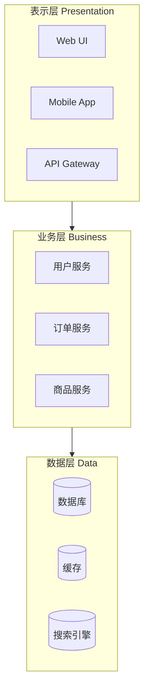

#### 微服务架构 (Microservices)

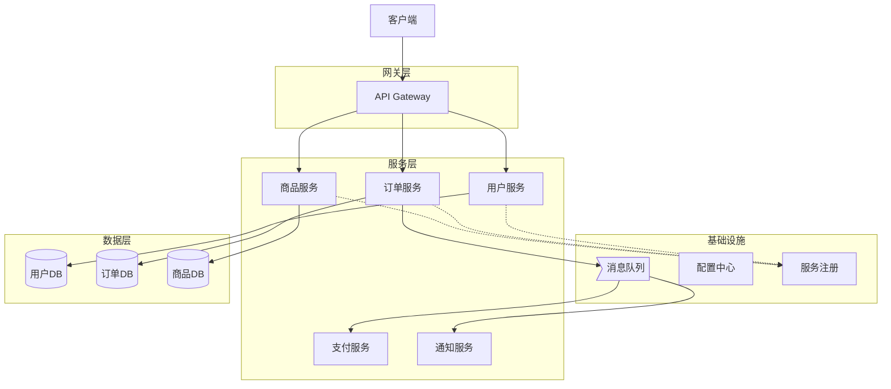

#### 事件驱动架构 (Event-Driven)

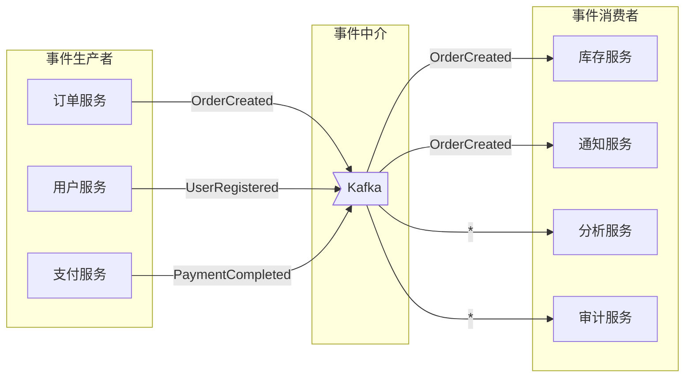

#### CQRS 模式

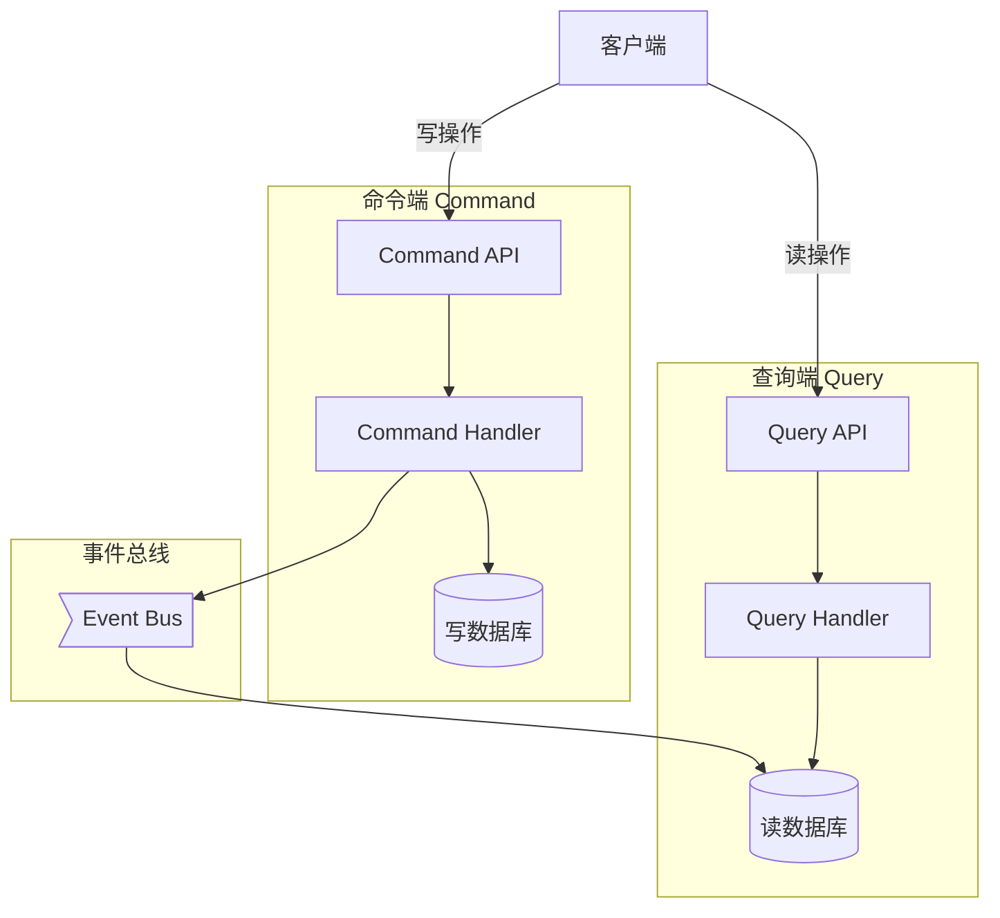

### 3.3 绘制技巧

#### 常用图形约定

| 元素        | 常用图形     | 示例               |
| ----------- | ------------ | ------------------ |
| 用户/客户端 | 人形或矩形   | 浏览器、移动端     |
| 服务/应用   | 矩形         | API 服务、Web 应用 |
| 数据库      | 圆柱形       | MySQL、MongoDB     |
| 消息队列    | 平行四边形   | Kafka、RabbitMQ    |
| 缓存        | 圆柱或矩形   | Redis、Memcached   |
| 外部系统    | 灰色矩形     | 第三方 API         |
| 负载均衡    | 菱形或特殊形 | Nginx、ALB         |

#### 布局原则

1. **从上到下**：用户在上，数据在下
2. **从左到右**：输入在左，输出在右
3. **分组清晰**：相关组件放在一起
4. **箭头明确**：标注数据流向和协议

#### 标注规范

```
✅ 好的标注：
- 箭头上标注：协议、端口、数据类型
- 组件上标注：技术栈、版本
- 分组上标注：职责、环境

❌ 不好的标注：
- 没有任何标注
- 标注过于详细（如完整的配置）
- 使用缩写没有说明
```

### 3.4 示例：电商平台系统架构

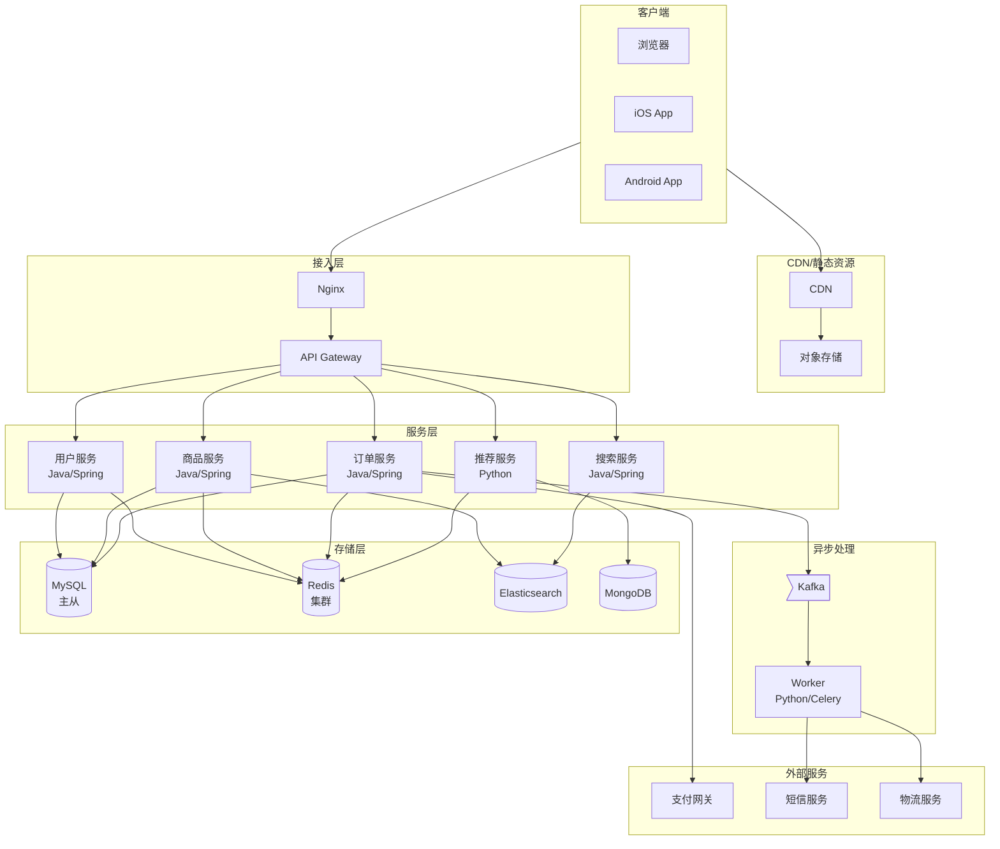

### 3.5 最佳实践

1. **明确图表目的**：在绘制前确定想要表达什么

2. **选择合适的抽象层次**：
   - 全局概览：只画主要组件
   - 详细设计：展示所有交互

3. **使用一致的图形语言**：团队内部约定统一的符号

4. **标注关键信息**：
   - 技术选型
   - 通信协议
   - 数据流向

5. **添加图例**：解释图中使用的符号和颜色

### 3.6 常见错误

| 错误            | 问题描述                 | 正确做法                        |
| --------------- | ------------------------ | ------------------------------- |
| ❌ 过于复杂     | 一张图包含所有细节       | ✅ 分层展示，每张图聚焦一个主题 |
| ❌ 缺少标注     | 组件没有名称和说明       | ✅ 标注组件名称、技术栈         |
| ❌ 箭头混乱     | 线条交叉、方向不清       | ✅ 合理布局、箭头标注方向和含义 |
| ❌ 抽象不一致   | 有的画到类，有的画到服务 | ✅ 保持同一抽象层次             |
| ❌ 忽略外部依赖 | 只画自己的系统           | ✅ 包含重要的外部系统和服务     |

### 3.7 模板

#### 通用系统架构模板

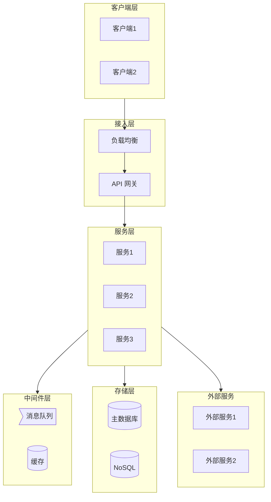

## 4. 部署图 (Deployment Diagram)

### 4.1 概述

**定义**：部署图展示软件系统或容器的实例如何部署到基础设施上，描述软件与硬件之间的映射关系。

**核心用途**：

- 展示系统的物理部署方式
- 说明软件组件在基础设施上的分布
- 描述不同环境（开发、测试、生产）的部署差异
- 支持容量规划和故障分析

**适用场景**：

| 适合使用           | 不适合使用   |
| ------------------ | ------------ |
| 运维文档           | 展示业务逻辑 |
| 基础设施规划       | 描述代码结构 |
| 故障排查和性能分析 | 需求分析阶段 |
| 安全审计和合规检查 | 组件交互设计 |

### 4.2 基本元素

| 元素     | 说明               | 表示方法     |
| -------- | ------------------ | ------------ |
| 部署节点 | 软件运行的位置     | 立体方框     |
| 制品     | 部署到节点上的软件 | 矩形或图标   |
| 通信路径 | 节点之间的网络连接 | 带标签的连线 |
| 规格     | 节点的硬件配置     | 标注或备注   |

#### 部署节点类型

| 节点类型   | 示例                      |
| ---------- | ------------------------- |
| 物理服务器 | Dell PowerEdge R740       |
| 虚拟机     | AWS EC2、VMware VM        |
| 容器       | Docker Container          |
| 容器编排   | Kubernetes Pod            |
| 云服务     | AWS RDS、Azure SQL        |
| 执行环境   | JVM、Node.js Runtime      |
| 设备       | Mobile Device、IoT Device |

### 4.3 示例

#### 传统部署架构

```plantuml
@startuml
!include https://raw.githubusercontent.com/plantuml-stdlib/C4-PlantUML/master/C4_Deployment.puml

title 电商平台 - 生产环境部署图

Deployment_Node(cdn, "CDN", "阿里云 CDN") {
    Deployment_Node(cdn_edge, "边缘节点") {
        Container(static, "静态资源", "HTML/CSS/JS")
    }
}

Deployment_Node(dc, "数据中心", "阿里云 华东1") {
    Deployment_Node(lb, "负载均衡", "SLB") {
        Container(nginx, "Nginx", "反向代理")
    }

    Deployment_Node(web_cluster, "Web 集群", "ECS x 4") {
        Deployment_Node(web1, "web-1", "4C8G") {
            Container(api1, "API 服务", "Spring Boot")
        }
        Deployment_Node(web2, "web-2", "4C8G") {
            Container(api2, "API 服务", "Spring Boot")
        }
    }

    Deployment_Node(worker_cluster, "Worker 集群", "ECS x 2") {
        Deployment_Node(worker1, "worker-1", "2C4G") {
            Container(celery1, "Celery Worker", "Python")
        }
    }

    Deployment_Node(db_cluster, "数据库集群", "RDS MySQL") {
        Deployment_Node(db_master, "主库", "8C32G") {
            ContainerDb(mysql_master, "MySQL Master")
        }
        Deployment_Node(db_slave, "从库", "8C32G") {
            ContainerDb(mysql_slave, "MySQL Slave")
        }
    }

    Deployment_Node(cache_cluster, "缓存集群", "Redis 集群") {
        ContainerDb(redis, "Redis Cluster", "6 节点")
    }

    Deployment_Node(mq_cluster, "消息队列", "RabbitMQ 集群") {
        ContainerQueue(rabbitmq, "RabbitMQ", "3 节点")
    }
}

Rel(cdn_edge, lb, "HTTPS", "443")
Rel(nginx, web_cluster, "HTTP", "8080")
Rel(api1, mysql_master, "JDBC", "3306")
Rel(api2, mysql_master, "JDBC", "3306")
Rel(api1, redis, "Redis", "6379")
Rel(api1, rabbitmq, "AMQP", "5672")
Rel(celery1, rabbitmq, "AMQP", "5672")
Rel(mysql_master, mysql_slave, "复制", "3306")

SHOW_LEGEND()
@enduml
```

#### Kubernetes 部署架构

```mermaid
flowchart TB
    subgraph internet[Internet]
        users((用户))
    end

    subgraph cloud[云平台]
        subgraph k8s[Kubernetes 集群]
            subgraph ingress[Ingress]
                nginx_ing[Nginx Ingress<br/>Controller]
            end

            subgraph ns_app[Namespace: app]
                subgraph deploy_api[Deployment: api]
                    api_pod1[Pod: api-1<br/>API 服务]
                    api_pod2[Pod: api-2<br/>API 服务]
                    api_pod3[Pod: api-3<br/>API 服务]
                end

                subgraph deploy_worker[Deployment: worker]
                    worker_pod1[Pod: worker-1<br/>Celery]
                    worker_pod2[Pod: worker-2<br/>Celery]
                end

                svc_api[Service: api-svc<br/>ClusterIP]
            end

            subgraph ns_infra[Namespace: infra]
                redis_sts[StatefulSet: redis<br/>Redis Cluster]
                kafka_sts[StatefulSet: kafka<br/>Kafka Cluster]
            end
        end

        subgraph managed[托管服务]
            rds[(RDS MySQL)]
            oss[OSS 对象存储]
        end
    end

    users --> nginx_ing
    nginx_ing --> svc_api
    svc_api --> deploy_api
    deploy_api --> rds
    deploy_api --> redis_sts
    deploy_api --> kafka_sts
    kafka_sts --> deploy_worker
    deploy_api --> oss
```

#### AWS 云部署架构

```
┌─────────────────────────────────────────────────────────────────────────┐
│                              AWS Cloud                                   │
│  ┌───────────────────────────────────────────────────────────────────┐  │
│  │                           VPC (10.0.0.0/16)                        │  │
│  │                                                                    │  │
│  │  ┌──────────────────────┐    ┌──────────────────────┐            │  │
│  │  │ Public Subnet        │    │ Public Subnet        │            │  │
│  │  │ (10.0.1.0/24)        │    │ (10.0.2.0/24)        │            │  │
│  │  │                      │    │                      │            │  │
│  │  │  ┌──────────────┐   │    │  ┌──────────────┐   │            │  │
│  │  │  │   NAT GW     │   │    │  │   NAT GW     │   │            │  │
│  │  │  └──────────────┘   │    │  └──────────────┘   │            │  │
│  │  │         │           │    │         │           │            │  │
│  │  │  ┌──────────────┐   │    │  ┌──────────────┐   │            │  │
│  │  │  │    ALB       │   │    │  │    ALB       │   │            │  │
│  │  │  └──────────────┘   │    │  └──────────────┘   │            │  │
│  │  └──────────────────────┘    └──────────────────────┘            │  │
│  │            │                           │                          │  │
│  │  ┌──────────────────────┐    ┌──────────────────────┐            │  │
│  │  │ Private Subnet       │    │ Private Subnet       │            │  │
│  │  │ (10.0.3.0/24)        │    │ (10.0.4.0/24)        │            │  │
│  │  │                      │    │                      │            │  │
│  │  │  ┌──────────────┐   │    │  ┌──────────────┐   │            │  │
│  │  │  │  ECS Task    │   │    │  │  ECS Task    │   │            │  │
│  │  │  │  (API)       │   │    │  │  (API)       │   │            │  │
│  │  │  └──────────────┘   │    │  └──────────────┘   │            │  │
│  │  │                      │    │                      │            │  │
│  │  │  ┌──────────────┐   │    │  ┌──────────────┐   │            │  │
│  │  │  │  ECS Task    │   │    │  │  ECS Task    │   │            │  │
│  │  │  │  (Worker)    │   │    │  │  (Worker)    │   │            │  │
│  │  │  └──────────────┘   │    │  └──────────────┘   │            │  │
│  │  └──────────────────────┘    └──────────────────────┘            │  │
│  │            │                           │                          │  │
│  │  ┌─────────────────────────────────────────────────────────────┐  │  │
│  │  │                    Data Subnet (10.0.5.0/24)                 │  │  │
│  │  │                                                              │  │  │
│  │  │  ┌──────────────┐  ┌──────────────┐  ┌──────────────┐      │  │  │
│  │  │  │  RDS MySQL   │  │ ElastiCache  │  │    MSK       │      │  │  │
│  │  │  │  (Primary)   │  │   (Redis)    │  │   (Kafka)    │      │  │  │
│  │  │  └──────────────┘  └──────────────┘  └──────────────┘      │  │  │
│  │  │         │                                                   │  │  │
│  │  │  ┌──────────────┐                                          │  │  │
│  │  │  │  RDS MySQL   │                                          │  │  │
│  │  │  │  (Replica)   │                                          │  │  │
│  │  │  └──────────────┘                                          │  │  │
│  │  └─────────────────────────────────────────────────────────────┘  │  │
│  └───────────────────────────────────────────────────────────────────┘  │
│                                                                          │
│  ┌──────────────┐  ┌──────────────┐  ┌──────────────┐                  │
│  │  CloudFront  │  │     S3       │  │   Route 53   │                  │
│  │    (CDN)     │  │   (存储)     │  │    (DNS)     │                  │
│  └──────────────┘  └──────────────┘  └──────────────┘                  │
└─────────────────────────────────────────────────────────────────────────┘
```

### 4.4 绘制工具

| 工具               | 类型     | 优点                   | 缺点           |
| ------------------ | -------- | ---------------------- | -------------- |
| PlantUML C4        | 文本绘图 | 版本控制友好、语法规范 | 复杂图布局受限 |
| Draw.io + AWS 图标 | 免费工具 | 图标丰富、免费         | 手动布局       |
| Cloudcraft         | 在线工具 | AWS 专用、3D 效果      | 仅支持 AWS     |
| Lucidchart         | 在线工具 | 多云支持、协作方便     | 需付费         |
| Diagrams (Python)  | 代码生成 | 程序化生成、版本控制   | 需要编程       |
| Mermaid            | 文本绘图 | Markdown 集成          | 图标支持有限   |

### 4.5 最佳实践

1. **标注硬件规格**：CPU、内存、存储等关键配置

2. **展示网络拓扑**：
   - 子网划分
   - 安全组/防火墙
   - 负载均衡

3. **区分环境**：
   - 开发、测试、生产环境分别绘制
   - 或在一张图中用颜色区分

4. **包含监控和日志**：
   - 监控系统（Prometheus、CloudWatch）
   - 日志系统（ELK、CloudWatch Logs）

5. **使用云厂商图标**：
   - 提高辨识度
   - 在图例中说明

### 4.6 常见错误

| 错误              | 问题描述                 | 正确做法                        |
| ----------------- | ------------------------ | ------------------------------- |
| ❌ 缺少网络信息   | 只画节点，不画网络       | ✅ 标注 VPC、子网、安全组       |
| ❌ 忽略高可用     | 只画单点，不展示冗余     | ✅ 展示多可用区、主从、集群     |
| ❌ 规格不明确     | 不知道节点的具体配置     | ✅ 标注 CPU、内存、实例类型     |
| ❌ 端口和协议不清 | 连线没有标注             | ✅ 标注端口号和通信协议         |
| ❌ 混淆逻辑和物理 | 把服务和物理节点混在一起 | ✅ 先画物理节点，再画部署的服务 |

### 4.7 模板

#### 基础部署图模板

```plantuml
@startuml
!include https://raw.githubusercontent.com/plantuml-stdlib/C4-PlantUML/master/C4_Deployment.puml

title [系统名称] - [环境] 部署图

Deployment_Node(client, "客户端", "浏览器/App") {
    Container(app, "客户端应用", "技术")
}

Deployment_Node(cloud, "云平台", "提供商") {
    Deployment_Node(lb, "负载均衡", "类型") {
        Container(nginx, "反向代理", "Nginx")
    }

    Deployment_Node(app_server, "应用服务器", "规格") {
        Container(api, "API 服务", "技术")
    }

    Deployment_Node(worker_server, "Worker 服务器", "规格") {
        Container(worker, "异步任务", "技术")
    }

    Deployment_Node(db_server, "数据库服务器", "规格") {
        ContainerDb(db, "数据库", "技术")
    }

    Deployment_Node(cache_server, "缓存服务器", "规格") {
        ContainerDb(cache, "缓存", "技术")
    }

    Deployment_Node(mq_server, "消息队列", "规格") {
        ContainerQueue(mq, "消息队列", "技术")
    }
}

Rel(client, lb, "HTTPS", "443")
Rel(lb, app_server, "HTTP", "8080")
Rel(api, db, "连接协议", "端口")
Rel(api, cache, "连接协议", "端口")
Rel(api, mq, "连接协议", "端口")
Rel(worker, mq, "连接协议", "端口")

SHOW_LEGEND()
@enduml
```

#### Kubernetes 部署模板

```mermaid
flowchart TB
    subgraph cluster[Kubernetes Cluster]
        subgraph ingress[Ingress Layer]
            ing[Ingress Controller]
        end

        subgraph services[Service Layer]
            svc1[Service: svc-1]
            svc2[Service: svc-2]
        end

        subgraph workloads[Workload Layer]
            deploy1[Deployment: app-1]
            deploy2[Deployment: app-2]
            sts1[StatefulSet: db]
        end

        subgraph storage[Storage Layer]
            pvc1[PVC: data-1]
            pvc2[PVC: data-2]
        end
    end

    subgraph external[External Services]
        ext_db[(Cloud Database)]
        ext_storage[Object Storage]
    end

    ing --> services
    services --> workloads
    workloads --> storage
    workloads --> external
```

## 5. 总结

### 5.1 三类图表对比

| 维度     | C4 模型               | 系统架构图          | 部署图               |
| -------- | --------------------- | ------------------- | -------------------- |
| 规范程度 | 标准化的四层模型      | 自由形式            | 相对标准化           |
| 核心关注 | 软件系统的逻辑结构    | 系统设计和模式      | 软件的物理部署       |
| 适用受众 | 各层次不同受众        | 技术团队            | 运维和架构师         |
| 抽象层次 | 多层次，逐级深入      | 通常是单一层次      | 关注物理层面         |
| 工具支持 | PlantUML、Structurizr | Draw.io、Lucidchart | PlantUML、云厂商工具 |
| 学习成本 | 中等                  | 低                  | 中等                 |

### 5.2 选择指南

| 场景                 | 推荐图表                      |
| -------------------- | ----------------------------- |
| 给非技术人员介绍系统 | C4 Context 图                 |
| 技术方案评审         | 系统架构图 或 C4 Container 图 |
| 新成员熟悉系统架构   | C4 Container + Component 图   |
| 展示特定架构模式     | 系统架构图                    |
| 运维文档和故障排查   | 部署图                        |
| 基础设施规划         | 部署图                        |
| 长期维护的架构文档   | C4 模型全套                   |

### 5.3 工具选择速查

| 需求场景      | 推荐工具                      |
| ------------- | ----------------------------- |
| 版本控制集成  | PlantUML C4 / Structurizr DSL |
| 快速草图      | Mermaid / Draw.io             |
| 云架构设计    | Draw.io + 云图标 / Cloudcraft |
| 团队协作      | Lucidchart / Miro             |
| Markdown 文档 | Mermaid                       |
| 正式架构文档  | PlantUML C4 / Structurizr     |

### 5.4 图表配合使用

```
架构设计阶段图表使用流程：

1. 系统定位阶段
   └── 使用【C4 Context 图】明确系统边界和外部交互
       └── 面向所有利益相关者

2. 架构设计阶段
   └── 使用【C4 Container 图】设计系统内部高层架构
   └── 或使用【系统架构图】展示架构模式和技术选型
       └── 面向技术团队

3. 详细设计阶段
   └── 使用【C4 Component 图】设计核心容器内部结构
       └── 面向开发人员
       └── 只为复杂容器绘制

4. 部署规划阶段
   └── 使用【部署图】设计基础设施和部署方案
       └── 面向运维和架构师
       └── 区分不同环境
```

### 5.5 速查表

#### C4 模型层次速查

| 层次      | 展示内容           | 目标受众 | 是否必需   |
| --------- | ------------------ | -------- | ---------- |
| Context   | 系统边界和外部交互 | 所有人   | 推荐       |
| Container | 系统内部高层架构   | 技术人员 | 推荐       |
| Component | 容器内部组件       | 开发人员 | 可选       |
| Code      | 代码级设计         | 开发人员 | 通常不需要 |

#### PlantUML C4 语法速查

| 功能           | 语法                                       |
| -------------- | ------------------------------------------ |
| 引入 Context   | `!include .../C4_Context.puml`             |
| 引入 Container | `!include .../C4_Container.puml`           |
| 引入 Component | `!include .../C4_Component.puml`           |
| 人员           | `Person(alias, label, description)`        |
| 系统           | `System(alias, label, description)`        |
| 外部系统       | `System_Ext(alias, label, description)`    |
| 系统边界       | `System_Boundary(alias, label) { }`        |
| 容器           | `Container(alias, label, tech, desc)`      |
| 数据库容器     | `ContainerDb(alias, label, tech, desc)`    |
| 队列容器       | `ContainerQueue(alias, label, tech, desc)` |
| 组件           | `Component(alias, label, tech, desc)`      |
| 关系           | `Rel(from, to, label, tech)`               |
| 显示图例       | `SHOW_LEGEND()`                            |

## 6. 参考资源

### 官方文档

- [C4 Model 官网](https://c4model.com/)
- [C4-PlantUML GitHub](https://github.com/plantuml-stdlib/C4-PlantUML)
- [Structurizr](https://structurizr.com/)
- [PlantUML 官方文档](https://plantuml.com/)

### 推荐阅读

- 《Software Architecture for Developers》- Simon Brown
- 《The C4 Model for Visualising Software Architecture》- Simon Brown
- [InfoQ - C4 Model 介绍](https://www.infoq.com/articles/C4-architecture-model/)
- [Martin Fowler - Software Architecture Guide](https://martinfowler.com/architecture/)

### 在线工具

- [PlantUML 在线编辑器](https://www.plantuml.com/plantuml/)
- [Mermaid 在线编辑器](https://mermaid.live/)
- [Draw.io](https://app.diagrams.net/)
- [Structurizr Lite](https://structurizr.com/help/lite)
- [Cloudcraft](https://www.cloudcraft.co/)
