# 详细设计阶段图表指南

## 1. 概述

详细设计阶段是将需求转化为具体技术实现方案的关键步骤。本指南介绍四种在详细设计阶段最常用的图表：

| 图表类型 | 核心用途         | 适用阶段       |
| -------- | ---------------- | -------------- |
| 类图     | 描述类结构及关系 | 面向对象设计   |
| ER 图    | 设计数据库表结构 | 数据建模       |
| 序列图   | 展示对象交互时序 | 接口与流程设计 |
| 状态机图 | 描述状态转换逻辑 | 状态管理设计   |

这四种图表各有侧重，通常配合使用：

- **类图**：定义系统的静态结构，是面向对象设计的核心
- **ER 图**：设计数据持久化层，与类图相互映射
- **序列图**：描述对象之间的动态交互过程
- **状态机图**：刻画对象的生命周期和状态变化

## 2. 类图 (Class Diagram)

### 2.1 概述

**定义**：类图是 UML 中用于描述系统静态结构的图表，展示类、接口、属性、方法以及它们之间的关系。

**核心用途**：

- 设计系统的面向对象结构
- 定义类的属性和方法
- 描述类之间的继承、关联、依赖等关系
- 作为代码实现的蓝图

**适用场景**：

| 适合使用             | 不适合使用           |
| -------------------- | -------------------- |
| 面向对象系统设计     | 描述运行时的交互过程 |
| 定义领域模型         | 表示数据流和控制流   |
| 设计模式的表达       | 描述系统部署架构     |
| 代码重构前的结构分析 | 非面向对象的系统     |
| API 接口设计         | 简单的脚本或工具     |

### 2.2 基本元素

类图由类、接口和它们之间的关系组成：

| 元素   | 说明                         | Mermaid 语法              |
| ------ | ---------------------------- | ------------------------- |
| 类     | 包含类名、属性、方法的矩形框 | `class ClassName { }`     |
| 接口   | 使用 `<<interface>>` 标记    | `<<interface>> Interface` |
| 抽象类 | 使用 `<<abstract>>` 标记     | `<<abstract>> Abstract`   |
| 枚举   | 使用 `<<enumeration>>` 标记  | `<<enumeration>> Enum`    |

#### 可见性修饰符

| 符号 | 含义      | 示例                |
| ---- | --------- | ------------------- |
| `+`  | public    | `+name: string`     |
| `-`  | private   | `-password: string` |
| `#`  | protected | `#id: int`          |
| `~`  | package   | `~config: Config`   |

#### 关系类型

| 关系     | 符号    | 含义                         | 示例                      |
| -------- | ------- | ---------------------------- | ------------------------- |
| 继承     | `<\|--` | 子类继承父类                 | `Animal <\|-- Dog`        |
| 实现     | `<\|..` | 类实现接口                   | `Interface <\|.. Class`   |
| 关联     | `-->`   | 类之间的引用关系             | `Order --> Customer`      |
| 聚合     | `o--`   | 整体与部分，部分可独立存在   | `Department o-- Employee` |
| 组合     | `*--`   | 整体与部分，部分不可独立存在 | `House *-- Room`          |
| 依赖     | `..>`   | 一个类使用另一个类           | `Client ..> Service`      |
| 双向关联 | `<-->`  | 双向引用关系                 | `Student <--> Course`     |

#### 多重性标记

| 标记   | 含义       |
| ------ | ---------- |
| `1`    | 恰好一个   |
| `0..1` | 零个或一个 |
| `*`    | 零个或多个 |
| `1..*` | 一个或多个 |
| `n`    | 恰好 n 个  |
| `0..n` | 零到 n 个  |

### 2.3 示例

#### 简单示例：用户管理系统

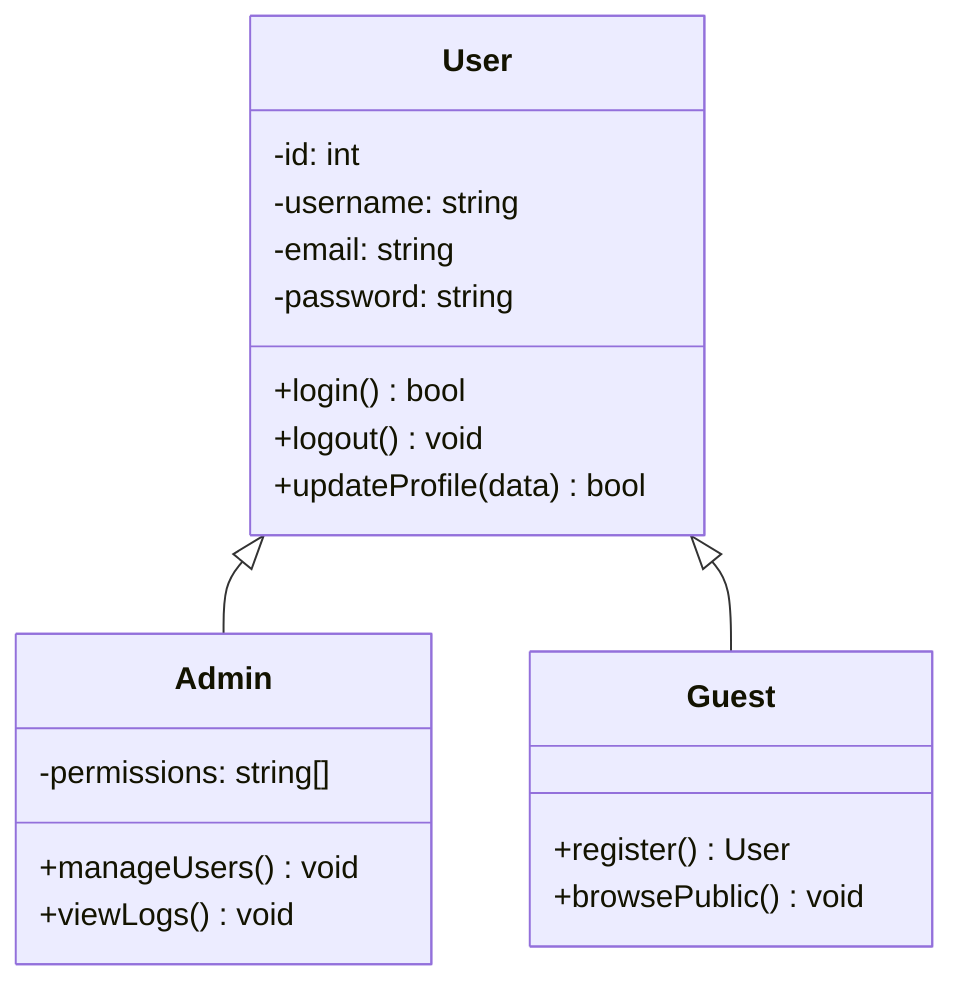
```mermaid
classDiagram
    class User {
        -id: int
        -username: string
        -email: string
        -password: string
        +login() bool
        +logout() void
        +updateProfile(data) bool
    }

    class Admin {
        -permissions: string[]
        +manageUsers() void
        +viewLogs() void
    }

    class Guest {
        +register() User
        +browsePublic() void
    }

    User <|-- Admin
    User <|-- Guest
```

#### 实战示例：电商订单系统

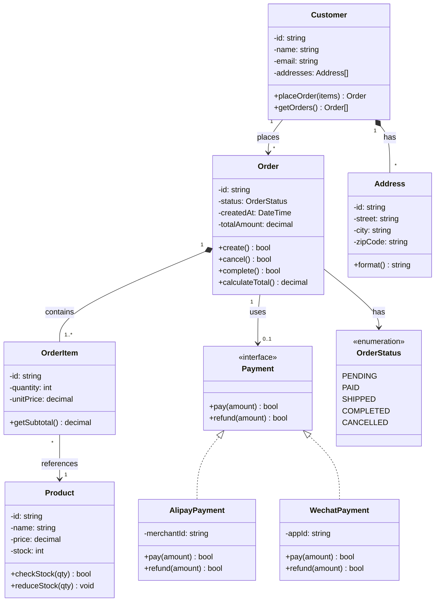
```mermaid
classDiagram
    class Order {
        -id: string
        -status: OrderStatus
        -createdAt: DateTime
        -totalAmount: decimal
        +create() bool
        +cancel() bool
        +complete() bool
        +calculateTotal() decimal
    }

    class OrderItem {
        -id: string
        -quantity: int
        -unitPrice: decimal
        +getSubtotal() decimal
    }

    class Product {
        -id: string
        -name: string
        -price: decimal
        -stock: int
        +checkStock(qty) bool
        +reduceStock(qty) void
    }

    class Customer {
        -id: string
        -name: string
        -email: string
        -addresses: Address[]
        +placeOrder(items) Order
        +getOrders() Order[]
    }

    class Address {
        -id: string
        -street: string
        -city: string
        -zipCode: string
        +format() string
    }

    class Payment {
        <<interface>>
        +pay(amount) bool
        +refund(amount) bool
    }

    class AlipayPayment {
        -merchantId: string
        +pay(amount) bool
        +refund(amount) bool
    }

    class WechatPayment {
        -appId: string
        +pay(amount) bool
        +refund(amount) bool
    }

    class OrderStatus {
        <<enumeration>>
        PENDING
        PAID
        SHIPPED
        COMPLETED
        CANCELLED
    }

    Customer "1" --> "*" Order : places
    Customer "1" *-- "*" Address : has
    Order "1" *-- "1..*" OrderItem : contains
    OrderItem "*" --> "1" Product : references
    Order "1" --> "0..1" Payment : uses
    Order --> OrderStatus : has
    Payment <|.. AlipayPayment
    Payment <|.. WechatPayment
```

### 2.4 绘制工具

| 工具                 | 类型     | 优点                   | 缺点                 |
| -------------------- | -------- | ---------------------- | -------------------- |
| Mermaid              | 文本绘图 | 版本控制友好、集成广泛 | 复杂类图布局受限     |
| PlantUML             | 文本绘图 | 语法成熟、功能完善     | 需要安装 Java 环境   |
| Enterprise Architect | 专业工具 | 功能全面、支持代码生成 | 价格昂贵、学习曲线陡 |
| Visual Paradigm      | 专业工具 | UML 支持完善、团队协作 | 需付费               |
| Draw.io              | 免费工具 | 完全免费、易于上手     | 手动布局、无代码生成 |
| IntelliJ IDEA        | IDE 集成 | 代码自动生成类图       | 仅支持 Java/Kotlin   |

### 2.5 最佳实践

1. **单一职责原则**：每个类只负责一个功能领域，避免上帝类（God Class）

2. **合理使用关系**：
   - ✅ 继承表示 "is-a" 关系
   - ✅ 组合/聚合表示 "has-a" 关系
   - ✅ 依赖表示 "uses" 关系

3. **控制类图规模**：单张类图不超过 15-20 个类，复杂系统拆分为多个包图

4. **明确可见性**：始终标注属性和方法的可见性，遵循最小权限原则

5. **使用接口解耦**：依赖抽象而非具体实现，便于扩展和测试

### 2.6 常见错误

| 错误              | 问题描述                       | 正确做法                              |
| ----------------- | ------------------------------ | ------------------------------------- |
| ❌ 滥用继承       | 使用继承仅仅为了复用代码       | ✅ 优先使用组合而非继承               |
| ❌ 循环依赖       | A 依赖 B，B 又依赖 A           | ✅ 引入接口或中间层打破循环           |
| ❌ 过度设计       | 为简单需求设计复杂的类层次结构 | ✅ 保持简单，需要时再重构             |
| ❌ 忽略多重性     | 关联线没有标注多重性           | ✅ 明确标注 1、\*、0..1 等            |
| ❌ 混淆聚合与组合 | 不区分部分是否可独立存在       | ✅ 组合：部分随整体消亡；聚合：可独立 |
| ❌ 类名使用动词   | 类名为 "ProcessOrder"          | ✅ 类名用名词，方法用动词             |

### 2.7 进阶技巧

#### 泛型类表示

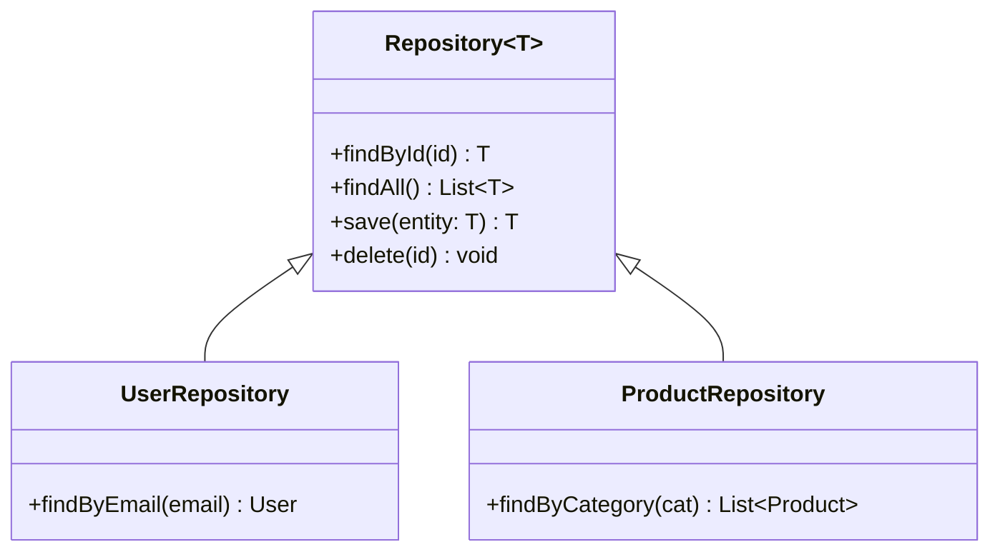
```mermaid
classDiagram
    class Repository~T~ {
        +findById(id) T
        +findAll() List~T~
        +save(entity: T) T
        +delete(id) void
    }

    class UserRepository {
        +findByEmail(email) User
    }

    class ProductRepository {
        +findByCategory(cat) List~Product~
    }

    Repository~T~ <|-- UserRepository
    Repository~T~ <|-- ProductRepository
```

#### 设计模式表达：策略模式

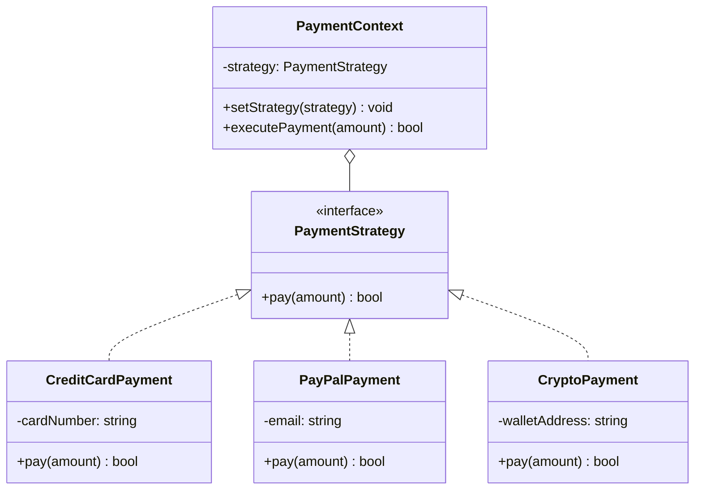
```mermaid
classDiagram
    class PaymentContext {
        -strategy: PaymentStrategy
        +setStrategy(strategy) void
        +executePayment(amount) bool
    }

    class PaymentStrategy {
        <<interface>>
        +pay(amount) bool
    }

    class CreditCardPayment {
        -cardNumber: string
        +pay(amount) bool
    }

    class PayPalPayment {
        -email: string
        +pay(amount) bool
    }

    class CryptoPayment {
        -walletAddress: string
        +pay(amount) bool
    }

    PaymentContext o-- PaymentStrategy
    PaymentStrategy <|.. CreditCardPayment
    PaymentStrategy <|.. PayPalPayment
    PaymentStrategy <|.. CryptoPayment
```

#### 与其他图配合使用

| 配合图表 | 用途                     |
| -------- | ------------------------ |
| 序列图   | 展示类之间方法调用的时序 |
| ER 图    | 类与数据库表的映射关系   |
| 包图     | 组织大型系统的类结构     |
| 对象图   | 展示运行时的具体对象实例 |

### 2.8 模板

#### 基础类图模板

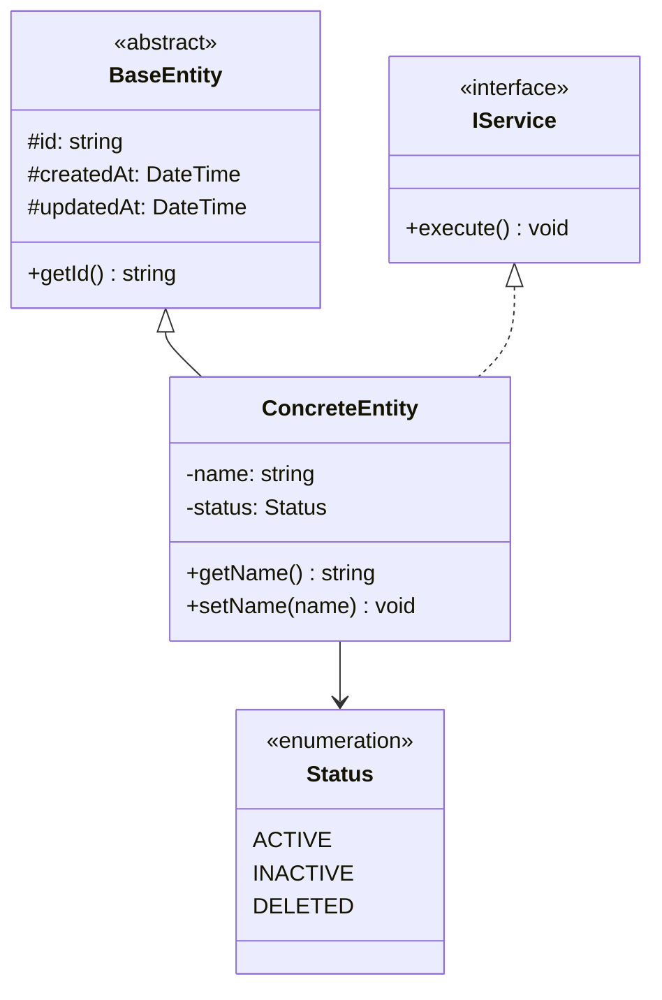
```mermaid
classDiagram
    %% 接口定义
    class IService {
        <<interface>>
        +execute() void
    }

    %% 抽象基类
    class BaseEntity {
        <<abstract>>
        #id: string
        #createdAt: DateTime
        #updatedAt: DateTime
        +getId() string
    }

    %% 具体实现类
    class ConcreteEntity {
        -name: string
        -status: Status
        +getName() string
        +setName(name) void
    }

    %% 枚举
    class Status {
        <<enumeration>>
        ACTIVE
        INACTIVE
        DELETED
    }

    %% 关系
    BaseEntity <|-- ConcreteEntity
    IService <|.. ConcreteEntity
    ConcreteEntity --> Status
```

#### 领域模型模板

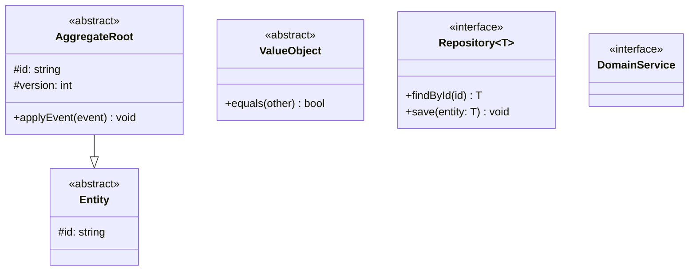
```mermaid
classDiagram
    %% 聚合根
    class AggregateRoot {
        <<abstract>>
        #id: string
        #version: int
        +applyEvent(event) void
    }

    %% 实体
    class Entity {
        <<abstract>>
        #id: string
    }

    %% 值对象
    class ValueObject {
        <<abstract>>
        +equals(other) bool
    }

    %% 仓储接口
    class Repository~T~ {
        <<interface>>
        +findById(id) T
        +save(entity: T) void
    }

    %% 领域服务
    class DomainService {
        <<interface>>
    }

    AggregateRoot --|> Entity
```

## 3. ER 图 (Entity-Relationship Diagram)

### 3.1 概述

**定义**：ER 图（实体关系图）是用于数据库设计的概念模型图，描述实体、属性以及实体之间的关系。

**核心用途**：

- 设计数据库的逻辑结构
- 定义表、字段和约束
- 描述表之间的关联关系
- 作为数据库实现的蓝图

**适用场景**：

| 适合使用           | 不适合使用         |
| ------------------ | ------------------ |
| 关系型数据库设计   | NoSQL 数据库设计   |
| 数据建模和分析     | 描述业务流程       |
| 系统间数据集成设计 | 表示对象的行为     |
| 数据迁移规划       | 非持久化的临时数据 |
| 数据字典文档化     | 复杂的查询逻辑     |

### 3.2 基本元素

ER 图由实体、属性和关系组成：

| 元素   | 说明             | Mermaid 语法          |
| ------ | ---------------- | --------------------- |
| 实体   | 数据库中的表     | `ENTITY_NAME { }`     |
| 属性   | 表中的字段       | `type name`           |
| 主键   | 唯一标识记录     | `type name PK`        |
| 外键   | 引用其他表的主键 | `type name FK`        |
| 唯一键 | 唯一约束的字段   | `type name UK`        |
| 注释   | 字段说明         | `type name "comment"` |

#### 关系基数符号

| 符号   | 含义               | 示例                       |
| ------ | ------------------ | -------------------------- |
| `\|\|` | 恰好一个           | `A \|\|--\|\| B`（一对一） |
| `\|o`  | 零个或一个         | `A \|\|--o\| B`            |
| `o\|`  | 零个或一个         | `A \|o--\|\| B`            |
| `}\|`  | 一个或多个         | `A \|\|--}\| B`（一对多）  |
| `o{`   | 零个或多个         | `A \|\|--o{ B`             |
| `}{`   | 一个或多个（双向） | `A }\|--\|{ B`（多对多）   |

#### 常用数据类型

| 类型       | 说明     | 示例                  |
| ---------- | -------- | --------------------- |
| `int`      | 整数     | `int id PK`           |
| `string`   | 字符串   | `string name`         |
| `datetime` | 日期时间 | `datetime created_at` |
| `decimal`  | 精确小数 | `decimal(10,2) price` |
| `boolean`  | 布尔值   | `boolean is_active`   |
| `text`     | 长文本   | `text description`    |

### 3.3 示例

#### 简单示例：用户与订单

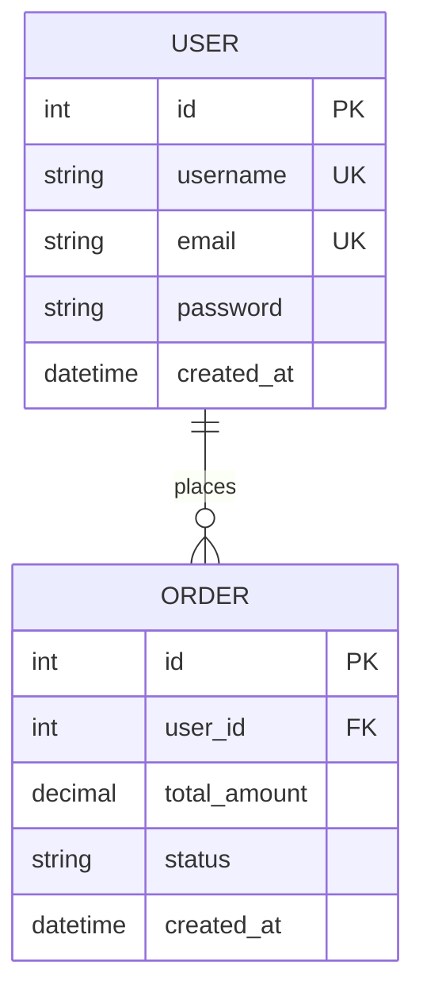
```mermaid
erDiagram
    USER ||--o{ ORDER : places
    USER {
        int id PK
        string username UK
        string email UK
        string password
        datetime created_at
    }
    ORDER {
        int id PK
        int user_id FK
        decimal total_amount
        string status
        datetime created_at
    }
```

#### 实战示例：电商数据库设计

```mermaid
erDiagram
    CUSTOMER ||--o{ ORDER : places
    CUSTOMER {
        int id PK
        string name
        string email UK
        string phone
        datetime created_at
    }

    CUSTOMER ||--o{ ADDRESS : has
    ADDRESS {
        int id PK
        int customer_id FK
        string street
        string city
        string province
        string zip_code
        boolean is_default
    }

<<<<<<< HEAD
    ORDER ||--|{ ORDER_ITEM : contains
=======
    ORDER ||--o{ ORDER_ITEM : contains
>>>>>>> main
    ORDER {
        int id PK
        int customer_id FK
        int shipping_address_id FK
        string order_no UK
        string status
        decimal total_amount
        datetime created_at
        datetime paid_at
    }

<<<<<<< HEAD
    ORDER_ITEM }|--|| PRODUCT : references
=======
    ORDER_ITEM }o--|| PRODUCT : references
>>>>>>> main
    ORDER_ITEM {
        int id PK
        int order_id FK
        int product_id FK
        int quantity
        decimal unit_price
        decimal subtotal
    }

<<<<<<< HEAD
    PRODUCT }|--|| CATEGORY : belongs_to
=======
    PRODUCT }o--|| CATEGORY : belongs_to
>>>>>>> main
    PRODUCT {
        int id PK
        int category_id FK
        string name
        string description
        decimal price
        int stock
        boolean is_active
    }

    CATEGORY {
        int id PK
        int parent_id FK
        string name
        int sort_order
    }

    ORDER ||--o| PAYMENT : has
<<<<<<< HEAD
    PAYMENT {
        int id PK
        int order_id FK UK
        string payment_no UK
        string method
        decimal amount
        string status
        datetime paid_at
    }
=======
     PAYMENT {
         int id PK
         int order_id FK
         string payment_no UK
         string method
         decimal amount
         string status
         datetime paid_at
     }
>>>>>>> main
```

### 3.4 绘制工具

| 工具            | 类型       | 优点                        | 缺点                 |
| --------------- | ---------- | --------------------------- | -------------------- |
| Mermaid         | 文本绘图   | 版本控制友好、Markdown 集成 | 复杂关系布局受限     |
| MySQL Workbench | 数据库工具 | 可逆向工程、生成 SQL        | 仅支持 MySQL         |
| DBeaver         | 数据库工具 | 支持多数据库、免费开源      | ER 图功能较基础      |
| DbSchema        | 专业工具   | 可视化强、支持多数据库      | 需付费               |
| Draw.io         | 免费工具   | 完全免费、模板丰富          | 手动绘制、无代码生成 |
| Navicat         | 数据库工具 | 功能全面、支持逆向工程      | 需付费               |
| dbdiagram.io    | 在线工具   | 简洁的 DSL 语法、免费       | 高级功能需付费       |

### 3.5 最佳实践

1. **遵循范式设计**：至少满足第三范式（3NF），避免数据冗余和更新异常

2. **合理命名**：
   - ✅ 表名使用复数或单数保持一致（如统一用单数）
   - ✅ 字段名使用 snake_case
   - ✅ 外键命名为 `关联表_id`

3. **主键设计**：
   - ✅ 优先使用自增整数或 UUID 作为主键
   - ❌ 避免使用业务字段作为主键

4. **索引规划**：在 ER 图中标注需要建立索引的字段（UK 标记）

5. **添加注释**：为重要字段添加说明注释，便于理解

### 3.6 常见错误

| 错误              | 问题描述                      | 正确做法                            |
| ----------------- | ----------------------------- | ----------------------------------- |
| ❌ 缺少主键       | 表没有定义主键                | ✅ 每个表必须有主键                 |
| ❌ 多对多无中间表 | 直接用 `}{` 连接两个实体      | ✅ 创建关联表（如 order_item）      |
| ❌ 过度反范式     | 为了查询方便大量冗余数据      | ✅ 先范式设计，必要时有策略地反范式 |
| ❌ 外键类型不匹配 | 外键与引用的主键数据类型不同  | ✅ 确保外键与主键类型完全一致       |
| ❌ 循环依赖       | 表 A 外键引用 B，B 外键引用 A | ✅ 重新设计关系或使用软关联         |
| ❌ 命名不一致     | 同一概念使用不同命名          | ✅ 建立命名规范并严格遵循           |

### 3.7 进阶技巧

#### 自引用关系

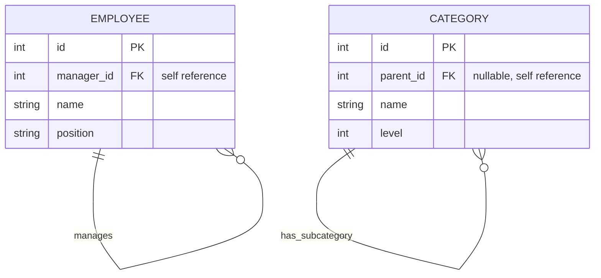
```mermaid
erDiagram
    EMPLOYEE ||--o{ EMPLOYEE : manages
    EMPLOYEE {
        int id PK
        int manager_id FK "self reference"
        string name
        string position
    }

    CATEGORY ||--o{ CATEGORY : has_subcategory
    CATEGORY {
        int id PK
        int parent_id FK "nullable, self reference"
        string name
        int level
    }
```

#### 多态关联

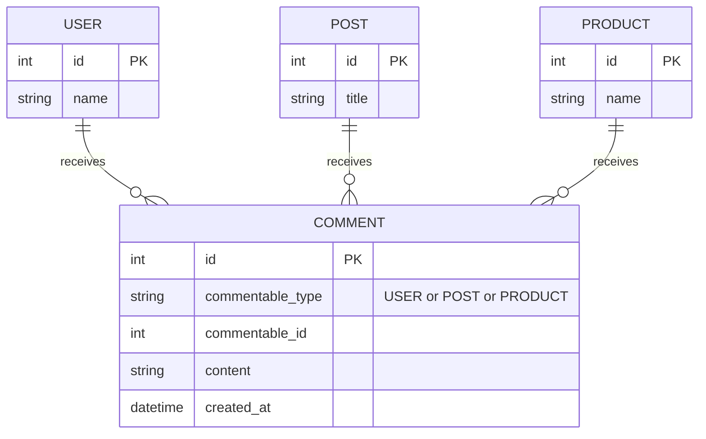
```mermaid
erDiagram
    COMMENT {
        int id PK
        string commentable_type "USER or POST or PRODUCT"
        int commentable_id
        string content
        datetime created_at
    }

    USER ||--o{ COMMENT : receives
    USER {
        int id PK
        string name
    }

    POST ||--o{ COMMENT : receives
    POST {
        int id PK
        string title
    }

    PRODUCT ||--o{ COMMENT : receives
    PRODUCT {
        int id PK
        string name
    }
```

#### 与类图的映射

| 类图概念   | ER 图对应         |
| ---------- | ----------------- |
| 类         | 实体（表）        |
| 属性       | 字段              |
| 方法       | 无（存储过程）    |
| 继承       | 单表继承/多表继承 |
| 一对多关联 | 外键关系          |
| 多对多关联 | 关联表            |

### 3.8 模板

#### 基础 CRUD 表模板

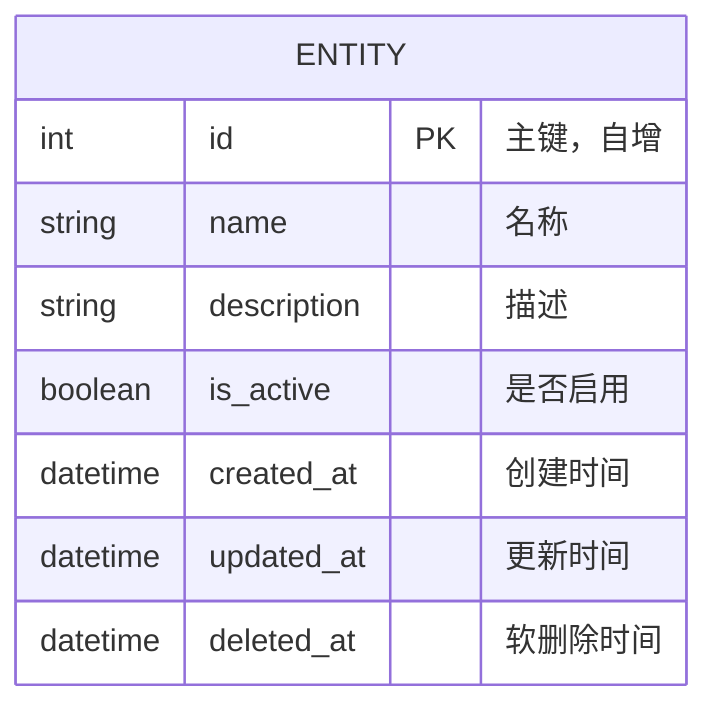
```mermaid
erDiagram
    ENTITY {
        int id PK "主键，自增"
        string name "名称"
        string description "描述"
        boolean is_active "是否启用"
        datetime created_at "创建时间"
        datetime updated_at "更新时间"
        datetime deleted_at "软删除时间"
    }
```

#### 用户认证模板

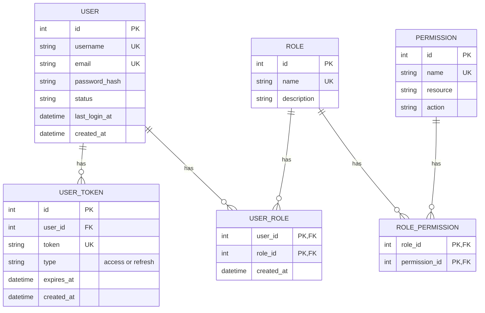
```mermaid
erDiagram
    USER ||--o{ USER_TOKEN : has
    USER ||--o{ USER_ROLE : has
    ROLE ||--o{ USER_ROLE : has
    ROLE ||--o{ ROLE_PERMISSION : has
    PERMISSION ||--o{ ROLE_PERMISSION : has

    USER {
        int id PK
        string username UK
        string email UK
        string password_hash
        string status
        datetime last_login_at
        datetime created_at
    }

    USER_TOKEN {
        int id PK
        int user_id FK
        string token UK
        string type "access or refresh"
        datetime expires_at
        datetime created_at
    }

    ROLE {
        int id PK
        string name UK
        string description
    }

    PERMISSION {
        int id PK
        string name UK
        string resource
        string action
    }

    USER_ROLE {
        int user_id PK, FK
        int role_id PK, FK
        datetime created_at
    }

    ROLE_PERMISSION {
        int role_id PK, FK
        int permission_id PK, FK
    }
```

#### 审计日志模板

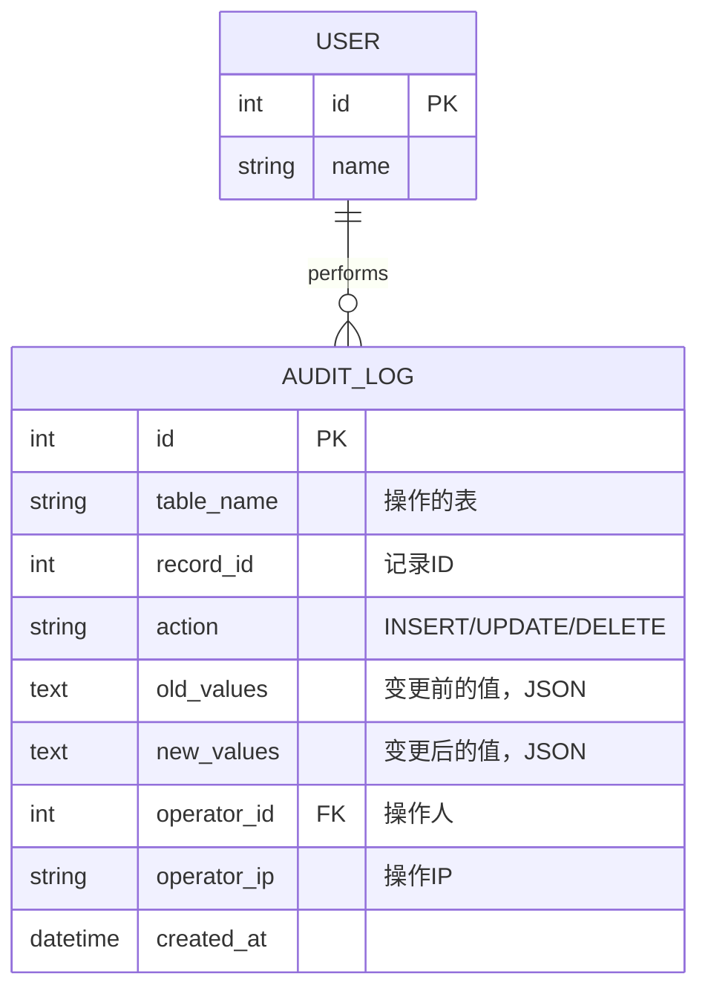
```mermaid
erDiagram
    AUDIT_LOG {
        int id PK
        string table_name "操作的表"
        int record_id "记录ID"
        string action "INSERT/UPDATE/DELETE"
        text old_values "变更前的值，JSON"
        text new_values "变更后的值，JSON"
        int operator_id FK "操作人"
        string operator_ip "操作IP"
        datetime created_at
    }

    USER ||--o{ AUDIT_LOG : performs
    USER {
        int id PK
        string name
    }
```

## 4. 序列图 (Sequence Diagram)

### 4.1 概述

**定义**：序列图是 UML 中用于描述对象之间消息交互的图表，按时间顺序展示参与者之间的消息传递过程。

**核心用途**：

- 描述用例的详细交互流程
- 设计 API 调用序列
- 分析系统组件间的通信
- 记录和理解现有系统的行为

**适用场景**：

| 适合使用               | 不适合使用             |
| ---------------------- | ---------------------- |
| 描述特定功能的交互流程 | 展示系统静态结构       |
| API 接口设计和文档     | 表示复杂的条件分支逻辑 |
| 微服务间的调用关系     | 描述数据结构           |
| Bug 分析和问题定位     | 展示全局系统架构       |
| 代码评审时的流程说明   | 需求阶段的功能概述     |

### 4.2 基本元素

序列图由参与者、消息和控制结构组成：

| 元素     | 说明                 | Mermaid 语法                  |
| -------- | -------------------- | ----------------------------- |
| 参与者   | 交互中的对象或系统   | `participant A`               |
| 角色     | 人类参与者           | `actor User`                  |
| 同步消息 | 请求并等待响应       | `->>` 实线实心箭头            |
| 异步消息 | 发送后不等待         | `-)` 实线开放箭头             |
| 返回消息 | 响应消息             | `-->>` 虚线实心箭头           |
| 自调用   | 对象调用自己的方法   | `A ->> A: method()`           |
| 激活框   | 表示对象处于活动状态 | `activate A` / `deactivate A` |

#### 消息类型

| 类型     | 语法        | 说明               |
| -------- | ----------- | ------------------ |
| 同步请求 | `->>`       | 实线，实心箭头     |
| 同步响应 | `-->>`      | 虚线，实心箭头     |
| 异步请求 | `-)`        | 实线，开放箭头     |
| 异步响应 | `--)`       | 虚线，开放箭头     |
| 实线     | `->` `->`   | 不带箭头或开放箭头 |
| 虚线     | `-->` `-->` | 不带箭头或开放箭头 |

#### 控制结构

| 结构   | 语法               | 用途               |
| ------ | ------------------ | ------------------ |
| 循环   | `loop [condition]` | 重复执行的消息序列 |
| 条件   | `alt [condition]`  | 互斥的条件分支     |
| 可选   | `opt [condition]`  | 可选执行的消息序列 |
| 并行   | `par [label]`      | 并行执行的消息序列 |
| 临界区 | `critical [label]` | 不可中断的消息序列 |
| 分组   | `rect rgb(r,g,b)`  | 可视化分组         |

### 4.3 示例

#### 简单示例：用户登录

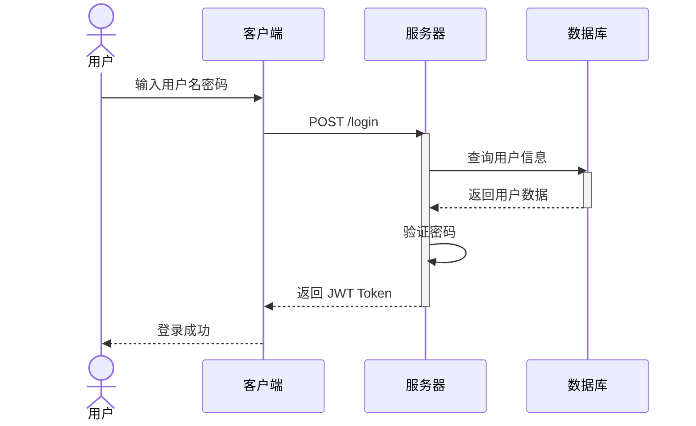
```mermaid
sequenceDiagram
    actor User as 用户
    participant Client as 客户端
    participant Server as 服务器
    participant DB as 数据库

    User ->> Client: 输入用户名密码
    Client ->> Server: POST /login
    activate Server
    Server ->> DB: 查询用户信息
    activate DB
    DB -->> Server: 返回用户数据
    deactivate DB
    Server ->> Server: 验证密码
    Server -->> Client: 返回 JWT Token
    deactivate Server
    Client -->> User: 登录成功
```

#### 实战示例：电商下单流程

```mermaid
sequenceDiagram
    actor Customer as 顾客
    participant Web as 前端
    participant Order as 订单服务
    participant Inventory as 库存服务
    participant Payment as 支付服务
    participant MQ as 消息队列
<<<<<<< HEAD
=======
    participant Logistics as 物流服务
>>>>>>> main

    Customer ->> Web: 点击下单
    Web ->> Order: 创建订单请求

    activate Order
    Order ->> Inventory: 检查库存
    activate Inventory
<<<<<<< HEAD

    alt 库存充足
        Inventory -->> Order: 库存确认
        deactivate Inventory
=======
    Inventory -->> Order: 库存确认
    deactivate Inventory

    alt 库存充足
>>>>>>> main
        Order ->> Inventory: 锁定库存
        activate Inventory
        Inventory -->> Order: 锁定成功
        deactivate Inventory

        Order ->> Order: 生成订单
        Order -->> Web: 返回订单信息
<<<<<<< HEAD
        deactivate Order
=======
>>>>>>> main

        Web ->> Payment: 发起支付
        activate Payment
        Payment -->> Web: 返回支付页面
<<<<<<< HEAD
        Customer ->> Web: 完成支付
        Web ->> Payment: 支付确认
=======
        deactivate Payment

        Customer ->> Web: 完成支付
        Web ->> Payment: 支付确认
        activate Payment
>>>>>>> main
        Payment -->> Web: 支付成功
        deactivate Payment

        Web ->> Order: 更新订单状态
<<<<<<< HEAD
        activate Order
        Order -) MQ: 发送订单完成消息
        Order -->> Web: 更新成功
        deactivate Order

        par 异步处理
            MQ -) Inventory: 扣减库存
            MQ -) 物流服务: 创建发货单
=======
        Order -) MQ: 发送订单完成消息
        Order -->> Web: 更新成功

        par 异步处理
            MQ -) Inventory: 扣减库存
            and
            MQ -) Logistics: 创建发货单
>>>>>>> main
        end

        Web -->> Customer: 下单成功

    else 库存不足
<<<<<<< HEAD
        Inventory -->> Order: 库存不足
        deactivate Inventory
        Order -->> Web: 下单失败
        deactivate Order
        Web -->> Customer: 提示库存不足
    end
=======
        Order -->> Web: 下单失败
        Web -->> Customer: 提示库存不足
    end

    deactivate Order
>>>>>>> main
```

#### 带注释的示例

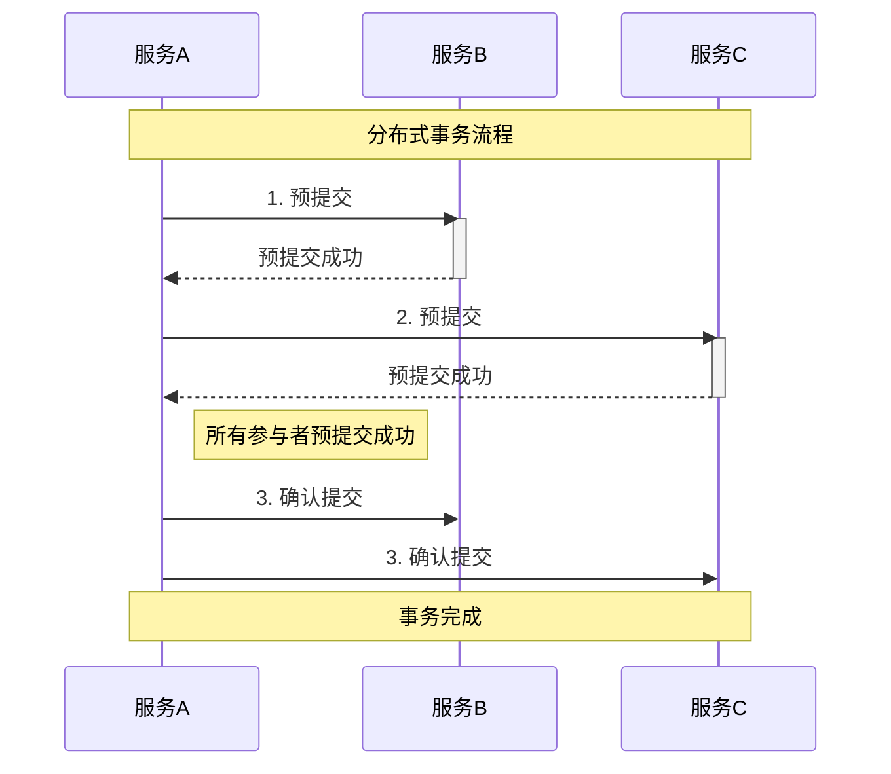
```mermaid
sequenceDiagram
    participant A as 服务A
    participant B as 服务B
    participant C as 服务C

    Note over A,C: 分布式事务流程

    A ->> B: 1. 预提交
    activate B
    B -->> A: 预提交成功
    deactivate B

    A ->> C: 2. 预提交
    activate C
    C -->> A: 预提交成功
    deactivate C

    Note right of A: 所有参与者预提交成功

    A ->> B: 3. 确认提交
    A ->> C: 3. 确认提交

    Note over A,C: 事务完成
```

### 4.4 绘制工具

| 工具                | 类型         | 优点                    | 缺点           |
| ------------------- | ------------ | ----------------------- | -------------- |
| Mermaid             | 文本绘图     | Markdown 集成、自动布局 | 复杂图布局受限 |
| PlantUML            | 文本绘图     | 功能丰富、样式可定制    | 需要服务端渲染 |
| Lucidchart          | 在线工具     | 协作方便、模板丰富      | 免费版功能受限 |
| Draw.io             | 免费工具     | 完全免费、导出格式多    | 手动布局       |
| WebSequenceDiagrams | 在线工具     | 简洁的语法、快速生成    | 样式较简单     |
| Sequence Diagram    | VS Code 插件 | IDE 集成、实时预览      | 仅限 VS Code   |

### 4.5 最佳实践

1. **控制参与者数量**：单张序列图参与者不超过 7-8 个，过多时拆分图表

2. **命名清晰**：
   - ✅ 参与者使用角色名或系统名
   - ✅ 消息使用动词短语描述行为

3. **合理使用激活框**：激活框表示对象正在处理，避免过长的激活

4. **标注关键信息**：
   - 使用 Note 添加重要说明
   - 在消息上标注参数或返回值

5. **聚焦核心流程**：一张图描述一个主要场景，异常流程单独绘制

### 4.6 常见错误

| 错误            | 问题描述                     | 正确做法                        |
| --------------- | ---------------------------- | ------------------------------- |
| ❌ 参与者过多   | 超过 10 个参与者导致图表混乱 | ✅ 拆分为多张图或合并相似参与者 |
| ❌ 消息描述不清 | 消息仅写 "调用" "返回"       | ✅ 写明具体的方法名和关键参数   |
| ❌ 缺少返回消息 | 同步调用没有显示返回         | ✅ 同步调用必须有对应的返回消息 |
| ❌ 时序错误     | 消息顺序与实际执行顺序不符   | ✅ 严格按照时间顺序从上到下排列 |
| ❌ 滥用控制结构 | 过多的 loop/alt 嵌套         | ✅ 复杂逻辑拆分为多张图         |
| ❌ 混淆同步异步 | 所有消息都用同一种箭头       | ✅ 明确区分同步和异步消息       |

### 4.7 进阶技巧

#### 自动编号

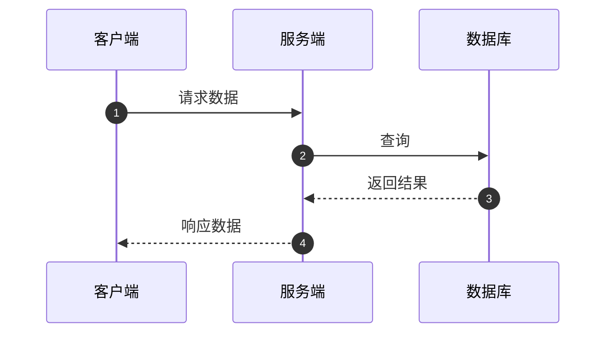
```mermaid
sequenceDiagram
    autonumber
    participant A as 客户端
    participant B as 服务端
    participant C as 数据库

    A ->> B: 请求数据
    B ->> C: 查询
    C -->> B: 返回结果
    B -->> A: 响应数据
```

#### 并行处理

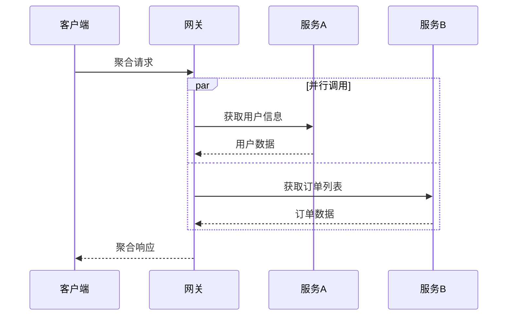
```mermaid
sequenceDiagram
    participant Client as 客户端
    participant Gateway as 网关
    participant ServiceA as 服务A
    participant ServiceB as 服务B

    Client ->> Gateway: 聚合请求

    par 并行调用
        Gateway ->> ServiceA: 获取用户信息
        ServiceA -->> Gateway: 用户数据
    and
        Gateway ->> ServiceB: 获取订单列表
        ServiceB -->> Gateway: 订单数据
    end

    Gateway -->> Client: 聚合响应
```

#### 与其他图配合使用

| 配合图表 | 用途                             |
| -------- | -------------------------------- |
| 类图     | 序列图中的参与者对应类图中的类   |
| 活动图   | 复杂的条件分支用活动图补充说明   |
| 状态图   | 对象状态变化与序列图中的消息对应 |
| 用例图   | 序列图详细描述用例的实现流程     |

### 4.8 模板

#### API 调用模板

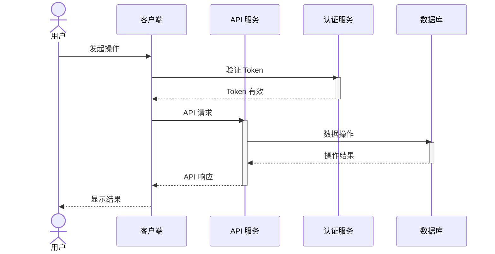
```mermaid
sequenceDiagram
    actor User as 用户
    participant Client as 客户端
    participant API as API 服务
    participant Auth as 认证服务
    participant DB as 数据库

    User ->> Client: 发起操作

    Client ->> Auth: 验证 Token
    activate Auth
    Auth -->> Client: Token 有效
    deactivate Auth

    Client ->> API: API 请求
    activate API

    API ->> DB: 数据操作
    activate DB
    DB -->> API: 操作结果
    deactivate DB

    API -->> Client: API 响应
    deactivate API

    Client -->> User: 显示结果
```

#### 异常处理模板

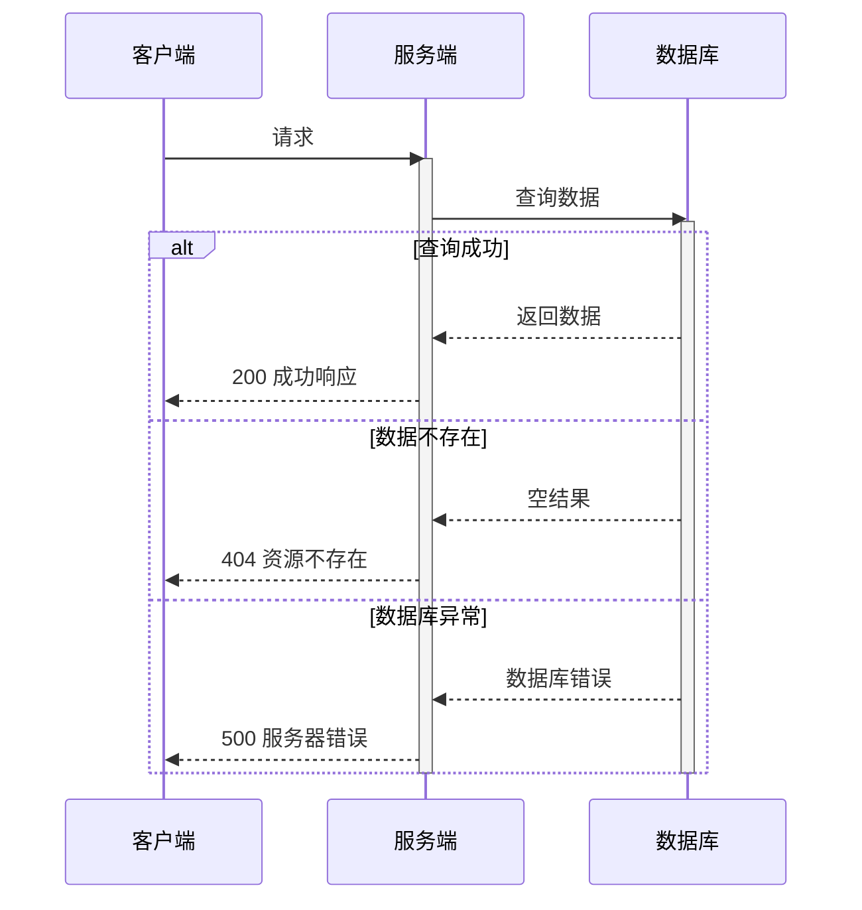
```mermaid
sequenceDiagram
    participant Client as 客户端
    participant Server as 服务端
    participant DB as 数据库

    Client ->> Server: 请求

    activate Server
    Server ->> DB: 查询数据
    activate DB

    alt 查询成功
        DB -->> Server: 返回数据
        Server -->> Client: 200 成功响应
    else 数据不存在
        DB -->> Server: 空结果
        Server -->> Client: 404 资源不存在
    else 数据库异常
        DB -->> Server: 数据库错误
        Server -->> Client: 500 服务器错误
    end

    deactivate DB
    deactivate Server
```

#### 微服务调用模板

```mermaid
sequenceDiagram
    participant Gateway as API 网关
    participant Auth as 认证服务
    participant BizService as 业务服务
    participant Cache as 缓存
    participant DB as 数据库
    participant MQ as 消息队列

    Gateway ->> Auth: 认证请求
    Auth -->> Gateway: 认证通过

    Gateway ->> BizService: 业务请求
    activate BizService

    BizService ->> Cache: 查询缓存
    alt 缓存命中
        Cache -->> BizService: 返回缓存数据
    else 缓存未命中
        Cache -->> BizService: 空
        BizService ->> DB: 查询数据库
        DB -->> BizService: 返回数据
        BizService ->> Cache: 写入缓存
    end

    BizService -) MQ: 发送事件
    BizService -->> Gateway: 返回结果
    deactivate BizService
```

## 5. 状态机图 (State Machine Diagram)

### 5.1 概述

**定义**：状态机图是 UML 中用于描述对象在其生命周期内可能经历的状态以及触发状态转换的事件。

**核心用途**：

- 描述对象的生命周期
- 定义状态转换的规则和条件
- 设计有限状态机（FSM）
- 分析复杂的业务状态逻辑

**适用场景**：

| 适合使用                 | 不适合使用         |
| ------------------------ | ------------------ |
| 订单、工单等业务状态管理 | 无状态的简单对象   |
| 工作流引擎设计           | 描述对象间的交互   |
| 协议状态机设计           | 表示系统架构       |
| 游戏角色状态管理         | 复杂的并行处理逻辑 |
| UI 组件状态管理          | 数据流处理         |

### 5.2 基本元素

状态机图由状态、转换和事件组成：

| 元素       | 说明                   | Mermaid 语法               |
| ---------- | ---------------------- | -------------------------- |
| 初始状态   | 状态机的起点           | `[*]`                      |
| 终止状态   | 状态机的终点           | `[*]`                      |
| 状态       | 对象的某种情况         | `state_name`               |
| 状态描述   | 状态的详细说明         | `state_name : description` |
| 转换       | 从一个状态到另一个状态 | `s1 --> s2`                |
| 带标签转换 | 带事件/条件的转换      | `s1 --> s2 : event`        |
| 复合状态   | 包含子状态的状态       | `state name { }`           |
| 选择状态   | 条件分支               | `state name <<choice>>`    |
| 分叉状态   | 并行分支               | `state name <<fork>>`      |
| 汇合状态   | 并行汇合               | `state name <<join>>`      |

#### 转换标签格式

```
event [guard] / action
```

| 部分   | 说明             | 示例                     |
| ------ | ---------------- | ------------------------ |
| event  | 触发转换的事件   | `click`、`timeout`       |
| guard  | 转换的条件       | `[isValid]`、`[count>0]` |
| action | 转换时执行的动作 | `/ sendEmail`            |

### 5.3 示例

#### 简单示例：开关状态

```mermaid
stateDiagram-v2
    [*] --> Off
    Off --> On : 按下开关
    On --> Off : 按下开关
    On --> [*] : 损坏
```

#### 实战示例：订单状态机

```mermaid
stateDiagram-v2
    [*] --> Created : 创建订单

    Created --> Pending : 提交订单
    Created --> Cancelled : 取消订单

    Pending --> Paid : 支付成功
    Pending --> Cancelled : 支付超时
    Pending --> Cancelled : 用户取消

    Paid --> Shipped : 商家发货
    Paid --> Refunding : 申请退款

    Shipped --> Delivered : 确认收货
    Shipped --> Refunding : 申请退款

    Delivered --> Completed : 交易完成
    Delivered --> Refunding : 申请退款

    Refunding --> Refunded : 退款成功
    Refunding --> Paid : 退款拒绝

    Completed --> [*]
    Cancelled --> [*]
    Refunded --> [*]

    note right of Created : 订单刚创建
    note right of Pending : 等待支付
    note right of Paid : 已支付，待发货
    note right of Shipped : 已发货，运输中
```

#### 带选择状态的示例

```mermaid
stateDiagram-v2
    [*] --> Submitted

    Submitted --> Reviewing : 提交审核
    state review_result <<choice>>
    Reviewing --> review_result : 审核完成

    review_result --> Approved : 审核通过
    review_result --> Rejected : 审核不通过

    Rejected --> Submitted : 重新提交
    Approved --> [*]
```

#### 复合状态示例

```mermaid
stateDiagram-v2
    [*] --> Active

    state Active {
        [*] --> Idle
        Idle --> Processing : 收到请求
        Processing --> Idle : 处理完成
        Processing --> Error : 处理失败
        Error --> Idle : 重试
    }

    Active --> Suspended : 暂停
    Suspended --> Active : 恢复
    Active --> [*] : 关闭
```

#### 并发状态示例

```mermaid
stateDiagram-v2
    [*] --> Active

    state Active {
        [*] --> NumLockOff
        NumLockOff --> NumLockOn : 按 NumLock
        NumLockOn --> NumLockOff : 按 NumLock
        --
        [*] --> CapsLockOff
        CapsLockOff --> CapsLockOn : 按 CapsLock
        CapsLockOn --> CapsLockOff : 按 CapsLock
    }
```

### 5.4 绘制工具

| 工具              | 类型     | 优点                   | 缺点               |
| ----------------- | -------- | ---------------------- | ------------------ |
| Mermaid           | 文本绘图 | 语法简洁、集成广泛     | 复杂状态机布局受限 |
| PlantUML          | 文本绘图 | 功能完善、支持历史状态 | 语法较复杂         |
| XState Viz        | 在线工具 | 专为状态机设计、可交互 | 仅支持 XState 格式 |
| Draw.io           | 免费工具 | 免费、UML 形状库       | 手动布局           |
| Lucidchart        | 在线工具 | 协作方便、模板丰富     | 免费版功能受限     |
| State Machine Cat | 文本绘图 | 简洁语法、专注状态机   | 功能相对简单       |

### 5.5 最佳实践

1. **状态命名**：
   - ✅ 使用形容词或过去分词（Created、Pending、Completed）
   - ❌ 避免使用动词（Creating、Process）

2. **控制状态数量**：单个状态机不超过 10-15 个状态，复杂情况使用复合状态或拆分

3. **明确转换条件**：每个转换都应标注触发事件，必要时添加守卫条件

4. **处理所有状态**：确保每个状态都有出口，避免死锁状态

5. **区分正常和异常流**：使用颜色或分组区分正常流程和异常处理

### 5.6 常见错误

| 错误                  | 问题描述                       | 正确做法                          |
| --------------------- | ------------------------------ | --------------------------------- |
| ❌ 状态遗漏           | 缺少某些业务状态               | ✅ 与业务方确认完整的状态列表     |
| ❌ 转换遗漏           | 某些状态无法达到或无法离开     | ✅ 检查每个状态的入口和出口       |
| ❌ 事件不明确         | 转换没有标注触发事件           | ✅ 明确标注每个转换的触发条件     |
| ❌ 状态爆炸           | 状态组合导致数量急剧增加       | ✅ 使用复合状态或并发状态         |
| ❌ 混淆状态和动作     | 把 "处理中" 这种瞬时动作当状态 | ✅ 状态是稳定的，动作是瞬时的     |
| ❌ 缺少初始和终止状态 | 不知道从哪开始、在哪结束       | ✅ 明确标注初始状态和所有终止状态 |

### 5.7 进阶技巧

#### 分叉与汇合

```mermaid
stateDiagram-v2
    [*] --> Start

    state fork_state <<fork>>
    Start --> fork_state

    fork_state --> Task1
    fork_state --> Task2
    fork_state --> Task3

    state join_state <<join>>
    Task1 --> join_state
    Task2 --> join_state
    Task3 --> join_state

    join_state --> Complete
    Complete --> [*]
```

#### 状态机与代码映射

状态机可以直接映射到代码实现：

| 状态机元素 | 代码实现             |
| ---------- | -------------------- |
| 状态       | 枚举值或常量         |
| 转换       | 状态转换函数         |
| 事件       | 方法调用或消息       |
| 守卫条件   | if 语句              |
| 动作       | 转换时执行的业务逻辑 |

#### 与其他图配合使用

| 配合图表 | 用途                             |
| -------- | -------------------------------- |
| 类图     | 状态枚举定义在类图中             |
| 序列图   | 触发状态转换的消息在序列图中展示 |
| 活动图   | 复杂的转换逻辑用活动图补充       |
| ER 图    | 状态字段存储在数据库表中         |

### 5.8 模板

#### 基础状态机模板

```mermaid
stateDiagram-v2
    %% 初始状态
    [*] --> Initial

    %% 正常流程
    Initial --> Processing : start
    Processing --> Completed : success
    Processing --> Failed : error

    %% 异常处理
    Failed --> Processing : retry
    Failed --> [*] : abandon

    %% 终止状态
    Completed --> [*]
```

#### 审批工作流模板

```mermaid
stateDiagram-v2
    [*] --> Draft

    Draft --> Submitted : 提交
    Draft --> [*] : 删除

    Submitted --> UnderReview : 分配审批人
    Submitted --> Draft : 撤回

    state UnderReview {
        [*] --> Level1Review
        Level1Review --> Level2Review : 一级通过
        Level1Review --> Rejected : 一级拒绝
        Level2Review --> Approved : 二级通过
        Level2Review --> Rejected : 二级拒绝
    }

    Rejected --> Draft : 修改后重新提交
    Rejected --> [*] : 放弃

    Approved --> [*]
```

#### 支付状态机模板

```mermaid
stateDiagram-v2
    [*] --> Unpaid

    Unpaid --> Paying : 发起支付
    Unpaid --> Cancelled : 取消

    Paying --> Paid : 支付成功
    Paying --> PayFailed : 支付失败
    Paying --> Unpaid : 支付超时

    PayFailed --> Paying : 重试
    PayFailed --> Unpaid : 返回

    Paid --> Refunding : 申请退款
    Paid --> [*] : 完成

    Refunding --> Refunded : 退款成功
    Refunding --> Paid : 退款失败

    Refunded --> [*]
    Cancelled --> [*]
```

#### 连接状态机模板

```mermaid
stateDiagram-v2
    [*] --> Disconnected

    Disconnected --> Connecting : connect()
    Connecting --> Connected : 连接成功
    Connecting --> Disconnected : 连接失败

    Connected --> Disconnecting : disconnect()
    Connected --> Disconnected : 连接断开

    Disconnecting --> Disconnected : 断开完成

    state Connected {
        [*] --> Idle
        Idle --> Sending : send()
        Sending --> Idle : 发送完成
        Idle --> Receiving : 收到数据
        Receiving --> Idle : 接收完成
    }
```

## 6. 总结

### 6.1 四种图表对比

| 维度     | 类图                 | ER 图            | 序列图               | 状态机图         |
| -------- | -------------------- | ---------------- | -------------------- | ---------------- |
| 主要用途 | 描述类结构和关系     | 设计数据库结构   | 展示对象交互时序     | 描述状态转换逻辑 |
| 结构特点 | 类、属性、方法、关系 | 实体、属性、关系 | 参与者、消息、时间线 | 状态、转换、事件 |
| 适用阶段 | 面向对象设计         | 数据建模         | 接口设计             | 业务状态设计     |
| 表达重点 | 静态结构             | 数据结构         | 动态交互             | 生命周期         |
| 规范程度 | UML 标准             | ER 模型标准      | UML 标准             | UML 标准         |

### 6.2 工具选择速查

| 需求场景       | 推荐工具                       |
| -------------- | ------------------------------ |
| 版本控制集成   | Mermaid / PlantUML             |
| 数据库设计     | MySQL Workbench / dbdiagram.io |
| 团队协作       | Lucidchart / Draw.io           |
| IDE 集成       | PlantUML 插件 / Mermaid 插件   |
| 代码生成       | Enterprise Architect           |
| 免费且功能足够 | Draw.io / Mermaid              |

### 6.3 图表配合使用

```
详细设计阶段图表使用流程：

1. 领域建模
   └── 使用【类图】设计领域模型

2. 数据设计
   └── 使用【ER 图】设计数据库结构
       └── 与类图相互映射验证

3. 接口设计
   └── 使用【序列图】描述关键接口的交互流程
       └── 参与者对应类图中的类

4. 状态设计
   └── 使用【状态机图】设计有状态对象的生命周期
       └── 状态枚举定义在类图中
       └── 状态字段存储在 ER 图的表中
       └── 状态转换触发在序列图中展示
```

### 6.4 速查表

#### Mermaid 类图语法速查

| 功能   | 语法                     |
| ------ | ------------------------ |
| 定义类 | `class ClassName { }`    |
| 属性   | `+name: type`            |
| 方法   | `+method(param): return` |
| 继承   | `Parent <\|-- Child`     |
| 实现   | `Interface <\|.. Class`  |
| 组合   | `Whole *-- Part`         |
| 聚合   | `Whole o-- Part`         |
| 关联   | `A --> B`                |
| 依赖   | `A ..> B`                |

#### Mermaid ER 图语法速查

| 功能     | 语法                  |
| -------- | --------------------- |
| 定义实体 | `ENTITY { }`          |
| 属性     | `type name`           |
| 主键     | `type name PK`        |
| 外键     | `type name FK`        |
| 一对一   | `A \|\|--\|\| B`      |
| 一对多   | `A \|\|--o{ B`        |
| 多对多   | `A }\|--\|{ B`        |
| 注释     | `type name "comment"` |

#### Mermaid 序列图语法速查

| 功能     | 语法                          |
| -------- | ----------------------------- |
| 参与者   | `participant A`               |
| 角色     | `actor User`                  |
| 同步消息 | `A ->> B: message`            |
| 返回消息 | `A -->> B: response`          |
| 异步消息 | `A -) B: message`             |
| 激活     | `activate A` / `deactivate A` |
| 循环     | `loop condition ... end`      |
| 条件     | `alt ... else ... end`        |
| 可选     | `opt condition ... end`       |
| 并行     | `par ... and ... end`         |
| 注释     | `Note over A,B: text`         |

#### Mermaid 状态机图语法速查

| 功能     | 语法                         |
| -------- | ---------------------------- |
| 初始状态 | `[*] --> State`              |
| 终止状态 | `State --> [*]`              |
| 状态     | `StateName`                  |
| 状态描述 | `StateName : description`    |
| 转换     | `S1 --> S2 : event`          |
| 复合状态 | `state Name { ... }`         |
| 选择     | `state name <<choice>>`      |
| 分叉     | `state name <<fork>>`        |
| 汇合     | `state name <<join>>`        |
| 并发     | `state Name { ... -- ... }`  |
| 注释     | `note right of State : text` |

## 7. 参考资源

### 官方文档

- [Mermaid 类图文档](https://mermaid.js.org/syntax/classDiagram.html)
- [Mermaid ER 图文档](https://mermaid.js.org/syntax/entityRelationshipDiagram.html)
- [Mermaid 序列图文档](https://mermaid.js.org/syntax/sequenceDiagram.html)
- [Mermaid 状态图文档](https://mermaid.js.org/syntax/stateDiagram.html)
- [PlantUML 官方文档](https://plantuml.com/)
- [UML 官方规范](https://www.omg.org/spec/UML/)

### 推荐阅读

- 《UML 精粹》- Martin Fowler
- 《领域驱动设计》- Eric Evans
- 《设计模式》- GoF
- [Refactoring Guru - UML](https://refactoring.guru/uml)

### 在线工具

- [Mermaid 在线编辑器](https://mermaid.live/)
- [PlantUML 在线编辑器](https://www.plantuml.com/plantuml/)
- [Draw.io](https://app.diagrams.net/)
- [dbdiagram.io](https://dbdiagram.io/)
- [XState Visualizer](https://stately.ai/viz)
