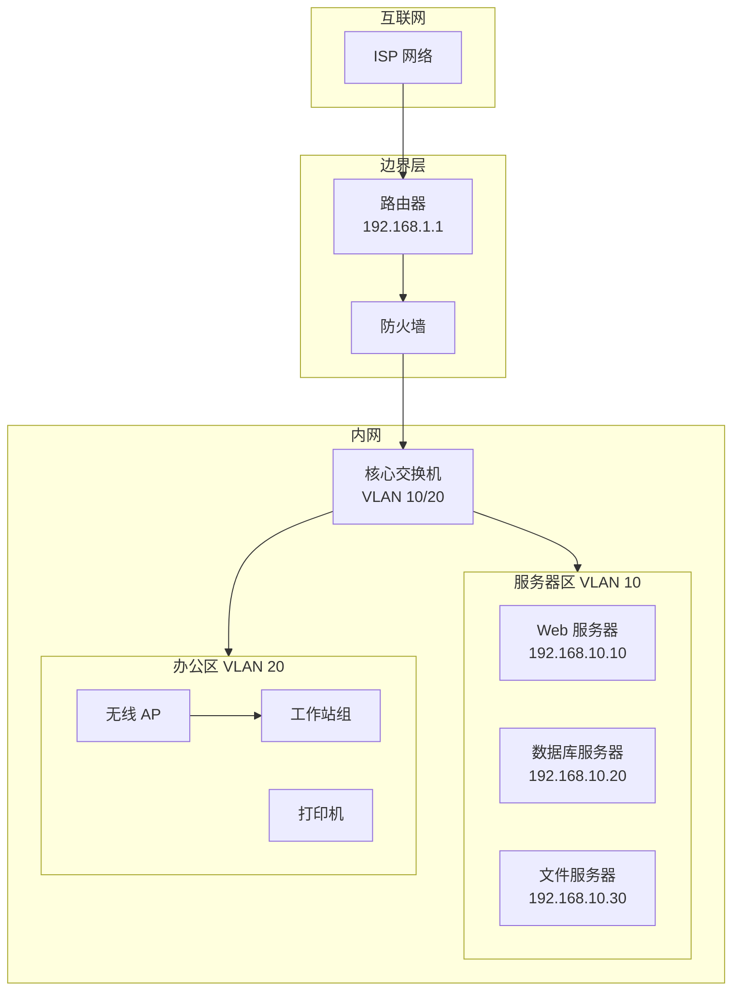
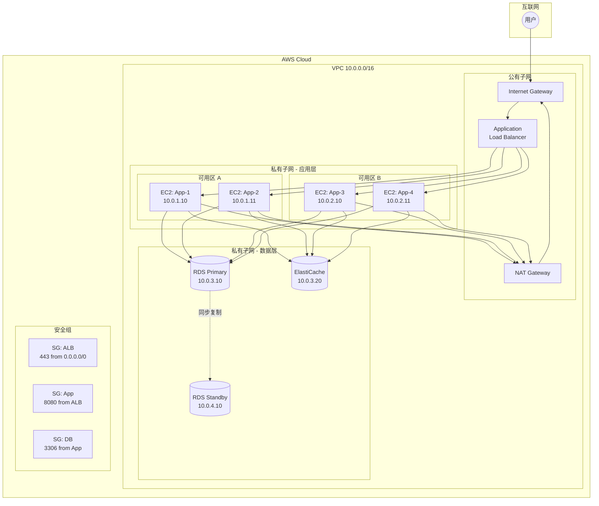
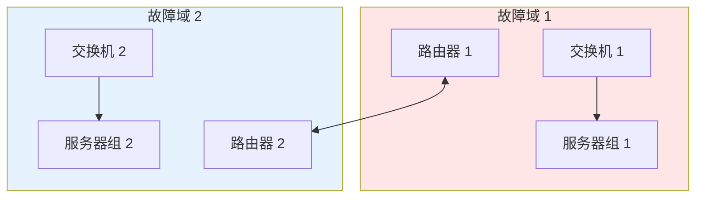
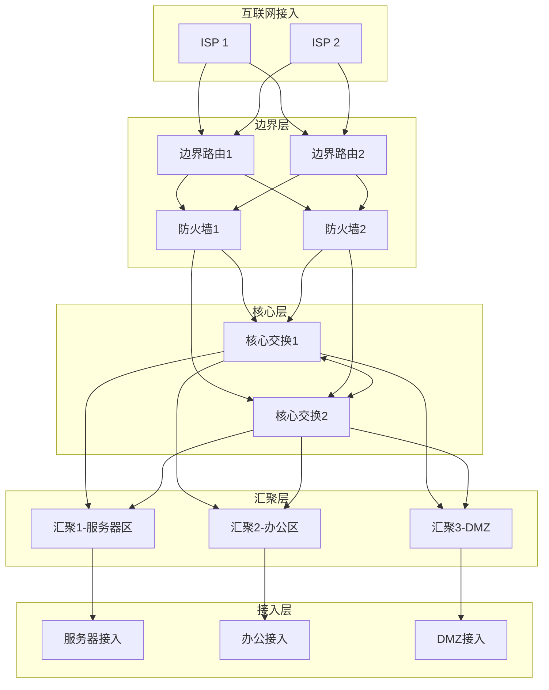
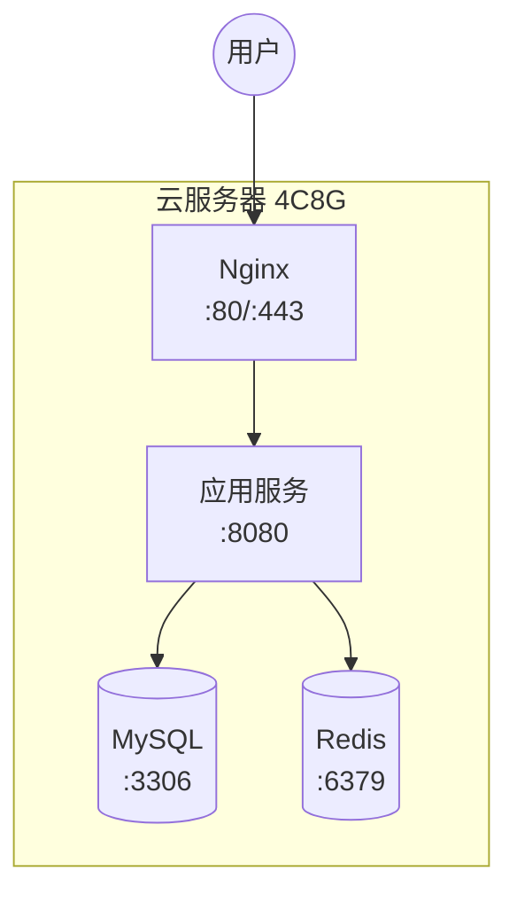
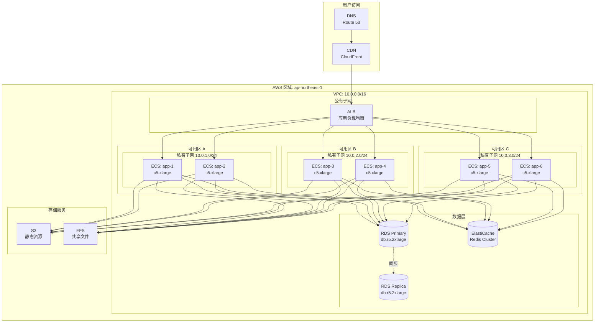
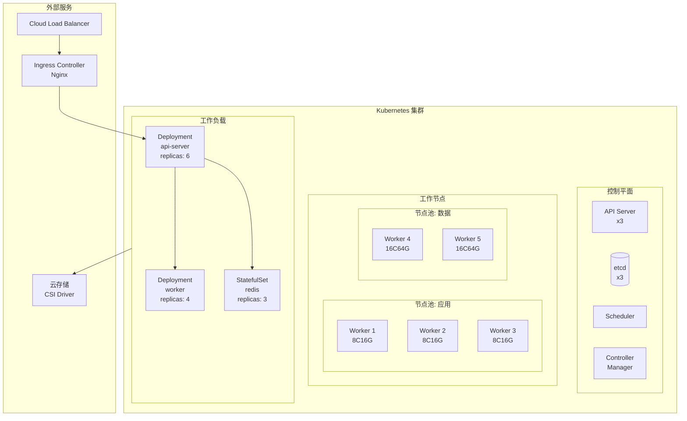
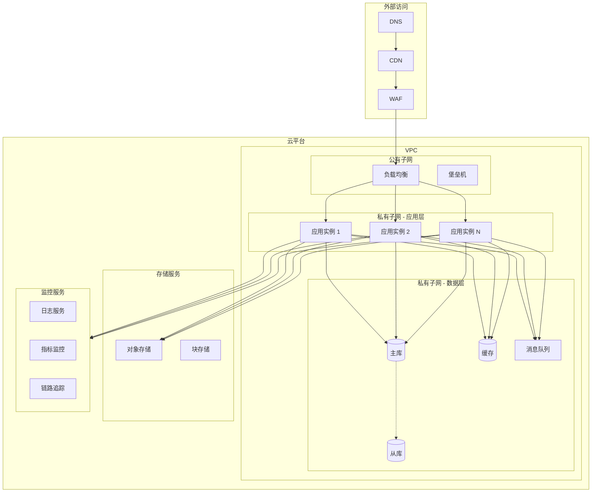

# 运维阶段图表指南

## 1. 概述

运维阶段是保障系统稳定运行、快速排障的关键环节。本指南介绍三种在运维阶段最常用的图表：

| 图表类型   | 核心用途               | 适用阶段           |
| ---------- | ---------------------- | ------------------ |
| 网络拓扑图 | 展示网络设备和连接关系 | 网络规划与故障排查 |
| 部署架构图 | 展示生产环境基础设施   | 基础设施管理       |
| 监控仪表盘 | 关键指标可视化布局     | 日常监控与告警     |

这三种图表各有侧重，通常配合使用：

- **网络拓扑图**：描述物理和逻辑网络结构，是排查网络故障的基础
- **部署架构图**：展示系统在云或数据中心的部署方式，便于容量规划和故障定位
- **监控仪表盘**：实时展示系统健康状态，是 SRE 和运维的核心工具

## 2. 网络拓扑图

### 2.1 概述

**定义**：网络拓扑图是描述网络中各设备（路由器、交换机、服务器等）及其相互连接关系的可视化图表。

**核心用途**：

- 规划和设计网络架构
- 记录网络设备的物理和逻辑连接
- 故障排查和根因分析
- 安全审计和网络隔离设计

**适用场景**：

| 适合使用         | 不适合使用       |
| ---------------- | ---------------- |
| 数据中心网络规划 | 描述软件架构     |
| 网络故障排查     | 展示业务流程     |
| 安全区域划分     | 数据库表关系设计 |
| 网络设备资产管理 | 代码结构分析     |
| 防火墙规则可视化 | 用户界面设计     |

### 2.2 基本元素

#### 核心符号

| 符号     | 含义         | 常见表示                   |
| -------- | ------------ | -------------------------- |
| 路由器   | 三层网络设备 | 圆柱形或带箭头的圆形       |
| 交换机   | 二层网络设备 | 矩形或带端口的长方形       |
| 防火墙   | 安全设备     | 带砖墙图案或盾牌形状       |
| 服务器   | 计算节点     | 塔式或机架式服务器图标     |
| 负载均衡 | 流量分发设备 | 带箭头分叉的图形           |
| 客户端   | 终端设备     | 电脑、手机图标             |
| 云服务   | 云端资源     | 云朵形状                   |
| 连接线   | 网络连接     | 实线表示物理、虚线表示逻辑 |

#### 拓扑类型

| 拓扑类型 | 特点                 | 适用场景         |
| -------- | -------------------- | ---------------- |
| 星型     | 中心节点连接所有设备 | 小型网络、办公室 |
| 环型     | 设备首尾相连成环     | 需要冗余的网络   |
| 网状     | 设备间多路径互联     | 高可用数据中心   |
| 树型     | 分层结构、层级清晰   | 大型企业网络     |
| 混合型   | 多种拓扑组合         | 复杂企业网络     |

#### 网络层次

| 层次   | 职责           | 典型设备             |
| ------ | -------------- | -------------------- |
| 核心层 | 高速数据交换   | 核心路由器、核心交换 |
| 汇聚层 | 策略控制、聚合 | 汇聚交换机、防火墙   |
| 接入层 | 终端设备接入   | 接入交换机、AP       |

### 2.3 示例

#### 简单示例：小型办公网络



#### 实战示例：企业数据中心网络

```
                                    ┌─────────────────────────────────────────┐
                                    │              互联网                      │
                                    └────────────────┬────────────────────────┘
                                                     │
                            ┌────────────────────────┴────────────────────────┐
                            │                   边界层                          │
                            │  ┌──────────┐              ┌──────────┐         │
                            │  │ 边界路由1 │──────────────│ 边界路由2 │         │
                            │  │ BGP/OSPF │              │ BGP/OSPF │         │
                            │  └────┬─────┘              └────┬─────┘         │
                            │       │                         │               │
                            │  ┌────┴─────┐              ┌────┴─────┐         │
                            │  │ 防火墙1  │──────────────│ 防火墙2  │         │
                            │  │  主     │              │  备     │         │
                            │  └────┬─────┘              └────┬─────┘         │
                            └───────┼─────────────────────────┼───────────────┘
                                    │                         │
                    ┌───────────────┴─────────────────────────┴───────────────┐
                    │                        核心层                             │
                    │       ┌────────────┐              ┌────────────┐        │
                    │       │ 核心交换1   │══════════════│ 核心交换2   │        │
                    │       │ 10.0.0.1   │              │ 10.0.0.2   │        │
                    │       └─────┬──────┘              └──────┬─────┘        │
                    └─────────────┼────────────────────────────┼──────────────┘
                                  │                            │
            ┌─────────────────────┴─────┬──────────────────────┴─────┐
            │                           │                            │
    ┌───────┴────────┐          ┌───────┴────────┐          ┌───────┴────────┐
    │   汇聚交换1     │          │   汇聚交换2     │          │   汇聚交换3     │
    │  VLAN 100-199  │          │  VLAN 200-299  │          │  VLAN 300-399  │
    └───────┬────────┘          └───────┬────────┘          └───────┬────────┘
            │                           │                            │
    ┌───────┴────────┐          ┌───────┴────────┐          ┌───────┴────────┐
    │   接入交换机    │          │   接入交换机    │          │   接入交换机    │
    │   服务器机架    │          │   存储设备     │          │   办公终端     │
    └────────────────┘          └────────────────┘          └────────────────┘

    ═══ 冗余链路（LACP）
    ─── 单链路
```

#### 云网络拓扑示例



### 2.4 绘制工具

| 工具                | 类型       | 优点                    | 缺点       | 适用场景     |
| ------------------- | ---------- | ----------------------- | ---------- | ------------ |
| Draw.io             | 免费在线   | 图标丰富、免费          | 手动绘制   | 通用网络图   |
| Lucidchart          | 在线协作   | 协作方便、模板丰富      | 需付费     | 团队协作     |
| Cisco Packet Tracer | 专业工具   | 可模拟网络行为          | 学习曲线陡 | 网络工程师   |
| NetBox              | 开源 DCIM  | 自动发现、资产管理      | 部署复杂   | 数据中心管理 |
| Mermaid             | 文本绘图   | 版本控制、Markdown 集成 | 图标有限   | 文档嵌入     |
| Visio               | 桌面软件   | 功能强大、专业图标      | 需购买     | 企业正式文档 |
| AWS/GCP/Azure       | 云厂商工具 | 原生集成、自动生成      | 限定厂商   | 云架构可视化 |

### 2.5 最佳实践

1. **分层展示**：按核心层、汇聚层、接入层分层，保持逻辑清晰

2. **标注关键信息**：
   - 设备型号和主机名
   - IP 地址和 VLAN
   - 端口号和链路带宽
   - 冗余类型（LACP、VRRP）

3. **使用标准图标**：采用 Cisco、AWS 等标准图标集，提高可读性

4. **标记网段和安全域**：
   - 用颜色或边框区分不同网段
   - 标注防火墙规则方向

5. **保持更新**：网络变更后及时更新拓扑图，可使用自动发现工具

### 2.6 常见错误

| 错误            | 问题描述               | 正确做法                          |
| --------------- | ---------------------- | --------------------------------- |
| ❌ 缺少 IP 信息 | 只画设备不标 IP        | ✅ 标注关键设备的 IP 和网段       |
| ❌ 层次混乱     | 核心和接入设备混在一起 | ✅ 按网络层次分层展示             |
| ❌ 忽略冗余     | 只画单链路             | ✅ 展示冗余链路和故障切换路径     |
| ❌ 符号不统一   | 使用非标准图标         | ✅ 采用标准网络设备图标           |
| ❌ 安全域不清   | 未标注防火墙和安全组   | ✅ 明确标注安全边界和访问规则     |
| ❌ 信息过载     | 一张图包含所有细节     | ✅ 分层级绘制，概览图和详细图分开 |

### 2.7 进阶技巧

#### 物理与逻辑分离

建议绘制两套拓扑图：

```
物理拓扑图：
- 展示真实的设备连接
- 标注端口、线缆类型
- 用于机房布线和硬件故障排查

逻辑拓扑图：
- 展示 VLAN、子网划分
- 标注路由协议、策略
- 用于网络规划和安全审计
```

#### 故障域标记

在拓扑图中标注故障域，便于故障影响评估：



#### 流量路径可视化

在排障时标注流量路径：

```
请求路径标注示例：

用户 → CDN → WAF → LB → App → Cache(命中) → 返回
                        ↓
                      DB(缓存未命中)
                        ↓
                     返回并更新缓存
```

### 2.8 模板

#### 企业网络拓扑模板



## 3. 部署架构图

### 3.1 概述

**定义**：部署架构图展示应用系统在生产环境中的基础设施布局，包括服务器、容器、云服务及其相互关系。

**核心用途**：

- 规划和设计生产环境
- 容量规划和资源评估
- 故障排查和影响分析
- 灾备方案设计

**适用场景**：

| 适合使用         | 不适合使用     |
| ---------------- | -------------- |
| 生产环境规划     | 代码级设计     |
| 运维手册和 SOP   | 业务流程描述   |
| 灾备和高可用设计 | 用户界面原型   |
| 容量和成本评估   | 需求分析阶段   |
| 安全合规审计     | 非技术人员沟通 |

### 3.2 基本元素

#### 云服务商图标规范

主流云厂商都提供官方图标库，使用官方图标可提高专业性：

| 云厂商 | 图标库                     | 获取方式         |
| ------ | -------------------------- | ---------------- |
| AWS    | AWS Architecture Icons     | 官网下载 PNG/SVG |
| Azure  | Azure Icon Collection      | 官网下载         |
| GCP    | Google Cloud Icons         | 官网下载         |
| 阿里云 | Alibaba Cloud Icons        | 官网下载         |
| 腾讯云 | Tencent Cloud Architecture | 官网下载         |

#### 常用元素

| 元素类型 | 表示方法        | 标注内容                  |
| -------- | --------------- | ------------------------- |
| 计算实例 | 服务器图标      | 实例类型、CPU/内存、数量  |
| 容器服务 | 容器/K8s 图标   | 集群规模、节点配置        |
| 数据库   | 圆柱形          | 类型、版本、主从关系      |
| 负载均衡 | 分叉箭头        | 类型（ALB/NLB）、监听端口 |
| 存储     | 存储桶/磁盘图标 | 类型、容量、IOPS          |
| 网络     | 线条和区域      | VPC、子网、安全组         |
| 可用区   | 虚线边框区域    | 区域标识                  |

#### 高可用模式标记

| 模式 | 表示方法             | 说明                 |
| ---- | -------------------- | -------------------- |
| 主从 | Primary/Replica 标签 | 一主多从，读写分离   |
| 主备 | Active/Standby 标签  | 热备份，自动故障转移 |
| 多活 | Active/Active 标签   | 多节点同时服务       |
| 集群 | Cluster 边框         | 多节点组成集群       |

### 3.3 示例

#### 简单示例：单机部署



#### 实战示例：多可用区高可用部署



#### 多区域灾备部署

```
┌─────────────────────────────────────────────────────────────────────────────┐
│                            全局负载均衡 (Route 53)                           │
│                              故障转移策略                                    │
└──────────────────────────────────┬──────────────────────────────────────────┘
                                   │
        ┌──────────────────────────┴──────────────────────────┐
        │                                                      │
        ▼                                                      ▼
┌───────────────────────────────┐      ┌───────────────────────────────┐
│     主区域 (ap-east-1)         │      │     灾备区域 (ap-southeast-1)   │
│         [Active]              │      │         [Standby]             │
│                               │      │                               │
│  ┌─────────────────────────┐  │      │  ┌─────────────────────────┐  │
│  │      应用集群            │  │      │  │      应用集群            │  │
│  │   EKS (6 nodes)         │  │      │  │   EKS (3 nodes)         │  │
│  │   c5.2xlarge            │  │      │  │   c5.2xlarge            │  │
│  └───────────┬─────────────┘  │      │  └───────────┬─────────────┘  │
│              │                │      │              │                │
│  ┌───────────┴─────────────┐  │      │  ┌───────────┴─────────────┐  │
│  │      数据层              │  │      │  │      数据层              │  │
│  │  ┌─────────────────┐    │  │      │  │  ┌─────────────────┐    │  │
│  │  │ RDS Primary     │◄───┼──┼──────┼──┼──│ RDS Replica     │    │  │
│  │  │ Multi-AZ        │    │  │  异  │  │  │ Read Replica    │    │  │
│  │  └─────────────────┘    │  │  步  │  │  └─────────────────┘    │  │
│  │                         │  │  复  │  │                         │  │
│  │  ┌─────────────────┐    │  │  制  │  │  ┌─────────────────┐    │  │
│  │  │ ElastiCache     │    │  │      │  │  │ ElastiCache     │    │  │
│  │  │ Redis Cluster   │    │  │      │  │  │ Redis Cluster   │    │  │
│  │  └─────────────────┘    │  │      │  │  └─────────────────┘    │  │
│  └─────────────────────────┘  │      │  └─────────────────────────┘  │
│                               │      │                               │
│  RPO: 0 (Multi-AZ)           │      │  RPO: < 1 min                 │
│  RTO: < 1 min                │      │  RTO: < 15 min                │
└───────────────────────────────┘      └───────────────────────────────┘
                    │                                  │
                    └──────────────┬───────────────────┘
                                   │
                    ┌──────────────┴──────────────┐
                    │      共享存储 (S3)           │
                    │   跨区域复制                 │
                    └─────────────────────────────┘
```

#### Kubernetes 集群部署架构



### 3.4 绘制工具

| 工具              | 类型     | 优点                        | 缺点             | 适用场景     |
| ----------------- | -------- | --------------------------- | ---------------- | ------------ |
| Draw.io           | 免费在线 | 多云图标、免费              | 手动布局         | 通用架构图   |
| Cloudcraft        | 在线工具 | AWS 专用、3D 效果、成本估算 | 仅支持 AWS、付费 | AWS 架构设计 |
| Lucidchart        | 在线协作 | 多云支持、协作方便          | 需付费           | 团队协作     |
| Diagrams (Python) | 代码即图 | 版本控制、自动化生成        | 需要编程         | CI/CD 集成   |
| Holori            | 在线工具 | 多云支持、自动发现          | 功能限制         | 云资源可视化 |
| PlantUML C4       | 文本绘图 | 版本控制、规范化            | 图标有限         | 技术文档     |
| Mermaid           | 文本绘图 | Markdown 集成               | 样式有限         | 文档嵌入     |

### 3.5 最佳实践

1. **使用官方云厂商图标**：提高专业性和可识别性

2. **标注关键规格**：
   - 实例类型和数量
   - 存储容量和 IOPS
   - 网络带宽

3. **展示高可用设计**：
   - 多可用区部署
   - 主从和备份关系
   - 故障转移路径

4. **包含网络边界**：
   - VPC 和子网划分
   - 安全组和 ACL
   - 公网/私网分离

5. **区分环境**：
   - 生产、预发、测试分别绘制
   - 或在一张图中用颜色区分

### 3.6 常见错误

| 错误            | 问题描述                   | 正确做法                      |
| --------------- | -------------------------- | ----------------------------- |
| ❌ 规格缺失     | 只画图标不标配置           | ✅ 标注实例类型、CPU/内存     |
| ❌ 忽略网络     | 不画 VPC 和子网            | ✅ 展示网络拓扑和安全边界     |
| ❌ 单点故障     | 没有展示高可用设计         | ✅ 展示多 AZ、主从、集群      |
| ❌ 缺少存储     | 遗漏数据库和存储服务       | ✅ 包含所有数据持久化组件     |
| ❌ 混淆逻辑物理 | 业务组件和基础设施混在一起 | ✅ 分层展示或分开绘制         |
| ❌ 版本不同步   | 图表与实际部署不一致       | ✅ 建立更新机制，IaC 自动生成 |

### 3.7 进阶技巧

#### 使用 Diagrams 代码生成

```python
# diagrams 是 Python 库，可以用代码生成架构图
from diagrams import Diagram, Cluster
from diagrams.aws.compute import ECS, EKS
from diagrams.aws.database import RDS, ElastiCache
from diagrams.aws.network import ELB, CloudFront, Route53

with Diagram("生产环境架构", show=False, direction="TB"):
    dns = Route53("DNS")
    cdn = CloudFront("CDN")

    with Cluster("VPC"):
        lb = ELB("ALB")

        with Cluster("应用层"):
            apps = [ECS("app-1"),
                    ECS("app-2"),
                    ECS("app-3")]

        with Cluster("数据层"):
            db = RDS("MySQL")
            cache = ElastiCache("Redis")

    dns >> cdn >> lb >> apps
    apps >> db
    apps >> cache
```

#### 标注成本估算

在部署图中加入成本信息，便于预算评估：

```
┌─────────────────────────────────────────────────────────┐
│  生产环境月度成本估算                                    │
├─────────────────────────────────────────────────────────┤
│  组件                │ 规格           │ 月成本 (USD)     │
├─────────────────────────────────────────────────────────┤
│  EC2 (6x c5.xlarge)  │ 4C8G           │ $612            │
│  RDS (Multi-AZ)      │ db.r5.2xlarge  │ $580            │
│  ElastiCache         │ r5.large x 3   │ $216            │
│  ALB                 │ -              │ $22 + 流量      │
│  S3 + CloudFront     │ 1TB            │ $50             │
├─────────────────────────────────────────────────────────┤
│  合计                                  │ ~$1,500/月      │
└─────────────────────────────────────────────────────────┘
```

#### 灾备切换流程

```
正常状态:
┌──────────────────┐     ┌──────────────────┐
│  主区域 [Active] │────▶│ 灾备区域 [Warm]  │
│  100% 流量       │ 复制 │  0% 流量         │
└──────────────────┘     └──────────────────┘

故障切换:
1. 检测到主区域故障
2. DNS 切换到灾备区域
3. 扩容灾备区域资源
4. 验证服务可用性

切换后状态:
┌──────────────────┐     ┌──────────────────┐
│  主区域 [Down]   │     │ 灾备区域 [Active]│
│  0% 流量         │     │  100% 流量       │
└──────────────────┘     └──────────────────┘
```

### 3.8 模板

#### 标准三层架构模板



## 4. 监控仪表盘

### 4.1 概述

**定义**：监控仪表盘是将系统关键指标以图表形式集中展示的可视化界面，用于实时监控系统健康状态和性能表现。

**核心用途**：

- 实时监控系统运行状态
- 快速发现和定位问题
- 容量规划和趋势分析
- 事故响应和根因分析

**适用场景**：

| 适合使用       | 不适合使用         |
| -------------- | ------------------ |
| 7x24 系统监控  | 一次性数据分析     |
| SRE 值班和告警 | 详细日志分析       |
| 性能基线建立   | 业务报表生成       |
| 容量规划参考   | 财务或销售数据展示 |
| 故障响应中心   | 代码质量分析       |

### 4.2 基本元素

#### 四个黄金信号 (Four Golden Signals)

Google SRE 提出的四个核心监控指标：

| 信号   | 英文       | 含义             | 示例指标                  |
| ------ | ---------- | ---------------- | ------------------------- |
| 延迟   | Latency    | 服务请求耗时     | P50/P90/P99 响应时间      |
| 流量   | Traffic    | 系统承受的请求量 | QPS、RPS、并发连接数      |
| 错误   | Errors     | 请求失败率       | 5xx 比例、错误计数        |
| 饱和度 | Saturation | 资源使用程度     | CPU、内存、磁盘、队列深度 |

#### RED 方法

面向微服务的简化监控方法：

| 指标     | 英文   | 含义         | 适用场景     |
| -------- | ------ | ------------ | ------------ |
| Rate     | 请求率 | 每秒请求数   | API 服务     |
| Errors   | 错误率 | 失败请求比例 | 所有服务     |
| Duration | 耗时   | 请求处理时间 | 性能敏感服务 |

#### USE 方法

面向基础设施的监控方法：

| 指标        | 英文   | 含义           | 适用资源           |
| ----------- | ------ | -------------- | ------------------ |
| Utilization | 利用率 | 资源使用百分比 | CPU、内存、磁盘    |
| Saturation  | 饱和度 | 排队等待程度   | 队列、连接池       |
| Errors      | 错误   | 错误事件计数   | 磁盘错误、网络丢包 |

#### 可视化类型

| 图表类型 | 适用场景           | 示例                      |
| -------- | ------------------ | ------------------------- |
| 折线图   | 时间序列趋势       | CPU 使用率、QPS 变化      |
| 面积图   | 堆叠数据、总量构成 | 内存分布、流量来源        |
| 柱状图   | 分类对比           | 各服务错误数、响应码分布  |
| 仪表盘   | 单一指标状态       | 当前 CPU 使用率、健康分数 |
| 热力图   | 多维度分布         | 延迟分布、请求热点        |
| 表格     | 详细数据列表       | Top N 慢查询、错误详情    |
| 状态面板 | 服务健康状态       | 各组件在线状态            |
| 拓扑图   | 服务依赖关系       | 调用链路、错误传播        |

### 4.3 示例

#### 简单示例：单服务仪表盘布局

```
┌─────────────────────────────────────────────────────────────────────────────┐
│                           API 服务监控仪表盘                                  │
├─────────────────────────────────────────────────────────────────────────────┤
│                                                                              │
│  ┌─────────────────┐ ┌─────────────────┐ ┌─────────────────┐ ┌─────────────┐│
│  │   请求成功率     │ │   平均延迟      │ │    QPS         │ │  错误数     ││
│  │   [仪表盘]      │ │   [仪表盘]      │ │   [仪表盘]     │ │  [仪表盘]   ││
│  │     99.5%       │ │     45ms        │ │    1,234       │ │     23      ││
│  └─────────────────┘ └─────────────────┘ └─────────────────┘ └─────────────┘│
│                                                                              │
│  ┌───────────────────────────────────────┐ ┌───────────────────────────────┐│
│  │          请求量趋势 (QPS)              │ │        响应时间分布            ││
│  │          [折线图]                      │ │        [热力图]                ││
│  │                                        │ │                                ││
│  │    ▲                                   │ │  P99 ████████░░░ 120ms        ││
│  │  2k│     ╭─╮                          │ │  P95 ██████░░░░░  85ms        ││
│  │    │    ╱   ╲    ╭─╮                  │ │  P90 █████░░░░░░  65ms        ││
│  │  1k│   ╱     ╲──╱   ╲─╮               │ │  P50 ██░░░░░░░░░  35ms        ││
│  │    │  ╱               ╲               │ │                                ││
│  │  0 └──────────────────────▶           │ │                                ││
│  │      6h    4h    2h    now            │ │                                ││
│  └───────────────────────────────────────┘ └───────────────────────────────┘│
│                                                                              │
│  ┌───────────────────────────────────────┐ ┌───────────────────────────────┐│
│  │          HTTP 状态码分布               │ │        Top 5 慢接口            ││
│  │          [饼图]                        │ │        [表格]                  ││
│  │                                        │ │                                ││
│  │           ████ 2xx (95%)              │ │  接口          │ P99    │ 调用 ││
│  │           ██   3xx (3%)               │ │  /api/search   │ 850ms  │ 1.2k ││
│  │           █    4xx (1.5%)             │ │  /api/report   │ 620ms  │ 890  ││
│  │           ░    5xx (0.5%)             │ │  /api/export   │ 520ms  │ 456  ││
│  │                                        │ │  /api/analyze  │ 380ms  │ 2.3k ││
│  │                                        │ │  /api/query    │ 250ms  │ 5.6k ││
│  └───────────────────────────────────────┘ └───────────────────────────────┘│
│                                                                              │
└─────────────────────────────────────────────────────────────────────────────┘
```

#### 实战示例：全站监控仪表盘

```
┌─────────────────────────────────────────────────────────────────────────────┐
│                          生产环境全局监控                                     │
│  时间范围: [最近1小时 ▼]  自动刷新: [5s ▼]              2024-01-15 14:32:15  │
├─────────────────────────────────────────────────────────────────────────────┤
│                                                                              │
│  ═══════════════════════════ 服务健康状态 ═══════════════════════════════   │
│                                                                              │
│  ┌──────────┐ ┌──────────┐ ┌──────────┐ ┌──────────┐ ┌──────────┐          │
│  │ ● API    │ │ ● Web    │ │ ● Worker │ │ ● MySQL  │ │ ● Redis  │          │
│  │ Gateway  │ │ Frontend │ │ Service  │ │ Primary  │ │ Cluster  │          │
│  │  健康    │ │  健康    │ │  健康    │ │  健康    │ │  健康    │          │
│  └──────────┘ └──────────┘ └──────────┘ └──────────┘ └──────────┘          │
│                                                                              │
│  ═══════════════════════════ 关键业务指标 ═══════════════════════════════   │
│                                                                              │
│  ┌─────────────────┐ ┌─────────────────┐ ┌─────────────────┐ ┌─────────────┐│
│  │ 订单量/分钟     │ │ 支付成功率      │ │  GMV (今日)     │ │ 活跃用户    ││
│  │    156.2        │ │    99.2%        │ │  ¥1,234,567    │ │   12,345    ││
│  │    ↑ 12%       │ │    ↓ 0.1%      │ │    ↑ 8%        │ │   ↑ 5%     ││
│  └─────────────────┘ └─────────────────┘ └─────────────────┘ └─────────────┘│
│                                                                              │
│  ═══════════════════════════ 系统性能指标 ═══════════════════════════════   │
│                                                                              │
│  ┌─────────────────────────────────────────────────────────────────────────┐│
│  │                         全站 QPS 和延迟                                  ││
│  │  QPS ▲                                                    Latency (ms)  ││
│  │  10k │        ╭──╮                                              │ 100  ││
│  │      │      ╭─╯  ╰─╮      ╭──╮                                 │      ││
│  │   5k │    ╭─╯      ╰──────╯  ╰─╮                               │ 50   ││
│  │      │  ╭─╯                    ╰─────                          │      ││
│  │    0 └──────────────────────────────────────────────────────── │ 0    ││
│  │        14:00    14:10    14:20    14:30   now                          ││
│  │        ─── QPS    - - - P99 Latency                                    ││
│  └─────────────────────────────────────────────────────────────────────────┘│
│                                                                              │
│  ┌──────────────────────────────────┐ ┌────────────────────────────────────┐│
│  │       资源使用率                  │ │        错误率趋势                   ││
│  │                                   │ │                                    ││
│  │  API-1   CPU ████████░░ 78%      │ │  ▲ 0.5%                            ││
│  │          MEM ██████░░░░ 62%      │ │    │                               ││
│  │  API-2   CPU ███████░░░ 72%      │ │    │     ╱╲                        ││
│  │          MEM █████░░░░░ 55%      │ │    │────╱  ╲───────────────        ││
│  │  API-3   CPU █████████░ 85% ⚠   │ │  0 └──────────────────────▶        ││
│  │          MEM ████████░░ 80%      │ │      14:00  14:15  14:30  now      ││
│  └──────────────────────────────────┘ └────────────────────────────────────┘│
│                                                                              │
│  ═══════════════════════════ 数据库性能 ═════════════════════════════════   │
│                                                                              │
│  ┌──────────────────────────────────┐ ┌────────────────────────────────────┐│
│  │       MySQL 连接池               │ │        慢查询 Top 5                 ││
│  │                                   │ │                                    ││
│  │  活跃: 45/100  空闲: 55          │ │  SQL               │ 耗时  │ 次数  ││
│  │  ██████████████████████████████░ │ │  SELECT...users    │ 2.3s  │ 12   ││
│  │          45%                      │ │  SELECT...orders   │ 1.8s  │ 8    ││
│  │                                   │ │  UPDATE...product  │ 1.2s  │ 34   ││
│  │  等待: 0     超时: 0              │ │  SELECT...logs     │ 0.9s  │ 56   ││
│  └──────────────────────────────────┘ └────────────────────────────────────┘│
│                                                                              │
│  ═══════════════════════════ 最近告警 ═══════════════════════════════════   │
│                                                                              │
│  │ 时间     │ 级别 │ 服务    │ 告警内容                         │ 状态   │ │
│  │ 14:28:15 │ ⚠    │ API-3  │ CPU 使用率超过 85%               │ 进行中 │ │
│  │ 14:15:32 │ ✓    │ MySQL  │ 慢查询数量超过阈值                │ 已恢复 │ │
│  │ 13:45:00 │ ✓    │ Redis  │ 内存使用率超过 80%                │ 已恢复 │ │
│                                                                              │
└─────────────────────────────────────────────────────────────────────────────┘
```

#### Grafana 仪表盘 JSON 片段示例

```json
{
  "title": "API 服务监控",
  "panels": [
    {
      "title": "请求成功率",
      "type": "gauge",
      "gridPos": { "x": 0, "y": 0, "w": 6, "h": 4 },
      "targets": [
        {
          "expr": "sum(rate(http_requests_total{status=~\"2..\"}[5m])) / sum(rate(http_requests_total[5m])) * 100"
        }
      ],
      "thresholds": {
        "mode": "absolute",
        "steps": [
          { "color": "red", "value": null },
          { "color": "yellow", "value": 95 },
          { "color": "green", "value": 99 }
        ]
      }
    },
    {
      "title": "QPS 趋势",
      "type": "timeseries",
      "gridPos": { "x": 0, "y": 4, "w": 12, "h": 8 },
      "targets": [
        {
          "expr": "sum(rate(http_requests_total[1m]))",
          "legendFormat": "总 QPS"
        }
      ]
    },
    {
      "title": "响应时间分布",
      "type": "heatmap",
      "gridPos": { "x": 12, "y": 4, "w": 12, "h": 8 },
      "targets": [
        {
          "expr": "sum(rate(http_request_duration_seconds_bucket[5m])) by (le)"
        }
      ]
    }
  ]
}
```

### 4.4 绘制工具

| 工具          | 类型       | 优点                | 缺点       | 适用场景     |
| ------------- | ---------- | ------------------- | ---------- | ------------ |
| Grafana       | 开源平台   | 功能强大、插件丰富  | 需要运维   | 通用监控     |
| Prometheus    | 开源监控   | 与 Grafana 完美配合 | 仅指标存储 | 指标采集     |
| Datadog       | SaaS 服务  | 开箱即用、AI 分析   | 价格较高   | 企业级监控   |
| CloudWatch    | AWS 服务   | AWS 原生集成        | 仅限 AWS   | AWS 环境     |
| Azure Monitor | Azure 服务 | Azure 原生集成      | 仅限 Azure | Azure 环境   |
| Kibana        | 开源平台   | 日志分析强大        | ELK 栈依赖 | 日志监控     |
| New Relic     | SaaS 服务  | APM 功能强大        | 价格较高   | 应用性能监控 |

### 4.5 最佳实践

1. **分层设计仪表盘**：
   - 概览层：关键 SLI 和健康状态
   - 服务层：各服务详细指标
   - 基础设施层：资源使用情况

2. **使用四个黄金信号**：
   - 每个服务至少监控延迟、流量、错误、饱和度
   - 设置合理告警阈值

3. **布局原则**：
   - 最重要的指标放在左上角
   - 相关指标放在一起
   - 使用合适的可视化类型

4. **时间范围选择**：
   - 默认显示最近 1 小时
   - 提供快速切换选项（5m/15m/1h/6h/24h/7d）

5. **添加上下文**：
   - 标注部署时间点
   - 显示告警阈值线
   - 提供钻取链接

### 4.6 常见错误

| 错误          | 问题描述             | 正确做法                        |
| ------------- | -------------------- | ------------------------------- |
| ❌ 指标过多   | 仪表盘塞满了各种指标 | ✅ 聚焦关键指标，分层展示       |
| ❌ 颜色混乱   | 随意使用颜色         | ✅ 红黄绿表示严重/警告/正常     |
| ❌ 缺少基线   | 不知道正常范围       | ✅ 添加阈值线、历史基线对比     |
| ❌ 单位不明   | 数字没有单位         | ✅ 标注单位（ms、%、req/s）     |
| ❌ 刷新太频繁 | 1秒刷新导致图表抖动  | ✅ 根据指标特性选择合适刷新间隔 |
| ❌ 忽略聚合   | 原始数据太多太细     | ✅ 使用合适的聚合粒度           |

### 4.7 进阶技巧

#### 告警分级

```
┌─────────────────────────────────────────────────────────────┐
│                      告警分级策略                            │
├─────────┬───────────────┬───────────────┬──────────────────┤
│ 级别    │ 条件          │ 响应时间      │ 通知方式          │
├─────────┼───────────────┼───────────────┼──────────────────┤
│ P0 严重 │ 服务不可用    │ 5 分钟内响应  │ 电话 + 短信       │
│ P1 高   │ 核心功能降级  │ 15 分钟内响应 │ 短信 + 即时通讯   │
│ P2 中   │ 非核心功能异常│ 1 小时内响应  │ 即时通讯          │
│ P3 低   │ 告警预警      │ 工作时间处理  │ 邮件              │
└─────────┴───────────────┴───────────────┴──────────────────┘
```

#### SLO 仪表盘设计

```
┌─────────────────────────────────────────────────────────────────────────────┐
│                           SLO 达成情况                                       │
├─────────────────────────────────────────────────────────────────────────────┤
│                                                                              │
│  ┌─────────────────────────────────────────────────────────────────────────┐│
│  │  服务可用性 SLO: 99.9%                                                   ││
│  │                                                                          ││
│  │  当前: 99.95%    目标: 99.9%    剩余错误预算: 43 分钟                    ││
│  │  ████████████████████████████████████████████░░░░░░                     ││
│  │                                            ▲                             ││
│  │                                       当前位置                           ││
│  │                                                                          ││
│  │  本月趋势:                                                               ││
│  │  Week 1: 99.98%  ✓                                                      ││
│  │  Week 2: 99.92%  ✓                                                      ││
│  │  Week 3: 99.95%  ✓  ◄── 当前                                            ││
│  │  Week 4: -                                                              ││
│  └─────────────────────────────────────────────────────────────────────────┘│
│                                                                              │
│  ┌─────────────────────────────────────────────────────────────────────────┐│
│  │  API 延迟 SLO: P99 < 200ms                                               ││
│  │                                                                          ││
│  │  当前 P99: 156ms    目标: 200ms    状态: ✓ 达标                         ││
│  │  ███████████████████████████████████████████████░░░░░░░░░░░             ││
│  │                                              ▲                           ││
│  │                                         当前位置                         ││
│  └─────────────────────────────────────────────────────────────────────────┘│
│                                                                              │
└─────────────────────────────────────────────────────────────────────────────┘
```

#### 根因分析视图

故障发生时，仪表盘应支持快速根因分析：

```
故障时间线:
14:30:00  ─────────────────────────────────────────────────────────▶
    │
    │  14:32:15  错误率上升 5xx > 1%
    │      │
    │      ├──▶ 下钻: 哪个服务?
    │      │         └─▶ order-service 5xx = 15%
    │      │
    │      ├──▶ 下钻: 哪个接口?
    │      │         └─▶ POST /api/orders 超时
    │      │
    │      ├──▶ 下钻: 依赖服务?
    │      │         └─▶ MySQL 连接池耗尽
    │      │
    │      └──▶ 根因: 慢查询导致连接池阻塞
    │
    │  14:35:00  添加索引，问题解决
    │
```

### 4.8 模板

#### 服务监控仪表盘模板

```
┌─────────────────────────────────────────────────────────────────────────────┐
│                           [服务名称] 监控仪表盘                               │
├─────────────────────────────────────────────────────────────────────────────┤
│  Row 1: 关键指标概览 (4 个 Stat/Gauge 面板)                                  │
│  ┌───────────┐ ┌───────────┐ ┌───────────┐ ┌───────────┐                   │
│  │ 可用性    │ │ 平均延迟  │ │ 请求量    │ │ 错误数    │                   │
│  │ [Gauge]   │ │ [Gauge]   │ │ [Stat]    │ │ [Stat]    │                   │
│  └───────────┘ └───────────┘ └───────────┘ └───────────┘                   │
│                                                                              │
│  Row 2: 流量和延迟趋势 (2 个 Time Series 面板)                               │
│  ┌─────────────────────────────────┐ ┌─────────────────────────────────┐   │
│  │        请求量趋势 (QPS)          │ │        响应时间 (P50/P90/P99)    │   │
│  │        [Time Series]            │ │        [Time Series]            │   │
│  └─────────────────────────────────┘ └─────────────────────────────────┘   │
│                                                                              │
│  Row 3: 错误分析 (2 个面板)                                                   │
│  ┌─────────────────────────────────┐ ┌─────────────────────────────────┐   │
│  │        状态码分布                │ │        错误类型 Top 5            │   │
│  │        [Pie Chart]              │ │        [Table]                  │   │
│  └─────────────────────────────────┘ └─────────────────────────────────┘   │
│                                                                              │
│  Row 4: 资源使用 (2 个面板)                                                   │
│  ┌─────────────────────────────────┐ ┌─────────────────────────────────┐   │
│  │        CPU/内存使用率            │ │        实例健康状态              │   │
│  │        [Time Series]            │ │        [Status Map]             │   │
│  └─────────────────────────────────┘ └─────────────────────────────────┘   │
│                                                                              │
│  Row 5: 依赖服务 (2 个面板)                                                   │
│  ┌─────────────────────────────────┐ ┌─────────────────────────────────┐   │
│  │        依赖调用延迟              │ │        依赖错误率                │   │
│  │        [Time Series by target]  │ │        [Time Series by target]  │   │
│  └─────────────────────────────────┘ └─────────────────────────────────┘   │
└─────────────────────────────────────────────────────────────────────────────┘
```

#### Prometheus 查询示例

```yaml
# 常用 PromQL 查询示例

# 请求率 (QPS)
sum(rate(http_requests_total[5m])) by (service)

# 错误率
sum(rate(http_requests_total{status=~"5.."}[5m]))
/ sum(rate(http_requests_total[5m])) * 100

# P99 延迟
histogram_quantile(0.99, sum(rate(http_request_duration_seconds_bucket[5m])) by (le))

# CPU 使用率
100 - (avg by (instance) (irate(node_cpu_seconds_total{mode="idle"}[5m])) * 100)

# 内存使用率
(1 - node_memory_MemAvailable_bytes / node_memory_MemTotal_bytes) * 100

# 磁盘使用率
(1 - node_filesystem_avail_bytes / node_filesystem_size_bytes) * 100
```

## 5. 总结

### 5.1 三类图表对比

| 维度     | 网络拓扑图         | 部署架构图         | 监控仪表盘      |
| -------- | ------------------ | ------------------ | --------------- |
| 核心关注 | 网络设备和连接     | 基础设施和部署     | 系统指标和状态  |
| 主要用途 | 网络规划和故障排查 | 容量规划和架构设计 | 实时监控和告警  |
| 更新频率 | 网络变更时更新     | 架构变更时更新     | 实时自动更新    |
| 目标受众 | 网络工程师、运维   | 架构师、SRE        | SRE、运维、开发 |
| 工具类型 | 绘图工具           | 绘图工具/代码生成  | 监控平台        |

### 5.2 选择指南

| 场景               | 推荐图表                |
| ------------------ | ----------------------- |
| 网络故障排查       | 网络拓扑图              |
| 新机房网络规划     | 网络拓扑图              |
| 云环境架构设计     | 部署架构图              |
| 容量规划和成本评估 | 部署架构图              |
| 灾备方案设计       | 部署架构图 + 网络拓扑图 |
| 日常系统监控       | 监控仪表盘              |
| 故障响应和定位     | 监控仪表盘 + 网络拓扑图 |
| SLO 跟踪           | 监控仪表盘              |

### 5.3 工具选择速查

| 需求场景       | 推荐工具                      |
| -------------- | ----------------------------- |
| 网络拓扑绘制   | Draw.io / Visio / Lucidchart  |
| 云架构图       | Draw.io + 云图标 / Cloudcraft |
| 代码生成架构图 | Diagrams (Python)             |
| 通用监控仪表盘 | Grafana + Prometheus          |
| AWS 监控       | CloudWatch / Grafana          |
| 日志分析监控   | Kibana / Grafana Loki         |
| 企业级 APM     | Datadog / New Relic           |

### 5.4 运维图表配合使用

```
运维场景图表使用流程:

1. 日常运维
   └── 【监控仪表盘】查看系统健康状态
       └── 发现异常指标

2. 故障排查
   ├── 【监控仪表盘】定位故障服务和时间点
   ├── 【部署架构图】确认服务依赖和部署位置
   └── 【网络拓扑图】排查网络层面问题

3. 架构优化
   ├── 【监控仪表盘】分析性能瓶颈
   ├── 【部署架构图】设计优化方案
   └── 【网络拓扑图】优化网络架构

4. 容灾演练
   ├── 【部署架构图】确认灾备架构
   ├── 【网络拓扑图】确认切换路径
   └── 【监控仪表盘】验证切换结果
```

### 5.5 速查表

#### 四个黄金信号监控清单

| 信号   | 指标                 | 告警阈值建议     |
| ------ | -------------------- | ---------------- |
| 延迟   | P50/P90/P99 响应时间 | P99 > SLO 目标值 |
| 流量   | QPS/RPS/并发数       | 超过容量 80%     |
| 错误   | 5xx 率/错误计数      | 错误率 > 0.1%    |
| 饱和度 | CPU/内存/队列深度    | 使用率 > 80%     |

#### 仪表盘布局优先级

| 位置   | 内容                | 原因               |
| ------ | ------------------- | ------------------ |
| 左上角 | 关键 SLI / 健康状态 | 视觉焦点，最先看到 |
| 顶部行 | 汇总指标 Stat/Gauge | 快速了解整体状况   |
| 中部   | 趋势图 Time Series  | 分析变化趋势       |
| 底部   | 详情表格/日志       | 深入分析使用       |

#### 常用 Prometheus 指标命名

| 类型      | 命名模式                       | 示例                           |
| --------- | ------------------------------ | ------------------------------ |
| Counter   | `<namespace>_<name>_total`     | `http_requests_total`          |
| Gauge     | `<namespace>_<name>`           | `node_memory_MemFree_bytes`    |
| Histogram | `<namespace>_<name>_bucket`    | `http_request_duration_bucket` |
| Summary   | `<namespace>_<name>_sum/count` | `go_gc_duration_seconds_sum`   |

## 6. 参考资源

### 官方文档

- [Grafana 官方文档](https://grafana.com/docs/)
- [Prometheus 官方文档](https://prometheus.io/docs/)
- [AWS Architecture Icons](https://aws.amazon.com/architecture/icons/)
- [Azure Architecture Icons](https://docs.microsoft.com/en-us/azure/architecture/icons/)
- [Google Cloud Architecture Icons](https://cloud.google.com/icons)

### 推荐阅读

- 《Site Reliability Engineering》- Google SRE 团队
- 《The Art of Monitoring》- James Turnbull
- [Google SRE Book - Monitoring](https://sre.google/sre-book/monitoring-distributed-systems/)
- [四个黄金信号](https://sre.google/sre-book/monitoring-distributed-systems/#xref_monitoring_golden-signals)
- [RED Method](https://grafana.com/blog/2018/08/02/the-red-method-how-to-instrument-your-services/)
- [USE Method](https://www.brendangregg.com/usemethod.html)

### 工具资源

- [Diagrams Python Library](https://diagrams.mingrammer.com/)
- [Draw.io / diagrams.net](https://app.diagrams.net/)
- [Cloudcraft](https://www.cloudcraft.co/)
- [Grafana Dashboard Gallery](https://grafana.com/grafana/dashboards/)
- [Awesome Prometheus Alerts](https://awesome-prometheus-alerts.grep.to/)
