# 流程建模阶段图表指南

## 1. 概述

流程建模是软件开发中描述业务逻辑和数据流转的关键环节。本指南介绍五种在流程建模阶段最常用的图表：

| 图表类型 | 核心用途                   | 适用阶段         |
| -------- | -------------------------- | ---------------- |
| 流程图   | 描述基础算法逻辑和简单流程 | 算法设计、入门级 |
| 活动图   | 描述带并发和分支的复杂流程 | UML 建模         |
| 泳道图   | 展示跨角色/部门的流程协作  | 业务流程分析     |
| 数据流图 | 展示数据在系统中的流动路径 | 系统分析         |
| BPMN     | 标准化业务流程建模         | 企业级流程管理   |

这五种图表的关系和适用场景：

- **流程图**：最基础的流程表示方式，适合简单的顺序逻辑和条件判断
- **活动图**：UML 标准图表，支持并发、分支、合并等复杂控制流
- **泳道图**：流程图的扩展，强调职责划分和跨部门协作
- **数据流图**：关注数据的流动和转换，而非控制流
- **BPMN**：业务流程建模的国际标准，功能最全面但学习成本较高

## 2. 流程图 (Flowchart)

### 2.1 概述

**定义**：流程图是一种使用几何图形和箭头来表示算法或过程步骤的可视化工具。它是最基础、最直观的流程表示方式。

**核心用途**：

- 描述算法的执行逻辑
- 展示简单的业务流程
- 编程前的逻辑设计
- 技术文档中的流程说明

**适用场景**：

| 适合使用               | 不适合使用             |
| ---------------------- | ---------------------- |
| 简单的顺序和条件逻辑   | 复杂的并发流程         |
| 算法设计和说明         | 跨多个角色的协作流程   |
| 单一职责的处理流程     | 需要严格标准的企业流程 |
| 技术文档中的流程片段   | 大规模的业务流程建模   |
| 初学者学习流程表示方法 | 需要执行引擎的流程定义 |

### 2.2 基本元素

流程图由几种核心符号组成：

| 元素      | 形状       | Mermaid 语法 | 说明             |
| --------- | ---------- | ------------ | ---------------- |
| 开始/结束 | 圆角矩形   | `([文本])`   | 流程的起点和终点 |
| 处理步骤  | 矩形       | `[文本]`     | 具体的操作或处理 |
| 判断条件  | 菱形       | `{文本}`     | 条件分支点       |
| 输入/输出 | 平行四边形 | `[/文本/]`   | 数据的输入或输出 |
| 数据库    | 圆柱形     | `[(文本)]`   | 数据存储         |
| 子流程    | 双边矩形   | `[[文本]]`   | 引用其他流程     |
| 连接线    | 箭头       | `-->`        | 流程方向         |
| 注释      | 旗形       | `>文本]`     | 补充说明         |

#### 连接线类型

| 类型       | 语法        | 说明           |
| ---------- | ----------- | -------------- |
| 实线箭头   | `-->`       | 标准流程方向   |
| 带文字箭头 | `- 文本 ->` | 标注条件或说明 |
| 虚线箭头   | `-.->`      | 可选或异步流程 |
| 粗线箭头   | `==>`       | 强调的主要流程 |

#### 流程方向

| 方向     | 语法           | 说明           |
| -------- | -------------- | -------------- |
| 从上到下 | `flowchart TD` | Top-Down，默认 |
| 从下到上 | `flowchart BT` | Bottom-Top     |
| 从左到右 | `flowchart LR` | Left-Right     |
| 从右到左 | `flowchart RL` | Right-Left     |

### 2.3 示例

#### 简单示例：用户登录流程

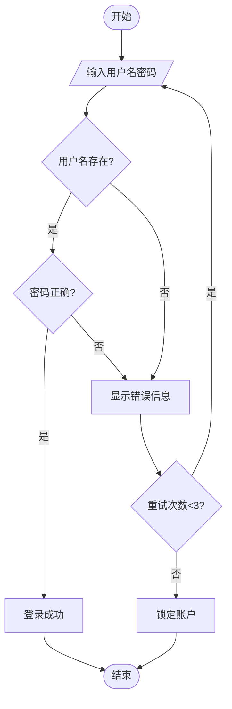

#### 实战示例：订单处理流程

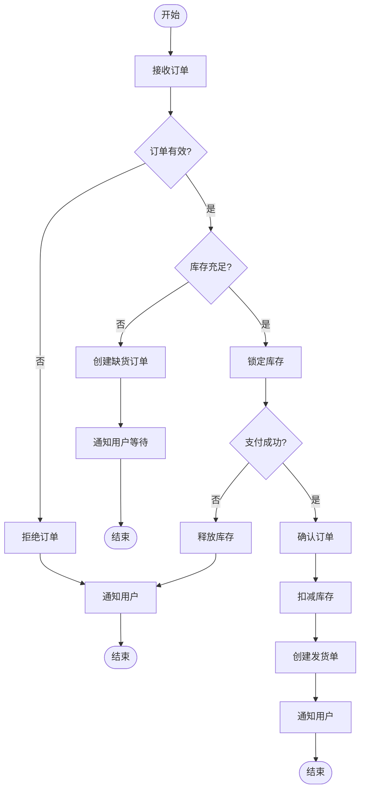

#### 带子流程的示例

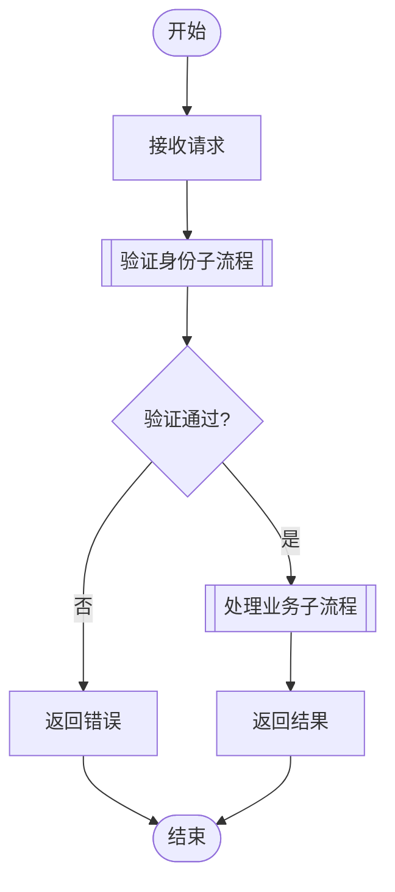

### 2.4 绘制工具

| 工具       | 类型     | 优点                    | 缺点           |
| ---------- | -------- | ----------------------- | -------------- |
| Mermaid    | 文本绘图 | Markdown 集成、版本控制 | 复杂布局受限   |
| Draw.io    | 免费工具 | 功能全面、模板丰富      | 需手动布局     |
| Lucidchart | 在线工具 | 协作方便、专业美观      | 免费版功能受限 |
| Visio      | 桌面软件 | 功能强大、企业级        | 价格昂贵       |
| ProcessOn  | 在线工具 | 中文友好、免费额度      | 高级功能需付费 |
| Excalidraw | 在线工具 | 手绘风格、简单易用      | 专业性较弱     |

### 2.5 最佳实践

1. **保持简洁**：单个流程图不超过 15-20 个节点，复杂流程拆分为子流程

2. **统一方向**：整体流程遵循从上到下或从左到右的方向，避免回流过多

3. **清晰命名**：节点使用动词短语，如"验证订单"而非"订单验证"

4. **合理分支**：每个判断节点清晰标注分支条件，使用"是/否"或具体条件

5. **标注关键信息**：在连接线上标注重要的条件或数据

### 2.6 常见错误

| 错误            | 问题描述               | 正确做法                    |
| --------------- | ---------------------- | --------------------------- |
| ❌ 节点过多     | 一张图超过 30 个节点   | ✅ 拆分为多个子流程         |
| ❌ 缺少开始结束 | 流程没有明确的起止点   | ✅ 始终包含开始和结束节点   |
| ❌ 箭头交叉     | 连线交叉导致难以阅读   | ✅ 调整布局或使用连接点     |
| ❌ 条件不完整   | 判断节点只有一个出口   | ✅ 判断必须有两个或以上分支 |
| ❌ 死循环       | 流程无法到达结束节点   | ✅ 确保所有路径都能结束     |
| ❌ 符号混用     | 判断和处理使用相同图形 | ✅ 严格遵循符号规范         |

### 2.7 进阶技巧

#### 使用样式区分状态

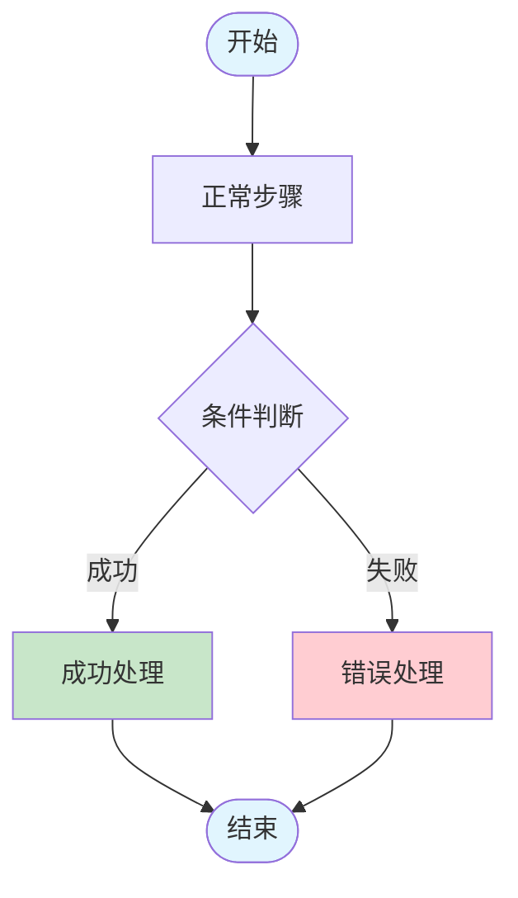

#### 使用子图分组

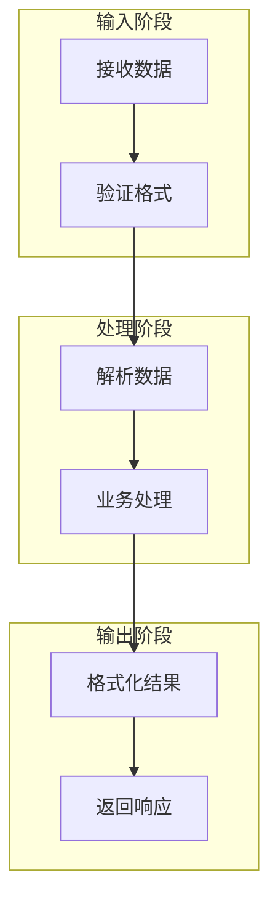

#### 与其他图配合使用

| 配合图表 | 用途                       |
| -------- | -------------------------- |
| 活动图   | 需要并发时升级为活动图     |
| 泳道图   | 需要展示职责时升级为泳道图 |
| 序列图   | 描述对象交互时配合序列图   |
| 状态机图 | 描述状态变化时配合状态机图 |

### 2.8 模板

#### 基础流程模板

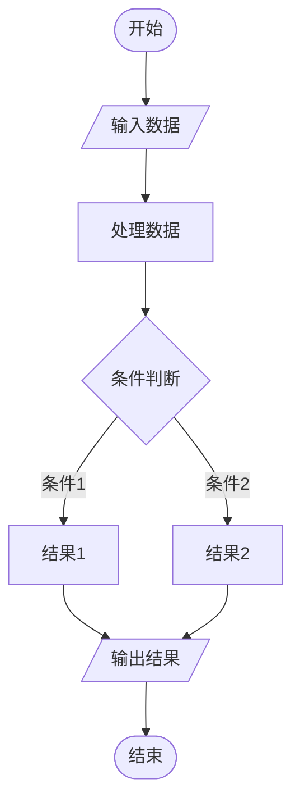

#### 异常处理流程模板

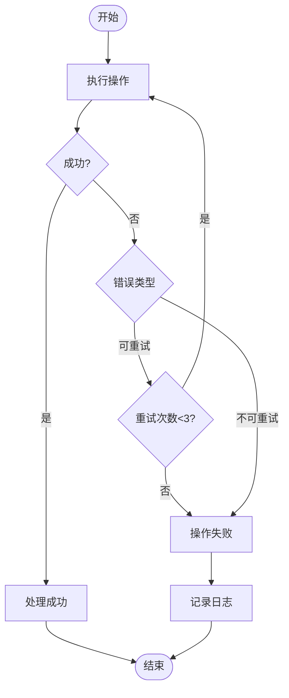

#### 审批流程模板

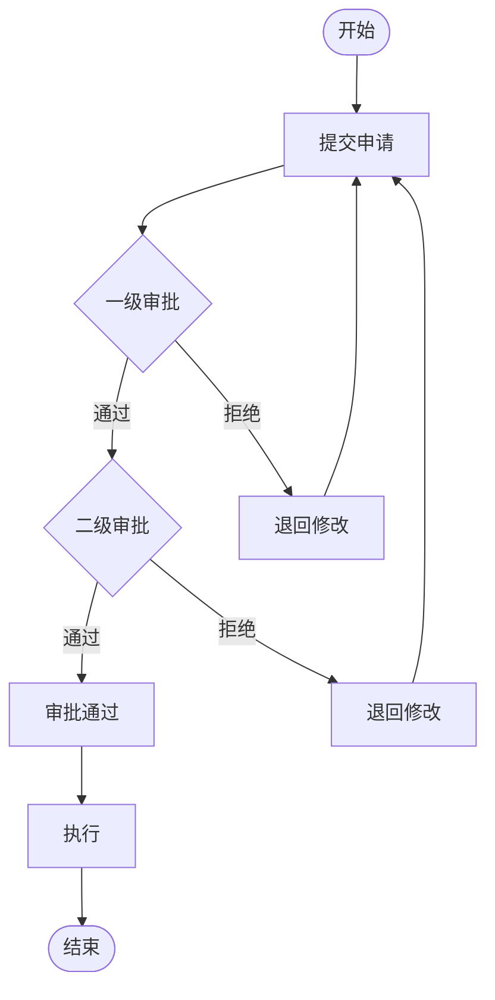

## 3. 活动图 (Activity Diagram)

### 3.1 概述

**定义**：活动图是 UML 中用于描述业务流程或算法的行为图，它扩展了流程图的能力，支持并发、分支、合并等复杂控制流。

**核心用途**：

- 描述带并发的复杂业务流程
- 建模系统的工作流
- 分析用例的详细行为
- 展示多线程或并行处理逻辑

**适用场景**：

| 适合使用           | 不适合使用       |
| ------------------ | ---------------- |
| 复杂的业务流程建模 | 简单的顺序流程   |
| 需要展示并发处理   | 只需要条件分支   |
| UML 建模项目       | 非技术人员的沟通 |
| 用例的行为分析     | 需要执行引擎支持 |
| 系统工作流设计     | 跨组织的流程协作 |

### 3.2 基本元素

活动图的核心元素：

| 元素      | 符号         | 说明                   |
| --------- | ------------ | ---------------------- |
| 初始节点  | 实心圆       | 流程的起点             |
| 活动/动作 | 圆角矩形     | 具体的操作步骤         |
| 决策节点  | 菱形         | 条件分支（一入多出）   |
| 合并节点  | 菱形         | 多路径合并（多入一出） |
| 分叉节点  | 粗横线       | 并行开始（一入多出）   |
| 汇合节点  | 粗横线       | 并行结束（多入一出）   |
| 终止节点  | 圆环内实心圆 | 流程的终点             |
| 控制流    | 箭头         | 活动之间的流转         |
| 对象流    | 虚线箭头     | 数据或对象的传递       |

#### 分叉与汇合

分叉（Fork）和汇合（Join）是活动图区别于流程图的核心特性：

- **分叉**：一个控制流分成多个并行执行的控制流
- **汇合**：多个并行控制流等待全部完成后合并为一个

```
       │
   ┌───┴───┐  ← 分叉（Fork）
   │       │
   ▼       ▼
  活动A   活动B   ← 并行执行
   │       │
   └───┬───┘  ← 汇合（Join）
       │
       ▼
```

### 3.3 示例

#### 简单示例：在线购物流程

使用 PlantUML 语法：

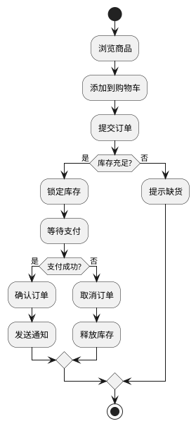

使用 Mermaid 模拟（Mermaid 原生不完全支持活动图，使用 flowchart 模拟）：

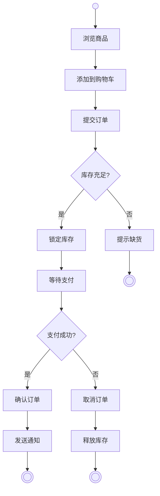

#### 实战示例：带并发的订单处理

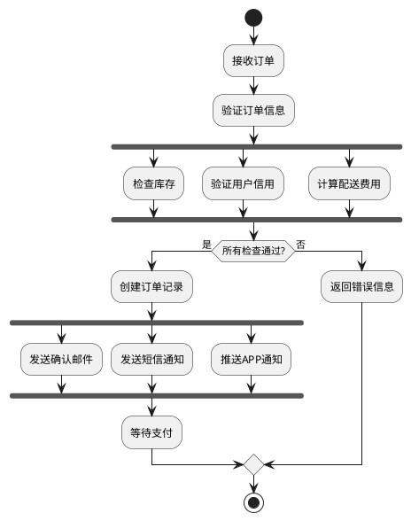

Mermaid 模拟并发（使用子图表示并行）：

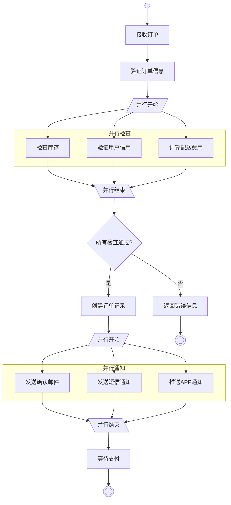

#### 带对象流的示例

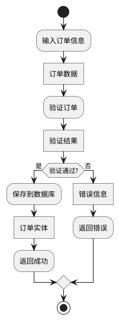

### 3.4 绘制工具

| 工具                 | 类型     | 优点               | 缺点             |
| -------------------- | -------- | ------------------ | ---------------- |
| PlantUML             | 文本绘图 | 语法简洁、支持并发 | 需要渲染服务     |
| Enterprise Architect | 专业工具 | UML 标准、功能完善 | 价格昂贵         |
| Visual Paradigm      | 专业工具 | UML 全面支持       | 需付费           |
| StarUML              | 桌面软件 | 轻量级、免费版可用 | 功能相对简单     |
| Draw.io              | 免费工具 | 免费、UML 形状库   | 手动布局         |
| Mermaid              | 文本绘图 | Markdown 集成      | 不完全支持活动图 |

### 3.5 最佳实践

1. **明确并发边界**：分叉和汇合必须成对出现，明确并行执行的范围

2. **简化决策分支**：每个决策节点的分支不超过 3-4 个，复杂条件拆分

3. **区分决策和合并**：
   - ✅ 决策节点：一个入口，多个出口（带条件）
   - ✅ 合并节点：多个入口，一个出口（无条件）

4. **标注守卫条件**：决策分支上必须标注条件，且条件互斥完备

5. **控制图的复杂度**：单个活动图不超过 20-25 个活动节点

### 3.6 常见错误

| 错误              | 问题描述                             | 正确做法                      |
| ----------------- | ------------------------------------ | ----------------------------- |
| ❌ 分叉汇合不配对 | 分叉后没有对应的汇合                 | ✅ 每个分叉必须有对应的汇合   |
| ❌ 决策条件不完备 | 条件分支没有覆盖所有情况             | ✅ 添加 else 分支处理其他情况 |
| ❌ 混淆决策与分叉 | 用决策节点表示并发                   | ✅ 并发用分叉，条件用决策     |
| ❌ 活动粒度不一致 | 有的活动是"点击按钮"有的是"处理订单" | ✅ 保持同一抽象层次           |
| ❌ 缺少初始和终止 | 没有明确的起点和终点                 | ✅ 必须有初始节点和终止节点   |

### 3.7 进阶技巧

#### 使用泳道分区

活动图可以结合泳道展示不同角色的职责：

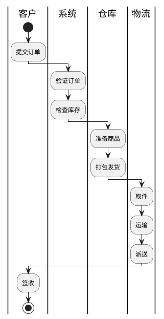

#### 异常处理区域

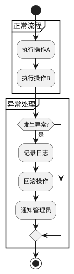

#### 与其他图配合使用

| 配合图表 | 用途                               |
| -------- | ---------------------------------- |
| 用例图   | 活动图详细描述用例的执行流程       |
| 序列图   | 活动图展示整体流程，序列图展示交互 |
| 状态机图 | 活动图展示流程，状态机图展示状态   |
| 类图     | 活动图中的对象对应类图中的类       |

### 3.8 模板

#### 基础活动图模板

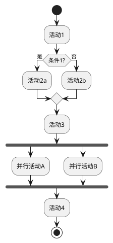

#### 循环处理模板

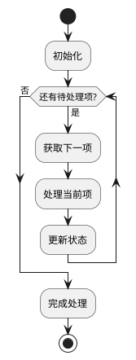

#### 异常处理模板

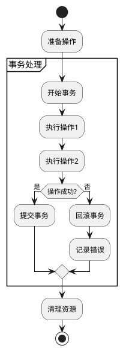

## 4. 泳道图 (Swimlane Diagram)

### 4.1 概述

**定义**：泳道图是在流程图或活动图的基础上增加泳道分区，用于展示不同角色、部门或系统在流程中的职责划分。

**核心用途**：

- 展示跨部门的业务流程协作
- 明确各角色在流程中的职责
- 分析业务流程的交接点和瓶颈
- 优化跨职能的工作流程

**适用场景**：

| 适合使用         | 不适合使用         |
| ---------------- | ------------------ |
| 跨部门的业务流程 | 单一角色的处理流程 |
| 需要明确职责划分 | 简单的技术算法     |
| 流程优化和分析   | 系统内部的技术流程 |
| 新员工培训和交接 | 高度自动化的流程   |
| 业务流程文档化   | 数据流分析         |

### 4.2 基本元素

泳道图在流程图基础上增加了泳道分区：

| 元素     | 说明                     | Mermaid 实现      |
| -------- | ------------------------ | ----------------- |
| 泳道     | 代表一个角色或部门的区域 | `subgraph 泳道名` |
| 活动     | 泳道内的具体操作         | 标准流程图节点    |
| 跨泳道流 | 从一个泳道流向另一个泳道 | 跨子图的连接线    |
| 分割线   | 泳道之间的边界           | 子图边框          |

#### 泳道布局方向

| 布局     | 说明                   | 适用场景       |
| -------- | ---------------------- | -------------- |
| 水平泳道 | 泳道横向排列，流程纵向 | 常见的组织结构 |
| 垂直泳道 | 泳道纵向排列，流程横向 | 时间轴相关流程 |

### 4.3 示例

#### 简单示例：请假审批流程

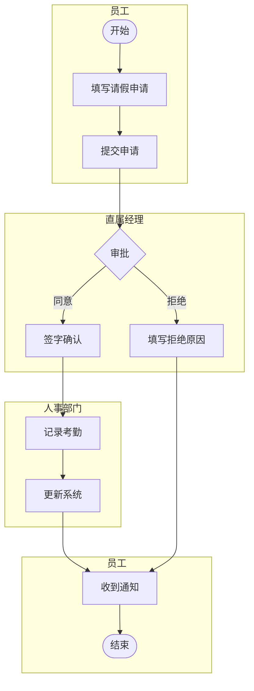

#### 实战示例：电商订单处理流程

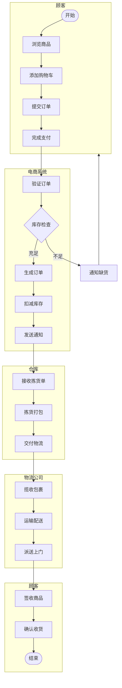

#### 带决策的复杂泳道图

```mermaid
flowchart TB
    subgraph sales[销售部]
        A([开始]) --> B[接收客户需求]
        B --> C[编写报价单]
        C --> D[提交审批]
    end

    subgraph finance[财务部]
        E{金额>10万?}
        F[财务审核]
        G[财务确认]
    end

    subgraph manager[销售经理]
        H{风险评估}
        I[经理审批]
    end

    subgraph director[总监]
        J[总监审批]
    end

    subgraph sales2[销售部]
        K[发送报价]
        L[跟进客户]
        M{客户接受?}
        N[签订合同]
        O[订单录入]
        P([结束])
    end

    D --> E
    E -->|是| J
    E -->|否| H
    H -->|高风险| J
    H -->|低风险| I
    I --> F
    J --> F
    F --> G
    G --> K
    K --> L
    L --> M
    M -->|是| N
    M -->|否| B
    N --> O
    O --> P
```

### 4.4 绘制工具

| 工具       | 类型     | 优点                   | 缺点           |
| ---------- | -------- | ---------------------- | -------------- |
| Mermaid    | 文本绘图 | 使用 subgraph 实现泳道 | 布局控制有限   |
| Lucidchart | 在线工具 | 专业泳道图模板         | 免费版受限     |
| Draw.io    | 免费工具 | 免费、泳道形状支持     | 需手动布局     |
| Visio      | 桌面软件 | 跨职能流程图模板       | 价格昂贵       |
| ProcessOn  | 在线工具 | 中文友好、模板丰富     | 高级功能需付费 |
| PlantUML   | 文本绘图 | 活动图支持泳道语法     | 学习曲线较陡   |

### 4.5 最佳实践

1. **合理划分泳道**：
   - ✅ 按角色划分：顾客、客服、仓库
   - ✅ 按部门划分：销售部、财务部、技术部
   - ❌ 避免过多泳道：一般不超过 5-6 个

2. **清晰的交接点**：跨泳道的流程要标注清楚交接内容

3. **保持流程方向一致**：整体流程从上到下或从左到右

4. **突出关键节点**：审批、决策等关键节点使用醒目样式

5. **标注时间信息**：如有 SLA 要求，在相关步骤标注时限

### 4.6 常见错误

| 错误            | 问题描述                       | 正确做法                      |
| --------------- | ------------------------------ | ----------------------------- |
| ❌ 泳道过多     | 超过 6 个泳道导致图表拥挤      | ✅ 合并相似角色或拆分为多张图 |
| ❌ 职责不清     | 活动放在错误的泳道中           | ✅ 确认每个活动的执行者       |
| ❌ 交接不明确   | 跨泳道流程没有说明交接内容     | ✅ 在连接线上标注传递的信息   |
| ❌ 泳道命名模糊 | 使用"相关人员"等模糊名称       | ✅ 使用具体的角色或部门名称   |
| ❌ 忽略等待状态 | 没有展示需要等待其他泳道的情况 | ✅ 添加等待节点或标注等待时间 |

### 4.7 进阶技巧

#### 添加时间维度

```
      │ 第1天    │ 第2天    │ 第3天    │
──────┼──────────┼──────────┼──────────┤
 销售 │ 接收需求 │ 跟进客户 │          │
──────┼──────────┼──────────┼──────────┤
 技术 │          │ 技术评估 │ 出方案   │
──────┼──────────┼──────────┼──────────┤
 财务 │          │          │ 报价     │
──────┴──────────┴──────────┴──────────┘
```

#### 标注 SLA 和指标

```mermaid
flowchart TB
    subgraph customer[客户]
        A[提交工单]
    end

    subgraph support[客服]
        B[接收工单<br/>SLA: 15分钟]
        C[初步诊断<br/>SLA: 30分钟]
        D{能否解决?}
    end

    subgraph tech[技术]
        E[技术处理<br/>SLA: 4小时]
        F[解决问题]
    end

    subgraph customer2[客户]
        G[确认解决]
    end

    A --> B
    B --> C
    C --> D
    D -->|是| G
    D -->|否| E
    E --> F
    F --> G
```

#### 与其他图配合使用

| 配合图表   | 用途                         |
| ---------- | ---------------------------- |
| 序列图     | 展示泳道间的详细交互时序     |
| 活动图     | 泳道内的复杂流程用活动图详述 |
| BPMN       | 需要更标准化时升级为 BPMN    |
| 组织结构图 | 说明泳道对应的组织结构       |

### 4.8 模板

#### 基础泳道图模板

```mermaid
flowchart TB
    subgraph role1[角色1]
        A([开始]) --> B[活动1]
        B --> C[活动2]
    end

    subgraph role2[角色2]
        D[活动3]
        E{决策}
        F[活动4a]
        G[活动4b]
    end

    subgraph role3[角色3]
        H[活动5]
        I([结束])
    end

    C --> D
    D --> E
    E -->|条件1| F
    E -->|条件2| G
    F --> H
    G --> H
    H --> I
```

#### 审批流程泳道模板

```mermaid
flowchart TB
    subgraph applicant[申请人]
        A([开始]) --> B[填写申请]
        B --> C[提交申请]
    end

    subgraph approver1[一级审批人]
        D{审批}
        E[通过]
        F[退回]
    end

    subgraph approver2[二级审批人]
        G{审批}
        H[最终通过]
        I[退回]
    end

    subgraph applicant2[申请人]
        J[收到结果]
        K([结束])
    end

    C --> D
    D -->|同意| E
    D -->|拒绝| F
    E --> G
    F --> J
    G -->|同意| H
    G -->|拒绝| I
    H --> J
    I --> J
    J --> K
```

#### 客服工单流程模板

```mermaid
flowchart TB
    subgraph customer[客户]
        A([开始]) --> B[提交问题]
    end

    subgraph l1[一线客服]
        C[接收工单]
        D[初步处理]
        E{解决?}
    end

    subgraph l2[二线技术]
        F[技术分析]
        G[深度处理]
        H{解决?}
    end

    subgraph l3[专家组]
        I[专家介入]
        J[最终方案]
    end

    subgraph customer2[客户]
        K[确认结果]
        L[满意度评价]
        M([结束])
    end

    B --> C
    C --> D
    D --> E
    E -->|是| K
    E -->|否| F
    F --> G
    G --> H
    H -->|是| K
    H -->|否| I
    I --> J
    J --> K
    K --> L
    L --> M
```

## 5. 数据流图 (Data Flow Diagram)

### 5.1 概述

**定义**：数据流图（DFD）是一种结构化分析工具，用于展示数据在系统中的流动、处理和存储。它关注"数据做什么"而非"如何做"。

**核心用途**：

- 分析系统的数据流动路径
- 识别系统的输入、输出和处理过程
- 定义系统与外部实体的数据交互
- 作为系统分析的重要工具

**适用场景**：

| 适合使用               | 不适合使用     |
| ---------------------- | -------------- |
| 系统分析和设计         | 描述控制流程   |
| 理解数据的来龙去脉     | 描述业务规则   |
| 定义系统边界           | 实时交互系统   |
| 与业务人员沟通数据需求 | 面向对象设计   |
| 遗留系统分析           | 微服务架构设计 |

### 5.2 基本元素

数据流图由四种基本元素组成：

| 元素     | 符号        | 说明                         |
| -------- | ----------- | ---------------------------- |
| 外部实体 | 矩形        | 系统外部的数据源或接收者     |
| 处理过程 | 圆角矩形/圆 | 对数据进行加工转换的过程     |
| 数据存储 | 开口矩形    | 数据的存储位置               |
| 数据流   | 箭头        | 数据的流动方向，标注数据名称 |

#### DFD 层次

DFD 采用自顶向下的层次分解：

| 层级     | 名称     | 说明                         |
| -------- | -------- | ---------------------------- |
| Level 0  | 上下文图 | 最高层，系统作为单个处理过程 |
| Level 1  | 顶层图   | 分解主要处理过程             |
| Level 2+ | 详细图   | 继续分解复杂的处理过程       |

#### Mermaid 表示约定

由于 Mermaid 没有原生 DFD 支持，使用以下约定：

| 元素     | Mermaid 语法 | 说明       |
| -------- | ------------ | ---------- | --- | ------------ |
| 外部实体 | `[实体名]`   | 方形节点   |
| 处理过程 | `(处理名)`   | 圆角节点   |
| 数据存储 | `[(存储名)]` | 数据库形状 |
| 数据流   | `-->         | 数据名     | `   | 带标签的箭头 |

### 5.3 示例

#### 简单示例：图书借阅系统上下文图（Level 0）

```mermaid
flowchart LR
    reader[读者] -->|借书请求| system((图书借阅系统))
    system -->|借书确认| reader
    system -->|图书信息| reader

    admin[管理员] -->|图书信息| system
    admin -->|读者信息| system
    system -->|统计报表| admin

    supplier[供应商] -->|新书信息| system
    system -->|采购订单| supplier
```

#### Level 1 展开：图书借阅系统顶层图

```mermaid
flowchart TB
    reader[读者]
    admin[管理员]

    subgraph system[图书借阅系统]
        p1((1.0<br/>借阅管理))
        p2((2.0<br/>图书管理))
        p3((3.0<br/>读者管理))
        p4((4.0<br/>统计分析))

        d1[(D1 图书库)]
        d2[(D2 读者库)]
        d3[(D3 借阅记录)]
    end

    reader -->|借书请求| p1
    p1 -->|借书确认| reader

    reader -->|还书请求| p1
    p1 -->|还书确认| reader

    admin -->|图书信息| p2
    p2 -->|处理结果| admin

    admin -->|读者信息| p3
    p3 -->|处理结果| admin

    p4 -->|统计报表| admin

    p1 <-->|图书状态| d1
    p1 <-->|读者信息| d2
    p1 -->|借阅记录| d3

    p2 <-->|图书数据| d1
    p3 <-->|读者数据| d2
    p4 -->|查询| d3
```

#### 实战示例：电商订单系统 DFD

```mermaid
flowchart TB
    customer[顾客]
    payment[支付系统]
    logistics[物流系统]

    subgraph order_system[订单处理系统]
        p1((1.0<br/>订单创建))
        p2((2.0<br/>订单验证))
        p3((3.0<br/>支付处理))
        p4((4.0<br/>发货处理))
        p5((5.0<br/>订单查询))

        d1[(D1 商品库)]
        d2[(D2 库存库)]
        d3[(D3 订单库)]
        d4[(D4 用户库)]
    end

    customer -->|订单信息| p1
    p1 -->|订单确认| customer

    p1 -->|待验证订单| p2
    d1 -->|商品信息| p2
    d2 -->|库存信息| p2
    d4 -->|用户信息| p2

    p2 -->|验证通过订单| p3
    p2 -->|验证失败| customer

    p3 -->|支付请求| payment
    payment -->|支付结果| p3
    p3 -->|支付成功订单| d3

    p3 -->|已支付订单| p4
    p4 -->|发货请求| logistics
    logistics -->|物流单号| p4
    p4 -->|更新状态| d3

    customer -->|查询请求| p5
    d3 -->|订单数据| p5
    p5 -->|订单状态| customer
```

#### Level 2 展开：订单创建处理详细 DFD

```mermaid
flowchart TB
    customer[顾客]

    subgraph p1[1.0 订单创建]
        p1_1((1.1<br/>验证购物车))
        p1_2((1.2<br/>计算价格))
        p1_3((1.3<br/>生成订单))
        p1_4((1.4<br/>锁定库存))
    end

    d1[(D1 商品库)]
    d2[(D2 库存库)]
    d3[(D3 订单库)]
    d5[(D5 购物车)]
    d6[(D6 促销规则)]

    customer -->|下单请求| p1_1
    d5 -->|购物车数据| p1_1
    d1 -->|商品信息| p1_1

    p1_1 -->|有效商品列表| p1_2
    d6 -->|促销规则| p1_2
    d1 -->|价格信息| p1_2

    p1_2 -->|计算后订单| p1_3
    p1_3 -->|订单数据| d3

    p1_3 -->|库存需求| p1_4
    p1_4 -->|锁定请求| d2
    d2 -->|锁定结果| p1_4

    p1_4 -->|订单确认| customer
```

### 5.4 绘制工具

| 工具       | 类型     | 优点                | 缺点             |
| ---------- | -------- | ------------------- | ---------------- |
| Draw.io    | 免费工具 | 有 DFD 形状库、免费 | 手动布局         |
| Lucidchart | 在线工具 | 专业 DFD 模板       | 免费版受限       |
| Visio      | 桌面软件 | 标准 DFD 模板       | 价格昂贵         |
| Mermaid    | 文本绘图 | 版本控制友好        | 需要约定表示方式 |
| ProcessOn  | 在线工具 | 中文友好            | 高级功能需付费   |
| StarUML    | 桌面软件 | 支持 DFD            | 功能相对简单     |

### 5.5 最佳实践

1. **分层展示**：
   - 从 Level 0 上下文图开始
   - 逐层分解，每层 5-9 个处理过程
   - 保持父子图的数据流一致性

2. **命名规范**：
   - 处理过程：动词 + 名词（如"验证订单"）
   - 数据流：名词或名词短语（如"订单信息"）
   - 数据存储：D + 编号 + 名称（如"D1 订单库"）

3. **数据流规则**：
   - ✅ 外部实体之间不能直接有数据流
   - ✅ 数据存储之间不能直接有数据流
   - ✅ 处理过程必须有输入和输出

4. **保持平衡**：父图的数据流在子图中必须体现

5. **区分数据流和控制流**：DFD 只展示数据流动，不展示控制逻辑

### 5.6 常见错误

| 错误            | 问题描述                 | 正确做法              |
| --------------- | ------------------------ | --------------------- |
| ❌ 黑洞         | 处理过程只有输入没有输出 | ✅ 每个处理必须有输出 |
| ❌ 奇迹         | 处理过程只有输出没有输入 | ✅ 每个处理必须有输入 |
| ❌ 灰洞         | 输入不足以产生输出       | ✅ 确保输入数据足够   |
| ❌ 外部实体直连 | 两个外部实体直接有数据流 | ✅ 必须通过处理过程   |
| ❌ 数据存储直连 | 两个数据存储直接有数据流 | ✅ 必须通过处理过程   |
| ❌ 层次不平衡   | 父图数据流在子图中丢失   | ✅ 保持父子图平衡     |

### 5.7 进阶技巧

#### 与其他图的关系

| 配合图表 | 关系说明                         |
| -------- | -------------------------------- |
| ER 图    | DFD 的数据存储对应 ER 图的实体   |
| 用例图   | DFD 的外部实体对应用例图的参与者 |
| 流程图   | DFD 关注数据流，流程图关注控制流 |
| 类图     | 数据字典定义对应类图的属性       |

#### 数据字典

为 DFD 中的数据流编写数据字典：

| 数据流   | 组成                                  | 说明         |
| -------- | ------------------------------------- | ------------ |
| 订单信息 | 订单号 + 客户信息 + 商品列表 + 总金额 | 完整订单     |
| 客户信息 | 客户ID + 姓名 + 联系方式 + 收货地址   | 客户基本信息 |
| 商品列表 | {商品ID + 数量 + 单价}                | 多个商品     |

#### 物理 DFD vs 逻辑 DFD

| 类型     | 关注点                 | 使用场景 |
| -------- | ---------------------- | -------- |
| 逻辑 DFD | 业务功能，不涉及实现   | 需求分析 |
| 物理 DFD | 具体的系统、设备、人员 | 系统设计 |

### 5.8 模板

#### 上下文图模板（Level 0）

```mermaid
flowchart LR
    ext1[外部实体1] -->|输入数据1| system((系统名称))
    system -->|输出数据1| ext1

    ext2[外部实体2] -->|输入数据2| system
    system -->|输出数据2| ext2

    ext3[外部实体3] -->|输入数据3| system
    system -->|输出数据3| ext3
```

#### 顶层图模板（Level 1）

```mermaid
flowchart TB
    ext1[外部实体1]
    ext2[外部实体2]

    subgraph system[系统名称]
        p1((1.0<br/>处理过程1))
        p2((2.0<br/>处理过程2))
        p3((3.0<br/>处理过程3))

        d1[(D1 数据存储1)]
        d2[(D2 数据存储2)]
    end

    ext1 -->|输入数据| p1
    p1 -->|输出数据| ext1

    p1 -->|内部数据| p2
    p1 <-->|存取数据| d1

    p2 -->|内部数据| p3
    p2 <-->|存取数据| d2

    p3 -->|输出数据| ext2
```

#### CRUD 矩阵

配合 DFD 使用的 CRUD 矩阵，展示处理过程与数据存储的关系：

| 处理过程 | D1 订单库 | D2 商品库 | D3 用户库 |
| -------- | --------- | --------- | --------- |
| 1.0 下单 | C         | R         | R         |
| 2.0 查询 | R         | R         | R         |
| 3.0 取消 | U, D      | -         | -         |
| 4.0 发货 | U         | U         | -         |

> C=Create, R=Read, U=Update, D=Delete

## 6. BPMN (Business Process Model and Notation)

### 6.1 概述

**定义**：BPMN 是由 OMG（对象管理组织）制定的业务流程建模标准，提供了一套标准化的图形符号来描述业务流程。

**核心用途**：

- 企业级业务流程建模和文档化
- 流程自动化和工作流引擎配置
- 业务分析师与技术人员的沟通桥梁
- 流程优化和持续改进

**适用场景**：

| 适合使用               | 不适合使用     |
| ---------------------- | -------------- |
| 企业级业务流程管理     | 简单的技术算法 |
| 需要流程引擎执行的流程 | 快速的流程草图 |
| 跨组织的流程协作       | 数据流分析     |
| 符合行业标准的流程文档 | 小型项目       |
| 需要详细定义的复杂流程 | 非流程类的建模 |

### 6.2 基本元素

BPMN 元素分为四大类：

#### 流对象 (Flow Objects)

| 元素 | 符号     | 说明                 |
| ---- | -------- | -------------------- |
| 事件 | 圆形     | 流程中发生的事情     |
| 活动 | 圆角矩形 | 工作的执行           |
| 网关 | 菱形     | 控制流程的分支和合并 |

#### 事件类型

| 事件类型 | 符号特征     | 说明                   |
| -------- | ------------ | ---------------------- |
| 开始事件 | 单线圆       | 流程的触发点           |
| 中间事件 | 双线圆       | 流程中间发生的事件     |
| 结束事件 | 粗线圆       | 流程的终止点           |
| 边界事件 | 附着在活动上 | 活动执行中的异常或超时 |

#### 事件触发类型

| 触发类型 | 图标     | 示例          |
| -------- | -------- | ------------- |
| 无       | 空       | 一般开始/结束 |
| 消息     | 信封     | 收到消息触发  |
| 定时器   | 时钟     | 定时触发      |
| 条件     | 文档     | 条件满足触发  |
| 信号     | 三角形   | 广播信号      |
| 错误     | 闪电     | 错误发生      |
| 取消     | X        | 取消事务      |
| 补偿     | 倒退箭头 | 补偿操作      |
| 终止     | 实心圆   | 强制终止      |

#### 活动类型

| 活动类型 | 符号特征        | 说明               |
| -------- | --------------- | ------------------ |
| 任务     | 普通圆角矩形    | 原子工作单元       |
| 子流程   | 带 + 的圆角矩形 | 可展开的流程       |
| 调用活动 | 粗边框          | 调用全局定义的流程 |

#### 任务类型

| 任务类型 | 图标     | 说明           |
| -------- | -------- | -------------- |
| 用户任务 | 人形     | 需要人工执行   |
| 服务任务 | 齿轮     | 自动化服务调用 |
| 脚本任务 | 文档     | 执行脚本       |
| 业务规则 | 表格     | 执行业务规则   |
| 手工任务 | 手形     | 不通过系统执行 |
| 发送任务 | 实心信封 | 发送消息       |
| 接收任务 | 空心信封 | 等待接收消息   |

#### 网关类型

| 网关类型 | 符号   | 说明                     |
| -------- | ------ | ------------------------ |
| 排他网关 | X      | 只选择一条路径（XOR）    |
| 并行网关 | +      | 所有路径并行（AND）      |
| 包容网关 | O      | 选择一条或多条路径（OR） |
| 事件网关 | 五边形 | 基于事件选择路径         |
| 复杂网关 | \*     | 复杂的条件逻辑           |

#### 连接对象 (Connecting Objects)

| 元素   | 符号     | 说明                 |
| ------ | -------- | -------------------- |
| 顺序流 | 实线箭头 | 活动的执行顺序       |
| 消息流 | 虚线箭头 | 参与者之间的消息传递 |
| 关联   | 点线     | 关联数据对象或注释   |

#### 泳道 (Swimlanes)

| 元素 | 说明                 |
| ---- | -------------------- |
| 池   | 代表一个参与者或组织 |
| 道   | 池内的职责划分       |

#### 制品 (Artifacts)

| 元素     | 说明             |
| -------- | ---------------- |
| 数据对象 | 流程中使用的数据 |
| 数据存储 | 数据库或文件存储 |
| 组       | 可视化分组       |
| 注释     | 补充说明         |

### 6.3 示例

#### 简单示例：请假审批流程

由于 Mermaid 不原生支持 BPMN，使用流程图模拟核心逻辑：

```mermaid
flowchart TD
    start((开始)) --> submit[提交请假申请]
    submit --> gateway1{天数>3?}

    gateway1 -->|是| manager[经理审批]
    gateway1 -->|否| leader[主管审批]

    manager --> gateway2{审批结果}
    leader --> gateway2

    gateway2 -->|通过| hr[人事备案]
    gateway2 -->|拒绝| notify_reject[通知申请人]

    hr --> notify_approve[通知申请人]

    notify_approve --> end1((结束))
    notify_reject --> end2((结束))
```

#### BPMN 文本描述：订单处理流程

```
池: 电商平台
├── 道: 顾客
│   ├── 开始事件: 下单
│   ├── 用户任务: 提交订单
│   └── 结束事件: 收到确认
│
├── 道: 订单系统
│   ├── 服务任务: 验证订单
│   ├── 排他网关: 库存检查
│   │   ├── [有库存] → 服务任务: 创建订单
│   │   └── [无库存] → 结束事件: 通知缺货
│   └── 服务任务: 发送确认
│
├── 道: 支付系统
│   ├── 接收任务: 等待支付
│   ├── 中间事件: 定时器(30分钟)
│   │   └── → 服务任务: 取消订单
│   └── 服务任务: 处理支付
│
└── 道: 仓库
    ├── 用户任务: 拣货打包
    └── 服务任务: 创建发货单
```

#### PlantUML BPMN 风格示例

```plantuml
@startuml
|顾客|
start
:提交订单;

|订单系统|
:验证订单;
if (库存充足?) then (是)
    :锁定库存;
else (否)
    :通知缺货;
    stop
endif

|支付系统|
:生成支付单;
fork
    :等待支付;
fork again
    :定时器 30分钟;
end fork {或}

if (支付成功?) then (是)
    :确认支付;
else (否)
    :释放库存;
    :取消订单;
    stop
endif

|仓库|
fork
    :打印拣货单;
fork again
    :通知物流;
end fork

:拣货打包;
:交付物流;

|顾客|
:收货确认;
stop
@enduml
```

#### 实战示例：保险理赔流程

```
池: 保险理赔系统

道: 客户
├── 开始事件(消息): 提交理赔申请
├── 用户任务: 上传材料
├── 中间事件(消息): 收到审核结果
└── 结束事件: 理赔完成

道: 客服中心
├── 用户任务: 初审材料
├── 排他网关: 材料完整?
│   ├── [否] → 发送任务: 通知补充材料 → 返回上传
│   └── [是] → 转核损
└── 服务任务: 发送结果通知

道: 核损部门
├── 用户任务: 现场查勘
├── 用户任务: 定损评估
├── 业务规则任务: 计算理赔金额
└── 包容网关: 金额>5万?
    ├── [是] → 转审核
    └── [否] → 直接赔付

道: 审核部门
├── 用户任务: 复核审批
├── 排他网关: 审批结果
│   ├── [通过] → 服务任务: 生成赔付单
│   └── [拒绝] → 发送任务: 通知拒赔原因
└── 边界事件(定时器): 超时升级

道: 财务部门
├── 服务任务: 打款
└── 结束事件: 理赔完成
```

### 6.4 绘制工具

| 工具            | 类型     | 优点                      | 缺点         |
| --------------- | -------- | ------------------------- | ------------ |
| Camunda Modeler | 开源工具 | 免费、支持执行、标准 BPMN | 学习曲线较陡 |
| bpmn.io         | 在线工具 | 免费、标准 BPMN、可嵌入   | 功能相对简单 |
| Signavio        | 企业工具 | 功能全面、企业级          | 价格昂贵     |
| Bizagi          | 免费工具 | 免费、功能较全            | 仅 Windows   |
| Draw.io         | 免费工具 | 有 BPMN 形状库            | 非原生支持   |
| Visual Paradigm | 专业工具 | UML + BPMN 全面支持       | 需付费       |

### 6.5 最佳实践

1. **合理使用网关**：
   - ✅ 排他网关：条件互斥，只走一条路
   - ✅ 并行网关：需要同时执行多个任务
   - ✅ 包容网关：可能走一条或多条路

2. **事件使用规范**：
   - 开始事件只能有出口，没有入口
   - 结束事件只能有入口，没有出口
   - 中间事件可以有入口和出口

3. **消息流规范**：
   - 消息流只能在不同的池之间
   - 同一个池内只能用顺序流

4. **泳道划分**：
   - 按组织或角色划分
   - 一个任务只能在一个道内
   - 避免过多的跨道流转

5. **保持可读性**：
   - 流程从左到右或从上到下
   - 避免箭头交叉
   - 复杂流程使用子流程

### 6.6 常见错误

| 错误              | 问题描述                   | 正确做法                  |
| ----------------- | -------------------------- | ------------------------- |
| ❌ 网关配对错误   | 并行网关开始，排他网关结束 | ✅ 网关类型必须配对       |
| ❌ 池内消息流     | 同一池内使用消息流         | ✅ 池内只用顺序流         |
| ❌ 开始事件有入口 | 开始事件前有箭头           | ✅ 开始事件只有出口       |
| ❌ 死锁           | 并行路径没有全部汇合       | ✅ 分叉必须有对应的汇合   |
| ❌ 缺少默认流     | 排他网关没有默认路径       | ✅ 添加 else/default 分支 |
| ❌ 混淆任务类型   | 自动任务用用户任务图标     | ✅ 正确使用任务类型图标   |

### 6.7 进阶技巧

#### BPMN vs UML 活动图

| 特性     | BPMN                   | UML 活动图   |
| -------- | ---------------------- | ------------ |
| 定位     | 业务流程建模           | 通用行为建模 |
| 标准组织 | OMG                    | OMG          |
| 事件类型 | 丰富（消息、定时器等） | 基础         |
| 执行语义 | 可执行                 | 主要用于设计 |
| 消息流   | 支持跨池消息流         | 不直接支持   |
| 工具支持 | 专业 BPM 工具          | UML 工具     |
| 学习曲线 | 较陡                   | 相对平缓     |

#### 与流程引擎集成

BPMN 2.0 可以直接被流程引擎执行：

| 引擎     | 特点                     |
| -------- | ------------------------ |
| Camunda  | 开源、功能全面、社区活跃 |
| Activiti | 开源、轻量级             |
| Flowable | Activiti 分支、增强功能  |
| jBPM     | Red Hat 支持             |
| Zeebe    | 云原生、高扩展性         |

#### 子流程和调用活动

```
主流程:
├── 任务A
├── 子流程: 审批流程 [+]
│   └── 展开:
│       ├── 一级审批
│       ├── 二级审批
│       └── 最终审批
├── 调用活动: 通知流程 [粗边框]
│   └── 引用: 全局通知流程定义
└── 任务B
```

### 6.8 模板

#### 基础审批流程模板

```
池: 审批系统

道: 申请人
├── 开始事件: 发起申请
├── 用户任务: 填写申请表
├── 中间事件(消息): 收到审批结果
└── 结束事件: 流程结束

道: 审批人
├── 用户任务: 审批
│   └── 边界事件(定时器): 超时提醒
├── 排他网关: 审批决定
│   ├── [通过] → 服务任务: 执行后续操作
│   └── [拒绝] → 服务任务: 记录原因
└── 发送任务: 通知申请人
```

#### 订单处理模板

```
池: 订单系统

道: 前台
├── 开始事件(消息): 收到订单
├── 服务任务: 订单验证
├── 排他网关: 验证结果
│   ├── [通过] → 继续
│   └── [失败] → 结束事件(错误): 订单无效
└── 服务任务: 创建订单

道: 支付
├── 服务任务: 发起支付
├── 事件网关
│   ├── 中间事件(消息): 支付成功
│   └── 中间事件(定时器): 支付超时
└── 排他网关: 支付结果
    ├── [成功] → 继续
    └── [超时] → 服务任务: 取消订单

道: 履约
├── 并行网关
│   ├── 服务任务: 扣减库存
│   ├── 用户任务: 打包
│   └── 服务任务: 通知物流
├── 并行网关: 汇合
└── 结束事件: 订单完成
```

#### 异常处理模板

```
池: 异常处理系统

道: 主流程
├── 开始事件
├── 子流程: 业务处理
│   ├── 任务1
│   ├── 任务2
│   └── 任务3
│   边界事件:
│   ├── (错误): 业务异常 → 转异常处理
│   └── (定时器): 超时 → 转超时处理
└── 结束事件: 正常完成

道: 异常处理
├── 服务任务: 记录异常
├── 服务任务: 回滚操作
├── 服务任务: 发送告警
└── 结束事件(错误): 异常终止

道: 超时处理
├── 服务任务: 记录超时
├── 用户任务: 人工干预
└── 排他网关
    ├── [继续] → 返回主流程
    └── [终止] → 结束事件
```

## 7. 总结

### 7.1 五种图表对比

| 维度       | 流程图   | 活动图     | 泳道图     | 数据流图   | BPMN       |
| ---------- | -------- | ---------- | ---------- | ---------- | ---------- |
| 核心关注   | 控制逻辑 | 行为和并发 | 职责划分   | 数据流动   | 业务流程   |
| 复杂度     | 低       | 中         | 中         | 中         | 高         |
| 标准化程度 | 非标准   | UML 标准   | 非标准     | 结构化方法 | OMG 标准   |
| 并发支持   | 不支持   | 支持       | 有限       | 不关注     | 完全支持   |
| 执行能力   | 不可执行 | 不可执行   | 不可执行   | 不可执行   | 可执行     |
| 学习成本   | 最低     | 中等       | 低         | 中等       | 较高       |
| 适用受众   | 所有人   | 技术人员   | 业务和技术 | 系统分析师 | 业务分析师 |

### 7.2 选择指南

| 场景               | 推荐图表        |
| ------------------ | --------------- |
| 简单算法或处理逻辑 | 流程图          |
| 带并发的复杂流程   | 活动图          |
| 跨部门协作流程     | 泳道图          |
| 系统数据分析       | 数据流图        |
| 企业级业务流程管理 | BPMN            |
| 流程引擎配置       | BPMN            |
| 技术文档快速说明   | 流程图          |
| 与非技术人员沟通   | 流程图 / 泳道图 |
| UML 建模项目       | 活动图          |
| 遗留系统分析       | 数据流图        |

### 7.3 工具选择速查

| 需求场景          | 推荐工具                  |
| ----------------- | ------------------------- |
| Markdown 文档集成 | Mermaid                   |
| 版本控制友好      | PlantUML / Mermaid        |
| 免费且功能全面    | Draw.io                   |
| 专业 BPMN 建模    | Camunda Modeler / bpmn.io |
| 团队协作          | Lucidchart / ProcessOn    |
| 企业级流程管理    | Signavio / Bizagi         |
| UML 全面支持      | Enterprise Architect      |

### 7.4 图表演进路径

```
流程建模图表演进：

简单需求
└── 流程图（基础）
    │
    ├── 需要并发 → 活动图（UML）
    │
    ├── 需要职责划分 → 泳道图
    │   │
    │   └── 需要标准化 → BPMN
    │
    └── 需要数据分析 → 数据流图
        │
        └── 需要业务规则 → BPMN

复杂企业流程
└── BPMN（完整标准）
```

### 7.5 速查表

#### 流程图符号速查

| 符号      | Mermaid 语法 | 用途     |
| --------- | ------------ | -------- |
| 开始/结束 | `([文本])`   | 流程起止 |
| 处理      | `[文本]`     | 操作步骤 |
| 判断      | `{文本}`     | 条件分支 |
| 数据      | `[(文本)]`   | 数据存储 |
| 子流程    | `[[文本]]`   | 引用流程 |
| 连接      | `-->`        | 流程方向 |

#### 活动图元素速查

| 元素 | PlantUML 语法    | 用途     |
| ---- | ---------------- | -------- |
| 开始 | `start`          | 流程开始 |
| 结束 | `stop`           | 流程结束 |
| 活动 | `:活动名;`       | 执行动作 |
| 条件 | `if (条件) then` | 条件分支 |
| 分叉 | `fork`           | 并行开始 |
| 汇合 | `end fork`       | 并行结束 |
| 泳道 | `\|泳道名\|`     | 职责划分 |

#### BPMN 网关速查

| 网关 | 符号 | 逻辑        | 示例场景         |
| ---- | ---- | ----------- | ---------------- |
| 排他 | X    | XOR         | 二选一的条件分支 |
| 并行 | +    | AND         | 同时执行多个任务 |
| 包容 | O    | OR          | 选择一个或多个   |
| 事件 | ◇    | Event-based | 等待多个事件之一 |

## 8. 参考资源

### 官方文档

- [Mermaid 流程图文档](https://mermaid.js.org/syntax/flowchart.html)
- [PlantUML 活动图文档](https://plantuml.com/activity-diagram-beta)
- [BPMN 2.0 规范](https://www.omg.org/spec/BPMN/2.0/)
- [Camunda BPMN 教程](https://docs.camunda.org/get-started/bpmn20/)

### 推荐阅读

- 《BPMN Method and Style》- Bruce Silver
- 《Business Process Management: Concepts, Languages, Architectures》- Mathias Weske
- 《结构化分析和系统规格说明》- Tom DeMarco
- [BPMN Quick Guide](https://www.bpmnquickguide.com/)

### 在线工具

- [Mermaid 在线编辑器](https://mermaid.live/)
- [PlantUML 在线编辑器](https://www.plantuml.com/plantuml/)
- [bpmn.io 在线编辑器](https://demo.bpmn.io/)
- [Draw.io](https://app.diagrams.net/)
- [Camunda Modeler](https://camunda.com/download/modeler/)
- [ProcessOn](https://www.processon.com/)
