# 需求分析阶段图表指南

## 1. 概述

需求分析是软件开发的起点，决定了产品的方向和范围。本指南介绍三种在需求分析阶段最常用的图表：

| 图表类型     | 核心用途           | 适用阶段       |
| ------------ | ------------------ | -------------- |
| 思维导图     | 发散思维、整理需求 | 需求头脑风暴   |
| 用户故事地图 | 规划产品功能与迭代 | 敏捷需求管理   |
| 用例图       | 定义系统功能边界   | 需求获取与分析 |

这三种图表各有侧重，通常配合使用：

- **思维导图**：用于需求收集的早期阶段，快速发散和归类想法
- **用户故事地图**：将需求组织成用户视角的完整旅程
- **用例图**：正式定义系统与参与者的交互

## 2. 思维导图 (Mind Map)

### 2.1 概述

**定义**：思维导图是一种以中心主题为核心，通过分支向外发散的可视化思维工具，由 Tony Buzan 在 1970 年代提出。

**核心用途**：

- 快速收集和整理需求想法
- 结构化组织零散的信息
- 促进头脑风暴和创意发散
- 建立概念之间的关联关系

**适用场景**：

| 适合使用           | 不适合使用         |
| ------------------ | ------------------ |
| 需求头脑风暴       | 详细的流程描述     |
| 会议记录和总结     | 时序性的交互设计   |
| 知识整理和学习笔记 | 精确的数据关系     |
| 问题分析和根因定位 | 正式的技术文档     |
| 功能模块的初步分类 | 需要精确度量的场景 |

### 2.2 基本元素

| 元素     | 说明                     | 使用建议                 |
| -------- | ------------------------ | ------------------------ |
| 中心主题 | 思维导图的核心，位于中央 | 使用图像或醒目的文字     |
| 主分支   | 从中心发散的一级分支     | 控制在 5-9 个以内        |
| 子分支   | 从主分支继续细化的分支   | 层级不超过 4-5 层        |
| 关键词   | 每个节点的文字内容       | 使用简洁的关键词而非长句 |
| 连接线   | 表示节点之间的层级关系   | 可使用颜色区分不同分支   |
| 图标     | 标记重点、状态等         | 如优先级、完成状态       |

#### Mermaid 节点形状

| 形状   | 语法       | 适用场景   |
| ------ | ---------- | ---------- |
| 默认   | `文本`     | 普通节点   |
| 方形   | `[文本]`   | 强调的节点 |
| 圆角   | `(文本)`   | 次要节点   |
| 圆形   | `((文本))` | 中心主题   |
| 云朵   | `)文本(`   | 想法、创意 |
| 六边形 | `{{文本}}` | 决策点     |

### 2.3 示例

#### 简单示例：产品需求分析


#### 实战示例：需求分析会议


#### ASCII 风格简易思维导图

```
                        ┌─ 注册
            ┌─ 用户 ────┼─ 登录
            │           └─ 个人中心
            │
            │           ┌─ 列表展示
   CRM ─────┼─ 客户 ────┼─ 详情查看
  系统      │           └─ 新增编辑
            │
            │           ┌─ 跟进记录
            └─ 销售 ────┼─ 商机管理
                        └─ 报表统计
```

### 2.4 绘制工具

| 工具        | 类型     | 优点                        | 缺点           |
| ----------- | -------- | --------------------------- | -------------- |
| XMind       | 桌面软件 | 功能强大、模板丰富、AI 辅助 | 高级功能需付费 |
| MindManager | 专业软件 | 企业级功能、Office 集成     | 价格昂贵       |
| Miro        | 在线白板 | 协作强、AI 生成、模板多     | 需要网络       |
| Mermaid     | 文本绘图 | 版本控制友好、免费          | 样式定制有限   |
| Coggle      | 在线工具 | 简洁易用、实时协作          | 功能相对简单   |
| 幕布        | 国产工具 | 大纲和导图切换、中文友好    | 导出格式有限   |
| ProcessOn   | 在线工具 | 免费、中文界面、模板多      | 高级功能需付费 |

### 2.5 最佳实践

1. **中心明确**：中心主题应该清晰、具体，最好使用图像增强记忆

2. **一词一节点**：每个节点使用单个关键词或短语，避免长句子

3. **层级适度**：控制在 3-4 层深度，过深会降低可读性

4. **颜色区分**：为不同主分支使用不同颜色，便于视觉区分

5. **放射状布局**：主分支均匀分布在中心周围，保持视觉平衡

### 2.6 常见错误

| 错误            | 问题描述                    | 正确做法                        |
| --------------- | --------------------------- | ------------------------------- |
| ❌ 节点文字过长 | 在节点中写完整的句子        | ✅ 使用关键词，详情写在备注中   |
| ❌ 层级过深     | 超过 5 层的嵌套             | ✅ 复杂内容拆分为多个思维导图   |
| ❌ 分支过多     | 单个节点下超过 7-9 个子分支 | ✅ 合理分组，控制分支数量       |
| ❌ 缺少视觉层次 | 所有节点样式相同            | ✅ 使用颜色、图标、字体区分层级 |
| ❌ 线性思维     | 思维导图变成列表            | ✅ 允许思维发散，建立关联       |

### 2.7 进阶技巧

#### 需求优先级标记

使用图标或颜色标记需求优先级：


> **说明**：🔴 高优先级 | 🟡 中优先级 | 🟢 低优先级

#### 与其他图表配合

| 配合图表     | 用途                                   |
| ------------ | -------------------------------------- |
| 用例图       | 思维导图梳理需求后，用用例图正式定义   |
| 用户故事地图 | 思维导图的分支可转化为故事地图的步骤   |
| 流程图       | 思维导图中的流程性内容用流程图详细展开 |

#### 需求分析框架

使用 MECE 原则（相互独立、完全穷尽）组织分支：


### 2.8 模板

#### 需求收集模板

```mermaid
mindmap
  root((项目名称))
    用户角色
      角色1
        目标
        痛点
      角色2
        目标
        痛点
    功能模块
      模块1
        功能1.1
        功能1.2
      模块2
        功能2.1
        功能2.2
    非功能需求
      性能
      安全
      兼容性
    技术考虑
      技术栈
      集成需求
      部署要求
```



#### 问题分析模板（5W1H）


#### 产品规划模板


## 3. 用户故事地图 (User Story Map)

### 3.1 概述

**定义**：用户故事地图是一种可视化的需求管理工具，由 Jeff Patton 提出，通过将用户故事按照用户活动和优先级组织，形成二维的故事地图。

**核心用途**：

- 从用户视角理解产品全貌
- 发现需求缺口和遗漏
- 规划产品迭代和发布计划
- 促进团队对需求的共同理解

**适用场景**：

| 适合使用                 | 不适合使用           |
| ------------------------ | -------------------- |
| 敏捷/Scrum 项目需求规划  | 技术架构设计         |
| 产品功能规划和路线图制定 | 详细的系统设计文档   |
| 团队需求工作坊           | 已明确的维护型项目   |
| MVP 功能范围定义         | 非用户导向的技术任务 |
| 发布计划制定             | 严格瀑布流程的项目   |

### 3.2 基本元素

用户故事地图由三个层次组成：

| 层次     | 说明                     | 示例                     |
| -------- | ------------------------ | ------------------------ |
| 活动     | 用户完成目标的高层次行为 | 购物、结账、管理账户     |
| 步骤     | 活动中的具体操作步骤     | 浏览商品、添加购物车     |
| 用户故事 | 步骤下的具体功能需求     | 按价格筛选、查看商品详情 |

#### 地图结构

```
横轴（时间/叙事流）→
┌────────────────────────────────────────────────────────────┐
│  活动1        │  活动2        │  活动3        │  活动4      │
├────────────────────────────────────────────────────────────┤
│  步骤1.1      │  步骤2.1      │  步骤3.1      │  步骤4.1    │
│  步骤1.2      │  步骤2.2      │  步骤3.2      │             │
├────────────────────────────────────────────────────────────┤ ← 发布1分割线
│  故事1.1.1    │  故事2.1.1    │  故事3.1.1    │  故事4.1.1  │
│  故事1.1.2    │  故事2.1.2    │               │             │
│  故事1.2.1    │               │               │             │
├────────────────────────────────────────────────────────────┤ ← 发布2分割线
│  故事1.1.3    │  故事2.1.3    │  故事3.1.2    │  故事4.1.2  │
│               │  故事2.2.1    │  故事3.2.1    │             │
└────────────────────────────────────────────────────────────┘
纵轴（优先级）↓
```

#### 用户故事格式

标准格式：**作为 [角色]，我想要 [功能]，以便 [价值]**

| 组成部分 | 说明               | 示例                     |
| -------- | ------------------ | ------------------------ |
| 角色     | 谁在使用这个功能   | 作为一名顾客             |
| 功能     | 想要什么功能       | 我想要按价格筛选商品     |
| 价值     | 为什么需要这个功能 | 以便快速找到预算内的商品 |

### 3.3 示例

#### 简单示例：在线购物

```
在线购物用户故事地图
==================

[发现商品]          [选购商品]          [完成购买]          [收货售后]
    │                   │                   │                   │
    ├─ 搜索商品         ├─ 查看详情         ├─ 填写地址         ├─ 查看物流
    ├─ 浏览分类         ├─ 选择规格         ├─ 选择支付         ├─ 确认收货
    └─ 查看推荐         └─ 加入购物车       └─ 提交订单         └─ 申请退款
        │                   │                   │                   │
━━━━━━━━━━━━━━━━━━━━━━━━━━━━━━━━━━━━━━━━━━━━━━━━━━━━━━━━━━━━━━━━━━━━  MVP
        │                   │                   │                   │
    · 关键词搜索        · 商品图片          · 默认地址         · 物流跟踪
    · 商品列表          · 价格库存          · 微信支付         · 确认收货
                        · 加购物车          · 订单确认
        │                   │                   │                   │
━━━━━━━━━━━━━━━━━━━━━━━━━━━━━━━━━━━━━━━━━━━━━━━━━━━━━━━━━━━━━━━━━━━━  v1.1
        │                   │                   │                   │
    · 高级筛选          · 商品视频          · 多地址管理       · 退款申请
    · 分类浏览          · 用户评价          · 支付宝支付       · 客服入口
    · 个性化推荐        · 相似推荐          · 优惠券使用
```

#### 实战示例：SaaS 项目管理工具

使用 Mermaid mindmap 展示核心结构：


### 3.4 绘制工具

| 工具              | 类型     | 优点                      | 缺点             |
| ----------------- | -------- | ------------------------- | ---------------- |
| Miro              | 在线白板 | 协作强、模板丰富、AI 辅助 | 免费版限制较多   |
| Jira + Easy Agile | 敏捷工具 | 与 Jira 深度集成          | 需付费           |
| StoriesOnBoard    | 专用工具 | 专为故事地图设计          | 功能单一         |
| Lucidchart        | 在线绘图 | 易用、模板多              | 非专用工具       |
| 物理白板+便签     | 传统方式 | 直观、参与感强            | 不便于远程协作   |
| Notion            | 知识管理 | 灵活、可嵌入其他内容      | 需要自己搭建结构 |

### 3.5 最佳实践

1. **从用户视角出发**：始终以用户完成目标的视角组织故事，而非系统功能模块

2. **先广度后深度**：先铺开整个用户旅程的骨架，再深入细化每个步骤

3. **可视化优先级**：使用水平分割线明确区分不同发布版本的范围

4. **团队共创**：故事地图应在工作坊中由跨职能团队共同完成，而非个人独立绘制

5. **持续演进**：故事地图是活的文档，随着需求理解的深入不断更新

### 3.6 常见错误

| 错误              | 问题描述                              | 正确做法                          |
| ----------------- | ------------------------------------- | --------------------------------- |
| ❌ 按系统模块组织 | 将地图组织成「用户模块」「订单模块」  | ✅ 按用户活动「购物」「结账」组织 |
| ❌ 忽略用户价值   | 只写功能不写「以便...」               | ✅ 每个故事都要说明用户价值       |
| ❌ 故事粒度不一致 | 有的故事是「登录」有的是「实现OAuth」 | ✅ 保持同一层级粒度一致           |
| ❌ 一次规划过多   | 试图规划未来一年的所有功能            | ✅ 聚焦近期 2-3 个迭代            |
| ❌ 缺少优先级区分 | 所有故事平铺，没有发布分割线          | ✅ 明确划分 MVP 和后续迭代        |

### 3.7 进阶技巧

#### 人物角色整合

为不同的用户角色使用不同颜色的卡片或标记：

```
[购物流程]
    │
    ├─ 搜索商品 [所有用户]
    ├─ 批量下单 [企业用户] 🏢
    ├─ 会员折扣 [会员用户] ⭐
    └─ 审批流程 [企业用户] 🏢
```

#### 与其他方法配合

| 配合方法     | 用途                     |
| ------------ | ------------------------ |
| 用户画像     | 明确地图服务的目标用户   |
| 用户旅程地图 | 提供更详细的用户体验视角 |
| 影响地图     | 识别关键指标和成功标准   |
| 事件风暴     | 深入分析复杂业务领域     |

#### 估算与规划

在故事上添加估算信息：

```
故事：作为顾客，我想要微信支付
估算：5 故事点
依赖：支付网关集成
风险：中（第三方API）
```

### 3.8 模板

#### 工作坊引导模板

```markdown
# 用户故事地图工作坊

## 准备工作
- [ ] 确定参与者（产品、设计、开发、测试）
- [ ] 准备便签纸（不同颜色代表不同层级）
- [ ] 准备白板或在线协作工具

## 工作坊流程（建议 2-3 小时）

### 第一步：明确目标用户（15 分钟）
- 讨论并确定核心用户角色
- 简单描述用户的目标和痛点

### 第二步：梳理用户活动（30 分钟）
- 从用户视角列出主要活动
- 按时间顺序从左到右排列
- 使用蓝色便签

### 第三步：细化步骤（30 分钟）
- 为每个活动列出具体步骤
- 使用黄色便签
- 保持步骤粒度一致

### 第四步：添加用户故事（45 分钟）
- 在每个步骤下添加具体故事
- 使用绿色便签
- 采用标准格式：作为...我想要...以便...

### 第五步：优先级排序（30 分钟）
- 讨论每个故事的优先级
- 用水平线划分发布版本
- 确定 MVP 范围
```

#### Markdown 记录模板

```markdown
# [产品名称] 用户故事地图

## 目标用户
- 角色 1：[描述]
- 角色 2：[描述]

## 故事地图

### 活动 1：[活动名称]

#### 步骤 1.1：[步骤名称]
| 优先级 | 用户故事 | 验收标准 |
|--------|----------|----------|
| MVP | 作为...我想要...以便... | - 条件1<br>- 条件2 |
| v1.1 | 作为...我想要...以便... | - 条件1 |

#### 步骤 1.2：[步骤名称]
...

### 活动 2：[活动名称]
...

## 发布计划
- **MVP**：[日期] - [核心功能描述]
- **v1.1**：[日期] - [增强功能描述]
- **v1.2**：[日期] - [后续功能描述]
```

## 4. 用例图 (Use Case Diagram)

### 4.1 概述

**定义**：用例图是 UML 中用于描述系统功能需求的标准图表，展示系统、参与者以及它们之间的交互关系。

**核心用途**：

- 明确系统的功能边界和范围
- 识别系统的所有参与者（用户、外部系统）
- 描述参与者与系统功能的交互关系
- 为需求文档和系统设计提供基础

**适用场景**：

| 适合使用                 | 不适合使用                       |
| ------------------------ | -------------------------------- |
| 定义系统功能范围         | 描述详细的业务流程               |
| 与利益相关者沟通需求     | 表示系统内部实现逻辑             |
| 识别系统边界和外部交互   | 描述数据结构和数据库设计         |
| 作为需求文档的可视化补充 | 表示时序性的交互（应使用时序图） |
| 指导测试用例设计         | 复杂的条件分支逻辑               |

### 4.2 基本元素

用例图由四种核心元素组成：

| 元素     | 符号                | 说明                 |
| -------- | ------------------- | -------------------- |
| 参与者   | 小人图标或 `:名称:` | 与系统交互的外部实体 |
| 用例     | 椭圆形 `(用例名称)` | 系统提供的功能或服务 |
| 系统边界 | 矩形框 `rectangle`  | 定义系统的范围       |
| 关联关系 | 实线连接 `--`       | 参与者与用例的交互   |

#### 关系类型

| 关系类型 | 符号              | 含义                               | 示例                    |
| -------- | ----------------- | ---------------------------------- | ----------------------- |
| 关联     | `--`              | 参与者与用例的基本交互             | 用户 -- 登录            |
| 包含     | `..> <<include>>` | 一个用例必须包含另一个用例         | 下单 ..> 验证库存       |
| 扩展     | `..> <<extend>>`  | 一个用例在特定条件下扩展另一个用例 | 支付 <.. 使用优惠券     |
| 泛化     | `<\|--`           | 参与者或用例之间的继承关系         | 管理员 <\|-- 超级管理员 |

### 4.3 示例

#### 简单示例：用户登录系统


#### 实战示例：电商订单系统


### 4.4 绘制工具

| 工具                 | 类型     | 优点                   | 缺点                   |
| -------------------- | -------- | ---------------------- | ---------------------- |
| PlantUML             | 文本绘图 | 版本控制友好、自动布局 | 学习语法成本           |
| Enterprise Architect | 专业工具 | 功能全面、支持正向工程 | 价格昂贵、学习曲线陡峭 |
| Lucidchart           | 在线工具 | 易用、协作方便         | 免费版功能受限         |
| Draw.io              | 免费工具 | 完全免费、功能够用     | 专业功能较少           |
| Visual Paradigm      | 专业工具 | UML 支持完善           | 需付费                 |

### 4.5 最佳实践

1. **保持简洁**：每个用例图聚焦一个子系统或功能模块，避免在单张图上放置过多元素

2. **使用动词短语命名用例**：用例名称应使用动词开头，如「提交订单」而非「订单」

3. **正确区分包含和扩展**：
   - ✅ 包含（include）：被包含的用例是必须执行的
   - ✅ 扩展（extend）：扩展的用例是可选的、条件触发的

4. **明确系统边界**：始终使用矩形框定义系统范围，区分系统内外

5. **参与者放在系统外部**：参与者代表系统外部的实体，应放在系统边界之外

### 4.6 常见错误

| 错误                  | 问题描述                     | 正确做法                      |
| --------------------- | ---------------------------- | ----------------------------- |
| ❌ 用例粒度过细       | 将每个操作步骤都作为用例     | ✅ 用例应代表完整的用户目标   |
| ❌ 包含业务流程       | 用箭头表示用例之间的执行顺序 | ✅ 使用活动图或时序图表示流程 |
| ❌ 混淆用例和功能     | 「登录按钮」不是用例         | ✅ 用例是「用户登录系统」     |
| ❌ 滥用包含和扩展关系 | 所有用例都用包含/扩展连接    | ✅ 仅在确实存在这种关系时使用 |
| ❌ 参与者过于具体     | 「张三」作为参与者           | ✅ 使用角色「顾客」「管理员」 |

### 4.7 进阶技巧

#### 参与者泛化

当多个参与者共享相同的用例时，可以使用泛化关系：


#### 用例泛化

当用例有共同的基础行为时：


#### 与其他图配合使用

| 配合图表 | 用途                             |
| -------- | -------------------------------- |
| 活动图   | 详细描述某个用例的业务流程       |
| 时序图   | 描述用例中参与者与系统的交互时序 |
| 类图     | 分析用例涉及的领域模型           |

### 4.8 模板

#### 基础模板


#### 多子系统模板


## 5. 总结

### 5.1 三种图表对比

| 维度     | 用例图               | 用户故事地图            | 思维导图       |
| -------- | -------------------- | ----------------------- | -------------- |
| 主要用途 | 定义系统功能边界     | 规划产品迭代            | 发散整理需求   |
| 结构特点 | 系统中心、参与者外围 | 二维矩阵（活动×优先级） | 放射状层级结构 |
| 适用阶段 | 需求分析中后期       | 需求规划全程            | 需求收集早期   |
| 表达重点 | 系统做什么           | 用户要什么              | 有哪些想法     |
| 规范程度 | UML 标准             | 实践约定                | 无严格标准     |
| 学习成本 | 中等                 | 较低                    | 最低           |

### 5.2 工具选择速查

| 需求场景         | 推荐工具             |
| ---------------- | -------------------- |
| 需要版本控制     | PlantUML / Mermaid   |
| 团队远程协作     | Miro / Lucidchart    |
| 快速个人头脑风暴 | XMind / 幕布         |
| 与开发工具集成   | Jira + Easy Agile    |
| 免费且功能足够   | Draw.io / ProcessOn  |
| 企业级专业建模   | Enterprise Architect |

### 5.3 使用流程建议

```
需求分析推荐流程：

1. 头脑风暴阶段
   └── 使用【思维导图】发散收集需求

2. 需求整理阶段
   └── 使用【用户故事地图】组织和优先级排序

3. 需求定义阶段
   └── 使用【用例图】正式定义系统功能

4. 迭代规划阶段
   └── 回到【用户故事地图】划分发布范围
```

## 6. 参考资源

### 官方文档

- [PlantUML 用例图文档](https://plantuml.com/use-case-diagram)
- [Mermaid 思维导图文档](https://mermaid.js.org/syntax/mindmap.html)
- [UML 官方规范](https://www.omg.org/spec/UML/)

### 推荐阅读

- 《用户故事地图》- Jeff Patton
- 《思维导图》- Tony Buzan
- [Agile Modeling - 用例图指南](https://agilemodeling.com/style/usecasediagram.htm)
- [NN/g - 用户故事地图](https://www.nngroup.com/articles/user-story-mapping/)

### 在线工具

- [PlantUML 在线编辑器](https://www.plantuml.com/plantuml/)
- [Mermaid 在线编辑器](https://mermaid.live/)
- [Draw.io](https://app.diagrams.net/)
- [ProcessOn](https://www.processon.com/)
