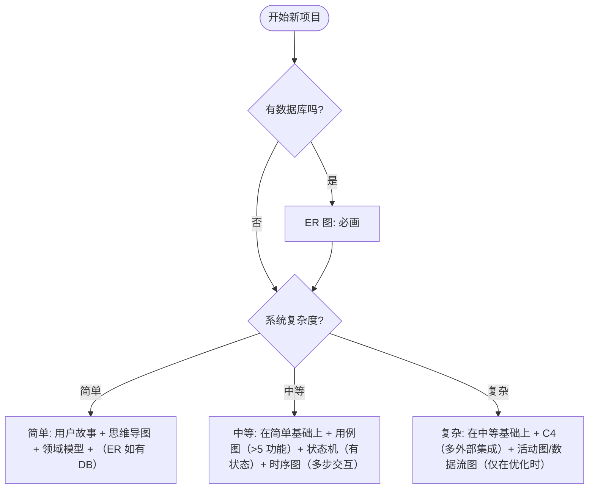

# 个人项目图表选择 SOP

> 说明：本文面向个人开发者，目标是用最少但关键的图表把需求边界、核心对象、数据库结构、关键交互一次讲清，减少返工。

## 1. 概述

个人项目最容易走进一个循环：想到就写 -> 写着写着发现边界不清 -> 数据结构反复改 -> 关键流程靠猜 -> 最后大返工。

解决方式不是写更长的文档，而是用"最少但关键"的图表在编码前把关键不确定性消掉。

本文提供两件事：

- 一棵决策树：回答几个问题，决定到底要不要画某种图
- 一张决策矩阵：10 分钟内选完需要的图（并带大概耗时）

## 2. 开局总览：从项目启动到编码（5 行以内）

1. 需求理解：用户故事（必要时补用例图）
2. 系统设计：思维导图 + 领域模型（必要时补 C4）
3. 数据设计：有数据库就画 ER 图
4. 流程交互：有状态画状态机，多步交互画时序图
5. 设计评审：问题多就回退修正，再进入实现

## 3. 决策树：到底要画哪些图？

你只需要按顺序回答几个问题：是否有数据库？复杂度如何？外部集成多吗？是否有状态变化？是否有多步跨组件交互？

### 3.1 停止条件：画到什么时候就可以开写？

决策树的价值不在于"画什么"，而在于"什么时候停"。你可以用下面 3 条停止条件判断是否该收手开始编码：

| 停止条件       | 你应该能做到                             | 常用图表        |
| -------------- | ---------------------------------------- | --------------- |
| 边界清晰       | 1 分钟讲清系统边界与角色                 | 用户故事/用例图 |
| 对象稳定       | 说清核心对象、关系、约束                 | 领域模型        |
| 关键路径可走通 | 能按顺序走一遍关键流程，知道失败怎么处理 | 状态机/时序图   |

> 提示：如果你做不到以上任意一条，不要急着写代码，先补最能消除不确定性的那张图。

## 4. 决策矩阵：10 分钟选图（含耗时）

| 图表               | 必需?       | 何时用                     | 何时跳过       | 耗时       |
| ------------------ | ----------- | -------------------------- | -------------- | ---------- |
| 用户故事           | 必需        | 所有项目                   | 不要跳过       | 30 分钟    |
| 思维导图           | 必需        | 项目启动梳理模块           | 不要跳过       | 30-60 分钟 |
| 领域模型           | 必需        | 定义核心业务对象           | 不要跳过       | 1-2 小时   |
| ER 图              | 必需(有 DB) | 需要数据库表结构           | 无 DB 项目     | 1-2 小时   |
| 用例图             | 条件        | 功能多(>5)/需对齐边界      | 简单小工具     | ~1 小时    |
| C4(System Context) | 条件        | 外部集成多、边界复杂       | 无外部依赖     | ~30 分钟   |
| 状态机图           | 条件        | 订单/审批/工作流等状态变化 | 无状态实体     | 30-60 分钟 |
| 时序图             | 条件        | 多步流程且跨组件交互       | 单组件简单流程 | 1-2 小时   |
| 活动图             | 可选        | 优化复杂分支/流程控制      | 逻辑不复杂     | ~1 小时    |
| 数据流图           | 可选        | 数据流动/处理链路复杂      | 数据链路清晰   | ~1.5 小时  |

## 5. 三档模板：简单/中等/复杂项目分别怎么画

### 5.1 简单项目（个人工具、CRUD）

必需图表：

1. 用户故事
2. 思维导图
3. 领域模型
4. ER 图（如使用数据库）

建议：

- 不要默认画用例图/C4/状态机/时序图
- 只有当你明确"卡住了"再用条件图针对性补齐

### 5.2 中等复杂项目（多模块业务系统）

在"简单项目"的基础上，按触发器补图：

| 触发器                         | 常见风险                             | 建议补的图 |
| ------------------------------ | ------------------------------------ | ---------- |
| 功能多（>5 个主要功能）        | 边界不清、漏需求、沟通成本高         | 用例图     |
| 有状态变化（订单/审批/工作流） | 状态遗漏、转移规则写散、异常难补     | 状态机图   |
| 多步交互（>3 步且多模块参与）  | 调用顺序出错、失败分支漏掉、集成返工 | 时序图     |

### 5.3 复杂项目（平台/微服务/多外部集成）

建议策略：

- 优先补 C4(System Context)：先把"谁依赖谁、边界在哪里"讲清
- 活动图/数据流图不要一开始就画：它们更适合"优化阶段"用于定位瓶颈与复杂分支

## 6. 图表如何指导编码（5 行以内）

1. ER 图 -> 落库：表/字段/索引（先把形状固定）
2. 领域模型 -> 写核心对象与关系（模型层不飘）
3. 状态机 -> 写状态与转移校验（服务层最稳）
4. 时序图 -> 写交互顺序与错误处理（接口/集成少踩坑）
5. 测试 -> 跟着关键时序覆盖主流程与失败分支

## 7. 总结

### 7.1 最小可用设计集

| 类别         | 内容                                                                     |
| ------------ | ------------------------------------------------------------------------ |
| 默认必备     | 用户故事 + 思维导图 + 领域模型 + (有 DB 就 ER)                           |
| 触发器加图   | 功能多 -> 用例图；外部集成多 -> C4；有状态 -> 状态机；多步交互 -> 时序图 |
| 留到优化再画 | 活动图/数据流图                                                          |

### 7.2 启动新项目核对清单

| 检查项             | 通过标准                                            |
| ------------------ | --------------------------------------------------- |
| 用户故事           | 3-5 个角色；每个角色 2-3 个故事；每个故事有价值目标 |
| 思维导图           | 模块分组清晰；分支不爆炸（5-9 个主分支）            |
| 领域模型           | 核心实体齐全；关系基数明确；关键约束清楚            |
| ER 图（如有 DB）   | 主键/外键/索引基本齐；字段类型合理                  |
| 状态机（如有状态） | 状态完整；转移触发条件明确；异常路径可收敛          |
| 时序（如多步交互） | 关键流程 2-3 条；返回值与失败分支标注清楚           |

## 8. 参考资源

- Mermaid 官方文档: https://mermaid.js.org/
- C4 Model: https://c4model.com/
