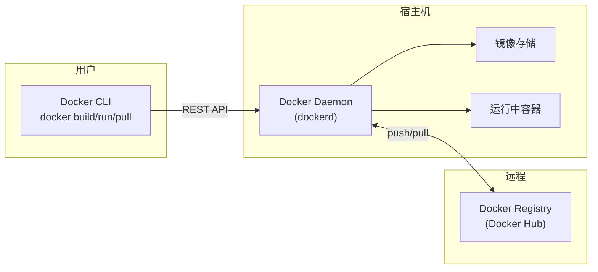
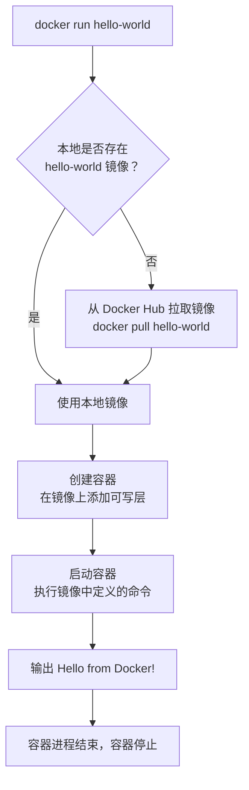

# Docker 基础完全指南

Docker 是一个开源的容器化平台，用于将应用程序及其依赖打包到轻量级、可移植的容器中运行，解决"在我机器上能跑"的环境一致性问题。本指南介绍 Docker 的核心概念、架构原理和基本使用方法。

> 本篇是 Docker 系列（共 7 篇）的第 1 篇。下一篇：[Docker 镜像与仓库完全指南](docker-2-images.md)。

## 1. 概述

### 1.1 Docker 是什么

Docker 是用 Go 语言编写的开源平台，利用 Linux 内核特性（Namespace、Cgroup、UnionFS）实现操作系统级别的虚拟化。它让开发者能够将应用和运行环境一起打包成标准化的**容器**，在任何安装了 Docker 的机器上一致地运行。

**核心能力**：

| 能力     | 说明                                         |
| -------- | -------------------------------------------- |
| 环境一致 | 开发、测试、生产环境完全相同，消除环境差异   |
| 快速部署 | 容器秒级启动，镜像一次构建到处运行           |
| 资源高效 | 共享宿主机内核，不需要完整操作系统，开销极小 |
| 隔离性   | 每个容器拥有独立的文件系统、网络和进程空间   |
| 版本管理 | 镜像分层存储，支持版本标签，方便回滚和分发   |

### 1.2 Docker 解决什么问题

**场景一：环境不一致**

开发者在本地使用 Node.js 18 开发 API 服务，测试环境运行 Node.js 16，生产环境是 Node.js 20。Docker 将 Node.js 版本和依赖锁定在镜像中，三个环境运行同一个镜像。

**场景二：依赖冲突**

项目 A 需要 PostgreSQL 14，项目 B 需要 PostgreSQL 16。Docker 让两个版本在各自容器中独立运行，互不干扰。

**场景三：部署复杂**

一个全栈应用包含 Nginx、Node.js API、PostgreSQL、Redis 四个服务。Docker Compose 一条命令启动全部服务，新成员无需手动配置环境。

## 2. 容器 vs 虚拟机

### 2.1 架构对比

```
┌─────────────────────────────────────┐  ┌─────────────────────────────────────┐
│           容器 (Container)           │  │          虚拟机 (VM)                │
├─────────────────────────────────────┤  ├─────────────────────────────────────┤
│  ┌────────┐ ┌────────┐ ┌────────┐  │  │  ┌────────┐ ┌────────┐ ┌────────┐ │
│  │ App A  │ │ App B  │ │ App C  │  │  │  │ App A  │ │ App B  │ │ App C  │ │
│  ├────────┤ ├────────┤ ├────────┤  │  │  ├────────┤ ├────────┤ ├────────┤ │
│  │ Libs/  │ │ Libs/  │ │ Libs/  │  │  │  │ Libs/  │ │ Libs/  │ │ Libs/  │ │
│  │ Bins   │ │ Bins   │ │ Bins   │  │  │  │ Bins   │ │ Bins   │ │ Bins   │ │
│  └────────┘ └────────┘ └────────┘  │  │  ├────────┤ ├────────┤ ├────────┤ │
├─────────────────────────────────────┤  │  │Guest OS│ │Guest OS│ │Guest OS│ │
│          Docker Engine              │  │  └────────┘ └────────┘ └────────┘ │
├─────────────────────────────────────┤  ├─────────────────────────────────────┤
│           宿主机操作系统             │  │            Hypervisor               │
├─────────────────────────────────────┤  ├─────────────────────────────────────┤
│              硬件                    │  │           宿主机操作系统             │
└─────────────────────────────────────┘  ├─────────────────────────────────────┤
                                         │              硬件                    │
                                         └─────────────────────────────────────┘
```

**关键区别**：容器共享宿主机内核，不需要每个实例运行一个完整的 Guest OS；虚拟机通过 Hypervisor 模拟硬件，每个 VM 都包含独立的操作系统。

### 2.2 性能差异

| 对比项   | 容器              | 虚拟机          |
| -------- | ----------------- | --------------- |
| 启动时间 | 秒级              | 分钟级          |
| 磁盘占用 | MB 级（共享内核） | GB 级（含 OS）  |
| 内存开销 | 仅应用所需        | 需额外分配给 OS |
| 运行性能 | 接近原生          | 有虚拟化损耗    |
| 密度     | 单机可运行数百个  | 单机通常数十个  |

### 2.3 适用场景

| 场景             | 推荐方案 | 原因                           |
| ---------------- | -------- | ------------------------------ |
| 微服务部署       | 容器     | 轻量、快速伸缩、资源利用率高   |
| CI/CD 流水线     | 容器     | 秒级启动，环境一致且可复现     |
| 运行不同操作系统 | 虚拟机   | 容器共享宿主内核，无法跨 OS    |
| 强隔离安全需求   | 虚拟机   | 硬件级隔离，安全边界更强       |
| 本地开发环境     | 容器     | 快速搭建、销毁，不污染宿主系统 |

## 3. Docker 架构

### 3.1 Client-Server 模型

Docker 采用 Client-Server 架构，客户端通过 REST API 与守护进程通信：



**交互流程**：用户执行 `docker run nginx` → CLI 发送请求到 Daemon → Daemon 检查本地镜像 → 如不存在则从 Registry 拉取 → 创建并启动容器。

### 3.2 Docker Daemon

Docker Daemon（`dockerd`）是 Docker 的核心服务进程，运行在宿主机上，负责：

| 职责         | 说明                           |
| ------------ | ------------------------------ |
| 镜像管理     | 构建、拉取、存储和删除镜像     |
| 容器生命周期 | 创建、启动、停止、删除容器     |
| 网络管理     | 创建和管理容器网络             |
| 存储管理     | 管理数据卷（Volume）和存储驱动 |

> **注意**：Docker Daemon 以 root 权限运行。在生产环境中应注意安全配置，避免将 Docker Socket 暴露给不受信任的用户。

### 3.3 Docker CLI

Docker CLI 是用户与 Docker 交互的主要工具。常用命令分类：

| 分类     | 命令示例                      | 说明             |
| -------- | ----------------------------- | ---------------- |
| 镜像操作 | `docker pull`、`docker build` | 获取和构建镜像   |
| 容器操作 | `docker run`、`docker stop`   | 管理容器生命周期 |
| 信息查看 | `docker ps`、`docker images`  | 查看运行状态     |
| 系统管理 | `docker system prune`         | 清理资源         |

### 3.4 Registry

Registry 是存储和分发 Docker 镜像的服务。

| Registry        | 说明                                 |
| --------------- | ------------------------------------ |
| Docker Hub      | 官方公共仓库，包含大量官方和社区镜像 |
| GitHub Packages | GitHub 提供的容器镜像仓库            |
| AWS ECR         | Amazon 提供的私有镜像仓库            |
| Harbor          | 开源企业级私有 Registry              |

```bash
# 从 Docker Hub 拉取官方 Nginx 镜像
docker pull nginx:latest

# 从 GitHub Packages 拉取镜像
docker pull ghcr.io/owner/image:tag
```

## 4. 核心概念

### 4.1 镜像（Image）

镜像是创建容器的只读模板，包含运行应用所需的文件系统、依赖库和配置。镜像采用**分层结构**，每一层代表一个文件系统变更：

```
┌──────────────────────────┐
│   应用代码层（可写层）    │  ← 容器运行时添加
├──────────────────────────┤
│   npm install 依赖层     │  ← COPY + RUN 指令
├──────────────────────────┤
│   Node.js 运行时层       │  ← FROM node:18
├──────────────────────────┤
│   Debian 基础系统层      │  ← 基础镜像
└──────────────────────────┘
```

**关键特性**：

- 每层只存储与上一层的差异（增量存储）
- 多个镜像可以共享相同的底层，节省磁盘空间
- 镜像本身不可修改，修改会产生新的层

### 4.2 容器（Container）

容器是镜像的运行实例。启动容器时，Docker 在镜像顶部添加一个可写层，所有运行时修改都写入这一层。

```bash
# 从 nginx 镜像创建并启动一个容器
docker run -d --name my-nginx -p 80:80 nginx:latest

# 查看运行中的容器
docker ps

# 停止容器
docker stop my-nginx

# 删除容器
docker rm my-nginx
```

**容器生命周期**：

| 状态    | 说明           | 触发命令           |
| ------- | -------------- | ------------------ |
| Created | 已创建但未启动 | `docker create`    |
| Running | 正在运行       | `docker start/run` |
| Paused  | 暂停运行       | `docker pause`     |
| Stopped | 已停止         | `docker stop`      |
| Removed | 已删除         | `docker rm`        |

### 4.3 仓库（Registry）

仓库是存放镜像的地方。一个仓库中可以包含同一个镜像的多个版本，通过标签（Tag）区分：

```
docker.io / library / nginx : 1.25
────────   ────────   ─────   ────
Registry   命名空间    仓库名   标签
```

```bash
# 完整镜像地址格式
docker pull docker.io/library/nginx:1.25

# 省略写法（默认 Docker Hub + library 命名空间）
docker pull nginx:1.25
```

### 4.4 三者关系

```
镜像 (Image)          容器 (Container)          仓库 (Registry)
   类比：               类比：                    类比：
   "程序安装包"         "运行中的程序"            "应用商店"

   ┌──────┐   docker run   ┌──────┐
   │ 镜像 │ ──────────────→│ 容器 │    一个镜像可创建多个容器
   └──────┘                └──────┘
      ↑
      │ docker pull
      │
   ┌──────┐
   │ 仓库 │    仓库存储和分发镜像
   └──────┘
```

## 5. 底层原理入门

Docker 利用 Linux 内核的三大特性实现容器化，无需像虚拟机那样模拟完整的操作系统。

### 5.1 Namespace（隔离）

Namespace 为容器提供独立的系统视图，让每个容器认为自己拥有完整的操作系统。

**类比**：Namespace 就像酒店的房间。每个房间（容器）有独立的门牌号、卫生间、电话，住客看不到其他房间的内部，但整栋楼（宿主机）共享同一个建筑结构。

| Namespace | 隔离内容       | 效果                               |
| --------- | -------------- | ---------------------------------- |
| PID       | 进程 ID        | 容器内进程从 PID 1 开始，互不可见  |
| NET       | 网络栈         | 容器拥有独立 IP、端口、路由表      |
| MNT       | 文件系统挂载点 | 容器拥有独立的文件系统视图         |
| UTS       | 主机名和域名   | 容器可以有自己的 hostname          |
| IPC       | 进程间通信     | 容器间信号量、消息队列隔离         |
| USER      | 用户和用户组   | 容器内 root 可映射为宿主机普通用户 |

### 5.2 Cgroup（资源限制）

Cgroup（Control Group）限制容器可使用的系统资源，防止单个容器耗尽宿主机资源。

**类比**：Cgroup 就像房间的电表和水表。每个房间（容器）有独立的用量计量和上限，超过配额就会被限流或断供，不会影响其他房间。

| 资源     | 控制能力                | 示例                       |
| -------- | ----------------------- | -------------------------- |
| CPU      | 限制 CPU 使用份额或核数 | 容器最多使用 2 个 CPU 核心 |
| 内存     | 设置内存使用上限        | 容器最多使用 512MB 内存    |
| 磁盘 I/O | 限制读写速率            | 容器磁盘写入限速 10MB/s    |
| 网络     | 限制网络带宽            | 容器出站带宽限制 100Mbps   |

```bash
# 启动容器时限制资源
docker run -d \
  --name api \
  --cpus="1.5" \
  --memory="512m" \
  node:18
```

### 5.3 UnionFS（分层文件系统）

UnionFS（联合文件系统）是 Docker 镜像分层存储的基础，它将多个只读层叠加为一个统一的文件系统视图。

**类比**：UnionFS 就像透明幻灯片叠加。每一张幻灯片（层）上画了不同的内容，叠在一起看到的就是完整的画面。修改时只需要新加一张幻灯片覆盖在上面，原有内容不变。

```
容器视图（用户看到的统一文件系统）
  ┌─────────────────────────────┐
  │  /app/server.js  (可写层)   │  ← 容器运行时修改
  │  /usr/local/bin/node (只读) │  ← Node.js 层
  │  /etc/apt/sources (只读)    │  ← 基础系统层
  └─────────────────────────────┘
```

**分层优势**：

| 优势     | 说明                                   |
| -------- | -------------------------------------- |
| 节省空间 | 多个容器共享相同的基础层，不重复存储   |
| 构建加速 | 未修改的层使用缓存，只重新构建变化的层 |
| 快速分发 | 拉取镜像时只下载本地缺少的层           |

## 6. 安装与验证

### 6.1 macOS 安装 Docker Desktop

Docker Desktop 是在 macOS 上使用 Docker 的推荐方式，它包含 Docker Engine、Docker CLI、Docker Compose 等全套工具。

**系统要求**：

| 要求       | 说明                                   |
| ---------- | -------------------------------------- |
| macOS 版本 | 当前版本及前两个主要版本               |
| 内存       | 至少 4 GB RAM                          |
| 芯片       | Apple Silicon（M 系列）或 Intel 均支持 |

**安装步骤**：

1. 从 [Docker 官网](https://www.docker.com/products/docker-desktop/) 下载 Docker Desktop 安装包
2. 打开 `Docker.dmg`，将 Docker 图标拖入 Applications 文件夹
3. 从 Applications 启动 Docker.app
4. 接受服务协议，按提示完成初始配置

> **提示**：Apple Silicon 用户如遇到兼容问题，可运行 `softwareupdate --install-rosetta` 安装 Rosetta 2。

### 6.2 验证安装

```bash
# 查看 Docker 版本
docker --version
# 输出示例：Docker version 27.x.x, build xxxxxxx

# 查看详细版本信息（Client + Server）
docker version

# 查看 Docker 系统信息
docker info

# 运行测试容器
docker run hello-world
```

如果 `docker run hello-world` 输出 `Hello from Docker!`，说明安装成功。

> **提示**：中国大陆用户如遇镜像拉取缓慢，可在 Docker Desktop 的 Settings → Docker Engine 中配置镜像加速地址。

## 7. 第一个容器

### 7.1 docker run hello-world

```bash
docker run hello-world
```

输出：

```
Unable to find image 'hello-world:latest' locally
latest: Pulling from library/hello-world
e6590344b1a5: Pull complete
Digest: sha256:...
Status: Downloaded newer image for hello-world:latest

Hello from Docker!
This message shows that your installation appears to be working correctly.
...
```

### 7.2 背后发生了什么

`docker run hello-world` 这一条命令触发了完整的 Docker 工作流程：



**分步拆解**：

| 步骤 | 动作         | 说明                                               |
| ---- | ------------ | -------------------------------------------------- |
| 1    | 解析命令     | CLI 解析 `hello-world` 为镜像名，默认标签 `latest` |
| 2    | 检查本地镜像 | Daemon 查找本地是否已有 `hello-world:latest`       |
| 3    | 拉取镜像     | 本地不存在时从 Docker Hub 下载镜像                 |
| 4    | 创建容器     | 基于镜像创建容器实例，分配文件系统和网络           |
| 5    | 启动容器     | 执行镜像中 `CMD` 指定的程序                        |
| 6    | 输出结果     | 程序向标准输出打印欢迎信息                         |
| 7    | 容器退出     | 程序执行完毕，容器进入 Stopped 状态                |

```bash
# 查看已停止的容器（包含 hello-world）
docker ps -a

# 清理已停止的容器
docker rm $(docker ps -aq --filter "ancestor=hello-world")
```

## 8. 总结

### 8.1 核心要点

- **Docker 是什么**：基于 Linux 内核特性的容器化平台，解决环境一致性和部署效率问题
- **容器 vs 虚拟机**：容器共享宿主内核、秒级启动、MB 级占用；虚拟机硬件级隔离、分钟启动、GB 级占用
- **架构**：Client-Server 模型，CLI → Daemon → Registry 三层交互
- **三大核心概念**：镜像（只读模板）、容器（运行实例）、仓库（镜像存储分发）
- **底层原理**：Namespace 提供隔离、Cgroup 限制资源、UnionFS 实现分层存储

### 8.2 速查表

| 命令                  | 说明                 |
| --------------------- | -------------------- |
| `docker --version`    | 查看 Docker 版本     |
| `docker info`         | 查看 Docker 系统信息 |
| `docker pull <镜像>`  | 拉取镜像             |
| `docker images`       | 列出本地镜像         |
| `docker run <镜像>`   | 创建并启动容器       |
| `docker ps`           | 查看运行中的容器     |
| `docker ps -a`        | 查看所有容器         |
| `docker stop <容器>`  | 停止容器             |
| `docker rm <容器>`    | 删除容器             |
| `docker rmi <镜像>`   | 删除镜像             |
| `docker system prune` | 清理未使用的资源     |

## 参考资源

- [Docker 官方文档](https://docs.docker.com/)
- [Docker 概述](https://docs.docker.com/get-started/docker-overview/)
- [Docker Desktop 安装指南](https://docs.docker.com/desktop/)
- [Docker Hub](https://hub.docker.com/)
- [Open Container Initiative (OCI)](https://opencontainers.org/)
