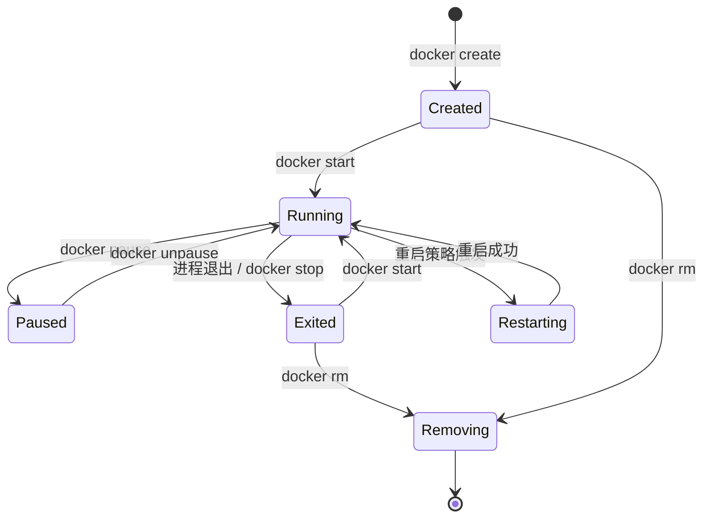
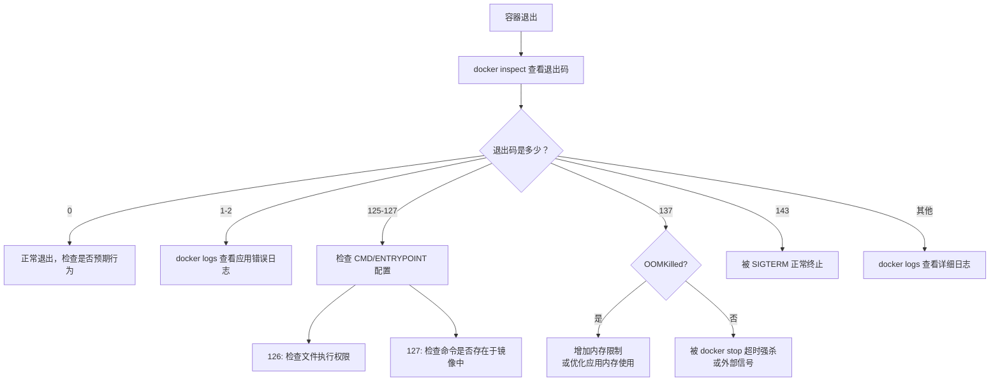
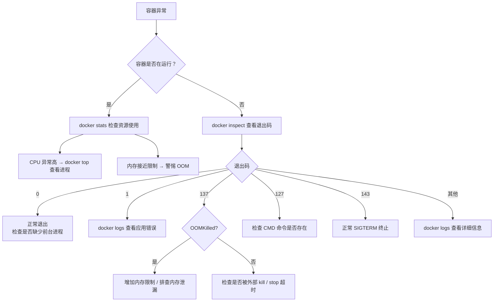

# Docker 容器管理完全指南

容器是镜像的运行实例，是 Docker 最核心的使用对象。理解容器的生命周期、掌握观察与排障技巧，是高效运维的基础。本指南聚焦于容器的创建、运行、监控和故障排查，帮助你从"能跑起来"进阶到"跑得明白"。

> 本篇是 Docker 系列（共 7 篇）的第 3 篇。上一篇：[Docker 镜像与仓库完全指南](docker-2-images.md)。下一篇：[Dockerfile 与镜像构建完全指南](docker-4-dockerfile.md)。

## 1. 容器生命周期

### 1.1 生命周期状态

容器从创建到销毁，会经历以下状态：

| 状态       | 含义                   | 对应操作                 |
| ---------- | ---------------------- | ------------------------ |
| Created    | 已创建，尚未启动       | `docker create`          |
| Running    | 正在运行               | `docker start/run`       |
| Paused     | 进程已暂停（冻结）     | `docker pause`           |
| Restarting | 正在重启中             | 重启策略触发或手动重启   |
| Exited     | 主进程已退出，容器停止 | 进程结束或 `docker stop` |
| Dead       | 删除失败的异常状态     | 系统异常                 |
| Removing   | 正在删除中             | `docker rm`              |

```bash
# 查看容器当前状态
docker inspect --format='{{.State.Status}}' web
# 输出示例：running
```

### 1.2 状态转换图



> **提示**：`docker run` = `docker create` + `docker start`，一步完成创建和启动。大多数场景直接使用 `docker run`。

## 2. 核心操作

### 2.1 创建与启动（run / create / start）

**docker run——最常用的命令**：

```bash
# 前台运行（Ctrl+C 退出）
docker run --name web nginx:1.27

# 后台运行（推荐）
docker run -d --name web nginx:1.27

# 端口映射 + 后台运行
docker run -d --name web -p 8080:80 nginx:1.27

# 交互式运行（进入容器 Shell）
docker run -it --name debug ubuntu:24.04 bash
```

**docker run 常用选项**：

| 选项        | 说明                      | 示例                         |
| ----------- | ------------------------- | ---------------------------- |
| `-d`        | 后台运行（detached 模式） | `docker run -d nginx`        |
| `-it`       | 交互模式 + 分配终端       | `docker run -it ubuntu bash` |
| `--name`    | 指定容器名称              | `--name web`                 |
| `-p`        | 端口映射（宿主:容器）     | `-p 8080:80`                 |
| `-v`        | 挂载卷（宿主:容器）       | `-v ./data:/app/data`        |
| `-e`        | 设置环境变量              | `-e NODE_ENV=production`     |
| `--rm`      | 容器退出后自动删除        | `docker run --rm nginx`      |
| `--restart` | 设置重启策略              | `--restart unless-stopped`   |
| `-w`        | 设置工作目录              | `-w /app`                    |
| `--network` | 指定网络                  | `--network my-net`           |

**docker create + docker start——分步操作**：

```bash
# 第一步：仅创建容器，不启动
docker create --name api -p 3000:3000 node:22-slim

# 第二步：启动已创建的容器
docker start api
```

> **提示**：`docker create` 适合需要先配置再启动的场景，或在脚本中需要获取容器 ID 后再操作的流程。

### 2.2 查看容器（ps / inspect）

**docker ps——列出容器**：

```bash
# 查看运行中的容器
docker ps

# 输出示例：
# CONTAINER ID   IMAGE        COMMAND                  CREATED        STATUS        PORTS                  NAMES
# a1b2c3d4e5f6   nginx:1.27   "/docker-entrypoint.…"   5 minutes ago  Up 5 minutes  0.0.0.0:8080->80/tcp   web

# 查看所有容器（包括已停止的）
docker ps -a

# 只显示容器 ID
docker ps -q

# 按状态过滤
docker ps -f "status=exited"

# 按名称过滤
docker ps -f "name=web"

# 按镜像过滤
docker ps -f "ancestor=nginx"

# 自定义输出格式
docker ps --format "table {{.Names}}\t{{.Status}}\t{{.Ports}}"
```

**docker ps 常用过滤条件**：

| 过滤条件   | 说明           | 示例                       |
| ---------- | -------------- | -------------------------- |
| `status`   | 按状态过滤     | `-f "status=running"`      |
| `name`     | 按名称过滤     | `-f "name=web"`            |
| `ancestor` | 按镜像过滤     | `-f "ancestor=nginx:1.27"` |
| `label`    | 按标签过滤     | `-f "label=env=prod"`      |
| `exited`   | 按退出码过滤   | `-f "exited=0"`            |
| `health`   | 按健康状态过滤 | `-f "health=unhealthy"`    |

### 2.3 停止与删除（stop / kill / rm）

```bash
# 优雅停止容器（发送 SIGTERM，等待 10 秒后发送 SIGKILL）
docker stop web

# 指定等待时间（秒）
docker stop -t 30 web

# 强制停止（直接发送 SIGKILL，不等待）
docker kill web

# 删除已停止的容器
docker rm web

# 强制删除运行中的容器（先 kill 再 rm）
docker rm -f web

# 删除所有已停止的容器
docker container prune

# 批量删除所有已停止的容器
docker rm $(docker ps -aq -f "status=exited")
```

**stop vs kill 对比**：

| 操作          | 信号              | 进程有机会清理？ | 适用场景             |
| ------------- | ----------------- | ---------------- | -------------------- |
| `docker stop` | SIGTERM → SIGKILL | 是（默认 10 秒） | 正常关闭，推荐使用   |
| `docker kill` | SIGKILL           | 否               | 容器无响应时强制终止 |

> **注意**：`docker stop` 先发送 SIGTERM 让进程做清理（关闭连接、保存状态），超时后才发 SIGKILL 强制终止。应用应正确处理 SIGTERM 信号以实现优雅关闭。

### 2.4 暂停与恢复（pause / unpause）

`docker pause` 使用 Linux cgroup 的 freezer 机制冻结容器中的所有进程，不释放内存，进程状态完整保留。

```bash
# 暂停容器
docker pause web

# 恢复容器
docker unpause web
```

**pause vs stop 对比**：

| 操作           | 机制                | 内存保留 | 进程状态 | 恢复速度   |
| -------------- | ------------------- | -------- | -------- | ---------- |
| `docker pause` | cgroup freezer 冻结 | 保留     | 完整保留 | 瞬间恢复   |
| `docker stop`  | 发送信号终止进程    | 释放     | 丢失     | 需重新启动 |

> **提示**：`docker pause` 适合需要临时冻结容器（如快照备份、调试资源竞争）但不希望丢失进程状态的场景。

### 2.5 重启（restart）

```bash
# 重启容器（等效于 stop + start）
docker restart web

# 指定停止等待时间
docker restart -t 5 web
```

> **提示**：`docker restart` 不会重新创建容器，容器的 ID、挂载卷、网络配置等全部保留。如需使用新镜像，应删除旧容器后重新 `docker run`。

## 3. 观察与排障

### 3.1 查看日志（logs）

`docker logs` 是容器排障的第一工具。

```bash
# 查看全部日志
docker logs web

# 实时跟踪日志（类似 tail -f）
docker logs -f web

# 查看最后 50 行
docker logs --tail 50 web

# 显示时间戳
docker logs -t web

# 查看指定时间之后的日志
docker logs --since "2026-03-08T10:00:00" web

# 查看最近 30 分钟的日志
docker logs --since 30m web

# 组合使用：最近 10 分钟的日志 + 持续跟踪
docker logs --since 10m -f web
```

**docker logs 常用选项**：

| 选项      | 说明                   | 示例                          |
| --------- | ---------------------- | ----------------------------- |
| `-f`      | 持续跟踪输出           | `docker logs -f web`          |
| `--tail`  | 只显示最后 N 行        | `docker logs --tail 100 web`  |
| `-t`      | 显示时间戳             | `docker logs -t web`          |
| `--since` | 显示指定时间之后的日志 | `docker logs --since 1h web`  |
| `--until` | 显示指定时间之前的日志 | `docker logs --until 30m web` |

> **注意**：`docker logs` 收集的是容器主进程写入 stdout 和 stderr 的输出。如果应用把日志写入文件（如 `/var/log/app.log`），`docker logs` 看不到，需要通过 `docker exec` 进入容器查看。

### 3.2 进入容器（exec / attach）

**docker exec——在运行中的容器内执行命令**：

```bash
# 进入容器的交互式 Shell
docker exec -it web bash

# 如果容器没有 bash，使用 sh
docker exec -it web sh

# 不进入交互模式，直接执行命令
docker exec web cat /etc/nginx/nginx.conf

# 以 root 身份执行（当容器以非 root 用户运行时）
docker exec -u root web apt-get update

# 设置环境变量执行
docker exec -e DEBUG=true api node check.js

# 在指定工作目录执行
docker exec -w /app api ls -la
```

**docker attach——连接到容器主进程**：

```bash
# 连接到容器的主进程（stdin/stdout/stderr）
docker attach web
```

**exec vs attach 对比**：

| 操作            | 作用                      | 退出影响            | 适用场景             |
| --------------- | ------------------------- | ------------------- | -------------------- |
| `docker exec`   | 启动新进程                | 不影响容器运行      | 调试、执行一次性命令 |
| `docker attach` | 连接到容器主进程（PID 1） | Ctrl+C 可能终止容器 | 查看主进程实时输出   |

> **注意**：`docker attach` 连接的是容器的主进程。如果按 Ctrl+C，会向主进程发送 SIGINT，可能导致容器停止。要安全退出 attach，使用 `Ctrl+P, Ctrl+Q`（分离快捷键）。

**实战：排障常用 exec 操作**：

```bash
# 查看容器内网络状态
docker exec web cat /etc/hosts
docker exec web hostname -i

# 查看容器内进程列表
docker exec web ps aux

# 查看容器内文件系统
docker exec web ls -la /app

# 测试容器内网络连通性
docker exec web curl -s http://api:3000/health

# 查看容器内环境变量
docker exec web env

# 检查容器内的配置文件
docker exec web cat /etc/nginx/conf.d/default.conf
```

### 3.3 资源监控（stats / top）

**docker stats——实时资源使用情况**：

```bash
# 查看所有运行中容器的资源使用
docker stats

# 输出示例：
# CONTAINER ID   NAME   CPU %   MEM USAGE / LIMIT     MEM %   NET I/O          BLOCK I/O   PIDS
# a1b2c3d4e5f6   web    0.50%   15.2MiB / 512MiB      2.97%   1.2kB / 648B     0B / 0B     3
# f6e5d4c3b2a1   api    2.30%   128MiB / 1GiB         12.5%   5.6kB / 3.2kB    0B / 4kB    12

# 查看指定容器
docker stats web api

# 只输出一次（不持续刷新，适合脚本）
docker stats --no-stream

# 自定义输出格式
docker stats --format "table {{.Name}}\t{{.CPUPerc}}\t{{.MemUsage}}"
```

**docker top——查看容器内进程**：

```bash
# 查看容器内运行的进程
docker top web

# 输出示例：
# UID    PID    PPID   C   STIME   TTY   TIME       CMD
# root   1234   1233   0   10:00   ?     00:00:00   nginx: master process
# nginx  1235   1234   0   10:00   ?     00:00:01   nginx: worker process

# 使用 ps 选项自定义输出
docker top web -o pid,comm,rss
```

### 3.4 详细信息（inspect）

`docker inspect` 返回容器的完整元数据（JSON 格式），是深度排障的核心工具。

```bash
# 查看容器完整信息
docker inspect web

# 查看容器 IP 地址
docker inspect --format='{{range .NetworkSettings.Networks}}{{.IPAddress}}{{end}}' web

# 查看容器状态
docker inspect --format='{{.State.Status}}' web

# 查看容器启动时间
docker inspect --format='{{.State.StartedAt}}' web

# 查看容器退出码
docker inspect --format='{{.State.ExitCode}}' web

# 查看容器绑定的端口
docker inspect --format='{{json .NetworkSettings.Ports}}' web

# 查看容器的挂载信息
docker inspect --format='{{json .Mounts}}' web

# 查看容器重启次数
docker inspect --format='{{.RestartCount}}' web

# 查看容器使用的镜像
docker inspect --format='{{.Config.Image}}' web

# 查看容器的启动命令
docker inspect --format='{{json .Config.Cmd}}' web

# 查看容器的环境变量
docker inspect --format='{{json .Config.Env}}' web
```

**inspect 常用字段速查**：

| 字段路径                     | 说明            |
| ---------------------------- | --------------- |
| `.State.Status`              | 容器状态        |
| `.State.ExitCode`            | 退出码          |
| `.State.StartedAt`           | 启动时间        |
| `.State.FinishedAt`          | 停止时间        |
| `.State.OOMKilled`           | 是否被 OOM 杀死 |
| `.RestartCount`              | 重启次数        |
| `.Config.Image`              | 使用的镜像      |
| `.Config.Env`                | 环境变量        |
| `.Config.Cmd`                | 启动命令        |
| `.NetworkSettings.IPAddress` | IP 地址         |
| `.NetworkSettings.Ports`     | 端口映射        |
| `.Mounts`                    | 卷挂载信息      |
| `.HostConfig.RestartPolicy`  | 重启策略        |
| `.HostConfig.Memory`         | 内存限制        |

> **提示**：`docker inspect` 的输出是 JSON 格式，可以配合 `jq` 工具进行更灵活的查询：`docker inspect web | jq '.[0].State'`。

### 3.5 其他实用命令

```bash
# 在容器和宿主机之间复制文件
docker cp web:/etc/nginx/nginx.conf ./nginx.conf   # 容器 → 宿主机
docker cp ./app.conf web:/etc/app/app.conf          # 宿主机 → 容器

# 查看容器文件系统相对于镜像的变更（A=添加, C=修改, D=删除）
docker diff web

# 实时监听 Docker 事件（容器启动、停止、销毁等）
docker events --filter type=container
```

## 4. 退出码

### 4.1 常见退出码含义

容器停止时，主进程的退出码记录在容器状态中。退出码是排障的重要线索。

| 退出码 | 含义                | 常见原因                            | 排查方法                        |
| ------ | ------------------- | ----------------------------------- | ------------------------------- |
| 0      | 正常退出            | 进程正常完成任务                    | 预期行为，无需排查              |
| 1      | 应用错误            | 代码异常、未捕获的错误              | `docker logs` 查看错误日志      |
| 2      | Shell 误用          | 命令语法错误、参数错误              | 检查 CMD/ENTRYPOINT 参数        |
| 125    | Docker daemon 错误  | Docker 自身错误，非容器内问题       | 检查 Docker daemon 日志         |
| 126    | 命令无法执行        | 文件存在但无执行权限                | 检查文件权限 `chmod +x`         |
| 127    | 命令未找到          | CMD 指定的可执行文件不存在          | 检查文件路径和镜像内容          |
| 130    | SIGINT（Ctrl+C）    | 用户手动中断                        | 预期行为                        |
| 137    | SIGKILL（被强杀）   | OOM 被杀 或 `docker kill/stop` 超时 | `docker inspect` 检查 OOMKilled |
| 139    | SIGSEGV（段错误）   | 程序内存访问越界                    | 检查应用代码或原生依赖          |
| 143    | SIGTERM（优雅终止） | `docker stop` 正常停止              | 预期行为                        |

> **提示**：退出码 128 以上表示进程被信号终止，退出码 = 128 + 信号编号。例如 SIGKILL 的信号编号是 9，所以退出码是 128 + 9 = 137。

### 4.2 退出码排查流程



```bash
# 快速排查退出码
docker inspect --format='Exit: {{.State.ExitCode}}, OOM: {{.State.OOMKilled}}' web

# 查看退出原因
docker inspect --format='{{.State.Error}}' web
```

## 5. 环境变量与配置

### 5.1 -e 传递环境变量

```bash
# 设置单个环境变量
docker run -d --name api \
  -e NODE_ENV=production \
  node:22-slim

# 设置多个环境变量
docker run -d --name db \
  -e POSTGRES_USER=admin \
  -e POSTGRES_PASSWORD=secret123 \
  -e POSTGRES_DB=myapp \
  postgres:16

# 传递宿主机的环境变量（不指定值，自动继承）
export API_KEY=abc123
docker run -d --name api -e API_KEY node:22-slim
```

### 5.2 --env-file 批量加载

将环境变量集中管理在文件中：

```bash
# .env 文件格式（每行一个 KEY=VALUE）
# 文件内容示例：
# NODE_ENV=production
# DB_HOST=db
# DB_PORT=5432
# DB_NAME=myapp

# 加载环境变量文件
docker run -d --name api \
  --env-file .env \
  node:22-slim

# 可以同时使用 --env-file 和 -e（-e 优先级更高）
docker run -d --name api \
  --env-file .env \
  -e NODE_ENV=development \
  node:22-slim
```

> **注意**：env-file 中不要使用引号包裹值（`DB_HOST=db` 而不是 `DB_HOST="db"`），也不支持变量展开。以 `#` 开头的行会被当作注释忽略。

### 5.3 配置注入模式

| 方式               | 适用场景             | 安全性 | 灵活性 |
| ------------------ | -------------------- | ------ | ------ |
| `-e KEY=VALUE`     | 少量非敏感配置       | 低     | 高     |
| `--env-file`       | 批量配置             | 中     | 高     |
| 挂载配置文件（-v） | 复杂配置文件         | 中     | 高     |
| Docker Secrets     | 密码、密钥等敏感数据 | 高     | 中     |

```bash
# ✅ 推荐：敏感信息使用 env-file（不提交到版本控制）
docker run -d --name api --env-file .env.local node:22-slim

# ✅ 推荐：配置文件通过卷挂载
docker run -d --name web \
  -v ./nginx.conf:/etc/nginx/nginx.conf:ro \
  nginx:1.27

# ❌ 避免：敏感信息直接写在命令行（会被 history/ps 记录）
docker run -d -e DB_PASSWORD=s3cret api
```

## 6. 资源限制

### 6.1 CPU 限制

```bash
# 限制使用 1.5 个 CPU 核心
docker run -d --name api --cpus="1.5" node:22-slim

# 设置 CPU 权重（默认 1024，相对值）
docker run -d --name api --cpu-shares=512 node:22-slim

# 绑定到指定 CPU 核心（0 和 1）
docker run -d --name api --cpuset-cpus="0,1" node:22-slim
```

**CPU 限制选项**：

| 选项            | 说明                       | 示例                  |
| --------------- | -------------------------- | --------------------- |
| `--cpus`        | 限制可用 CPU 核心数        | `--cpus="2.0"`        |
| `--cpu-shares`  | CPU 权重（相对值，软限制） | `--cpu-shares=512`    |
| `--cpuset-cpus` | 绑定到指定 CPU 核心        | `--cpuset-cpus="0,1"` |

> **提示**：`--cpu-shares` 是软限制，仅在多个容器竞争 CPU 时生效。空闲时容器可以使用所有可用 CPU。`--cpus` 是硬限制，任何时候都不会超出。

### 6.2 内存限制

```bash
# 限制最大内存为 512 MB
docker run -d --name api -m 512m node:22-slim

# 限制内存 + 关闭 swap
docker run -d --name api -m 512m --memory-swap 512m node:22-slim

# 设置内存软限制（超出时优先回收）
docker run -d --name api -m 512m --memory-reservation 256m node:22-slim
```

**内存限制选项**：

| 选项                   | 说明                        | 示例                        |
| ---------------------- | --------------------------- | --------------------------- |
| `-m` / `--memory`      | 最大内存硬限制（最低 6 MB） | `-m 512m`                   |
| `--memory-swap`        | 内存 + swap 总限制          | `--memory-swap 1g`          |
| `--memory-reservation` | 内存软限制                  | `--memory-reservation 256m` |
| `--oom-kill-disable`   | 禁止 OOM 杀死容器           | `--oom-kill-disable`        |

> **注意**：`--memory-swap` 设置的是内存和 swap 的**总量**。如果 `-m 512m --memory-swap 1g`，则 swap 可用空间为 512 MB（1g - 512m）。如果 `--memory-swap` 等于 `-m`，则容器没有 swap 空间。

### 6.3 OOM 处理

当容器内存使用超过限制时，Linux 内核的 OOM Killer 会终止容器主进程，退出码为 137。

```bash
# 检查容器是否因 OOM 被杀
docker inspect --format='OOM Killed: {{.State.OOMKilled}}' api
# 输出：OOM Killed: true

# 查看容器内存使用情况
docker stats --no-stream --format "table {{.Name}}\t{{.MemUsage}}\t{{.MemPerc}}" api
```

**OOM 处理建议**：

| 场景             | 处理方式                                        |
| ---------------- | ----------------------------------------------- |
| 内存限制设置过小 | 适当增加 `-m` 限制                              |
| 应用内存泄漏     | 排查应用代码，修复泄漏                          |
| 启动峰值超限     | 设置 `--memory-reservation` 软限制              |
| 关键服务不能被杀 | 配合 `--oom-kill-disable` 使用（必须设置 `-m`） |

> **注意**：`--oom-kill-disable` 必须配合 `-m` 使用。如果没有内存限制就禁用 OOM Killer，可能导致宿主机内存耗尽。

## 7. 重启策略

### 7.1 四种策略对比

| 策略             | 行为                              | 手动 stop 后重启？  | 适用场景       |
| ---------------- | --------------------------------- | ------------------- | -------------- |
| `no`（默认）     | 不自动重启                        | 否                  | 一次性任务     |
| `on-failure[:N]` | 非 0 退出码时重启（可限制次数 N） | 否                  | 可能失败需重试 |
| `always`         | 始终重启                          | 是（Docker 启动后） | 关键服务       |
| `unless-stopped` | 始终重启，除非手动 stop           | 否                  | 大多数后台服务 |

```bash
# 不自动重启（默认）
docker run -d --name task --restart no my-task

# 失败时重启，最多 5 次
docker run -d --name api --restart on-failure:5 node:22-slim

# 始终重启（Docker daemon 重启后也会启动）
docker run -d --name db --restart always postgres:16

# 除非手动 stop，否则始终重启（推荐）
docker run -d --name web --restart unless-stopped nginx:1.27
```

> **提示**：`always` 和 `unless-stopped` 的关键区别在于 Docker daemon 重启后的行为。`always` 策略下，即使容器之前被 `docker stop` 停止，daemon 重启后也会重新启动容器。`unless-stopped` 不会。

### 7.2 选择建议

```
需要自动重启？
├── 否 → no（一次性任务、调试容器）
└── 是
    ├── 只在异常退出时重启？
    │   └── 是 → on-failure[:N]（批处理、可重试任务）
    └── 始终保持运行？
        ├── Docker 重启后也要自动启动？
        │   └── 是 → always（数据库、核心基础设施）
        └── 否 → unless-stopped（大多数应用服务）
```

> **提示**：对于使用 Docker Compose 管理的服务，推荐使用 `unless-stopped` 或 `on-failure`。使用 `always` 可能导致 `docker compose down` 后容器被意外重启。

## 8. 健康检查

### 8.1 健康状态是什么

Docker 支持对容器进行健康检查，判断容器内的应用是否正常工作。健康检查通过定期执行指定命令来判断状态。

**三种健康状态**：

| 状态        | 含义                               | `docker ps` 显示           |
| ----------- | ---------------------------------- | -------------------------- |
| `starting`  | 容器刚启动，处于健康检查启动等待期 | `Up 5s (health: starting)` |
| `healthy`   | 健康检查命令返回 0                 | `Up 2m (healthy)`          |
| `unhealthy` | 健康检查连续失败达到阈值           | `Up 5m (unhealthy)`        |

```bash
# 通过 docker ps 查看健康状态
docker ps
# CONTAINER ID   IMAGE   ...   STATUS                   NAMES
# a1b2c3d4e5f6   api     ...   Up 2 minutes (healthy)   api
# f6e5d4c3b2a1   web     ...   Up 5 minutes (unhealthy) web
```

> **提示**：没有配置健康检查的容器不会显示健康状态。健康状态和容器的运行状态（Running/Exited）是独立的——一个容器可以处于 Running + unhealthy 状态。

### 8.2 健康状态查看与排障

```bash
# 查看容器健康状态
docker inspect --format='{{.State.Health.Status}}' api
# 输出：healthy

# 查看最近的健康检查记录（包含每次检查的输出和退出码）
docker inspect --format='{{json .State.Health}}' api | jq

# 输出示例：
# {
#   "Status": "healthy",
#   "FailingStreak": 0,
#   "Log": [
#     {
#       "Start": "2026-03-08T10:00:00Z",
#       "End": "2026-03-08T10:00:01Z",
#       "ExitCode": 0,
#       "Output": "OK"
#     }
#   ]
# }

# 查看连续失败次数
docker inspect --format='{{.State.Health.FailingStreak}}' api

# 按健康状态过滤容器
docker ps -f "health=unhealthy"
```

**健康检查排障步骤**：

1. 确认健康状态：`docker inspect --format='{{.State.Health.Status}}' <容器>`
2. 查看检查日志：`docker inspect --format='{{json .State.Health.Log}}' <容器> | jq`
3. 手动执行检查命令：`docker exec <容器> <健康检查命令>`
4. 检查应用日志：`docker logs <容器>`

### 8.3 docker run 中的健康检查参数

在 `docker run` 时通过参数配置健康检查：

```bash
# 完整示例：配置 HTTP 健康检查
docker run -d --name api \
  --health-cmd="node -e \"fetch('http://localhost:3000/health').then(r=>{process.exit(r.ok?0:1)}).catch(()=>process.exit(1))\"" \
  --health-interval=30s \
  --health-timeout=5s \
  --health-retries=3 \
  --health-start-period=10s \
  -p 8080:3000 \
  my-api:latest
```

**健康检查参数**：

| 参数                      | 说明                               | 默认值 |
| ------------------------- | ---------------------------------- | ------ |
| `--health-cmd`            | 健康检查命令                       | 无     |
| `--health-interval`       | 检查间隔                           | 30s    |
| `--health-timeout`        | 单次检查超时时间                   | 30s    |
| `--health-retries`        | 连续失败多少次判定为 unhealthy     | 3      |
| `--health-start-period`   | 启动等待期（此期间失败不计入重试） | 0s     |
| `--health-start-interval` | 启动期间的检查间隔                 | 5s     |
| `--no-healthcheck`        | 禁用镜像中定义的健康检查           | -      |

```bash
# 禁用镜像内置的健康检查
docker run -d --name web --no-healthcheck nginx:1.27

# 适合 Node.js API 的健康检查
docker run -d --name api \
  --health-cmd="node -e \"fetch('http://localhost:3000/health').then(r=>{process.exit(r.ok?0:1)}).catch(()=>process.exit(1))\"" \
  --health-interval=15s \
  --health-start-period=30s \
  node:22-slim

# 适合 PostgreSQL 的健康检查
docker run -d --name db \
  --health-cmd="pg_isready -U postgres || exit 1" \
  --health-interval=10s \
  --health-retries=5 \
  postgres:16

# 适合 Redis 的健康检查
docker run -d --name redis \
  --health-cmd="redis-cli ping | grep -q PONG || exit 1" \
  --health-interval=10s \
  redis:7
```

> **提示**：`--health-start-period` 给应用一个启动缓冲期（如数据库初始化、应用预热）。在此期间健康检查失败不会被计入重试次数，但如果检查成功则立即标记为 healthy。Dockerfile 中 `HEALTHCHECK` 指令的声明方式将在[第 4 篇](docker-4-dockerfile.md)介绍。

> **注意**：健康检查命令依赖镜像内已有的工具。`node:22-slim` 等精简镜像不含 curl 和 wget，应使用 Node.js 内置的 `fetch`（如上例）。Alpine 镜像自带 `wget`（`wget -qO /dev/null http://...`），数据库和 Redis 镜像自带专用命令（如 `pg_isready`、`redis-cli ping`）。

## 9. 常见故障排查

### 9.1 容器启动失败

容器启动后立即退出的常见原因和排查方法：

| 症状                   | 可能原因                   | 排查命令                                                |
| ---------------------- | -------------------------- | ------------------------------------------------------- |
| 退出码 127             | CMD 指定的命令不存在       | `docker inspect --format='{{json .Config.Cmd}}' <容器>` |
| 退出码 126             | 命令无执行权限             | `docker run --rm <镜像> ls -la /entrypoint.sh`          |
| 退出码 1               | 应用启动错误               | `docker logs <容器>`                                    |
| 退出码 137 + OOMKilled | 内存不足                   | `docker inspect --format='{{.State.OOMKilled}}' <容器>` |
| 端口冲突               | 宿主机端口已被占用         | `lsof -i :8080` 或 `docker ps` 检查端口                 |
| 卷挂载错误             | 宿主机路径不存在或权限不足 | 检查路径和权限                                          |

```bash
# 排障三板斧：
# 1. 查看日志
docker logs web

# 2. 查看退出码和状态
docker inspect --format='Exit: {{.State.ExitCode}}, OOM: {{.State.OOMKilled}}, Error: {{.State.Error}}' web

# 3. 用交互模式启动排查（绕过 CMD/ENTRYPOINT）
docker run -it --entrypoint sh my-app:latest
```

### 9.2 容器意外退出

容器运行一段时间后突然退出的排查方向：

```bash
# 1. 查看退出码判断原因
docker inspect --format='{{.State.ExitCode}}' api
# 137 → 可能是 OOM 或外部强杀
# 143 → 被 SIGTERM 终止
# 1   → 应用错误

# 2. 检查是否 OOM
docker inspect --format='{{.State.OOMKilled}}' api

# 3. 查看退出前的日志
docker logs --tail 100 api

# 4. 查看容器重启次数（判断是否频繁崩溃重启）
docker inspect --format='RestartCount: {{.RestartCount}}' api

# 5. 查看容器启动和停止时间
docker inspect --format='Started: {{.State.StartedAt}}, Finished: {{.State.FinishedAt}}' api
```

### 9.3 排查路径速查



> **提示**：排查容器问题的核心思路是**先定位（退出码 + OOM），再取证（logs + inspect），最后复现（exec 或交互模式启动）**。

## 10. 总结

### 10.1 核心要点

- **生命周期**：容器经历 Created → Running → Paused/Exited → Removing 等状态，`docker run` 一步完成创建和启动
- **核心操作**：`run` 创建启动、`ps` 查看状态、`stop` 优雅停止、`rm` 删除容器
- **观察排障**：`logs` 查日志、`exec` 进入容器、`stats` 监控资源、`inspect` 查元数据——这四个命令是排障的核心工具
- **退出码**：0 正常退出、1 应用错误、127 命令不存在、137 被 SIGKILL（可能 OOM）、143 被 SIGTERM
- **资源限制**：`--cpus` 限制 CPU、`-m` 限制内存，防止单个容器耗尽宿主机资源
- **重启策略**：大多数服务使用 `unless-stopped`，关键基础设施使用 `always`
- **健康检查**：通过 `--health-cmd` 定义检查命令，`docker inspect` 查看健康状态和检查日志

### 10.2 速查表

| 命令                                                   | 说明                 |
| ------------------------------------------------------ | -------------------- |
| `docker run -d --name <名称> <镜像>`                   | 后台启动容器         |
| `docker run -it <镜像> bash`                           | 交互式启动容器       |
| `docker ps`                                            | 查看运行中容器       |
| `docker ps -a`                                         | 查看所有容器         |
| `docker stop <容器>`                                   | 优雅停止容器         |
| `docker kill <容器>`                                   | 强制停止容器         |
| `docker rm <容器>`                                     | 删除容器             |
| `docker rm -f <容器>`                                  | 强制删除运行中容器   |
| `docker container prune`                               | 清理所有停止的容器   |
| `docker logs -f <容器>`                                | 实时跟踪日志         |
| `docker logs --tail 100 <容器>`                        | 查看最后 100 行日志  |
| `docker exec -it <容器> bash`                          | 进入容器 Shell       |
| `docker exec <容器> <命令>`                            | 在容器内执行命令     |
| `docker stats`                                         | 查看资源使用情况     |
| `docker top <容器>`                                    | 查看容器内进程       |
| `docker inspect <容器>`                                | 查看容器详细信息     |
| `docker inspect --format='{{.State.ExitCode}}' <容器>` | 查看退出码           |
| `docker restart <容器>`                                | 重启容器             |
| `docker pause <容器>`                                  | 暂停容器             |
| `docker unpause <容器>`                                | 恢复暂停的容器       |
| `docker cp <容器>:<路径> <宿主机路径>`                 | 从容器复制文件       |
| `docker diff <容器>`                                   | 查看容器文件系统变更 |

## 参考资源

- [Docker 容器操作文档](https://docs.docker.com/reference/cli/docker/container/)
- [docker run 参考](https://docs.docker.com/reference/cli/docker/container/run/)
- [资源限制文档](https://docs.docker.com/config/containers/resource_constraints/)
- [容器健康检查](https://docs.docker.com/reference/dockerfile/#healthcheck)
- [Docker inspect 文档](https://docs.docker.com/reference/cli/docker/container/inspect/)
- [Docker 日志文档](https://docs.docker.com/reference/cli/docker/container/logs/)
