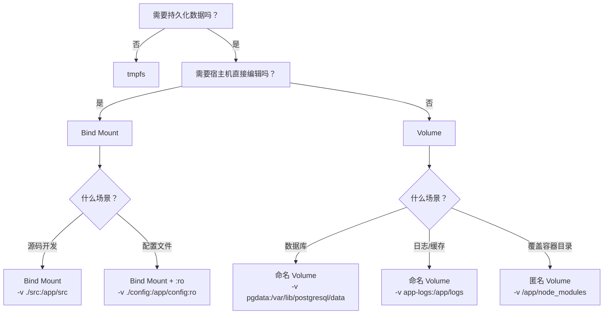

# Docker 数据管理完全指南

容器的文件系统是临时的——容器一删除，里面的数据就全没了。这在开发环境下可能无所谓，但数据库文件、用户上传、配置文件这些数据必须持久化。Docker 提供了三种挂载方式来解决这个问题，但该选哪种？本指南以"场景决策"为核心，帮你快速选对方案。

> 本篇是 Docker 系列（共 7 篇）的第 6 篇。上一篇：[Docker 网络完全指南](docker-5-networking.md)。下一篇：[Docker Compose 完全指南](docker-7-compose.md)。

## 1. 容器数据问题

### 1.1 容器文件系统特性

Docker 容器的文件系统基于镜像层（只读）+ 容器层（可写）构成。容器运行时的所有写操作都发生在最上面的容器层：

```
┌─────────────────────────┐
│   容器层（可写，临时）     │ ← 容器运行时的写入
├─────────────────────────┤
│   镜像层 3（只读）        │
├─────────────────────────┤
│   镜像层 2（只读）        │
├─────────────────────────┤
│   镜像层 1（只读）        │
└─────────────────────────┘
```

容器层使用 Copy-on-Write（CoW）机制：修改镜像中的文件时，先复制到容器层再修改。这意味着频繁写入会带来性能开销。

### 1.2 为什么数据会丢失

用一个实验说明问题：

```bash
# 1. 启动容器并写入数据
docker run -d --name db -e POSTGRES_PASSWORD=secret postgres:16
docker exec db sh -c 'echo "important data" > /tmp/mydata.txt'
docker exec db cat /tmp/mydata.txt
# 输出：important data

# 2. 停止并删除容器
docker stop db && docker rm db

# 3. 用同一镜像重新创建容器
docker run -d --name db -e POSTGRES_PASSWORD=secret postgres:16
docker exec db cat /tmp/mydata.txt
# 输出：cat: /tmp/mydata.txt: No such file or directory
```

**数据丢失了**。因为新容器有全新的容器层，之前的写入随旧容器一起被删除。

**数据丢失的常见场景**：

| 操作                  | 数据是否保留      |
| --------------------- | ----------------- |
| `docker stop`         | ✅ 保留           |
| `docker restart`      | ✅ 保留           |
| `docker rm`           | ❌ 丢失           |
| `docker rm -f`        | ❌ 丢失           |
| 重新 `docker run`     | ❌ 全新容器       |
| `docker system prune` | ❌ 清理停止的容器 |

### 1.3 数据持久化方案概览

Docker 提供三种挂载方式，将数据存储在容器之外：

```
┌─────────────────────────────────────────────────────┐
│                      容器                            │
│                                                     │
│  /app/data    /app/src     /app/tmp                 │
│      │            │            │                    │
└──────┼────────────┼────────────┼────────────────────┘
       │            │            │
   ┌───▼───┐   ┌───▼───┐   ┌───▼───┐
   │ Volume │   │ Bind  │   │ tmpfs │
   │       │   │ Mount │   │       │
   └───┬───┘   └───┬───┘   └───────┘
       │            │         内存中
       ▼            ▼
  Docker 管理    宿主机任意
  /var/lib/      目录
  docker/volumes
```

| 方式       | 存储位置        | 管理方 | 典型场景             |
| ---------- | --------------- | ------ | -------------------- |
| Volume     | Docker 管理区域 | Docker | 数据库、持久化数据   |
| Bind Mount | 宿主机任意路径  | 用户   | 开发热重载、配置文件 |
| tmpfs      | 宿主机内存      | 系统   | 临时数据、敏感信息   |

## 2. 挂载语法

### 2.1 -v 与 --mount 对比

Docker 提供两种语法来挂载存储，功能基本相同，但语法风格差异明显：

**`-v` / `--volume` 语法**——紧凑，用冒号分隔：

```bash
# 格式：-v 源:目标[:选项]
docker run -v mydata:/app/data nginx            # Volume
docker run -v ./src:/app/src nginx               # Bind Mount
docker run -v mydata:/app/data:ro nginx          # 只读
```

**`--mount` 语法**——显式，用键值对：

```bash
# 格式：--mount type=类型,src=源,dst=目标[,选项]
docker run --mount type=volume,src=mydata,dst=/app/data nginx
docker run --mount type=bind,src=./src,dst=/app/src nginx
docker run --mount type=volume,src=mydata,dst=/app/data,readonly nginx
```

**核心差异**：

| 对比项       | `-v`                 | `--mount`               |
| ------------ | -------------------- | ----------------------- |
| 语法风格     | 紧凑，冒号分隔       | 显式，键值对            |
| 可读性       | 简短但需记住参数顺序 | 冗长但含义清晰          |
| 不存在的源   | 自动创建目录         | 报错（更安全）          |
| 高级选项     | 部分选项不支持       | 支持所有选项            |
| Compose 文件 | 短语法用 `-v` 风格   | 长语法用 `--mount` 风格 |

### 2.2 推荐用法

**简单场景用 `-v`**，写起来快：

```bash
# 开发环境挂载源码
docker run -v ./src:/app/src my-app

# 数据库持久化
docker run -v pgdata:/var/lib/postgresql/data postgres:16
```

**复杂场景或生产环境用 `--mount`**，不容易出错：

```bash
# 只读挂载配置文件
docker run --mount type=bind,src=./nginx.conf,dst=/etc/nginx/conf.d/default.conf,readonly nginx

# 使用 Volume 子路径
docker run --mount type=volume,src=mydata,dst=/app/logs,volume-subpath=app-logs nginx
```

> **提示**：`-v` 在源路径不存在时会自动创建空目录，这可能导致应用启动失败却不报错。`--mount` 会直接报错，帮你提前发现问题。在生产环境中推荐使用 `--mount`。

## 3. 三种挂载方式

### 3.1 Volume

Volume 由 Docker 引擎创建和管理，数据存放在 Docker 管理的宿主机目录中（Linux 上是 `/var/lib/docker/volumes/`）。

```bash
# 创建并使用 Volume
docker volume create pgdata
docker run -d --name db \
  -v pgdata:/var/lib/postgresql/data \
  -e POSTGRES_PASSWORD=secret \
  postgres:16
```

**特点**：

- Docker 管理生命周期，不依赖宿主机目录结构
- 可以被多个容器同时挂载
- 支持 Volume 驱动（NFS、云存储等）
- 容器删除后 Volume 仍然存在

### 3.2 Bind Mount

Bind Mount 将宿主机上的**指定目录或文件**直接挂载到容器中。容器和宿主机看到的是同一份文件。

```bash
# 挂载当前目录的 src 到容器
docker run -d --name web \
  -v ./src:/app/src \
  -p 3000:3000 \
  node:22-slim
```

**特点**：

- 宿主机和容器双向同步——修改立即可见
- 依赖宿主机的目录结构，不可移植
- 容器进程默认有写权限，可能修改宿主机文件
- 适合开发环境的代码热重载

### 3.3 tmpfs

tmpfs 将数据存储在宿主机内存中，不写入磁盘。容器停止后数据消失。

```bash
# 使用 tmpfs 存储临时数据
docker run -d --name app \
  --mount type=tmpfs,dst=/app/tmp,tmpfs-size=100m \
  my-app
```

**特点**：

- 读写速度快（内存级别）
- 容器停止后数据立即消失
- 不能在容器间共享
- 仅在 Linux 上可用

### 3.4 三者对比与选择

| 特性        | Volume            | Bind Mount      | tmpfs         |
| ----------- | ----------------- | --------------- | ------------- |
| 存储位置    | Docker 管理区域   | 宿主机任意路径  | 宿主机内存    |
| 持久化      | ✅ 容器删除后保留 | ✅ 宿主机上保留 | ❌ 停止即消失 |
| 可移植性    | ✅ 不依赖宿主机   | ❌ 依赖目录结构 | ❌ 仅 Linux   |
| 性能        | 接近原生          | 原生            | 最快（内存）  |
| 多容器共享  | ✅ 支持           | ✅ 支持         | ❌ 不支持     |
| 适用环境    | 开发 + 生产       | 主要开发环境    | 特殊场景      |
| Docker 管理 | ✅ 完整生命周期   | ❌ 用户自行管理 | ❌ 自动清理   |
| 典型场景    | 数据库、持久数据  | 源码挂载、配置  | 临时缓存      |

## 4. Volume 详解

### 4.1 创建与管理

```bash
# 创建 Volume
docker volume create pgdata

# 列出所有 Volume
docker volume ls
# 输出：
# DRIVER    VOLUME NAME
# local     pgdata
# local     redis-data
# local     a1b2c3d4...  （匿名 Volume）

# 查看 Volume 详情
docker volume inspect pgdata
# 输出：
# [
#     {
#         "CreatedAt": "2024-01-15T10:30:00Z",
#         "Driver": "local",
#         "Mountpoint": "/var/lib/docker/volumes/pgdata/_data",
#         "Name": "pgdata",
#         "Options": {},
#         "Scope": "local"
#     }
# ]

# 删除 Volume
docker volume rm pgdata

# 清理所有未使用的 Volume
docker volume prune
```

### 4.2 命名 Volume vs 匿名 Volume

**命名 Volume**——指定名称，明确管理：

```bash
# 创建命名 Volume
docker run -d --name db \
  -v pgdata:/var/lib/postgresql/data \
  postgres:16

# pgdata 会持久存在，可复用
docker volume ls | grep pgdata
# local     pgdata
```

**匿名 Volume**——不指定名称，Docker 自动生成哈希名：

```bash
# 不指定 Volume 名称，Docker 自动创建匿名 Volume
docker run -d --name db \
  -v /var/lib/postgresql/data \
  postgres:16

# 匿名 Volume 名称是随机哈希
docker volume ls
# DRIVER    VOLUME NAME
# local     a1b2c3d4e5f6...
```

**对比**：

| 特性     | 命名 Volume              | 匿名 Volume                 |
| -------- | ------------------------ | --------------------------- |
| 名称     | 自定义名称               | 随机哈希                    |
| 可复用   | ✅ 通过名称引用          | ❌ 难以找到和引用           |
| 管理     | 容易识别和管理           | 容易积累成垃圾              |
| 适用场景 | 数据库、需要持久化的数据 | 临时覆盖（如 node_modules） |

> **提示**：需要持久化的数据始终使用命名 Volume。匿名 Volume 主要用于特殊技巧（如后面会讲到的 node_modules 处理）。

### 4.3 Volume 数据查看

```bash
# 方法 1：用临时容器查看 Volume 内容
docker run --rm -v pgdata:/data alpine ls -la /data

# 方法 2：在 Linux 上直接查看 Volume 目录（需要 root 权限）
sudo ls /var/lib/docker/volumes/pgdata/_data

# 方法 3：查看容器的挂载信息
docker inspect db --format='{{json .Mounts}}' | python3 -m json.tool
```

> **注意**：macOS 和 Windows 上 Docker Desktop 运行在虚拟机中，无法直接访问 `/var/lib/docker/volumes/` 路径。使用临时容器方式查看。

### 4.4 Volume 清理

```bash
# 删除指定 Volume（Volume 正在被使用时会报错）
docker volume rm pgdata

# 查看哪些 Volume 未被使用
docker volume ls -f dangling=true

# 清理所有未使用的 Volume（谨慎操作！）
docker volume prune
# WARNING! This will remove all local volumes not used by at least one container.

# 清理所有未使用资源（包括 Volume）
docker system prune --volumes
```

> **注意**：`docker volume prune` 会删除所有未被容器引用的 Volume，包括你可能还需要的数据。生产环境中务必确认后再执行。

## 5. Bind Mount 详解

### 5.1 基本用法

```bash
# 挂载目录
docker run -d --name web \
  -v ./my-app/src:/app/src \
  -p 3000:3000 \
  node:22-slim

# 挂载单个文件（常用于配置文件）
docker run -d --name web \
  -v ./nginx.conf:/etc/nginx/conf.d/default.conf:ro \
  -p 3000:80 \
  nginx

# 只读挂载（容器无法修改）
docker run -d --name web \
  -v ./config:/app/config:ro \
  my-app
```

> **注意**：使用 `-v` 时，如果宿主机路径不存在，Docker 会**自动创建一个空目录**。这常常不是你想要的行为。使用 `--mount` 则会直接报错。

### 5.2 权限问题

Bind Mount 的权限问题是最常见的坑，而且 macOS 和 Linux 表现不同。

**macOS（Docker Desktop）**：

macOS 上 Docker Desktop 通过虚拟机中的文件共享机制（VirtioFS / gRPC FUSE）同步文件，权限问题较少。容器内进程通常可以正常读写挂载的文件。

```bash
# macOS 上一般不会遇到权限问题
docker run --rm -v ./my-app:/app node:22-slim sh -c "touch /app/test.txt && echo OK"
# OK
```

**Linux**：

Linux 上 Bind Mount 是真正的目录挂载，容器内的用户 UID/GID 必须与宿主机文件的权限匹配。

```bash
# Linux 上可能遇到权限拒绝
docker run --rm -v ./my-app:/app node:22-slim sh -c "touch /app/test.txt"
# touch: cannot touch '/app/test.txt': Permission denied

# 原因：容器内以 node 用户（UID 1000）运行，但宿主机文件属于其他用户
```

**Linux 权限问题的解决方法**：

```bash
# 方法 1：指定容器用户与宿主机用户一致
docker run --rm -u $(id -u):$(id -g) -v ./my-app:/app node:22-slim \
  sh -c "touch /app/test.txt"

# 方法 2：修改宿主机目录权限
chmod -R 777 ./my-app  # 简单但不安全

# 方法 3：在 Dockerfile 中创建匹配 UID 的用户（推荐）
# Dockerfile 中：
# RUN groupadd -g 1000 appuser && useradd -u 1000 -g appuser appuser
```

| 平台  | 权限表现                 | 常见问题                   |
| ----- | ------------------------ | -------------------------- |
| macOS | 透明处理，很少有权限问题 | 文件同步性能稍慢           |
| Linux | 严格匹配 UID/GID         | 容器用户与宿主机用户不一致 |

### 5.3 开发环境热重载

Bind Mount 最大的价值是开发时的热重载——修改宿主机代码，容器内的应用自动重新加载：

```bash
# 前端开发：Vite 热重载
docker run -d --name web \
  -v ./my-app:/app \
  -p 5173:5173 \
  node:22-slim \
  sh -c "cd /app && npm install && npm run dev -- --host 0.0.0.0"

# 后端开发：nodemon 热重载
docker run -d --name api \
  -v ./my-api:/app \
  -p 3000:3000 \
  node:22-slim \
  sh -c "cd /app && npm install && npx nodemon server.js"
```

修改宿主机上 `my-app/src/App.tsx`，Vite 会自动检测变更并热更新浏览器页面。

## 6. 场景决策指南

### 6.1 开发环境怎么选

| 需求              | 选择        | 原因                     |
| ----------------- | ----------- | ------------------------ |
| 源码热重载        | Bind Mount  | 宿主机修改立即同步到容器 |
| 数据库数据保留    | Volume      | 容器重建后数据不丢失     |
| 配置文件注入      | Bind Mount  | 方便在宿主机编辑         |
| node_modules 隔离 | 匿名 Volume | 避免宿主机与容器依赖冲突 |
| 临时文件/缓存     | tmpfs       | 快速读写，不占磁盘       |

### 6.2 生产环境怎么选

| 需求                 | 选择        | 原因                    |
| -------------------- | ----------- | ----------------------- |
| 数据库持久化         | 命名 Volume | Docker 管理，易备份迁移 |
| 日志持久化           | Volume      | 不依赖宿主机目录结构    |
| 配置文件注入（只读） | Bind Mount  | 加 `:ro` 确保容器不修改 |
| 密钥/证书（临时）    | tmpfs       | 不落盘，安全            |
| 静态资源             | Volume      | 多容器共享，可移植      |

### 6.3 决策流程图



**速记口诀**：

- **要编辑？** → Bind Mount
- **要持久化？** → Volume
- **要临时？** → tmpfs

## 7. 数据备份与恢复

### 7.1 Volume 备份

Volume 不能直接在宿主机上访问（尤其是 macOS/Windows），但可以用临时容器来备份：

```bash
# 备份 pgdata Volume 到当前目录的 tar 文件
docker run --rm \
  -v pgdata:/source:ro \
  -v ./backup:/backup \
  alpine tar czf /backup/pgdata-backup.tar.gz -C /source .
```

**工作原理**：

```
┌──── 临时容器 ────┐
│                  │
│  /source ← pgdata Volume（只读）
│  /backup ← 宿主机 ./backup 目录
│                  │
│  tar czf /backup/pgdata-backup.tar.gz -C /source .
│                  │
└──────────────────┘
```

### 7.2 Volume 恢复

```bash
# 创建新 Volume 并恢复数据
docker volume create pgdata-restored

docker run --rm \
  -v pgdata-restored:/target \
  -v ./backup:/backup:ro \
  alpine tar xzf /backup/pgdata-backup.tar.gz -C /target
```

### 7.3 数据迁移

将数据从一个 Volume 复制到另一个：

```bash
# Volume 间直接复制
docker run --rm \
  -v old-volume:/source:ro \
  -v new-volume:/target \
  alpine sh -c "cp -a /source/. /target/"
```

将 Bind Mount 数据迁移到 Volume：

```bash
# 从宿主机目录迁移到 Volume
docker run --rm \
  -v ./local-data:/source:ro \
  -v app-data:/target \
  alpine sh -c "cp -a /source/. /target/"
```

## 8. 前端项目常见坑

### 8.1 源码挂载与 HMR

使用 Bind Mount 挂载源码进行热重载时，需要注意 HMR（Hot Module Replacement）的配置：

```bash
# 启动前端开发容器
docker run -d --name web \
  -v ./my-app:/app \
  -p 5173:5173 \
  node:22-slim \
  sh -c "cd /app && npm run dev -- --host 0.0.0.0"
```

**Vite 配置注意事项**：

```javascript
// vite.config.js
export default defineConfig({
  server: {
    host: "0.0.0.0", // 必须，否则容器外无法访问
    watch: {
      usePolling: true, // macOS/Windows Docker Desktop 需要轮询监听
    },
    hmr: {
      port: 5173, // 确保 HMR WebSocket 端口一致
    },
  },
});
```

> **提示**：macOS 和 Windows 上 Docker Desktop 的文件系统事件通知可能不可靠。如果修改文件后 HMR 不触发，添加 `usePolling: true` 可以解决，但会增加 CPU 开销。

### 8.2 node_modules 处理

**经典问题**：把整个项目目录挂载到容器，宿主机的 `node_modules` 会覆盖容器内通过 `npm install` 安装的依赖。两者的平台可能不同（macOS vs Linux），导致原生模块崩溃。

```bash
# ❌ 错误做法：宿主机的 node_modules 覆盖了容器的
docker run -d \
  -v ./my-app:/app \
  node:22-slim sh -c "cd /app && npm install && npm start"
# 如果宿主机 macOS 的 node_modules 存在，会覆盖容器中 Linux 的依赖
```

**解决方案：匿名 Volume 技巧**

```bash
# ✅ 正确做法：用匿名 Volume 隔离 node_modules
docker run -d --name web \
  -v ./my-app:/app \
  -v /app/node_modules \
  -p 3000:3000 \
  node:22-slim sh -c "cd /app && npm install && npm start"
```

**原理**：

```
宿主机 ./my-app/         容器 /app/
├── src/          ←→     ├── src/          （Bind Mount，双向同步）
├── package.json  ←→     ├── package.json  （Bind Mount，双向同步）
├── node_modules/ ✗      ├── node_modules/ （匿名 Volume，隔离）
└── ...                  └── ...
```

`-v /app/node_modules` 创建一个匿名 Volume 挂载到容器的 `/app/node_modules`，优先级高于 Bind Mount。这样容器内的 `npm install` 安装到匿名 Volume 中，不受宿主机 `node_modules` 影响。

**注意事项**：

- 每次用 `docker rm` 删除容器后，匿名 Volume 中的 `node_modules` 也会丢失（除非用 `docker run --rm` 以外的方式管理）
- 宿主机上添加新依赖后，需要在容器内重新 `npm install`
- 如果想持久化容器内的 `node_modules`，可以用命名 Volume 替代匿名 Volume

### 8.3 构建产物持久化

前端项目构建后需要将产物持久化或与其他容器共享：

```bash
# 方法 1：构建产物输出到宿主机（Bind Mount）
docker run --rm \
  -v ./my-app:/app \
  node:22-slim sh -c "cd /app && npm run build"
# 构建产物在宿主机 ./my-app/dist/ 中

# 方法 2：构建产物存入 Volume，供 Nginx 容器使用
docker volume create app-dist

# 构建并输出到 Volume
docker run --rm \
  -v ./my-app:/app:ro \
  -v app-dist:/output \
  node:22-slim sh -c "cd /app && npm run build && cp -r dist/. /output/"

# Nginx 从 Volume 读取静态文件
docker run -d --name web \
  -v app-dist:/usr/share/nginx/html:ro \
  -p 3000:80 \
  nginx
```

## 9. 总结

### 9.1 核心要点

- **容器文件系统是临时的**：容器删除后，容器层的数据全部丢失
- **Volume 是首选**：Docker 管理、可移植、易备份，适合需要持久化的数据
- **Bind Mount 用于开发**：宿主机编辑实时同步到容器，适合源码热重载
- **tmpfs 用于临时数据**：内存级速度，容器停止后消失
- **`--mount` 更安全**：源路径不存在时报错而非静默创建空目录
- **node_modules 用匿名 Volume 隔离**：避免宿主机与容器的依赖冲突
- **备份用临时容器**：`docker run --rm` 挂载 Volume 和宿主机目录来备份

### 9.2 速查表

| 命令/操作                                     | 说明                      |
| --------------------------------------------- | ------------------------- |
| `docker volume create <名称>`                 | 创建命名 Volume           |
| `docker volume ls`                            | 列出所有 Volume           |
| `docker volume inspect <名称>`                | 查看 Volume 详情          |
| `docker volume rm <名称>`                     | 删除 Volume               |
| `docker volume prune`                         | 清理未使用的 Volume       |
| `-v mydata:/app/data`                         | 命名 Volume 挂载          |
| `-v /app/node_modules`                        | 匿名 Volume（隔离用）     |
| `-v ./src:/app/src`                           | Bind Mount 挂载           |
| `-v ./config:/app/config:ro`                  | 只读 Bind Mount           |
| `--mount type=volume,src=X,dst=Y`             | 显式 Volume 挂载          |
| `--mount type=bind,src=X,dst=Y,readonly`      | 显式只读 Bind Mount       |
| `--mount type=tmpfs,dst=/tmp,tmpfs-size=100m` | tmpfs 挂载                |
| `docker system prune --volumes`               | 清理所有未用资源含 Volume |

## 参考资源

- [Docker 存储概述](https://docs.docker.com/engine/storage/)
- [Docker Volume 文档](https://docs.docker.com/engine/storage/volumes/)
- [Docker Bind Mount 文档](https://docs.docker.com/engine/storage/bind-mounts/)
- [Docker tmpfs 文档](https://docs.docker.com/engine/storage/tmpfs/)
- [docker volume 命令参考](https://docs.docker.com/reference/cli/docker/volume/)
