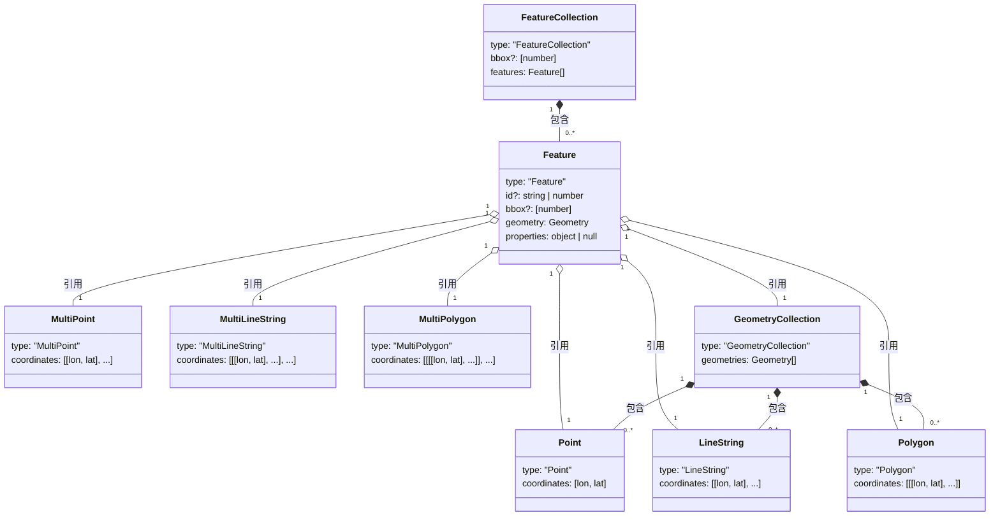

# GeoJSON 完全指南

GeoJSON 是一种基于 JSON 的地理空间数据交换格式，广泛应用于 Web 地图、地理信息系统（GIS）和位置服务中。本指南将深入介绍 GeoJSON 的规范、数据结构、实际应用场景和最佳实践。

## 1. 概述

### 1.1 什么是 GeoJSON

GeoJSON 是一种用于编码地理数据结构的开放标准格式。它基于 JSON（JavaScript Object Notation），能够表示点、线、多边形等几何对象，以及这些几何对象的集合。

```
+------------------+     +------------------+     +------------------+
|      JSON        | --> |     GeoJSON      | --> |    地图可视化      |
|   (数据格式)      |      |   (地理数据)      |     |   (前端展示)       |
+------------------+     +------------------+     +------------------+
```

### 1.2 发展历史

| 时间 | 事件                     |
| ---- | ------------------------ |
| 2008 | GeoJSON 1.0 规范发布     |
| 2015 | IETF 成立 GeoJSON 工作组 |
| 2016 | RFC 7946 正式标准发布    |

### 1.3 GeoJSON vs 其他格式

| 格式      | 特点                         | 适用场景           |
| --------- | ---------------------------- | ------------------ |
| GeoJSON   | 人类可读、易于解析、Web 友好 | Web 应用、API 交互 |
| Shapefile | 二进制、多文件组成、广泛支持 | 传统 GIS 软件      |
| KML       | XML 格式、支持样式           | Google Earth       |
| TopoJSON  | 拓扑编码、文件更小           | 大规模地图数据     |
| WKT       | 纯文本、简洁                 | 数据库存储         |

## 2. 数据结构

### 2.1 对象模型

GeoJSON 的数据结构是一个分层组合体系。下图展示了各对象之间的包含和引用关系：



GeoJSON 的核心设计思路：**几何对象**描述空间形状，**Feature** 将几何与属性数据关联，**FeatureCollection** 将多个 Feature 组织在一起。理解这个嵌套关系是使用 GeoJSON 的基础。

### 2.2 基本结构

每个 GeoJSON 对象都包含 `type` 属性，可选的 `bbox`（边界框）属性：

```json
{
  "type": "Feature",
  "geometry": {
    "type": "Point",
    "coordinates": ["longitude", "latitude"]
  },
  "properties": {
    "name": "示例点"
  }
}
```

> **注意**：GeoJSON 坐标顺序是 **[经度, 纬度]**，而非常见的 [纬度, 经度]。

### 2.3 几何类型

GeoJSON 支持七种几何类型：

```
┌─────────────────────────────────────────────────────────────┐
│                    GeoJSON 几何类型                           │
├─────────────────────────────────────────────────────────────┤
│  基础类型                                                     │
│  ├── Point (点)                    ●                         │
│  ├── LineString (线)               ●────●────●               │
│  └── Polygon (多边形)               ┌───┐                     │
│                                    │   │                     │
│                                    └───┘                     │
│  复合类型                                                      │
│  ├── MultiPoint (多点)             ●  ●  ●                    │
│  ├── MultiLineString (多线)        ─── ─── ───                │
│  ├── MultiPolygon (多多边形)         ┌─┐ ┌─┐                  │
│  │                                  └─┘ └─┘                  │
│  └── GeometryCollection (几何集合) ●── ┌─┐                    │
│                                       └─┘                   │
└─────────────────────────────────────────────────────────────┘
```

### 2.4 Point（点）

表示地球上的单个位置：

```json
{
  "type": "Point",
  "coordinates": [116.4074, 39.9042]
}
```

### 2.5 LineString（线）

由两个或更多点连接形成的线：

```json
{
  "type": "LineString",
  "coordinates": [
    [116.4074, 39.9042],
    [121.4737, 31.2304],
    [113.2644, 23.1291]
  ]
}
```

### 2.6 Polygon（多边形）

由闭合线环定义的区域，第一个和最后一个坐标必须相同：

```json
{
  "type": "Polygon",
  "coordinates": [
    [
      [116.0, 39.0],
      [117.0, 39.0],
      [117.0, 40.0],
      [116.0, 40.0],
      [116.0, 39.0]
    ]
  ]
}
```

> **提示**：多边形可以包含孔洞，第一个数组是外环，后续数组是内环（孔洞）。

带孔洞的多边形示例：

```json
{
  "type": "Polygon",
  "coordinates": [
    [
      [100.0, 0.0],
      [101.0, 0.0],
      [101.0, 1.0],
      [100.0, 1.0],
      [100.0, 0.0]
    ],
    [
      [100.2, 0.2],
      [100.8, 0.2],
      [100.8, 0.8],
      [100.2, 0.8],
      [100.2, 0.2]
    ]
  ]
}
```

### 2.7 Multi\* 类型

```json
// MultiPoint - 多个独立的点
{
  "type": "MultiPoint",
  "coordinates": [
    [116.4074, 39.9042],
    [121.4737, 31.2304]
  ]
}

// MultiLineString - 多条独立的线
{
  "type": "MultiLineString",
  "coordinates": [
    [[100.0, 0.0], [101.0, 1.0]],
    [[102.0, 2.0], [103.0, 3.0]]
  ]
}

// MultiPolygon - 多个独立的多边形
{
  "type": "MultiPolygon",
  "coordinates": [
    [[[102.0, 2.0], [103.0, 2.0], [103.0, 3.0], [102.0, 3.0], [102.0, 2.0]]],
    [[[100.0, 0.0], [101.0, 0.0], [101.0, 1.0], [100.0, 1.0], [100.0, 0.0]]]
  ]
}
```

### 2.8 GeometryCollection（几何集合）

包含不同类型几何对象的集合：

```json
{
  "type": "GeometryCollection",
  "geometries": [
    {
      "type": "Point",
      "coordinates": [100.0, 0.0]
    },
    {
      "type": "LineString",
      "coordinates": [
        [101.0, 0.0],
        [102.0, 1.0]
      ]
    }
  ]
}
```

## 3. Feature 和 FeatureCollection

### 3.1 Feature（要素）

Feature 将几何对象与属性数据关联：

```json
{
  "type": "Feature",
  "id": "building-001",
  "geometry": {
    "type": "Point",
    "coordinates": [116.4074, 39.9042]
  },
  "properties": {
    "name": "天安门",
    "city": "北京",
    "category": "landmark",
    "visitors": 15000000
  }
}
```

### 3.2 FeatureCollection（要素集合）

多个 Feature 的集合，是最常用的顶级 GeoJSON 结构：

```json
{
  "type": "FeatureCollection",
  "features": [
    {
      "type": "Feature",
      "geometry": {
        "type": "Point",
        "coordinates": [116.4074, 39.9042]
      },
      "properties": { "name": "北京" }
    },
    {
      "type": "Feature",
      "geometry": {
        "type": "Point",
        "coordinates": [121.4737, 31.2304]
      },
      "properties": { "name": "上海" }
    }
  ]
}
```

## 4. 坐标系统

### 4.1 WGS84 坐标系

RFC 7946 规定 GeoJSON 必须使用 WGS84 坐标参考系统（EPSG:4326）：

| 属性     | 说明               |
| -------- | ------------------ |
| 经度范围 | -180 到 180        |
| 纬度范围 | -90 到 90          |
| 坐标顺序 | [经度, 纬度, 高程] |
| 单位     | 十进制度           |

### 4.2 中国常用坐标系

在中国开发地图应用时，需要特别注意坐标系的转换：

| 坐标系     | 代号   | 使用平台                                |
| ---------- | ------ | --------------------------------------- |
| 地球坐标系 | WGS84  | GPS 设备、Google 地图（国外）           |
| 火星坐标系 | GCJ-02 | 高德地图、腾讯地图、Google 地图（国内） |
| 百度坐标系 | BD-09  | 百度地图                                |

> **注意**：不同坐标系之间存在几十到几百米的偏移，直接混用会导致位置错误。

### 4.3 坐标转换

使用 gcoord 库进行坐标转换：

```javascript
import gcoord from "gcoord";

// 单个坐标转换：WGS84 转 GCJ-02
const result = gcoord.transform(
  [116.4074, 39.9042], // 输入坐标
  gcoord.WGS84, // 源坐标系
  gcoord.GCJ02, // 目标坐标系
);

// GeoJSON 数据转换
const geojson = {
  type: "Point",
  coordinates: [116.4074, 39.9042],
};

const transformed = gcoord.transform(geojson, gcoord.WGS84, gcoord.GCJ02);
```

### 4.4 三维坐标

GeoJSON 坐标支持可选的第三个值来表示高程，格式为 `[经度, 纬度, 高程]`，高程单位为米，基准为 WGS84 椭球面。

```json
// 三维 Point —— 建筑物位置及高度
{
  "type": "Point",
  "coordinates": [116.4074, 39.9042, 44.0]
}

// 三维 LineString —— 无人机飞行航线
{
  "type": "LineString",
  "coordinates": [
    [116.40, 39.90, 100],
    [116.41, 39.91, 150],
    [116.42, 39.92, 120]
  ]
}
```

**典型使用场景**：

| 场景           | 说明                                       |
| -------------- | ------------------------------------------ |
| 城市三维建模   | 用高程值表示建筑物高度，配合 3D 地图渲染   |
| 飞行航线规划   | 无人机或航空路径中，每个航点包含飞行高度   |
| 地形等高线数据 | 等高线上的采样点携带海拔值，用于地形可视化 |

> **注意**：
>
> - 高程是可选的，大多数 Web 地图场景不需要。省略高程可以减小数据体积。
> - 不同数据源的高程基准可能不同（正高/海拔 vs 椭球高），混用会导致高度偏差。使用前应确认数据源的高程基准是否一致。

## 5. 边界框（Bounding Box）

### 5.1 bbox 属性

bbox（Bounding Box）是包围几何对象的最小矩形范围，用于快速定位和过滤空间数据。格式为 `[minLon, minLat, maxLon, maxLat]`：

```
        maxLat ┌──────────────────────┐
               │   ╱╲                 │
               │  ╱  ╲    ╱╲          │
               │ ╱    ╲  ╱  ╲         │
               │╱      ╲╱    ╲        │
               │              ╲╱      │
        minLat └──────────────────────┘
             minLon                maxLon

        ── 不规则多边形    □ bbox 边界
```

```json
{
  "type": "Feature",
  "bbox": [116.0, 39.0, 117.0, 40.0],
  "geometry": {
    "type": "Polygon",
    "coordinates": [
      [
        [116.0, 39.0],
        [117.0, 39.0],
        [117.0, 40.0],
        [116.0, 40.0],
        [116.0, 39.0]
      ]
    ]
  },
  "properties": {}
}
```

### 5.2 三维边界框

当坐标包含高程时（参见 [4.4 三维坐标](#44-三维坐标)），bbox 扩展为六个值，格式为 `[minLon, minLat, minAlt, maxLon, maxLat, maxAlt]`：

```json
{
  "type": "Point",
  "bbox": [116.4074, 39.9042, 0, 116.4074, 39.9042, 100],
  "coordinates": [116.4074, 39.9042, 50]
}
```

## 6. 实际应用场景

### 6.1 场景1：城市 POI 数据

```json
{
  "type": "FeatureCollection",
  "features": [
    {
      "type": "Feature",
      "geometry": {
        "type": "Point",
        "coordinates": [116.4034, 39.915]
      },
      "properties": {
        "name": "故宫博物院",
        "type": "museum",
        "address": "北京市东城区景山前街4号",
        "rating": 4.8,
        "openTime": "08:30-17:00"
      }
    },
    {
      "type": "Feature",
      "geometry": {
        "type": "Point",
        "coordinates": [116.3912, 39.9067]
      },
      "properties": {
        "name": "天安门广场",
        "type": "landmark",
        "address": "北京市东城区",
        "rating": 4.9
      }
    }
  ]
}
```

### 6.2 场景2：行政区划边界

```json
{
  "type": "Feature",
  "properties": {
    "name": "朝阳区",
    "adcode": "110105",
    "level": "district",
    "parent": "北京市"
  },
  "geometry": {
    "type": "Polygon",
    "coordinates": [
      [
        [116.4, 39.9],
        [116.5, 39.9],
        [116.5, 40.0],
        [116.4, 40.0],
        [116.4, 39.9]
      ]
    ]
  }
}
```

### 6.3 场景3：路径规划

```json
{
  "type": "Feature",
  "properties": {
    "routeId": "route-001",
    "distance": 12500,
    "duration": 1800,
    "mode": "driving"
  },
  "geometry": {
    "type": "LineString",
    "coordinates": [
      [116.4074, 39.9042],
      [116.415, 39.91],
      [116.43, 39.915],
      [116.45, 39.92]
    ]
  }
}
```

### 6.4 场景4：地理围栏

```javascript
// 定义配送范围围栏
const deliveryArea = {
  type: "Feature",
  properties: {
    name: "配送范围",
    maxDeliveryTime: 30,
  },
  geometry: {
    type: "Polygon",
    coordinates: [
      [
        [116.35, 39.85],
        [116.5, 39.85],
        [116.5, 39.98],
        [116.35, 39.98],
        [116.35, 39.85],
      ],
    ],
  },
};

// 使用 Turf.js 判断点是否在围栏内
import * as turf from "@turf/turf";

const point = turf.point([116.4, 39.9]);
const isInside = turf.booleanPointInPolygon(point, deliveryArea);
console.log(isInside); // true
```

### 6.5 场景5：空间查询过滤

利用 bbox 做矩形相交预判断（O(1)），快速排除无关数据，再对候选要素做精确几何计算：

```javascript
import * as turf from "@turf/turf";

// 判断两个 bbox 是否相交
function bboxIntersects(a, b) {
  return a[0] <= b[2] && a[2] >= b[0] && a[1] <= b[3] && a[3] >= b[1];
}

// 从大量要素中筛选与目标区域可能相交的候选要素
const targetBbox = [116.3, 39.8, 116.5, 40.0];
const candidates = features.filter((f) =>
  bboxIntersects(turf.bbox(f), targetBbox),
);
```

### 6.6 场景6：地图视口裁剪

前端地图在平移或缩放时，将当前视口转为 bbox 参数请求后端，只加载可见范围内的数据：

```javascript
// 获取当前视口范围并请求对应数据
const bounds = map.getBounds();
const bbox = [
  bounds.getWest(),
  bounds.getSouth(),
  bounds.getEast(),
  bounds.getNorth(),
].join(",");

fetch(`/api/features?bbox=${bbox}`)
  .then((res) => res.json())
  .then((geojson) => updateMapLayer(geojson));
```

## 7. JavaScript 操作 GeoJSON

### 7.1 常用库

| 库名      | 用途       | 特点             |
| --------- | ---------- | ---------------- |
| Turf.js   | 空间分析   | 功能全面、模块化 |
| Leaflet   | 地图展示   | 轻量、易用       |
| Mapbox GL | 高性能渲染 | WebGL、3D 支持   |
| gcoord    | 坐标转换   | 专注中国坐标系   |

### 7.2 Turf.js 常用操作

```javascript
import * as turf from "@turf/turf";

// 创建点
const point = turf.point([116.4074, 39.9042]);

// 创建缓冲区（5公里范围）
const buffer = turf.buffer(point, 5, { units: "kilometers" });

// 计算两点距离
const from = turf.point([116.4074, 39.9042]);
const to = turf.point([121.4737, 31.2304]);
const distance = turf.distance(from, to, { units: "kilometers" });
console.log(`距离: ${distance} km`); // 约 1068 km

// 计算多边形面积
const polygon = turf.polygon([
  [
    [116.0, 39.0],
    [117.0, 39.0],
    [117.0, 40.0],
    [116.0, 40.0],
    [116.0, 39.0],
  ],
]);
const area = turf.area(polygon);
console.log(`面积: ${area} 平方米`);

// 计算中心点
const center = turf.center(polygon);

// 计算边界框
const bbox = turf.bbox(polygon);
console.log(bbox); // [116.0, 39.0, 117.0, 40.0]

// 合并多个多边形
const union = turf.union(polygon1, polygon2);

// 求交集
const intersection = turf.intersect(polygon1, polygon2);
```

### 7.3 Leaflet 展示 GeoJSON

```javascript
import L from "leaflet";

// 初始化地图
const map = L.map("map").setView([39.9042, 116.4074], 12);

// 添加底图
L.tileLayer("https://{s}.tile.openstreetmap.org/{z}/{x}/{y}.png").addTo(map);

// GeoJSON 数据
const geojsonData = {
  type: "FeatureCollection",
  features: [
    {
      type: "Feature",
      geometry: { type: "Point", coordinates: [116.4074, 39.9042] },
      properties: { name: "北京" },
    },
  ],
};

// 添加 GeoJSON 图层
L.geoJSON(geojsonData, {
  // 点要素样式
  pointToLayer: (feature, latlng) => {
    return L.circleMarker(latlng, {
      radius: 8,
      fillColor: "#ff7800",
      color: "#000",
      weight: 1,
      fillOpacity: 0.8,
    });
  },
  // 绑定弹窗
  onEachFeature: (feature, layer) => {
    if (feature.properties?.name) {
      layer.bindPopup(feature.properties.name);
    }
  },
}).addTo(map);
```

## 8. GeoJSON 验证与优化

### 8.1 数据验证

```javascript
// 使用 geojson-validation 库
import GJV from "geojson-validation";

const geojson = {
  type: "Point",
  coordinates: [116.4074, 39.9042],
};

// 验证是否为有效 GeoJSON
const isValid = GJV.valid(geojson);
console.log(isValid); // true

// 获取详细验证信息
GJV.isPoint(geojson.coordinates, (valid, errs) => {
  if (!valid) {
    console.error("验证错误:", errs);
  }
});
```

### 8.2 常见错误

| 错误类型       | 示例                     | 正确写法                    |
| -------------- | ------------------------ | --------------------------- |
| 坐标顺序错误   | `[39.9, 116.4]`          | `[116.4, 39.9]` ✅          |
| 多边形未闭合   | 首尾坐标不同             | 首尾坐标相同 ✅             |
| 缺少 type 属性 | `{"coordinates": [...]}` | `{"type": "Point", ...}` ✅ |
| 经度超范围     | `[200, 39.9]`            | `[-180, 180]` 范围内 ✅     |

### 8.3 性能优化

```javascript
// ❌ 精度过高，数据冗余
{
  "coordinates": [116.40742839485729, 39.90428374829584]
}

// ✅ 保留合理精度（6位小数约 0.1 米精度）
{
  "coordinates": [116.407428, 39.904284]
}
```

**优化建议**：

1. **简化坐标精度**：通常 6 位小数足够（约 0.1 米精度）
2. **使用 TopoJSON**：对于大量多边形数据，可减少 80% 文件大小
3. **分级加载**：按缩放级别加载不同精度的数据
4. **数据压缩**：使用 gzip 压缩传输

## 9. 常见问题

**Q1: GeoJSON 坐标是 [经度, 纬度] 还是 [纬度, 经度]？**

GeoJSON 规范（RFC 7946）明确规定坐标顺序为 **[经度, 纬度]**，即 `[longitude, latitude]`。这与 Google Maps API 等使用的 `(lat, lng)` 顺序相反，需特别注意。

**Q2: 如何处理跨越 180° 经线的几何对象？**

RFC 7946 规定，对于跨越反子午线（±180°）的几何对象，应将其分割为不跨越的部分，或使用 -180 到 180 范围外的经度值表示。

```json
// 跨越太平洋的线（使用超出范围的经度）
{
  "type": "LineString",
  "coordinates": [
    [170, 40],
    [190, 40]
  ]
}
```

**Q3: properties 可以包含哪些数据类型？**

properties 可以是任何有效的 JSON 值，包括字符串、数字、布尔值、数组、嵌套对象或 null。

## 10. 总结

### 10.1 核心要点

- GeoJSON 是基于 JSON 的地理数据标准格式（RFC 7946）
- 坐标顺序为 **[经度, 纬度]**，使用 WGS84 坐标系
- 七种几何类型：Point、LineString、Polygon 及其 Multi\* 版本、GeometryCollection
- Feature 关联几何和属性，FeatureCollection 组织多个 Feature
- 在中国需注意 WGS84、GCJ-02、BD-09 坐标系转换

### 10.2 速查表

| 类型              | 结构                                      | 坐标维度 |
| ----------------- | ----------------------------------------- | -------- |
| Point             | `coordinates: [lon, lat]`                 | 0 维     |
| LineString        | `coordinates: [[lon, lat], ...]`          | 1 维     |
| Polygon           | `coordinates: [[[lon, lat], ...]]`        | 2 维     |
| MultiPoint        | `coordinates: [[lon, lat], ...]`          | 0 维 × n |
| MultiLineString   | `coordinates: [[[lon, lat], ...], ...]`   | 1 维 × n |
| MultiPolygon      | `coordinates: [[[[lon, lat], ...]], ...]` | 2 维 × n |
| Feature           | `geometry + properties`                   | -        |
| FeatureCollection | `features: [Feature, ...]`                | -        |

## 11. 参考资源

- [RFC 7946 - The GeoJSON Format](https://datatracker.ietf.org/doc/html/rfc7946) - GeoJSON 官方规范
- [geojson.io](https://geojson.io/) - 在线 GeoJSON 编辑器
- [Turf.js](https://turfjs.org/) - JavaScript 地理空间分析库
- [gcoord](https://github.com/hujiulong/gcoord) - 地理坐标系转换工具
- [Leaflet GeoJSON](https://leafletjs.com/reference.html#geojson) - Leaflet GeoJSON 文档
- [Mapbox GeoJSON](https://docs.mapbox.com/help/glossary/geojson/) - Mapbox GeoJSON 指南
