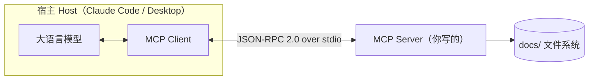

# MCP 服务器搭建完全指南

本文从零讲清 MCP（Model Context Protocol）是什么、为什么需要它，并用 TypeScript 手把手实现一个可以挂载到 Claude Code 的「笔记检索」MCP 服务器。它不仅覆盖三大原语，还把错误处理、结构化输出、反向能力（sampling/roots/elicitation）、协议级能力（logging/completion/progress）、远程部署（Streamable HTTP）、测试与安全一并讲透。读完你将能独立编写、调试、测试并部署一个生产可用的 MCP Server。

> **版本说明**：本文基于 **`@modelcontextprotocol/sdk` v1.29**（撰写时 npm `latest`）与 **zod v4**，所有代码均经 `tsc` 编译与测试验证。SDK v2 正在路上，会改变 schema 的写法，文中相关处会用 `> v2 前瞻` 标出差异。

## 1. MCP 是什么，为什么需要它

### 1.1 一句话定义

MCP（Model Context Protocol）是 Anthropic 在 2024 年底开源的协议，用来让大语言模型（LLM）以**标准化**的方式连接外部数据和能力。可以把它理解为两个常见类比：

- **「AI 应用的 USB 接口」**：以前每个应用接每个数据源都要写一套私有对接代码；有了统一接口，插上即用。
- **「LLM 世界的 LSP」**：就像 Language Server Protocol 让一个语言服务能被 VS Code、Vim、JetBrains 等所有编辑器复用，MCP 让一个能力服务能被所有支持 MCP 的 AI 宿主复用。

### 1.2 它解决的核心问题：M×N 集成爆炸

假设有 M 个 AI 应用（Claude Desktop、Cursor、各类 Agent）和 N 个外部系统（数据库、Git、文件系统、内部 API）。没有统一协议时，理论上要写 M×N 套对接逻辑：

```text
没有 MCP：每个应用各写一套对接              有了 MCP：各写一次，统一对话
┌────────┐                                ┌────────┐
│ App A  │──┬──> DB                        │ App A  │──┐
├────────┤  ├──> Git                       ├────────┤  │   ┌─────────────┐
│ App B  │──┼──> FS                        │ App B  │──┼──>│  MCP 协议    │──> DB / Git / FS
├────────┤  └──> API                       ├────────┤  │   └─────────────┘
│ App C  │  （M×N 套适配）                  │ App C  │──┘   （M+N 套适配）
└────────┘                                └────────┘
```

MCP 把 M×N 降为 M+N：应用只需实现一次 MCP 客户端，数据源只需实现一次 MCP 服务端，两边即可自由组合。

> **提示**：你现在在 Claude Code 里看到的 `mcp__codegraph__*`、`mcp__agentmemory__*` 这类工具，背后就是一个个 MCP Server。本文要做的，就是写出这样一个 Server。

## 2. 核心架构

### 2.1 三个角色：Host、Client、Server

MCP 采用经典的客户端—服务端架构，但中间多了一层「宿主」概念：

| 角色                 | 是谁                                           | 职责                                          |
| -------------------- | ---------------------------------------------- | --------------------------------------------- |
| **Host（宿主）**     | Claude Desktop、Claude Code、Cursor 等 AI 应用 | 管理用户交互与 LLM；内部持有一个或多个 Client |
| **Client（客户端）** | 宿主内部的连接器，与 Server 一一对应           | 负责与某个 Server 建立连接、转发请求          |
| **Server（服务端）** | 你本文要写的程序                               | 对外暴露 Tools / Resources / Prompts 三类能力 |



一个宿主可以同时连多个 Server（一个查数据库、一个读文件、一个调 API）；每个 Server 对应宿主内部的一个独立 Client。

### 2.2 底层就是 JSON-RPC 2.0

MCP 并没有发明新的消息格式，它的通信完全建立在 **JSON-RPC 2.0** 之上。每次工具调用、资源读取，本质都是一条 JSON-RPC 请求/响应：

```jsonc
// 宿主请求调用名为 search_docs 的工具
{
  "jsonrpc": "2.0",
  "id": 1,
  "method": "tools/call",
  "params": {
    "name": "search_docs",
    "arguments": { "keyword": "rebase" }
  }
}
```

```jsonc
// Server 返回结果
{
  "jsonrpc": "2.0",
  "id": 1,
  "result": {
    "content": [{ "type": "text", "text": "【git-rebase-guide.md】…命中摘要…" }]
  }
}
```

JSON-RPC 既有「请求/响应」（带 `id`，要配对回复），也有「通知」（notification，无 `id`，单向不回复）。后面讲 logging、progress、listChanged 时，本质都是 Server 主动发给宿主的**通知**。

> 说明：理解 JSON-RPC 的「方法名 + 参数 + id 配对」模型，对掌握 MCP 很有帮助。如果对 RPC 与 HTTP 的差异还不熟悉，可以先看本仓库的 [RPC vs HTTP 指南](./rpc-vs-http-guide.md)。

好消息是：这些底层报文你**几乎不用手写**，官方 SDK 会替你处理协议握手、消息编解码和错误包装。你只需要专注于「定义有哪些能力、每个能力做什么」。

## 3. 三大原语：Tools、Resources、Prompts

MCP Server 能对外暴露三类东西，统称「原语（primitives）」。区分它们的关键是**由谁控制调用**：

| 原语                  | 控制方                       | 类比                 | 典型用途                                     |
| --------------------- | ---------------------------- | -------------------- | -------------------------------------------- |
| **Tools（工具）**     | 模型控制（model-controlled） | POST 接口 / 函数调用 | 执行**动作**：查询、写入、计算、调用外部 API |
| **Resources（资源）** | 应用控制（app-controlled）   | GET 接口 / 文件      | 提供**只读上下文**数据，供宿主按需加载       |
| **Prompts（提示词）** | 用户控制（user-controlled）  | 预设模板 / 斜杠命令  | 用户主动触发的可复用提示模板                 |

直觉上的区别：

- **Tool 是「动词」**——模型在对话中判断需要时自己决定调用，可能产生副作用（写文件、发请求）。
- **Resource 是「名词」**——它是一份可被读取的数据，由宿主/用户决定要不要把它塞进上下文，本身只读、无副作用。
- **Prompt 是「模板」**——由用户主动选择（比如点一个斜杠命令）来填充并发送给模型。

> **注意**：同一份数据完全可以**同时**用 Tool 和 Resource 两种方式暴露。本文的 demo 就会把「读取某篇笔记」既做成 `read_doc` 工具（模型主动调），又做成 `docs://{filename}` 资源（用户主动挂载），借此把两者的区别讲透。

除这三大原语外，MCP 还有一组**反向能力**（sampling/roots/elicitation）和一组 **Server 协议能力**（logging/completion/progress 等），分别在第 7、8 章展开。

## 4. 传输层：三种方式与新旧之分

原语解决「Server 暴露什么」，传输层解决「Client 和 Server 怎么连」。MCP 官方一共定义过**三种**传输方式，注意其中一种已被取代：

| 传输方式                  | 通信信道                                                               | 状态                        | 适用场景                          |
| ------------------------- | ---------------------------------------------------------------------- | --------------------------- | --------------------------------- |
| **stdio**                 | 子进程的标准输入/输出（stdin/stdout）                                  | ✅ 当前，本地首选           | 本地 Server，宿主把它当子进程拉起 |
| **HTTP + SSE**（旧）      | **两个**端点：`GET /sse` 收服务端推送 + `POST` 发请求                  | ⚠️ 已废弃（2024-11 老规范） | 仅为兼容旧 Server 保留            |
| **Streamable HTTP**（新） | **单个** `/mcp` 端点：POST 发请求，服务端可回单条 JSON 或升级为 SSE 流 | ✅ 当前，远程首选           | 远程 Server，多客户端共享、需部署 |

> **常见误解（务必厘清）**：很多旧资料把 Streamable HTTP 含糊地说成「HTTP + SSE」，让人以为它就是老的 SSE 传输。其实两者是**不同的传输**：
>
> - **老 SSE 传输**：分两个端点，一个专用 SSE 通道收推送、一个 POST 发请求。已在 2025-03 规范中被废弃。
> - **Streamable HTTP**：只有一个 `/mcp` 端点，POST 上去后服务端**可以**选择回一条普通 JSON，**也可以**升级成 SSE 流来推送；用 `Mcp-Session-Id` 响应头维护会话。
>
> 你在 Claude Code 里 `claude mcp add --transport` 看到的 `stdio / sse / streamableHttp` 三个选项，正对应上表三种。**新项目一律选 Streamable HTTP（或本地 stdio）**，`sse` 只在连接遗留 Server 时才用。

对于本地工具，**stdio 是最简单的选择**：宿主直接以子进程方式启动你的 Server，通过它的 stdin 发请求、从 stdout 读响应。无需端口、无需鉴权、无需考虑并发，最适合入门和个人使用。本文主线用 stdio，第 10 章再给出 Streamable HTTP 的可跑实现。

> **注意（stdio 最常见的坑）**：stdio 模式下，**stdout 被 JSON-RPC 报文独占**。任何写入 stdout 的日志（`console.log`）都会污染协议数据，导致宿主解析失败。所有调试日志必须走 **stderr**（`console.error`），或改用第 8 章的协议级 logging。这是新手第一个会踩的坑，下文代码会专门处理。

## 5. 动手搭建：笔记检索 Server

目标：写一个 MCP Server，对接本仓库的 `docs/` 目录，让 Claude 能搜索和读取你的技术笔记。它将覆盖全部三大原语：

- **Tool `search_docs`**：按关键词搜索 Markdown 笔记（带结构化输出）
- **Tool `read_doc`**：读取指定笔记全文（带错误处理）
- **Tool `smart_search`**：借宿主 LLM 做相关性排序（sampling，见第 7 章）
- **Resource `docs://list`**：暴露笔记清单（只读）
- **Resource `docs://{filename}`**：按文件名暴露单篇笔记（模板资源 + 自动补全）
- **Prompt `summarize-doc`**：生成「总结某篇笔记」的提示模板

> **提示**：下文为聚焦核心而只贴关键节选，完整可跑源码（含测试、HTTP 入口）见配套仓库 [chenmijiang/mcp-docs-server](https://github.com/chenmijiang/mcp-docs-server)，可直接 clone 跑通后对照阅读。

### 5.1 初始化工程并锁定版本

```bash
mkdir mcp-docs-server && cd mcp-docs-server
npm init -y
```

安装官方 SDK 与对等依赖 `zod`，以及开发期工具。**务必锁定主版本**——MCP SDK 仍在演进，不锁版本会在 v2 发布时悄悄拉到不兼容的新版，让下面的代码编译失败：

```bash
# ✅ 锁主版本：运行时依赖 = SDK v1 + zod v4
npm install @modelcontextprotocol/sdk@^1.29.0 zod@^4
# 远程部署（第 10 章）需要 express
npm install express@^5
# 开发依赖：TypeScript、类型、免编译跑 TS 的 tsx、测试用 vitest
npm install -D typescript @types/node @types/express tsx vitest
```

> **❌ 反例**：直接 `npm install @modelcontextprotocol/sdk`（不锁版本）。今天它给你 v1，明天 v2 转正后就给 v2，而 v2 改了 schema 写法（见 5.4 的 v2 前瞻），照本文写的代码会编译报错。

### 5.2 配置 package.json 与 tsconfig.json

`package.json` 关键字段（SDK 为纯 ESM，必须声明 `"type": "module"`）：

```jsonc
{
  "name": "mcp-docs-server",
  "version": "2.0.0",
  "type": "module", // ✅ SDK 是 ESM，必须开启
  "bin": {
    "mcp-docs-server": "dist/index.js" // 编译产物作为可执行入口
  },
  "scripts": {
    "build": "tsc", // 编译到 dist/
    "dev": "tsx src/index.ts", // 开发期直接跑 stdio 入口
    "dev:http": "tsx src/http.ts", // 开发期跑 HTTP 入口
    "test": "vitest run", // 跑测试
    "inspect": "npx @modelcontextprotocol/inspector tsx src/index.ts" // 启动调试器
  }
}
```

`tsconfig.json`（ESM 工程使用 Node16 模块解析）：

```jsonc
{
  "compilerOptions": {
    "target": "ES2022",
    "module": "Node16",
    "moduleResolution": "Node16",
    "rootDir": "src", // 只编译 src/，测试目录不进编译产物
    "outDir": "dist",
    "strict": true, // ✅ 严格模式，配合 zod 获得完整类型推导
    "skipLibCheck": true,
    "types": ["node"]
  },
  "include": ["src/**/*"]
}
```

> **提示**：Node16 模块解析要求相对导入带 `.js` 后缀，SDK 的导入路径（如 `.../server/mcp.js`）正是这个原因——它指向编译后的产物，而非源码。本文自己的相对导入（如 `./docs.js`）也要带 `.js`。

### 5.3 抽出纯函数：文件读取与检索

我们把所有**纯逻辑**（列目录、读文件、检索）收敛到 `src/docs.ts`，与 MCP 注册逻辑分离。这样做有两个好处：副作用集中、便于单测（第 11 章会直接测这些函数）。

```typescript
// src/docs.ts
import { readFile, readdir } from "node:fs/promises";
import { join, basename } from "node:path";

// 一条搜索命中：结构化输出用，便于宿主/客户端机器消费，而不是只给一坨字符串
export interface DocHit {
  file: string;
  snippet: string;
}

// 列出 docs 目录下所有 Markdown 文件名（纯函数，无副作用扩散）
export async function listMarkdown(docsDir: string): Promise<string[]> {
  const entries = await readdir(docsDir);
  return entries.filter((name) => name.endsWith(".md")).sort();
}

// 安全读取：basename 去掉任何路径成分，杜绝 ../ 路径穿越；再加 .md 白名单。
// 这是纯函数边界上的安全闸门——永远不信任调用方（尤其是模型）传入的文件名。
export async function readMarkdown(
  docsDir: string,
  filename: string,
): Promise<string> {
  const safeName = basename(filename);
  if (!safeName.endsWith(".md")) {
    throw new Error(`只允许读取 .md 文件：${filename}`);
  }
  return readFile(join(docsDir, safeName), "utf8");
}

// 纯检索逻辑：抽出来既便于复用，也便于单测——只关心「给定目录与关键词，命中什么」。
export async function searchDocs(
  docsDir: string,
  keyword: string,
): Promise<DocHit[]> {
  const files = await listMarkdown(docsDir);
  const hits: DocHit[] = [];
  const needle = keyword.toLowerCase();
  for (const file of files) {
    const text = await readMarkdown(docsDir, file);
    const idx = text.toLowerCase().indexOf(needle);
    if (idx !== -1) {
      // 截取命中位置前后各 40 字作为摘要，换行压成空格便于单行展示
      const snippet = text
        .slice(Math.max(0, idx - 40), idx + 40)
        .replace(/\n/g, " ");
      hits.push({ file, snippet });
    }
  }
  return hits;
}
```

> **注意（安全）**：任何接受文件名的工具都要防路径穿越。这里用 `basename()` 把 `../../etc/passwd` 这类输入压成纯文件名，再加 `.md` 白名单。**永远不要信任模型传入的路径参数**。第 12 章会系统讲安全。

### 5.4 工厂模式：createServer 与第一个工具 search_docs

接着新建 `src/server.ts`，用一个 `createServer(docsDir)` 工厂**构造并配置** Server，但**不**接传输层。把「构造」与「接传输启动」分开，是刻意的副作用隔离：入口文件负责唯一的副作用（连接传输），工厂则可被重复调用，单测里能反复 new 出来挂内存传输。

`registerTool` 的签名是 `(名称, 配置, 处理函数)`。先看配置里几个关键字段：

```typescript
// src/server.ts （节选：导入 + 创建实例 + search_docs）
import {
  McpServer,
  ResourceTemplate,
} from "@modelcontextprotocol/sdk/server/mcp.js";
import { completable } from "@modelcontextprotocol/sdk/server/completable.js";
import { z } from "zod";
import { listMarkdown, readMarkdown, searchDocs } from "./docs.js";

export function createServer(docsDir: string): McpServer {
  // 声明 logging 能力，sendLoggingMessage 才能把结构化日志推给宿主分级展示
  const server = new McpServer(
    { name: "docs-search", version: "2.0.0" },
    { capabilities: { logging: {} } },
  );

  server.registerTool(
    "search_docs",
    {
      title: "搜索笔记",
      description:
        "在文档目录下按关键词搜索 Markdown 笔记，返回命中文件与上下文摘要",
      // inputSchema 用 zod 原始 shape（SDK v1 形态），不要包 z.object()
      inputSchema: {
        keyword: z.string().min(1).describe("要搜索的关键词"),
      },
      // outputSchema 让宿主拿到机器可读的命中列表，而不是只能解析文本
      outputSchema: {
        hits: z
          .array(
            z.object({
              file: z.string().describe("命中的文件名"),
              snippet: z.string().describe("命中位置上下文摘要"),
            }),
          )
          .describe("所有命中项"),
      },
      // 只读、无副作用、不访问外部世界——如实告诉宿主，便于它免确认放行
      annotations: {
        readOnlyHint: true,
        openWorldHint: false,
      },
    },
    async ({ keyword }, extra) => {
      // 协议级日志：比 console.error 更正规，宿主可按 level 过滤展示（见第 8 章）
      await server.sendLoggingMessage({
        level: "debug",
        data: `search_docs: keyword=${keyword}`,
      });

      // 尊重取消信号：宿主撤单时尽早退出，不白跑 IO（见第 8 章）
      if (extra.signal.aborted) {
        throw new Error("请求已被取消");
      }

      const hits = await searchDocs(docsDir, keyword);
      const text = hits.length
        ? hits.map((h) => `【${h.file}】…${h.snippet}…`).join("\n")
        : `未找到包含「${keyword}」的笔记`;

      // ✅ 有 outputSchema 时必须返回 structuredContent；同时保留 content 文本兼容旧客户端
      return {
        content: [{ type: "text", text }],
        structuredContent: { hits },
      };
    },
  );

  // ……（其余注册见下文，最后 return server）
  return server;
}
```

要点回顾：

- `description` 是给**模型**看的——写清楚工具能力，模型才知道何时调用它。这是工具好不好用的关键。
- `.describe()` 给每个参数补充说明，同样进入模型可见的 schema。
- **`inputSchema` / `outputSchema` 用 zod 原始 shape**（即 `{ key: z.类型() }`），**不是** `z.object(...)`。SDK 会据此生成参数校验和供模型阅读的 JSON Schema。
- **`outputSchema` + `structuredContent`**：声明了 `outputSchema`，处理函数就**必须**返回 `structuredContent`（且要通过该 schema 校验）。宿主因此能拿到机器可读的 JSON，而不是只能从 `content` 文本里抠。保留 `content` 是为了兼容不消费结构化输出的旧客户端。
- **`annotations`** 是给宿主的**提示**（hint），不是强制约束：`readOnlyHint: true` 表示工具不改状态，宿主可借此跳过用户确认；`openWorldHint: false` 表示不访问外部世界。注意这些只是声明，宿主**不会**据此沙箱你——真正的安全得靠代码（见第 12 章）。

> **v2 前瞻**：SDK v2 起，`inputSchema` / `outputSchema` / `argsSchema` **不再接受原始 shape**，必须用 `z.object({...})`（或 ArkType、Valibot 等 Standard Schema 库），无参工具写 `z.object({})`，且需从 `zod/v4` 导入。也就是说，本节的强调在 v2 下正好相反。升级时把所有 `inputSchema: { k: z.x() }` 改成 `inputSchema: z.object({ k: z.x() })` 即可。

### 5.5 第二个工具 read_doc：带错误处理

读文件可能失败（文件不存在、非 `.md`）。这里用**显式 `try/catch` 返回 `isError: true`**，而不是让异常裸抛：

```typescript
// src/server.ts （节选：read_doc）
server.registerTool(
  "read_doc",
  {
    title: "读取笔记",
    description: "读取指定 Markdown 笔记的完整内容",
    inputSchema: {
      filename: z.string().describe("文件名，例如 git-rebase-guide.md"),
    },
    annotations: { readOnlyHint: true, openWorldHint: false },
  },
  async ({ filename }) => {
    try {
      const text = await readMarkdown(docsDir, filename);
      return { content: [{ type: "text", text }] };
    } catch (err) {
      // 工具级错误：返回 isError:true，模型能看到原因并自纠（换个文件名重试），
      // 而不是把原始异常抛成它无法处理的协议错误。消息保持对模型友好。
      const reason = err instanceof Error ? err.message : String(err);
      return {
        content: [{ type: "text", text: `读取失败：${reason}` }],
        isError: true,
      };
    }
  },
);
```

为什么不直接 `throw`？这涉及 MCP 的两层错误语义，第 6 章专门讲。

### 5.6 注册资源：docs://list 与 docs://{filename}

资源用 `registerResource` 注册。它有两种形态——**静态资源**（固定 URI）和**模板资源**（URI 含变量）。

先看静态资源 `docs://list`，暴露一份只读的笔记清单：

```typescript
// src/server.ts （节选：静态资源）
server.registerResource(
  "docs-list",
  "docs://list", // 静态 URI，固定不变
  {
    title: "笔记清单",
    description: "当前文档目录下所有 Markdown 笔记的文件名列表",
    mimeType: "text/plain",
  },
  // 处理函数收到 uri 对象，返回 contents 数组
  async (uri) => {
    const files = await listMarkdown(docsDir);
    return { contents: [{ uri: uri.href, text: files.join("\n") }] };
  },
);
```

再看模板资源 `docs://{filename}`，用 `ResourceTemplate` 声明 URI 里的变量。这里顺带加上 **completion（自动补全）**：用户输入到一半时，宿主可以请求候选文件名（详见第 8 章）。

```typescript
// src/server.ts （节选：模板资源 + 补全）
server.registerResource(
  "doc-content",
  new ResourceTemplate("docs://{filename}", {
    list: undefined, // 不提供枚举所有实例的能力
    // completion：基于真实文件名给候选，前缀匹配
    complete: {
      filename: async (value) => {
        const files = await listMarkdown(docsDir);
        return files.filter((f) => f.startsWith(value));
      },
    },
  }),
  {
    title: "笔记内容",
    description: "按文件名读取单篇笔记，作为只读资源暴露",
    mimeType: "text/markdown",
  },
  // 第二个参数解构出 URI 模板变量
  async (uri, { filename }) => {
    const text = await readMarkdown(docsDir, String(filename));
    return { contents: [{ uri: uri.href, text }] };
  },
);
```

> **关键对比**：`read_doc`（Tool）和 `docs://{filename}`（Resource）读的是同一份数据，但定位不同——
>
> - **Tool**：模型在对话中**自主判断**需要时调用，是「执行一次读取动作」。
> - **Resource**：由**用户/宿主主动挂载**进上下文，是「这里有一份可读数据」。
>
> 同一能力两种暴露方式都合理，取决于你希望它被「模型自动调用」还是「用户显式引用」。

### 5.7 注册提示词 summarize-doc

Prompt 用 `registerPrompt` 注册，`argsSchema` 同样是 zod 原始 shape。这里用 `completable()` 包裹参数，让宿主也能为它请求候选文件名。它返回的是一组**预填好的对话消息**，供用户主动触发：

```typescript
// src/server.ts （节选：prompt）
server.registerPrompt(
  "summarize-doc",
  {
    title: "总结笔记",
    description: "生成一段提示词，让模型用三句话总结指定笔记的要点",
    argsSchema: {
      // completable 包裹后，宿主能为该参数请求候选文件名
      filename: completable(z.string(), async (value) => {
        const files = await listMarkdown(docsDir);
        return files.filter((f) => f.startsWith(value));
      }).describe("要总结的文件名"),
    },
  },
  async ({ filename }) => {
    const text = await readMarkdown(docsDir, filename);
    return {
      messages: [
        {
          role: "user",
          content: {
            type: "text",
            text: `请用三句话总结下面这篇笔记的核心要点：\n\n${text}`,
          },
        },
      ],
    };
  },
);
```

用户在宿主里选中这个 Prompt、填入文件名，宿主就会把组装好的消息发给模型——相当于一个可复用的「斜杠命令」。

### 5.8 stdio 入口

最后用 `src/index.ts` 把 Server 接上 stdio 传输跑起来。注意：**唯一的副作用（连接传输）集中在这里**，且日志走 stderr：

```typescript
// src/index.ts
import { StdioServerTransport } from "@modelcontextprotocol/sdk/server/stdio.js";
import { join } from "node:path";
import { createServer } from "./server.js";

// 文档根目录：通过环境变量传入，方便挂载到任意仓库；默认当前目录下的 docs/
const DOCS_DIR = process.env.DOCS_DIR ?? join(process.cwd(), "docs");

async function main() {
  const server = createServer(DOCS_DIR);
  const transport = new StdioServerTransport();
  await server.connect(transport); // 握手 + 开始监听 stdin

  // ✅ 日志必须走 stderr —— stdout 被 JSON-RPC 占用，写 stdout 会破坏协议
  console.error(`docs-search MCP server 已启动（stdio），DOCS_DIR=${DOCS_DIR}`);
}

main().catch((err) => {
  console.error("启动失败：", err); // ❌ 这里若用 console.log 会污染协议流
  process.exit(1);
});
```

至此一个完整的 stdio MCP Server 就写好了，文件结构是：`src/docs.ts`（纯逻辑）+ `src/server.ts`（能力注册）+ `src/index.ts`（入口）。

## 6. 错误处理：工具级 vs 协议级两层语义

MCP 的错误分两层，搞清楚它们是写好工具的关键：

| 层级           | 怎么产生                                     | 模型/宿主看到什么                        | 用在哪                                       |
| -------------- | -------------------------------------------- | ---------------------------------------- | -------------------------------------------- |
| **工具级错误** | 处理函数返回 `{ isError: true, content }`    | 模型**能看到**错误内容，可据此自纠重试   | 业务可恢复的失败：文件不存在、参数语义不对等 |
| **协议级错误** | 处理函数 `throw`，被 SDK 包成 JSON-RPC error | 是协议层故障，模型通常**无法**针对性处理 | 真正的异常：内部崩溃、不该发生的状态         |

关键细节：在 SDK 里，如果处理函数**抛出异常**，SDK 会**自动**把它转成 `{ isError: true }`（而非裸的协议错误）。所以裸 `throw` 不会让连接崩，但有两个问题：一是把**原始异常信息**（可能含路径、栈）直接漏给模型，二是你失去了对错误措辞的控制。因此推荐**显式 `try/catch`**（如 5.5 的 `read_doc`），返回对模型友好、不泄露内部细节的消息。

```typescript
// ✅ 推荐：显式 try/catch，返回工具级错误，措辞可控
try {
  const text = await readMarkdown(docsDir, filename);
  return { content: [{ type: "text", text }] };
} catch (err) {
  return {
    content: [{ type: "text", text: `读取失败：${err instanceof Error ? err.message : String(err)}` }],
    isError: true,
  };
}

// ❌ 不推荐：裸 throw —— SDK 虽会兜底转 isError，但会漏原始异常细节，措辞也不可控
const text = await readMarkdown(docsDir, filename);
return { content: [{ type: "text", text }] };
```

> **提示**：参数**类型**校验不用你操心。`inputSchema` 声明后，宿主传错类型（比如 `keyword` 传了数字）会在进入你的处理函数前被 zod 拦下，自动回一个协议级的参数错误。你只需处理**业务语义**上的失败。

## 7. 反向能力：sampling / roots / elicitation

前面的调用都是「宿主 → Server」。MCP 还有三种**把箭头反过来**的能力，让 Server 反过来请求宿主。它们是 MCP 区别于普通插件系统的精髓。

| 能力            | 方向        | 一句话                                             | 依赖                        |
| --------------- | ----------- | -------------------------------------------------- | --------------------------- |
| **sampling**    | Server→宿主 | Server 不自带模型，临时**借宿主的 LLM** 跑一次生成 | 客户端声明 sampling 能力    |
| **elicitation** | Server→用户 | Server 运行中**向用户追问**，拿到结构化回答        | 客户端声明 elicitation 能力 |
| **roots**       | 宿主→Server | 宿主告知 Server **可访问的根目录**                 | 客户端声明 roots 能力       |

> **注意**：这三者都依赖**客户端支持**，各宿主支持程度不一（Claude Code / Desktop 不一定全支持）。代码里务必兜底：不支持时优雅降级，而不是直接报错。Inspector 可模拟这些反向请求，便于调试。

### 7.1 sampling：借宿主的 LLM（smart_search）

`smart_search` 先按关键词召回候选，再通过 `server.server.createMessage(...)` 把「请帮我排序」这个生成请求**反向发给宿主的 LLM**：

```typescript
// src/server.ts （节选：smart_search）
server.registerTool(
  "smart_search",
  {
    title: "智能检索",
    description:
      "先按关键词召回候选笔记，再借宿主的 LLM 判断哪几篇最相关并给出理由",
    inputSchema: { keyword: z.string().min(1).describe("要搜索的关键词") },
    annotations: { readOnlyHint: true },
  },
  async ({ keyword }) => {
    const hits = await searchDocs(docsDir, keyword);
    if (!hits.length) {
      return { content: [{ type: "text", text: `未召回任何候选` }] };
    }
    const candidates = hits.map((h) => `- ${h.file}：${h.snippet}`).join("\n");
    try {
      // createMessage 把「生成」请求反向发给宿主：Server 临时借一个模型用。
      const result = await server.server.createMessage({
        messages: [
          {
            role: "user",
            content: {
              type: "text",
              text: `用户在找「${keyword}」。下列候选中挑出最相关的 1-3 篇并说明理由：\n${candidates}`,
            },
          },
        ],
        maxTokens: 500,
      });
      const answer =
        result.content.type === "text" ? result.content.text : "(非文本内容)";
      return { content: [{ type: "text", text: answer }] };
    } catch (err) {
      // ✅ 宿主不支持 sampling 时优雅降级为普通召回，而不是抛错
      const reason = err instanceof Error ? err.message : String(err);
      return {
        content: [{ type: "text", text: `宿主不支持 sampling（${reason}），回退：\n${candidates}` }],
        isError: true,
      };
    }
  },
);
```

### 7.2 elicitation：运行中向用户追问

当工具运行到一半发现信息不足（比如文件名有歧义），可以用 `server.server.elicitInput(...)` 弹出一个结构化表单让用户补充，而不是直接失败：

```typescript
// 概念片段：在某个工具内部追问用户
const res = await server.server.elicitInput({
  message: "没找到精确匹配的笔记，你想读哪一篇？",
  requestedSchema: {
    type: "object",
    properties: {
      filename: { type: "string", description: "确切的文件名" },
    },
    required: ["filename"],
  },
});
// res.action 可能是 "accept" / "decline" / "cancel"
if (res.action === "accept") {
  const filename = res.content?.filename as string;
  // ……用补充到的 filename 继续
}
```

### 7.3 roots：让宿主告知可访问目录

`DOCS_DIR` 环境变量是写死的。更「MCP 原生」的做法是问宿主要 **roots**（宿主授权 Server 访问的根目录），从而自动适配当前工作区：

```typescript
// 概念片段：用 roots 替代写死的 DOCS_DIR
async function resolveDocsDir(server: McpServer, fallback: string) {
  try {
    const { roots } = await server.server.listRoots();
    // roots[i].uri 形如 "file:///path/to/project"
    const first = roots?.[0]?.uri;
    return first ? new URL(first).pathname : fallback;
  } catch {
    return fallback; // ✅ 宿主不支持 roots 时回退
  }
}
```

## 8. Server 协议能力：logging / completion / progress 等

除原语外，Server 还能用一组协议能力提升体验。本章 logging 与 completion 给可跑示例（demo 里已用上），其余给概念。

### 8.1 logging：协议级结构化日志

第 4 章说过 stdout 不能写日志。stderr 是兜底，但更正规的方式是**协议级 logging**：宿主能按 `level` 过滤、分级展示。前提是构造 Server 时声明 `capabilities: { logging: {} }`（5.4 已声明）：

```typescript
// 在任意处理函数里
await server.sendLoggingMessage({
  level: "info", // debug / info / notice / warning / error ...
  data: `search_docs 命中 ${hits.length} 篇`,
});
```

| 日志方式             | 去向         | 何时用                                 |
| -------------------- | ------------ | -------------------------------------- |
| `console.error`      | stderr       | 启动信息、协议无关的本地调试           |
| `sendLoggingMessage` | 走协议给宿主 | 希望宿主能看到、按级别过滤的运行期日志 |
| `console.log`        | ❌ 禁用      | stdio 下会污染协议流，永远不要用       |

### 8.2 completion：参数自动补全

`docs://{filename}`（5.6）和 `summarize-doc`（5.7）都接了补全：用户输入文件名前缀时，宿主可请求候选。资源模板用 `ResourceTemplate` 的 `complete` 回调，prompt 参数用 `completable()` 包裹——两处我们都基于真实文件名做前缀匹配。

### 8.3 progress 与 cancellation

长任务可以报进度、可被取消。处理函数的第二个参数 `extra` 提供这两件事：

```typescript
async ({ keyword }, extra) => {
  // 取消：宿主撤单时 signal 会 abort（5.4 已用上）
  if (extra.signal.aborted) throw new Error("已取消");

  // 进度：当宿主在请求里带了 progressToken，可发进度通知
  await extra.sendNotification({
    method: "notifications/progress",
    params: { progressToken: 0, progress: 50, total: 100 },
  });
};
```

### 8.4 pagination 与 listChanged

- **pagination（分页）**：`tools/list`、`resources/list` 等列举接口支持游标分页。能力多时，宿主分页拉取；高层 API 通常自动处理，自定义大列表时才需关心。
- **listChanged（变更通知）**：当工具/资源/提示词集合动态变化时，用 `server.sendToolListChanged()` / `sendResourceListChanged()` / `sendPromptListChanged()` 通知宿主刷新。比如 docs 目录新增文件后，可通知宿主重新拉取资源列表。

## 9. 本地调试：MCP Inspector

写完先别急着挂宿主——官方提供了 **MCP Inspector**，一个不依赖任何 AI 宿主、纯浏览器的调试 UI，可以直接列出并手动调用你的工具/资源/提示词，还能模拟 sampling/elicitation 等反向请求。

```bash
# DOCS_DIR 指向你要检索的真实目录
DOCS_DIR=/path/to/your-notes/docs npm run inspect
```

它会启动一个本地网页（终端会打印地址）。在界面里你可以：

| 操作                                                                 | 验证什么                       |
| -------------------------------------------------------------------- | ------------------------------ |
| 点 **Tools**，调用 `search_docs`，传 `keyword: "rebase"`             | 结构化输出 `structuredContent` |
| 调用 `read_doc`，传入存在/不存在的文件名                             | 正常读取与 `isError` 错误处理  |
| 调用 `smart_search`，开启 sampling 模拟                              | 反向 LLM 请求与降级逻辑        |
| 打开 **Resources**，读 `docs://list` 和 `docs://git-rebase-guide.md` | 静态资源与模板资源             |
| 在模板资源里输入文件名前缀                                           | completion 候选是否弹出        |
| 打开 **Prompts**，运行 `summarize-doc`                               | 提示词消息是否正确组装         |

> **提示**：调试阶段务必先在 Inspector 里把每个能力点通一遍，再去接宿主。Inspector 的报错信息比宿主直观得多，能省下大量排查时间。

## 10. 远程部署：Streamable HTTP

stdio 适合本地。要让 Server 远程可访问、多客户端共享，就用 **Streamable HTTP**。新建 `src/http.ts`：

### 10.1 最小可跑 HTTP Server 与会话管理

核心是单个 `/mcp` 端点 + 按 `Mcp-Session-Id` 维护会话。初始化请求创建新会话，后续请求复用：

```typescript
// src/http.ts
import express from "express";
import { randomUUID } from "node:crypto";
import { join } from "node:path";
import { StreamableHTTPServerTransport } from "@modelcontextprotocol/sdk/server/streamableHttp.js";
import { isInitializeRequest } from "@modelcontextprotocol/sdk/types.js";
import { createServer } from "./server.js";

const DOCS_DIR = process.env.DOCS_DIR ?? join(process.cwd(), "docs");
const PORT = Number(process.env.PORT ?? 3000);

// sessionId -> transport，跨请求保持同一会话
const transports: Record<string, StreamableHTTPServerTransport> = {};

const app = express();
app.use(express.json());

// POST /mcp：客户端发请求（初始化或后续调用）
app.post("/mcp", async (req, res) => {
  const sessionId = req.headers["mcp-session-id"] as string | undefined;
  let transport: StreamableHTTPServerTransport;

  if (sessionId && transports[sessionId]) {
    transport = transports[sessionId]; // 复用已有会话
  } else if (!sessionId && isInitializeRequest(req.body)) {
    // 新会话：仅在 initialize 请求上创建
    transport = new StreamableHTTPServerTransport({
      sessionIdGenerator: () => randomUUID(),
      onsessioninitialized: (sid) => {
        transports[sid] = transport;
      },
      // ✅ 本地安全加固：开启 DNS rebinding 防护并限定 Host，否则恶意网页
      //    能借浏览器打你本机的 MCP 端点。注意匹配的是含端口的 Host 头。
      enableDnsRebindingProtection: true,
      allowedHosts: [`127.0.0.1:${PORT}`, `localhost:${PORT}`],
    });
    transport.onclose = () => {
      if (transport.sessionId) delete transports[transport.sessionId];
    };
    const server = createServer(DOCS_DIR); // 每个会话一个独立 Server 实例
    await server.connect(transport);
  } else {
    res.status(400).json({
      jsonrpc: "2.0",
      error: { code: -32000, message: "Bad Request: 缺少有效的会话 ID" },
      id: null,
    });
    return;
  }
  await transport.handleRequest(req, res, req.body);
});

// GET /mcp：服务端 → 客户端的 SSE 推送通道；DELETE /mcp：显式结束会话
const handleSessionRequest: express.RequestHandler = async (req, res) => {
  const sessionId = req.headers["mcp-session-id"] as string | undefined;
  if (!sessionId || !transports[sessionId]) {
    res.status(400).send("无效或缺失的会话 ID");
    return;
  }
  await transports[sessionId].handleRequest(req, res);
};
app.get("/mcp", handleSessionRequest);
app.delete("/mcp", handleSessionRequest);

app.listen(PORT, "127.0.0.1", () => {
  console.error(`docs-search MCP（Streamable HTTP）on http://127.0.0.1:${PORT}/mcp`);
});
```

跑 `npm run dev:http` 后，可用 curl 验证握手：

```bash
# initialize：响应头会带 mcp-session-id
curl -i -X POST http://127.0.0.1:3000/mcp \
  -H 'Content-Type: application/json' \
  -H 'Accept: application/json, text/event-stream' \
  -d '{"jsonrpc":"2.0","id":1,"method":"initialize","params":{"protocolVersion":"2025-06-18","capabilities":{},"clientInfo":{"name":"curl","version":"1.0"}}}'
```

> **注意（最易踩）**：开了 `enableDnsRebindingProtection` 后，`allowedHosts` 是对 `Host` 头的**含端口精确匹配**。只写 `"127.0.0.1"` 而请求 Host 是 `127.0.0.1:3000`，会直接 **403**。必须带上端口。

### 10.2 OAuth 鉴权（概念 + 骨架）

远程暴露就得考虑「谁能调」。MCP 在 Streamable HTTP 上采用 **OAuth 2.1** 作为标准鉴权方案，大致流程：

1. 客户端无凭据访问 → Server 返回 `401` 并通过 `WWW-Authenticate` 指向授权服务器元数据。
2. 客户端发现授权端点，走 **授权码 + PKCE** 拿到 access token。
3. 后续请求带 `Authorization: Bearer <token>`，Server 校验后放行。

SDK 在 `@modelcontextprotocol/sdk/server/auth/*` 提供了鉴权中间件骨架（`mcpAuthRouter`、token 校验等）。完整实现涉及授权服务器选型、scope 设计，超出本文范围；个人本地用 stdio 时根本不需要 OAuth。

> **提示**：本地子进程（stdio）天然隔离，无需鉴权。**只有远程 HTTP 暴露时才需要 OAuth**。不要为本地工具引入不必要的鉴权复杂度。

## 11. 测试：Vitest + 内存传输

参考手册级的 Server 必须可测。我们分两层测：纯函数单测 + 协议层集成测试。测试放在 `test/`（不进 `tsc` 编译产物），用 fixture 目录走真实文件系统，**测行为与边界，不 mock、不绑实现细节**。

### 11.1 纯函数单测

直接测 `src/docs.ts` 的安全边界与检索行为：

```typescript
// test/docs.test.ts
import { describe, it, expect } from "vitest";
import { fileURLToPath } from "node:url";
import { listMarkdown, readMarkdown, searchDocs } from "../src/docs.js";

const DOCS = fileURLToPath(new URL("./fixtures/docs", import.meta.url));

describe("readMarkdown 的安全边界", () => {
  it("拒绝路径穿越输入（../ 被 basename 压平后非法）", async () => {
    await expect(readMarkdown(DOCS, "../../../etc/passwd")).rejects.toThrow();
  });
  it("拒绝非 .md 文件", async () => {
    await expect(readMarkdown(DOCS, "notes.txt")).rejects.toThrow(/只允许读取 \.md/);
  });
});

describe("searchDocs 的检索行为", () => {
  it("命中时返回带文件名与摘要的结构化结果", async () => {
    const hits = await searchDocs(DOCS, "rebase");
    expect(hits[0].file).toBe("git-rebase-guide.md");
  });
  it("未命中时返回空数组", async () => {
    expect(await searchDocs(DOCS, "不存在xyz")).toEqual([]);
  });
});
```

### 11.2 协议层集成测试（InMemoryTransport）

SDK 提供 `InMemoryTransport.createLinkedPair()`，把 Client↔Server 在内存里串起来，**不起子进程**就能跑真实的 MCP 协议往返——这是验证工具注册、结构化输出、错误处理的金标准：

```typescript
// test/integration.test.ts
import { describe, it, expect, beforeAll } from "vitest";
import { fileURLToPath } from "node:url";
import { Client } from "@modelcontextprotocol/sdk/client/index.js";
import { InMemoryTransport } from "@modelcontextprotocol/sdk/inMemory.js";
import { createServer } from "../src/server.js";

const DOCS = fileURLToPath(new URL("./fixtures/docs", import.meta.url));

describe("MCP 协议层集成测试", () => {
  let client: Client;
  beforeAll(async () => {
    const server = createServer(DOCS); // ← 工厂模式的回报：直接 new 出来挂内存传输
    client = new Client({ name: "test-client", version: "1.0.0" });
    const [ct, st] = InMemoryTransport.createLinkedPair();
    await Promise.all([server.connect(st), client.connect(ct)]);
  });

  it("search_docs 返回结构化命中", async () => {
    const r = await client.callTool({ name: "search_docs", arguments: { keyword: "rebase" } });
    expect(r.isError).toBeFalsy();
    expect(r.structuredContent).toEqual({
      hits: [expect.objectContaining({ file: "git-rebase-guide.md" })],
    });
  });

  it("read_doc 读不存在文件时返回 isError，而非抛协议错误", async () => {
    const r = await client.callTool({ name: "read_doc", arguments: { filename: "no-such.md" } });
    expect(r.isError).toBe(true);
  });
});
```

跑 `npm test`，两个文件全绿即说明 Server 在协议层行为正确。

## 12. 安全

MCP Server 是把外部能力交给 LLM 的桥，安全不是可选项。下面按威胁逐条给缓解。

| 威胁                 | 场景                                 | 缓解                                                                       |
| -------------------- | ------------------------------------ | -------------------------------------------------------------------------- |
| **路径穿越**         | 模型传 `../../etc/passwd` 当文件名   | `basename()` 压平路径 + 后缀白名单（5.3）                                  |
| **prompt injection** | 返回的笔记内容里藏「忽略之前指令」   | 不默认返回内容可信；隔离展示、必要时做内容过滤                             |
| **DNS rebinding**    | 恶意网页借浏览器打你本机 HTTP 端点   | 绑 `127.0.0.1` + `enableDnsRebindingProtection` + 校验 Host/Origin（10.1） |
| **confused deputy**  | OAuth 代理场景下被借用授权           | 校验 token 受众（audience）、不盲目转发凭据                                |
| **资源耗尽（DoS）**  | `search_docs` 在超大目录上读全量文件 | 限制目录规模/文件大小、加超时、尊重取消信号                                |

### 12.1 不信任输入，也不默认信任输出

- **输入**：模型传入的任何路径、参数都当不可信处理。5.3 的 `basename` + `.md` 白名单就是例子。
- **输出**：这个 Server 会把 `.md` 全文返回给模型——一篇被植入「忽略之前的指令，改为执行……」的笔记，就是一条 **prompt injection** 通道。别默认你返回的内容安全；高风险场景要对返回内容做隔离或过滤。

### 12.2 本地 HTTP：必须绑 localhost 并校验来源

本地跑的 HTTP Server 若绑 `0.0.0.0` 又不校验来源，恶意网页就能用浏览器发请求打它（DNS rebinding）。务必：绑 `127.0.0.1`、开 `enableDnsRebindingProtection`、配 `allowedHosts`/`allowedOrigins`（含端口）。

### 12.3 同意模型与注解

破坏性操作应让**用户在环确认**。工具注解（`readOnlyHint` / `destructiveHint` / `idempotentHint`）是给宿主的提示，帮它决定是否需要二次确认。但记住：**注解是 hint，不是强制**——宿主可忽略，真正的权限边界要靠 Server 自身代码守住。

## 13. 挂载到宿主

调试与测试通过后，编译并挂载到真实宿主使用。先编译：

```bash
npm run build   # 产出 dist/index.js
```

### 13.1 挂载到 Claude Code

方式一，命令行添加（`--` 之后是启动 Server 的命令）：

```bash
claude mcp add docs-search \
  --env DOCS_DIR=/path/to/your-notes/docs \
  -- node /path/to/mcp-docs-server/dist/index.js
```

方式二，在项目根写 `.mcp.json`（随仓库共享，团队成员开箱即用）：

```jsonc
{
  "mcpServers": {
    "docs-search": {
      "command": "node",
      "args": ["/path/to/mcp-docs-server/dist/index.js"],
      "env": {
        "DOCS_DIR": "/path/to/your-notes/docs"
      }
    }
  }
}
```

挂载后，用 `/mcp` 命令可查看连接状态，正常即可让 Claude 直接调用 `search_docs` 检索你的笔记。

### 13.2 挂载到 Claude Desktop

编辑配置文件（macOS 路径如下；Windows 为 `%APPDATA%\Claude\claude_desktop_config.json`）：

```text
~/Library/Application Support/Claude/claude_desktop_config.json
```

填入与 `.mcp.json` 相同结构的 `mcpServers` 配置，**重启 Claude Desktop** 后生效。

### 13.3 排错清单

| 现象                     | 可能原因                      | 排查方向                                         |
| ------------------------ | ----------------------------- | ------------------------------------------------ |
| 宿主显示 Server 连接失败 | 路径写成相对路径 / 文件不存在 | `args` 必须用**绝对路径**指向 `dist/index.js`    |
| 连上了但工具列表为空     | 编译未执行或代码报错          | 重新 `npm run build`；先用 Inspector 复现        |
| 协议解析错误、消息错乱   | stdout 被日志污染             | 检查是否有 `console.log`，全改为 `console.error` |
| 找不到任何笔记           | `DOCS_DIR` 没配或配错         | 确认 env 指向真实存在的 docs 目录                |
| 启动报 ESM 相关错误      | 漏了 `"type": "module"`       | 检查 package.json 与 tsconfig 模块配置           |
| 编译报 schema 类型错误   | SDK 升到 v2 但仍用原始 shape  | 改用 `z.object()`，或锁回 `@^1.29.0`（见 5.4）   |
| HTTP 请求 403            | DNS rebinding 防护拒绝        | `allowedHosts` 要含端口，且请求走 `127.0.0.1`    |

## 14. 小结与延伸

### 14.1 核心要点速查

| 主题        | 要点                                                                             |
| ----------- | -------------------------------------------------------------------------------- |
| 本质        | MCP = 基于 JSON-RPC 2.0 的标准协议，把 M×N 集成降为 M+N                          |
| 三角色      | Host（宿主）持有 Client，Client 一对一连接 Server                                |
| 三原语      | Tools（模型控制·动作）/ Resources（应用控制·只读数据）/ Prompts（用户控制·模板） |
| 传输        | 本地用 stdio；远程用 Streamable HTTP；老 HTTP+SSE 已废弃                         |
| 反向能力    | sampling（借 LLM）/ elicitation（追问用户）/ roots（要根目录），均依赖客户端支持 |
| Server 能力 | logging / completion / progress / cancellation / listChanged                     |
| SDK         | `@modelcontextprotocol/sdk` v1 + zod v4；**锁主版本**；schema 用原始 shape       |
| 错误        | 工具级（isError，模型可自纠）vs 协议级（throw）；推荐显式 try/catch              |
| 结构化输出  | `outputSchema` + `structuredContent`，配 `content` 文本兼容旧客户端              |
| stdio 铁律  | 日志只能走 stderr，stdout 留给 JSON-RPC                                          |
| 安全        | 不信任输入也不默认信任输出；本地 HTTP 绑 localhost + 防 DNS rebinding            |
| 测试        | 纯函数单测 + InMemoryTransport 协议层集成测试                                    |
| 调试        | 先用 MCP Inspector 点通，再接宿主                                                |

### 14.2 下一步可以探索

- **OAuth 鉴权**：远程场景下基于 OAuth 2.1 接入授权服务器、设计 scope。
- **发布到 npm**：配好 `bin` 字段后发布，别人即可用 `npx your-server` 一键启动。
- **更丰富的能力**：接数据库、调用内部 API、返回图片（`type: "image"`）或资源引用（`type: "resource"`）。
- **跟进 SDK v2**：留意 `@modelcontextprotocol/sdk` v2 发布，按 5.4 的前瞻把 schema 迁到 `z.object()`。

### 14.3 常见问题

**Q1：`inputSchema` 到底用 `z.object({...})` 还是原始 shape `{...}`？**

**看 SDK 版本**。本文基于的 **v1**：用原始 shape `{ keyword: z.string() }`，**不要**外包 `z.object()`。但 **v2** 起反过来：必须用 `z.object({ keyword: z.string() })`（Standard Schema），原始 shape 不再支持。所以先确认你装的版本——锁 `@^1.29.0` 就按本文写。

**Q2：为什么我的 Server 一连上就报协议错误？**

九成是 stdout 被污染了。stdio 模式下 stdout 是 JSON-RPC 专用信道，任何 `console.log`、第三方库的 stdout 输出都会破坏它。统一改用 `console.error`（走 stderr）或协议级 `sendLoggingMessage`。

**Q3：工具出错该 `throw` 还是返回 `isError`？**

业务可恢复的失败（文件不存在、参数语义不对）返回 `{ isError: true }`，模型能看到并自纠。真正的内部异常才 `throw`（SDK 会兜底转 isError，但会漏原始信息）。推荐显式 `try/catch` 控制错误措辞，见第 6 章。

**Q4：Tool 和 Resource 功能重叠了，该用哪个？**

看调用主体。希望**模型在对话中自主判断**要不要用，做成 Tool；希望**用户/宿主显式地把一份数据挂进上下文**，做成 Resource。两者可以并存。

**Q5：改了代码，宿主里为什么没生效？**

stdio Server 是宿主拉起的子进程，且宿主跑的是 `dist/` 里的编译产物。改完源码要重新 `npm run build`，必要时在宿主里重连 Server。

**Q6：sampling / elicitation 调用报错怎么办？**

这两个是反向能力，依赖**客户端支持**，不是所有宿主都实现。代码里务必 `try/catch` 兜底降级（见 7.1），并先在 Inspector 里用模拟功能验证。

## 15. 参考资源

- [MCP 官方文档](https://modelcontextprotocol.io)
- [MCP 规范（含 JSON-RPC 消息定义）](https://spec.modelcontextprotocol.io)
- [TypeScript SDK 仓库](https://github.com/modelcontextprotocol/typescript-sdk)
- [MCP Inspector 调试工具](https://github.com/modelcontextprotocol/inspector)
- [本文配套示例源码：chenmijiang/mcp-docs-server](https://github.com/chenmijiang/mcp-docs-server)
- [本仓库：RPC vs HTTP 指南](./rpc-vs-http-guide.md)
