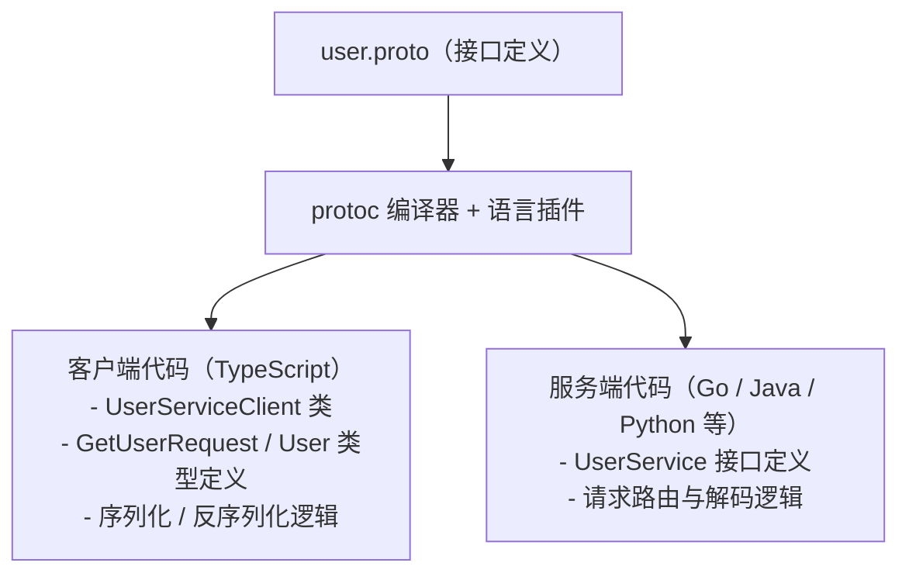
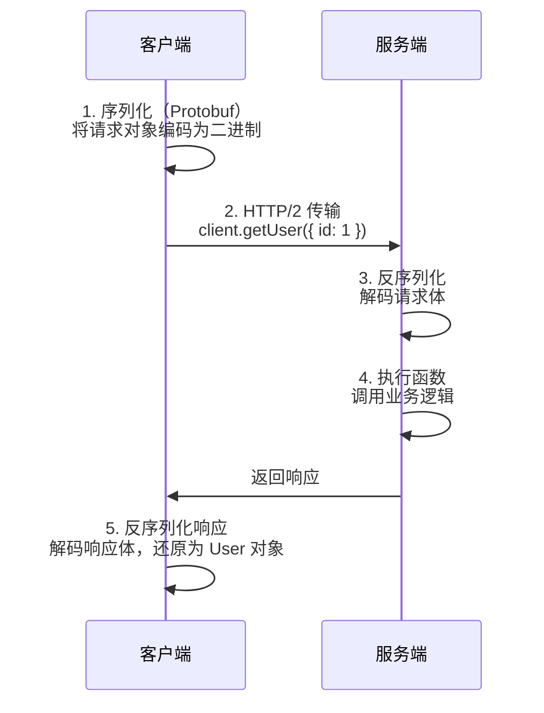
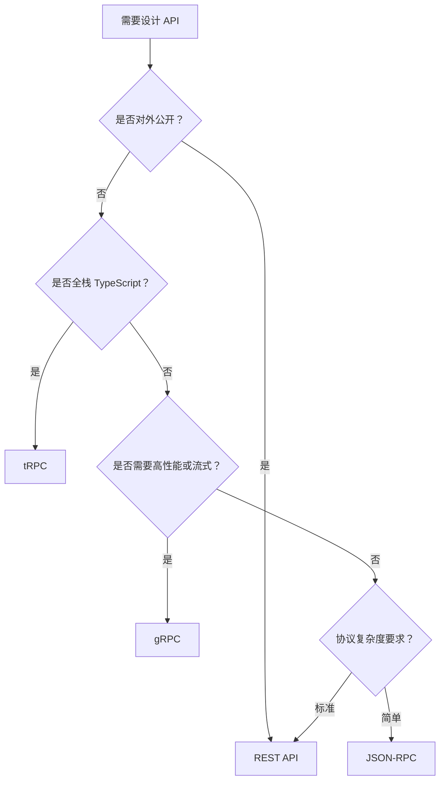

# RPC 与 HTTP 完全指南

## 1. 概述

### 1.1 为什么要了解 RPC

对前端和全栈开发者而言，HTTP/REST API 曾是与后端通信的默认选项。但随着架构演进，越来越多的场景让开发者不得不认识 RPC：

- **微服务架构的普及**：当一个系统由十几个甚至数十个服务组成时，服务之间的通信变得频繁且对性能敏感。gRPC 等 RPC 框架凭借二进制序列化和 HTTP/2 多路复用，在微服务间通信中比传统 REST 有显著的性能优势。

- **BFF（Backend for Frontend）层的需求**：在 BFF 模式下，前端团队往往自己维护一个聚合层，该层需要同时调用多个后端微服务。如果后端服务使用 gRPC，BFF 层就必须能消费 gRPC 接口。

- **类型安全的诉求**：全栈 TypeScript 项目中，开发者希望从数据库到前端 UI 保持完整的类型链路，避免手动维护接口类型定义。tRPC 等框架正是为此而生，它通过 RPC 风格的调用让服务端函数签名直接成为客户端的类型来源。

掌握 RPC 的核心概念，有助于在选型时做出有依据的判断，而不是盲目跟随潮流。

### 1.2 HTTP 与 RPC 的本质区别

两者的核心抽象不同：

- **HTTP/REST**：以「资源」为中心，通过 URL 定位资源，通过 HTTP 动词（GET / POST / PUT / DELETE）表达操作意图。例如获取用户：`GET /users/1`
- **RPC**：以「函数调用」为中心，客户端像调用本地函数一样调用远程服务。例如获取用户：`getUser(1)`

这一抽象差异带来了接口设计、数据传输、协议选择等一系列不同：

| 维度     | HTTP/REST          | RPC              |
| -------- | ------------------ | ---------------- |
| 核心抽象 | 资源（名词）       | 函数调用（动词） |
| 接口描述 | URL + HTTP 方法    | 函数签名         |
| 数据格式 | JSON（通常）       | Protobuf / JSON  |
| 传输协议 | HTTP/1.1 或 HTTP/2 | HTTP/2、TCP 等   |

REST 的资源抽象对外部调用者友好，URL 语义直观，无需额外工具即可理解和调用。RPC 的函数抽象则更贴近代码逻辑，适合内部服务之间紧密耦合的场景，配合代码生成工具可以大幅减少样板代码。

### 1.3 典型使用场景概览

本文涵盖四种主流方案：**REST** 是对外公开 API 的默认选择；**gRPC** 适用于高性能微服务内部通信；**tRPC** 为全栈 TypeScript 项目提供端到端类型安全；**JSON-RPC** 是轻量级跨系统集成的简便选项。

后续章节将分别深入讲解 HTTP 和 RPC 的设计哲学，并对 gRPC、tRPC、JSON-RPC 等主流实现进行详细介绍和横向对比。完整的选型场景矩阵见第 6 章。

## 2. HTTP 的设计哲学

### 2.1 HTTP 协议基础

HTTP 是一个基于请求-响应模型的应用层协议。理解 HTTP 方法语义、状态码和 Header，是设计良好 REST API 的前提。

**HTTP 方法语义**

| 方法   | 语义     | 幂等性 | 安全性 |
| ------ | -------- | ------ | ------ |
| GET    | 读取资源 | ✅     | ✅     |
| POST   | 创建资源 | ❌     | ❌     |
| PUT    | 全量更新 | ✅     | ❌     |
| PATCH  | 部分更新 | ❌     | ❌     |
| DELETE | 删除资源 | ✅     | ❌     |

> **说明**：「安全性」指该操作不会修改服务器状态；「幂等性」指多次执行与一次执行的结果相同。

**常用状态码分类**

| 分类 | 范围    | 含义       | 典型示例                                           |
| ---- | ------- | ---------- | -------------------------------------------------- |
| 2xx  | 200-299 | 请求成功   | 200 OK、201 Created、204 No Content                |
| 3xx  | 300-399 | 重定向     | 301 Moved Permanently、304 Not Modified            |
| 4xx  | 400-499 | 客户端错误 | 400 Bad Request、401 Unauthorized、404 Not Found   |
| 5xx  | 500-599 | 服务端错误 | 500 Internal Server Error、503 Service Unavailable |

**常用 Header**

| Header        | 方向        | 作用                                   |
| ------------- | ----------- | -------------------------------------- |
| Content-Type  | 请求 / 响应 | 声明请求体或响应体的媒体类型           |
| Accept        | 请求        | 告知服务器客户端期望的响应格式         |
| Authorization | 请求        | 携带认证凭据（Bearer Token、Basic 等） |
| Cache-Control | 请求 / 响应 | 控制缓存行为                           |
| ETag          | 响应        | 资源版本标识，配合条件请求使用         |
| X-Request-ID  | 请求        | 分布式追踪用的请求唯一标识             |

### 2.2 REST 六大约束

REST（Representational State Transfer）由 Roy Fielding 在 2000 年博士论文中提出，定义了六大架构约束：

1. **客户端-服务器（Client-Server）**：客户端和服务器关注点分离，客户端负责用户界面，服务器负责数据存储和业务逻辑，两者通过统一接口通信，可以独立演进。

2. **无状态（Stateless）**：每个请求必须包含服务器处理该请求所需的全部信息，服务器不保存客户端的会话状态。这一约束提升了可扩展性，任意服务器实例都能处理任意请求。

3. **可缓存（Cacheable）**：响应必须声明自身是否可缓存。可缓存的响应允许客户端或中间代理复用，减少服务器压力和网络延迟。

4. **统一接口（Uniform Interface）**：这是 REST 的核心约束，包含四个子约束：资源标识（URI）、通过表述操作资源（JSON/XML）、自描述消息（Content-Type）、超媒体驱动（HATEOAS）。

5. **分层系统（Layered System）**：客户端无法感知自己是直接连接到终端服务器还是连接到中间层（负载均衡、缓存、安全网关等），中间层对客户端透明。

6. **按需代码（Code on Demand，可选）**：服务器可以向客户端传输可执行代码（如 JavaScript），扩展客户端功能。这是唯一的可选约束。

### 2.3 REST API 设计规范

REST API 设计的核心原则是**资源导向**：URL 表示资源（名词），HTTP 方法表示操作（动词）。

**好坏实践对比**

```typescript
// ✅ RESTful 风格：资源导向，使用名词
app.get('/users/:id', async (req, res) => {
  const user = await UserService.findById(req.params.id)
  res.json(user)
})

app.post('/users', async (req, res) => {
  // 使用 201 Created 表示资源创建成功
  const user = await UserService.create(req.body)
  res.status(201).json(user)
})

app.patch('/users/:id', async (req, res) => {
  // PATCH 用于部分更新，只传入需要修改的字段
  const user = await UserService.update(req.params.id, req.body)
  res.json(user)
})

// ❌ RPC 风格混入 REST：使用动词，不符合资源语义
app.post('/getUser', ...)
app.post('/createUser', ...)
app.post('/updateUserName', ...)
```

**URL 设计规范**

| 规则           | 正确示例                      | 错误示例                          |
| -------------- | ----------------------------- | --------------------------------- |
| 使用名词复数   | `/users`、`/orders`           | `/user`、`/getOrders`             |
| 层级表达从属   | `/users/:id/orders`           | `/getUserOrders?userId=1`         |
| 避免动词       | `DELETE /users/:id`           | `POST /deleteUser`                |
| 使用连字符     | `/user-profiles`              | `/user_profiles`、`/userProfiles` |
| 过滤用查询参数 | `/users?status=active&page=2` | `/getActiveUsers/page/2`          |
| 版本号在路径中 | `/v1/users`                   | `/users?version=1`                |

### 2.4 REST 的局限性

REST 并非万能，在实际工程中暴露出以下痛点：

- **过度获取（Over-fetching）和获取不足（Under-fetching）**：REST 以资源为粒度，客户端往往拿到比实际需要更多的字段（over-fetching），或者需要多次请求才能组装完整数据（under-fetching）。例如，页面只需要用户名和头像，但 `GET /users/:id` 返回了所有字段；而展示用户及其订单则需要先请求 `/users/:id`，再请求 `/users/:id/orders`。

- **接口版本管理复杂**：随着业务演进，API 不可避免地需要变更。REST 通常通过 URL 版本号（`/v1`、`/v2`）来管理，但多版本并存会带来维护负担，旧版本何时下线也是持续的运营成本。

- **缺乏类型约束，前后端接口漂移**：REST 没有强制的接口契约，前后端通常依赖手写文档或 OpenAPI/Swagger 规范来对齐。文档与实现容易产生偏差，导致运行时出现字段缺失、类型不匹配等问题。

- **HTTP/1.1 队头阻塞（Head-of-Line Blocking）问题**：HTTP/1.1 在单个 TCP 连接上请求必须串行处理，一个慢请求会阻塞后续请求。虽然浏览器通过建立多个连接来缓解，但根本问题依然存在。HTTP/2 的多路复用解决了这一问题，但基于 HTTP/1.1 的历史遗留 REST 服务仍受影响。

## 3. RPC 的设计哲学

### 3.1 什么是 RPC

RPC（Remote Procedure Call，远程过程调用）的核心理念是：让远程调用像本地函数调用一样自然。开发者无需关心底层的网络传输细节，只需像调用本地函数一样调用远程服务提供的函数。

```typescript
// 本地调用
const localUser = userService.getUser(1)

// RPC 调用（感觉和本地一样）
const rpcUser = await client.getUser({ id: 1 })

// REST 调用（需要手动拼 URL、处理响应）
const res = await fetch('/users/1')
const restUser = await res.json()
```

从代码形式上看，RPC 调用与本地调用几乎一致，唯一的区别是需要 `await` 异步等待网络 IO。而 REST 调用则要求开发者手动拼接 URL、发起请求、解析响应，模型更偏向「网络请求」而非「函数调用」。

### 3.2 接口定义语言（IDL）

IDL（Interface Definition Language，接口定义语言）是 RPC 体系的基石。它是一种与编程语言无关的规范语言，用于描述服务对外暴露的接口：有哪些函数、函数接收什么参数、返回什么类型。

gRPC 使用 Protocol Buffers（简称 Protobuf）作为 IDL，接口定义保存在 `.proto` 文件中：

```protobuf
// user.proto
syntax = "proto3";

service UserService {
  rpc GetUser (GetUserRequest) returns (User);
  rpc ListUsers (ListUsersRequest) returns (ListUsersResponse);
}

message GetUserRequest {
  int32 id = 1;
}

message User {
  int32 id = 1;
  string name = 2;
  string email = 3;
}
```

这份 `.proto` 文件是服务端与客户端之间的唯一契约。任何一方的变更都必须先修改这份文件，再重新生成代码，从根本上避免了接口漂移的问题。

### 3.3 类型安全与代码生成

IDL 的另一个关键价值是**代码生成**。基于 `.proto` 文件，工具链可以自动为多种编程语言生成客户端桩（stub）和服务端骨架（skeleton）代码，开发者无需手动编写任何类型定义或序列化逻辑。

代码生成的完整流程如下：



这一机制带来了三个核心优势：

- **消除手写类型**：类型定义由工具生成，不会因为人为疏忽而出现拼写错误或类型不一致。
- **跨语言互通**：客户端用 TypeScript，服务端用 Go，两者通过同一份 `.proto` 文件保证接口一致。
- **重构友好**：修改 `.proto` 文件后，编译器会在所有受影响的地方报错，而不是等到运行时才暴露问题。

### 3.4 RPC 的工作机制

一次 RPC 调用在底层经历了序列化、传输、反序列化、执行等多个步骤，但对开发者完全透明：



gRPC 默认使用 Protobuf 作为序列化格式，相比 JSON 体积更小、解析更快，这也是 gRPC 在微服务内部通信中性能优于传统 REST 的主要原因之一。HTTP/2 的多路复用特性则允许在单个连接上并发传输多个请求，消除了 HTTP/1.1 的队头阻塞问题。

## 4. 主流 RPC 实现

### 4.1 gRPC

gRPC 是 Google 于 2015 年开源的高性能 RPC 框架，以 Protocol Buffers（Protobuf）作为接口定义语言和序列化格式，以 HTTP/2 作为传输协议。它原生支持 10 余种编程语言，是目前微服务内部通信的事实标准之一。

**服务定义（.proto 文件）**

服务定义复用第 3.2 节的 `user.proto` 示例，此处不再重复。

**服务端实现（TypeScript）**

```typescript
// server.ts
import * as grpc from '@grpc/grpc-js'
import * as protoLoader from '@grpc/proto-loader'

// 加载 proto 定义
const packageDef = protoLoader.loadSync('user.proto')
const proto = grpc.loadPackageDefinition(packageDef) as any

// 实现服务
const server = new grpc.Server()
server.addService(proto.UserService.service, {
  getUser: (call: any, callback: any) => {
    // 处理请求并返回用户数据
    const user = { id: call.request.id, name: 'Alice', email: 'alice@example.com' }
    callback(null, user)
  }
})

// 启动服务器
server.bindAsync('0.0.0.0:50051', grpc.ServerCredentials.createInsecure(), () => {
  server.start()
})
```

**客户端调用（TypeScript）**

```typescript
// client.ts
import * as grpc from '@grpc/grpc-js'
import * as protoLoader from '@grpc/proto-loader'

// 加载 proto 定义，生成客户端桩
const packageDef = protoLoader.loadSync('user.proto')
const proto = grpc.loadPackageDefinition(packageDef) as any

// 创建客户端连接
const client = new proto.UserService(
  'localhost:50051',
  grpc.credentials.createInsecure()
)

// ✅ 调用远程方法，像调用本地函数一样自然
client.getUser({ id: 1 }, (error: any, user: any) => {
  if (error) {
    console.error('调用失败：', error.message)
    return
  }
  // user: { id: 1, name: 'Alice', email: 'alice@example.com' }
  console.log('获取用户成功：', user)
})
```

**gRPC 特性总结**

| 特性       | 说明                                                     | 备注                           |
| ---------- | -------------------------------------------------------- | ------------------------------ |
| 传输协议   | HTTP/2，支持多路复用、头部压缩                           | 消除 HTTP/1.1 队头阻塞         |
| 序列化格式 | Protobuf 二进制，体积小、解析快                          | 也支持 JSON 转码               |
| 流式调用   | 支持服务端流、客户端流、双向流三种模式                   | 适合实时数据推送场景           |
| 双向流     | 客户端和服务端均可随时发送消息                           | 基于 HTTP/2 stream 实现        |
| 拦截器     | 支持客户端和服务端拦截器，可用于认证、日志、重试等       | 类似 Express 中间件            |
| 负载均衡   | 支持客户端负载均衡和 DNS 轮询                            | 需配合服务发现（如 Consul）    |
| 多语言支持 | 官方支持 Go、Java、Python、TypeScript、C++ 等 10+ 种语言 | 同一 .proto 文件生成各语言代码 |
| 代码生成   | 通过 `protoc` 编译器自动生成客户端桩和服务端骨架         | 消除手写类型定义               |
| 错误处理   | 使用 gRPC 状态码（而非 HTTP 状态码），语义更精确         | 如 NOT_FOUND、UNAVAILABLE 等   |
| 浏览器支持 | 原生 gRPC 不支持浏览器，需通过 gRPC-Web 代理             | 前端项目需额外配置             |

### 4.2 tRPC

tRPC 是专为 TypeScript 生态设计的端到端类型安全 RPC 框架。它不依赖任何 IDL 或代码生成步骤——服务端的函数签名本身就是客户端的类型来源，TypeScript 的类型推导在编译阶段完成全部工作。

与 gRPC 相比，tRPC 无需维护 `.proto` 文件，也无需运行代码生成脚本。服务端修改函数签名后，客户端代码立即获得最新类型，IDE 自动补全和编译器报错会在开发阶段捕捉所有类型不匹配问题。这使得 tRPC 在全栈 TypeScript 单体仓库（monorepo）中具有极低的维护成本。

**服务端 Router 定义**

```typescript
// server/router.ts
import { initTRPC } from '@trpc/server'
import { z } from 'zod'

const t = initTRPC.create()

export const appRouter = t.router({
  // 查询：获取用户
  getUser: t.procedure
    .input(z.object({ id: z.number() }))
    .query(async ({ input }) => {
      // ✅ input 类型自动推导为 { id: number }
      return { id: input.id, name: 'Alice', email: 'alice@example.com' }
    }),
  // mutation：创建用户
  createUser: t.procedure
    .input(z.object({ name: z.string(), email: z.string().email() }))
    .mutation(async ({ input }) => {
      // ✅ Zod 在运行时校验 input，不合法的请求会被拦截
      return { id: 1, ...input }
    }),
})

// ✅ 导出 Router 类型，供客户端使用——无需手写任何类型定义
export type AppRouter = typeof appRouter
```

**客户端调用（带完整类型推导）**

```typescript
// client/index.ts
import { createTRPCClient, httpBatchLink } from '@trpc/client'
import type { AppRouter } from '../server/router'

const client = createTRPCClient<AppRouter>({
  links: [httpBatchLink({ url: 'http://localhost:3000/trpc' })]
})

// ✅ 完整类型推导，IDE 自动补全，无需手写类型
const user = await client.getUser.query({ id: 1 })
// user 的类型自动推导为 { id: number; name: string; email: string }

// ✅ 创建用户，参数类型由服务端 Zod schema 决定
const newUser = await client.createUser.mutate({
  name: 'Bob',
  email: 'bob@example.com',
})
// newUser 的类型自动推导为 { id: number; name: string; email: string }
```

**tRPC 特点说明**

| 特性             | 说明                                                                |
| ---------------- | ------------------------------------------------------------------- |
| 无代码生成       | 服务端类型直接流向客户端，无需 `.proto` 或任何代码生成步骤          |
| 端到端类型安全   | 服务端修改函数签名，客户端立即感知，编译阶段即可发现不兼容          |
| 运行时校验       | 使用 Zod schema 对输入进行运行时校验，兼顾静态类型和动态安全        |
| Next.js 深度集成 | 官方提供 `@trpc/next` 适配器，与 App Router / Pages Router 无缝集成 |
| Nuxt 集成        | 社区提供 `trpc-nuxt` 适配器，支持 Nuxt 3                            |
| 批量请求         | `httpBatchLink` 自动将同一时间帧内的多个查询合并为一个 HTTP 请求    |
| 订阅（实时推送） | 支持基于 WebSocket 的订阅，适合实时数据场景                         |
| 仅限 TypeScript  | 不支持跨语言调用，适合全栈 TypeScript 项目，不适合多语言微服务      |

### 4.3 JSON-RPC

JSON-RPC 是一种轻量级的远程过程调用协议，使用 JSON 作为数据格式。其规范极为简单——JSON-RPC 2.0 规范全文不足两页，任何编程语言都可以轻松实现。JSON-RPC 没有指定传输协议，可以运行在 HTTP、WebSocket、TCP 等任意传输层之上。

由于协议简单、无需代码生成、调试方便，JSON-RPC 常见于区块链节点 API（如以太坊的 `eth_getBalance`）、语言服务器协议（LSP）以及需要快速集成的轻量级跨系统场景。

**协议格式示例**

```typescript
// JSON-RPC 2.0 请求格式
const request = {
  jsonrpc: '2.0',
  method: 'getUser',
  params: { id: 1 },
  id: 1             // 用于关联请求与响应；通知（notification）不含 id 字段
}

// JSON-RPC 2.0 成功响应
const response = {
  jsonrpc: '2.0',
  result: { id: 1, name: 'Alice', email: 'alice@example.com' },
  id: 1
}

// JSON-RPC 2.0 错误响应
const errorResponse = {
  jsonrpc: '2.0',
  error: { code: -32601, message: 'Method not found' },
  id: 1
}
```

**Node.js 服务端实现示例**

```typescript
// server.ts
import http from 'http'

// 注册可供远程调用的方法
const methods: Record<string, (params: any) => any> = {
  getUser: (params: { id: number }) => {
    // 根据 id 返回用户数据
    return { id: params.id, name: 'Alice', email: 'alice@example.com' }
  },
  createUser: (params: { name: string; email: string }) => {
    // 创建新用户并返回
    return { id: 2, name: params.name, email: params.email }
  },
}

const server = http.createServer(async (req, res) => {
  if (req.method !== 'POST') {
    res.writeHead(405).end()
    return
  }

  // 读取请求体
  let body = ''
  for await (const chunk of req) body += chunk

  const { jsonrpc, method, params, id } = JSON.parse(body)

  // ✅ 校验协议版本
  if (jsonrpc !== '2.0') {
    res.writeHead(400).end(JSON.stringify({
      jsonrpc: '2.0',
      error: { code: -32600, message: 'Invalid Request' },
      id,
    }))
    return
  }

  // 查找并执行对应方法
  const handler = methods[method]
  if (!handler) {
    res.end(JSON.stringify({
      jsonrpc: '2.0',
      error: { code: -32601, message: 'Method not found' },
      id,
    }))
    return
  }

  const result = handler(params)
  res.end(JSON.stringify({ jsonrpc: '2.0', result, id }))
})

server.listen(3000, () => console.log('JSON-RPC 服务已启动：http://localhost:3000'))
```

**JSON-RPC 2.0 预定义错误码**

| 错误码          | 含义             | 说明                                         |
| --------------- | ---------------- | -------------------------------------------- |
| -32700          | Parse error      | 请求体不是合法 JSON，解析失败                |
| -32600          | Invalid Request  | 请求体不符合 JSON-RPC 规范（缺少必填字段等） |
| -32601          | Method not found | 请求的方法不存在或不可用                     |
| -32602          | Invalid params   | 方法参数不合法                               |
| -32603          | Internal error   | 服务端内部错误                               |
| -32000 ~ -32099 | Server error     | 服务端自定义错误，由实现方自行定义语义       |

## 5. 深度对比

### 5.1 性能对比

各方案的性能差异主要来源于三个层面：序列化格式、传输协议和连接复用机制。

| 维度       | REST/HTTP    | gRPC               | tRPC               | JSON-RPC   |
| ---------- | ------------ | ------------------ | ------------------ | ---------- |
| 序列化格式 | JSON（文本） | Protobuf（二进制） | JSON               | JSON       |
| 传输协议   | HTTP/1.1     | HTTP/2             | HTTP/1.1 或 HTTP/2 | HTTP       |
| 连接复用   | Keep-Alive   | 多路复用           | 取决于传输层       | 取决于实现 |
| 性能评级   | 中           | 高                 | 中                 | 中         |
| 流式支持   | 部分（SSE）  | ✅ 原生支持        | ❌                 | ❌         |

**序列化格式的影响**：gRPC 使用 Protobuf 二进制编码，相比 JSON 文本格式，序列化后的数据体积通常小 3–10 倍，同时解析速度也更快，因为二进制格式无需词法分析和字符串解码。REST、tRPC 和 JSON-RPC 均依赖 JSON 文本序列化，在数据量较大时序列化开销更为明显。

**传输协议的影响**：gRPC 强制使用 HTTP/2，其多路复用特性允许在单个 TCP 连接上并发传输多个请求-响应流，彻底消除了 HTTP/1.1 的队头阻塞（Head-of-Line Blocking）问题。REST 和 JSON-RPC 默认基于 HTTP/1.1，同一连接上的请求必须串行处理；tRPC 的传输协议取决于所使用的适配器，部分场景下可借助 HTTP/2 提升并发性能。

### 5.2 类型安全对比

类型安全是各方案差异最显著的维度之一，直接影响开发效率和运行时可靠性。

| 方案     | 类型安全        | 实现方式            | 前后端同步 | 运行时校验 |
| -------- | --------------- | ------------------- | ---------- | ---------- |
| REST     | ❌ 无原生支持   | 手写类型 / OpenAPI  | 需额外工具 | 无         |
| gRPC     | ✅ 强类型       | `.proto` 代码生成   | 自动同步   | 有         |
| tRPC     | ✅ 极致类型安全 | TypeScript 类型推导 | 自动同步   | Zod 校验   |
| JSON-RPC | ❌ 无原生支持   | 手写类型            | 需额外工具 | 无         |

**gRPC 的类型安全**：通过 IDL（`.proto` 文件）定义接口契约，`protoc` 编译器为客户端和服务端分别生成强类型代码。类型一致性由工具链在编译阶段强制保证，任何不兼容的变更都会导致代码生成失败或编译报错。其优势在于支持多种编程语言，跨语言的类型同步同样由工具链负责。

**tRPC 的类型安全**：完全依托 TypeScript 的类型系统，服务端路由的函数签名直接成为客户端的类型来源，无需任何中间步骤。服务端修改函数返回值或参数类型后，客户端代码在下一次编译时立即感知，IDE 也会实时给出错误提示。tRPC 还结合 Zod schema 在运行时对输入进行校验，兼顾了静态类型和动态安全。两者的根本区别在于：gRPC 的类型安全依赖外部 IDL 和代码生成工具链，而 tRPC 的类型安全完全内嵌在 TypeScript 语言本身。

### 5.3 学习曲线与生态

| 方案     | 学习曲线 | 前置知识          | 生态成熟度     | 主要使用场景    |
| -------- | -------- | ----------------- | -------------- | --------------- |
| REST     | 低       | HTTP 基础         | 极高           | 通用 API        |
| gRPC     | 高       | Protobuf、HTTP/2  | 高             | 微服务、多语言  |
| tRPC     | 中       | TypeScript、React | 中（快速增长） | 全栈 TypeScript |
| JSON-RPC | 低       | HTTP、JSON        | 中             | 简单集成        |

**REST**：学习成本最低，只需掌握 HTTP 基础知识即可上手。生态极为成熟，各语言框架均有完善的支持，文档、工具链、社区资源丰富，是大多数开发者最熟悉的接口风格。

**gRPC**：学习曲线较陡，需要掌握 Protobuf IDL 语法、`protoc` 编译工具链以及 HTTP/2 的相关概念。此外，构建流程中需要集成代码生成步骤，本地开发环境配置相对复杂。但其生态已相当成熟，在云原生和微服务领域有大量生产落地经验。

**tRPC**：对于熟悉 TypeScript 的开发者，上手门槛适中。核心概念（router、procedure、query/mutation）较少，与 Next.js 等框架的集成文档完善。生态仍在快速成长，社区活跃，但相较于 REST 和 gRPC，周边工具链尚不如前两者完善。

**JSON-RPC**：协议规范简单，实现门槛极低，任何熟悉 HTTP 和 JSON 的开发者都能快速实现一个可用的 JSON-RPC 服务。但缺乏官方推荐的框架和工具链，生产级实现需要自行处理更多细节。

### 5.4 综合对比总表

以下总表汇总了四种方案在所有关键维度上的差异，可作为选型时的快速参考：

| 维度           | REST            | gRPC               | tRPC              | JSON-RPC        |
| -------------- | --------------- | ------------------ | ----------------- | --------------- |
| 协议基础       | HTTP 语义       | HTTP/2 + Protobuf  | HTTP + TypeScript | HTTP/TCP + JSON |
| 序列化         | JSON            | Protobuf（二进制） | JSON              | JSON            |
| 传输协议       | HTTP/1.1+       | HTTP/2             | HTTP              | HTTP/TCP        |
| 类型安全       | ❌              | ✅（IDL）          | ✅（TS 推导）     | ❌              |
| 代码生成       | 可选（OpenAPI） | ✅ 必须            | ❌ 不需要         | 可选            |
| 流式支持       | 部分            | ✅                 | ❌                | ❌              |
| 跨语言         | ✅              | ✅                 | ❌（仅 TS）       | ✅              |
| 浏览器直接支持 | ✅              | 需 grpc-web        | ✅                | ✅              |
| 学习成本       | 低              | 高                 | 中                | 低              |
| 推荐场景       | 公开 API        | 微服务内部         | 全栈 TS           | 简单集成        |

从综合对比可以看出，四种方案各有侧重，并不存在绝对的优劣之分。gRPC 在性能和类型安全上最为突出，但浏览器兼容性和学习成本是其主要短板；tRPC 在全栈 TypeScript 场景下提供了最流畅的开发体验，但仅限于 TypeScript 生态；REST 以其通用性和成熟生态仍是公开 API 的首选；JSON-RPC 凭借极简的协议规范，在需要快速集成的轻量级场景中有一席之地。

## 6. 选型指南

### 6.1 场景矩阵

| 场景                     | 推荐方案             | 理由                         |
| ------------------------ | -------------------- | ---------------------------- |
| 对外公开 API             | REST                 | 通用性强，任意客户端消费     |
| 微服务内部通信           | gRPC                 | 高性能，强类型，流式支持     |
| 全栈 TypeScript 单体     | tRPC                 | 端到端类型安全，无需代码生成 |
| 前后端分离（TypeScript） | tRPC 或 REST+OpenAPI | 根据团队规模决定             |
| 异构语言微服务           | gRPC                 | 跨语言代码生成               |
| 简单集成/脚本            | JSON-RPC             | 协议简单，易实现             |
| 移动端 API               | REST 或 gRPC         | REST 易调试，gRPC 省流量     |

**对外公开 API**：REST 是对外接口的不二选择。任意客户端（浏览器、移动端、第三方服务）均可直接消费，不依赖特定 SDK 或语言绑定。配合 OpenAPI/Swagger 规范，可以生成文档、测试工具和多语言客户端代码，生态最为成熟。

**微服务内部通信**：当服务之间的通信频繁且对延迟敏感时，gRPC 是首选。Protobuf 二进制序列化体积小、解析快；HTTP/2 多路复用消除队头阻塞；流式调用支持实时数据推送；强类型 IDL 在多服务协作中防止接口漂移。

**全栈 TypeScript 单体**：前后端共享同一代码仓库时，tRPC 提供最流畅的开发体验。服务端函数签名直接成为客户端类型，无需维护 `.proto` 文件或运行代码生成，修改接口后 IDE 即时报错，重构成本极低。

**前后端分离（TypeScript）**：这一场景需要根据实际情况权衡：

- **选 tRPC**：前后端在同一 monorepo 中、团队规模较小（< 10 人）、且不需要对外暴露 API 时，tRPC 的零配置类型安全优势明显。
- **选 REST+OpenAPI**：团队规模较大、前后端仓库分离、需要对外暴露 API、或未来有多语言客户端需求时，REST+OpenAPI 的通用性和工具链成熟度更有价值。tRPC 强绑定 TypeScript 生态，一旦需要接入非 TypeScript 客户端，迁移成本较高。

**异构语言微服务**：当各服务使用不同编程语言时，gRPC 是唯一能提供跨语言类型安全的选项。同一份 `.proto` 文件可以为 Go、Java、Python、TypeScript 等 10 余种语言生成客户端桩，接口契约由工具链强制维护。

**简单集成/脚本**：在需要快速对接第三方系统、编写自动化脚本或构建轻量工具时，JSON-RPC 的极简协议（规范不足两页）意味着极低的接入门槛，无需引入任何框架即可手动实现客户端。

**移动端 API**：REST 对调试友好（Postman、浏览器均可直接使用），生态工具丰富，适合大多数移动端场景。若应用对流量消耗极为敏感（如弱网环境、高频实时数据），gRPC 的 Protobuf 二进制格式在相同数据量下可节省 3–10 倍的传输体积，但需通过 gRPC-Web 代理解决浏览器兼容问题。

### 6.2 决策流程图



这棵决策树覆盖了最常见的选型路径，使用时有以下几点注意事项：

**第一个问题最关键**：是否对外公开决定了通用性要求。对外 API 必须保证任意客户端可消费，REST 是唯一满足条件的选项；内部 API 则有更多自由度，可以根据技术栈和性能需求选择。

**"全栈 TypeScript"的边界**：这里指前后端共用 TypeScript 且在同一 monorepo 中，能够共享类型定义。如果前后端仓库分离，即便都用 TypeScript，也建议走"否"分支，考虑 REST+OpenAPI 的方案。

**高性能或流式的判断**：需要服务端推送（如实时价格、日志流）、双向通信，或服务间调用 QPS 超过数千时，选择 gRPC。一般的 CRUD 服务通常不需要 gRPC 的性能开销和运维复杂度。

**边界情况与组合使用**：实际项目中各方案可以共存。典型模式是：对外公开接口使用 REST，内部微服务间使用 gRPC，全栈 TypeScript 的 BFF 层使用 tRPC 聚合多个 gRPC 服务后暴露给前端。选型不是非此即彼，而是在架构的不同层次为不同需求选择最合适的工具。

## 7. 总结

本文从 HTTP 的设计哲学出发，逐一介绍了 gRPC、tRPC、JSON-RPC 的核心原理，并通过横向对比与选型决策框架，帮助读者在不同场景下做出有依据的技术选择。REST、gRPC、tRPC、JSON-RPC 各有适用场景，没有绝对最优解——关键是理解各方案在协议、序列化、类型安全、工具链、运维成本等维度上的取舍，根据项目的实际需求和团队约束做出正确选择。

### 速查表

| 技术     | 协议      | 序列化   | 类型安全      | 代码生成 | 流式 | 适用场景        |
| -------- | --------- | -------- | ------------- | -------- | ---- | --------------- |
| REST     | HTTP/1.1+ | JSON     | ❌ 无原生     | 可选     | 部分 | 公开 API        |
| gRPC     | HTTP/2    | Protobuf | ✅ 强（IDL）  | ✅ 必须  | ✅   | 微服务内部      |
| tRPC     | HTTP      | JSON     | ✅ 极致（TS） | ❌ 不需  | ❌   | 全栈 TypeScript |
| JSON-RPC | HTTP/TCP  | JSON     | ❌ 无原生     | 可选     | ❌   | 简单集成        |

### 常见选型问题

**Q1: 已有 REST API，需要引入 gRPC 吗？**

答：如果现有 REST API 满足需求，不需要引入 gRPC。gRPC 适合新建高性能微服务，而非改造已有系统。

**Q2: tRPC 和 gRPC 都强调类型安全，应该选哪个？**

答：核心区别是语言范围。tRPC 仅支持 TypeScript，适合纯 TS 全栈项目；gRPC 支持多语言，适合异构系统。

**Q3: 小型项目用什么方案最简单？**

答：小型项目推荐从 REST 开始。如果是全栈 TypeScript 项目，tRPC 学习成本低且类型安全，也是很好的选择。

## 参考资源

**官方文档**

- [gRPC 官方文档](https://grpc.io/docs/)
- [tRPC 官方文档](https://trpc.io/docs)
- [JSON-RPC 2.0 规范](https://www.jsonrpc.org/specification)

**相关论文与规范**

- Roy Fielding 的 REST 论文（Architectural Styles and the Design of Network-based Software Architectures）
- [HTTP/2 RFC 9113](https://httpwg.org/specs/rfc9113.html)
- [Protocol Buffers 文档](https://protobuf.dev/)

**工具与库**

- [@grpc/grpc-js](https://www.npmjs.com/package/@grpc/grpc-js) — Node.js gRPC 库
- [@grpc/proto-loader](https://www.npmjs.com/package/@grpc/proto-loader) — Proto 文件加载器
- [Zod](https://zod.dev/) — TypeScript 运行时校验库（tRPC 配合使用）
