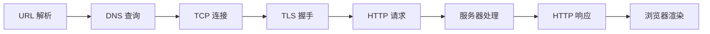
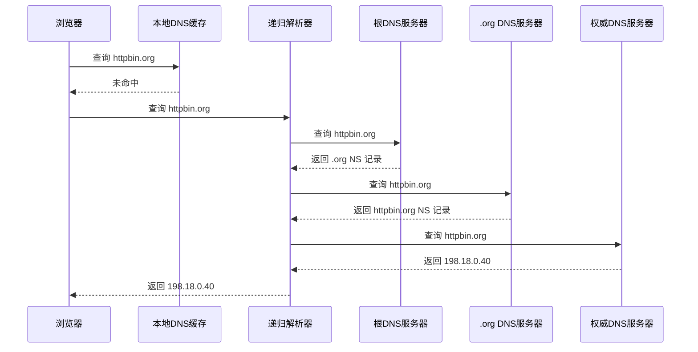
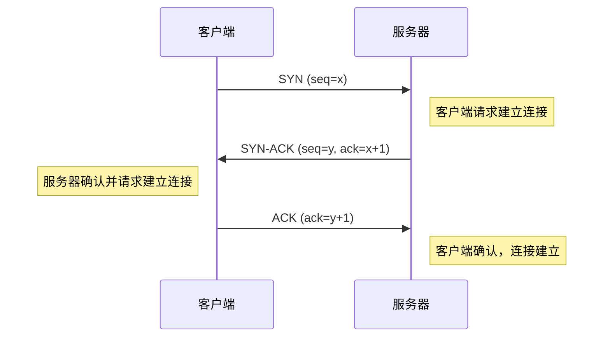
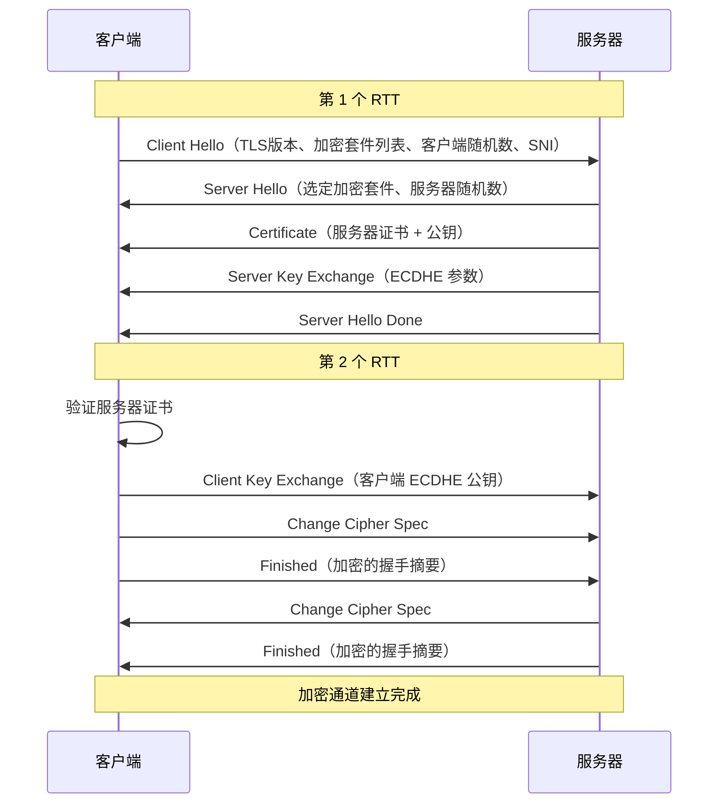
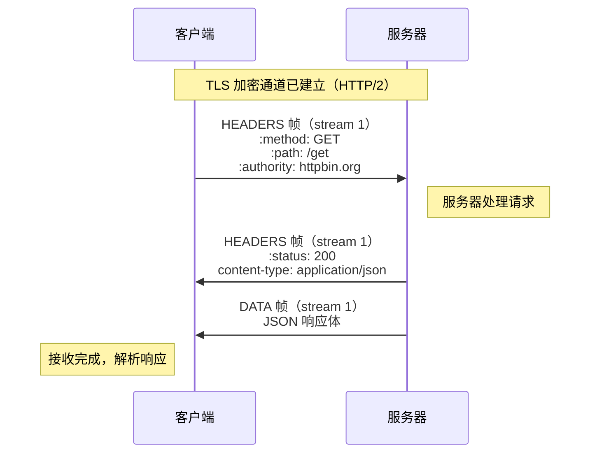

# 从输入 URL 到页面渲染完全指南

当你在浏览器地址栏输入一个 URL 并按下回车，背后会经历 URL 解析、DNS 查询、TCP 连接、TLS 握手、HTTP 请求与响应、服务器处理以及浏览器渲染等一系列步骤，最终将页面呈现在你眼前。

## 1. 概述

### 1.1 全局流程

从输入 URL 到页面渲染完成，整个过程可以用下面的流程图概括：



| 阶段       | 核心任务                         | 关键协议/技术    |
| ---------- | -------------------------------- | ---------------- |
| URL 解析   | 拆解协议、主机名、路径等信息     | URL 规范         |
| DNS 查询   | 将域名解析为 IP 地址             | DNS              |
| TCP 连接   | 建立可靠的传输通道               | TCP 三次握手     |
| TLS 握手   | 建立加密安全通道                 | TLS 1.2 / 1.3    |
| HTTP 请求  | 发送请求报文                     | HTTP/1.1、HTTP/2 |
| 服务器处理 | 路由、业务逻辑、数据库查询等     | 后端框架         |
| HTTP 响应  | 返回状态码、响应头和响应体       | HTTP             |
| 浏览器渲染 | 解析 HTML/CSS/JS，构建渲染树绘制 | 浏览器引擎       |

### 1.2 用 curl -v 观测全过程

`curl -v` 是观测网络请求全过程的利器。一条命令就能看到 DNS 解析、TCP 连接、TLS 握手、HTTP 请求与响应的完整细节：

```bash
curl -v https://httpbin.org/get
```

> **提示**：`-v`（verbose）标志会输出连接过程中每个阶段的详细信息，是理解网络请求流程最直观的方式。

完整输出如下，后续章节会逐段拆解分析：

```text
* Host httpbin.org:443 was resolved.
* IPv6: (none)
* IPv4: 198.18.0.40
*   Trying 198.18.0.40:443...
* Connected to httpbin.org (198.18.0.40) port 443
* ALPN: curl offers h2,http/1.1
* (304) (OUT), TLS handshake, Client hello (1):
*  CAfile: /etc/ssl/cert.pem
*  CApath: none
* (304) (IN), TLS handshake, Server hello (2):
* TLSv1.2 (IN), TLS handshake, Certificate (11):
* TLSv1.2 (IN), TLS handshake, Server key exchange (12):
* TLSv1.2 (IN), TLS handshake, Server finished (14):
* TLSv1.2 (OUT), TLS handshake, Client key exchange (16):
* TLSv1.2 (OUT), TLS change cipher, Change cipher spec (1):
* TLSv1.2 (OUT), TLS handshake, Finished (20):
* TLSv1.2 (IN), TLS change cipher, Change cipher spec (1):
* TLSv1.2 (IN), TLS handshake, Finished (20):
* SSL connection using TLSv1.2 / ECDHE-RSA-AES128-GCM-SHA256 / [blank] / UNDEF
* ALPN: server accepted h2
* Server certificate:
*  subject: CN=httpbin.org
*  start date: Jul 20 00:00:00 2025 GMT
*  expire date: Aug 17 23:59:59 2026 GMT
*  subjectAltName: host "httpbin.org" matched cert's "httpbin.org"
*  issuer: C=US; O=Amazon; CN=Amazon RSA 2048 M03
*  SSL certificate verify ok.
* using HTTP/2
* [HTTP/2] [1] OPENED stream for https://httpbin.org/get
* [HTTP/2] [1] [:method: GET]
* [HTTP/2] [1] [:scheme: https]
* [HTTP/2] [1] [:authority: httpbin.org]
* [HTTP/2] [1] [:path: /get]
* [HTTP/2] [1] [user-agent: curl/8.7.1]
* [HTTP/2] [1] [accept: */*]
> GET /get HTTP/2
> Host: httpbin.org
> User-Agent: curl/8.7.1
> Accept: */*
>
* Request completely sent off
< HTTP/2 200
< date: Sun, 01 Mar 2026 14:54:46 GMT
< content-type: application/json
< content-length: 256
< server: gunicorn/19.9.0
< access-control-allow-origin: *
< access-control-allow-credentials: true
<
{
  "args": {},
  "headers": {
    "Accept": "*/*",
    "Host": "httpbin.org",
    "User-Agent": "curl/8.7.1",
    "X-Amzn-Trace-Id": "Root=1-69a45336-01c9a5360d78dba746e05f2d"
  },
  "origin": "140.235.140.187",
  "url": "https://httpbin.org/get"
}
* Connection #0 to host httpbin.org left intact
```

在这段输出中，可以清晰地看到各阶段的对应关系：

| curl 输出标志             | 对应阶段       |
| ------------------------- | -------------- |
| `Host ... was resolved`   | DNS 查询       |
| `Trying ... Connected to` | TCP 连接       |
| `TLS handshake` 相关行    | TLS 握手       |
| `>` 开头的行              | HTTP 请求      |
| `<` 开头的行              | HTTP 响应      |
| JSON 响应体               | 服务器处理结果 |

## 2. URL 解析

### 2.1 URL 的组成部分

以 `https://httpbin.org/get` 为例，一个完整的 URL 可以拆解为以下几个组成部分：

| 组成部分 | 值            | 说明                                                               |
| -------- | ------------- | ------------------------------------------------------------------ |
| 协议     | `https`       | 指定使用的应用层协议，`https` 表示通过 TLS 加密的 HTTP 通信        |
| 域名     | `httpbin.org` | 目标服务器的主机名，后续需要通过 DNS 解析为 IP 地址                |
| 端口     | `443`（隐含） | HTTPS 默认端口为 443，HTTP 默认为 80，省略时使用协议对应的默认端口 |
| 路径     | `/get`        | 服务器上的资源路径，告诉服务器客户端请求的是哪个资源               |

> **面试提示**：完整的 URL 还可以包含查询参数（`?key=value`）、片段标识符（`#section`）等部分。面试时能完整说出 URL 的各组成部分，说明你对 HTTP 协议有扎实的理解。

### 2.2 浏览器的判断逻辑

当用户在地址栏输入内容并按下回车时，浏览器首先需要判断输入的是一个 URL 还是搜索关键词。判断逻辑大致如下：

1. **包含协议前缀**：如果输入以 `http://` 或 `https://` 开头，直接当作 URL 处理
2. **包含域名特征**：如果输入包含 `.`（如 `httpbin.org`），浏览器倾向于将其视为域名
3. **特殊字符判断**：包含 `://`、`/`、`:` 等 URL 特征字符时，优先作为 URL 处理
4. **其他情况**：将输入内容发送给默认搜索引擎进行搜索

> **面试提示**：这个判断逻辑看似简单，但它解释了为什么输入 `localhost` 会访问本地服务器，而输入一个普通单词会触发搜索。

### 2.3 HSTS 检查

在确定输入是 URL 之后，如果用户输入的是 `http://` 协议，浏览器会检查该域名是否在 **HSTS（HTTP Strict Transport Security）** 列表中。如果是，浏览器会在发出请求之前将 `http://` 强制替换为 `https://`。

HSTS 有两种生效方式：

- **响应头声明**：服务器通过 `Strict-Transport-Security` 响应头告知浏览器在指定时间内只使用 HTTPS 访问该域名。浏览器会将此信息缓存在本地
- **Preload List**：由浏览器厂商维护的内置列表，包含申请加入的域名。即使用户从未访问过该网站，浏览器也会强制使用 HTTPS

> **面试提示**：HSTS 的核心价值在于防止 **SSL 剥离攻击**（SSL Stripping）——攻击者在中间将 HTTPS 降级为 HTTP，从而窃取明文数据。Preload List 则解决了"首次访问"的安全盲区。

## 3. DNS 解析

### 3.1 curl 中的 DNS

回顾 `curl -v` 输出的第一段，可以看到 DNS 解析的结果：

```text
* Host httpbin.org:443 was resolved.
* IPv6: (none)
* IPv4: 198.18.0.40
```

这三行告诉我们：浏览器（或 curl）将域名 `httpbin.org` 解析为了 IP 地址 `198.18.0.40`，没有获取到 IPv6 地址。这个看似简单的结果，背后经历了一套完整的 DNS 查询流程。

### 3.2 DNS 查询流程

DNS 查询采用分层缓存和递归查询机制，完整流程如下：

**缓存层级**（按查询顺序）：

1. **浏览器 DNS 缓存**：浏览器自身维护的缓存，TTL 通常较短（Chrome 默认 60 秒）
2. **操作系统 DNS 缓存**：OS 级别的缓存，如 macOS 的 `mDNSResponder`、Linux 的 `systemd-resolved`
3. **路由器 DNS 缓存**：家用路由器通常会缓存 DNS 记录
4. **ISP DNS 服务器**：互联网服务提供商的 DNS 服务器
5. **递归查询**：如果以上缓存全部未命中，DNS 递归解析器会从根域开始逐级查询

当所有缓存未命中时，递归解析器会执行以下查询过程：



> **面试提示**：面试官常问"DNS 用的是 TCP 还是 UDP？"答案是 **默认使用 UDP**（端口 53），因为 DNS 查询报文通常很小，UDP 的无连接特性更高效。但当响应数据超过 512 字节（如区域传输）时会切换到 TCP。

### 3.3 DNS 优化

在实际开发中，有多种 DNS 优化手段可以提升页面加载速度：

- **DNS over HTTPS（DoH）**：将 DNS 查询通过 HTTPS 加密传输，防止 DNS 劫持和窃听。主流浏览器（Chrome、Firefox）已默认支持
- **dns-prefetch**：通过 HTML 标签提前解析第三方域名的 DNS，减少后续请求的延迟：

```html
<link rel="dns-prefetch" href="//cdn.example.com" />
<link rel="dns-prefetch" href="//api.example.com" />
```

- **preconnect**：比 `dns-prefetch` 更进一步，提前完成 DNS + TCP + TLS 的全部连接步骤：

```html
<link rel="preconnect" href="https://cdn.example.com" />
```

> **面试提示**：`dns-prefetch` 和 `preconnect` 是前端性能优化的常见考点。关键区别是 `dns-prefetch` 只做 DNS 解析，而 `preconnect` 会建立完整连接。对于关键资源用 `preconnect`，对于可能用到的资源用 `dns-prefetch`。

## 4. TCP 连接

### 4.1 curl 中的 TCP

DNS 解析拿到 IP 地址后，下一步就是建立 TCP 连接。`curl -v` 输出中对应的部分：

```text
*   Trying 198.18.0.40:443...
* Connected to httpbin.org (198.18.0.40) port 443
```

`Trying` 表示正在向目标 IP 的 443 端口发起 TCP 连接，`Connected` 表示三次握手已经成功完成，连接建立。

### 4.2 三次握手

TCP 使用三次握手（Three-Way Handshake）来建立可靠连接。这个过程确保通信双方都具备发送和接收数据的能力：



三次握手各步骤详解：

1. **SYN（同步）**：客户端发送 SYN 报文，携带一个随机初始序列号 `x`，表示请求建立连接。客户端进入 `SYN_SENT` 状态
2. **SYN-ACK（同步确认）**：服务器收到 SYN 后，回复 SYN-ACK 报文，携带自己的随机初始序列号 `y`，并将确认号设为 `x+1`。服务器进入 `SYN_RCVD` 状态
3. **ACK（确认）**：客户端收到 SYN-ACK 后，发送 ACK 报文，确认号为 `y+1`。双方进入 `ESTABLISHED` 状态，连接建立完成

### 4.3 为什么是三次握手

面试中经常会问："为什么 TCP 需要三次握手，两次不行吗？"

核心原因是**防止历史连接请求导致资源浪费**。考虑以下场景：

1. 客户端发送了一个 SYN 请求（第一次），但由于网络延迟，这个包在网络中滞留了
2. 客户端超时后重新发送了新的 SYN 并成功建立连接、完成通信、关闭连接
3. 此时那个滞留的旧 SYN 到达了服务器

如果只有两次握手，服务器收到旧 SYN 后会直接建立连接并分配资源，但客户端不会响应这个连接，导致服务器资源被白白占用。

有了三次握手，服务器回复 SYN-ACK 后需要等待客户端的 ACK 确认。客户端收到这个 SYN-ACK 后，发现不是自己发起的连接请求，会回复 RST（重置）报文，服务器随即释放资源。

> **面试提示**：三次握手的本质是**确认双方的发送和接收能力**。第一次握手确认客户端能发送，第二次确认服务器能接收和发送，第三次确认客户端能接收。这是建立可靠双向通信的最小次数。

## 5. TLS 握手

### 5.1 curl 中的 TLS 握手

TCP 连接建立后，由于我们访问的是 `https://` 协议，客户端和服务器需要通过 TLS 握手建立加密通道。`curl -v` 输出中 TLS 握手的完整过程如下：

```text
* ALPN: curl offers h2,http/1.1
* (304) (OUT), TLS handshake, Client hello (1):
*  CAfile: /etc/ssl/cert.pem
*  CApath: none
* (304) (IN), TLS handshake, Server hello (2):
* TLSv1.2 (IN), TLS handshake, Certificate (11):
* TLSv1.2 (IN), TLS handshake, Server key exchange (12):
* TLSv1.2 (IN), TLS handshake, Server finished (14):
* TLSv1.2 (OUT), TLS handshake, Client key exchange (16):
* TLSv1.2 (OUT), TLS change cipher, Change cipher spec (1):
* TLSv1.2 (OUT), TLS handshake, Finished (20):
* TLSv1.2 (IN), TLS change cipher, Change cipher spec (1):
* TLSv1.2 (IN), TLS handshake, Finished (20):
* SSL connection using TLSv1.2 / ECDHE-RSA-AES128-GCM-SHA256 / [blank] / UNDEF
* ALPN: server accepted h2
* Server certificate:
*  subject: CN=httpbin.org
*  start date: Jul 20 00:00:00 2025 GMT
*  expire date: Aug 17 23:59:59 2026 GMT
*  subjectAltName: host "httpbin.org" matched cert's "httpbin.org"
*  issuer: C=US; O=Amazon; CN=Amazon RSA 2048 M03
*  SSL certificate verify ok.
```

这段输出信息量很大，包含了 TLS 握手的每一个步骤。其中 `(OUT)` 表示客户端发出的消息，`(IN)` 表示从服务器收到的消息，括号中的数字是 TLS 握手消息类型编号。接下来逐步拆解。

### 5.2 TLS 握手流程详解

TLS 1.2 的握手过程需要 2 个 RTT（往返时间）才能完成，比 TCP 的 1 个 RTT 多了一倍。这也是为什么 HTTPS 比 HTTP 建立连接更慢的原因之一。

**第一步：Client Hello（客户端问候）**

```text
* (304) (OUT), TLS handshake, Client hello (1):
*  CAfile: /etc/ssl/cert.pem
*  CApath: none
```

客户端向服务器发送 Client Hello 消息，包含以下关键信息：

- **支持的 TLS 版本**：客户端告知自己支持的最高 TLS 版本（如 TLS 1.2）
- **支持的加密套件列表**：按优先级排列的加密算法组合，供服务器选择
- **客户端随机数（Client Random）**：一个 32 字节的随机数，用于后续生成会话密钥
- **SNI（Server Name Indication）**：携带目标域名 `httpbin.org`，让服务器知道客户端要访问哪个站点（一台服务器可能托管多个域名）

`CAfile` 指向本地的证书信任库 `/etc/ssl/cert.pem`，客户端稍后会用它来验证服务器证书。

**第二步：Server Hello（服务器问候）**

```text
* (304) (IN), TLS handshake, Server hello (2):
```

服务器从客户端提供的选项中做出选择，回复 Server Hello 消息：

- **选定的 TLS 版本**：TLS 1.2
- **选定的加密套件**：`ECDHE-RSA-AES128-GCM-SHA256`（从客户端列表中选择的最优方案）
- **服务器随机数（Server Random）**：另一个 32 字节的随机数

**第三步：Certificate（服务器证书）**

```text
* TLSv1.2 (IN), TLS handshake, Certificate (11):
```

服务器将自己的数字证书发送给客户端。证书中包含服务器的公钥和身份信息（如 `CN=httpbin.org`），由受信任的 CA（证书颁发机构）签名。客户端会验证证书的合法性，这一步是防止中间人攻击的关键。

**第四步：Server Key Exchange（服务器密钥交换）**

```text
* TLSv1.2 (IN), TLS handshake, Server key exchange (12):
```

由于使用的是 ECDHE 密钥交换算法，服务器需要发送额外的参数——ECDHE 的公钥参数（椭圆曲线参数和服务器的临时公钥）。服务器用自己的 RSA 私钥对这些参数进行签名，确保参数在传输过程中不被篡改。

**为什么需要 ECDHE？** 因为 ECDHE 提供了**前向安全性（Forward Secrecy）**：每次握手都会生成新的临时密钥对，即使服务器的长期私钥将来被泄露，之前的通信内容也无法被解密。

**第五步：Server Finished**

```text
* TLSv1.2 (IN), TLS handshake, Server finished (14):
```

服务器告知客户端：我这边的握手消息发送完毕了。

**第六步：Client Key Exchange + Change Cipher Spec + Finished**

```text
* TLSv1.2 (OUT), TLS handshake, Client key exchange (16):
* TLSv1.2 (OUT), TLS change cipher, Change cipher spec (1):
* TLSv1.2 (OUT), TLS handshake, Finished (20):
```

这三条消息是客户端连续发出的：

- **Client Key Exchange**：客户端发送自己的 ECDHE 临时公钥。此时双方都有了对方的 ECDHE 公钥和自己的私钥，可以独立计算出相同的**预主密钥（Pre-Master Secret）**。结合之前交换的两个随机数（Client Random + Server Random），双方生成相同的**会话密钥**
- **Change Cipher Spec**：通知服务器"从现在开始，我发送的所有数据都将使用协商好的加密算法和密钥进行加密"
- **Finished**：客户端发送的第一条加密消息，包含之前所有握手消息的摘要。服务器用它来验证握手过程没有被篡改

**第七步：服务器确认**

```text
* TLSv1.2 (IN), TLS change cipher, Change cipher spec (1):
* TLSv1.2 (IN), TLS handshake, Finished (20):
```

服务器也发送 Change Cipher Spec 和 Finished 消息，确认双方进入加密通信状态。至此，TLS 握手完成，安全通道建立成功。

完整的 TLS 1.2 握手流程如下：



> **面试提示**：TLS 1.3 将握手从 2-RTT 优化到了 1-RTT，甚至支持 0-RTT 恢复。核心改进是在 Client Hello 中就附带密钥交换参数，减少了一次往返。面试时提到 TLS 1.2 和 1.3 的区别是加分项。

### 5.3 证书验证

TLS 握手完成后，curl 输出了服务器证书的详细信息：

```text
* Server certificate:
*  subject: CN=httpbin.org
*  start date: Jul 20 00:00:00 2025 GMT
*  expire date: Aug 17 23:59:59 2026 GMT
*  subjectAltName: host "httpbin.org" matched cert's "httpbin.org"
*  issuer: C=US; O=Amazon; CN=Amazon RSA 2048 M03
*  SSL certificate verify ok.
```

客户端（浏览器或 curl）验证证书时会检查以下几项：

1. **证书链验证**：`httpbin.org` 的证书由 `Amazon RSA 2048 M03` 签发，而 Amazon 的中间 CA 证书又由 Amazon 的根 CA 签发。客户端沿着证书链向上追溯，直到找到本地信任库（`/etc/ssl/cert.pem`）中预装的根证书，形成完整的信任链
2. **域名匹配**：检查证书的 `subject`（`CN=httpbin.org`）和 `subjectAltName` 是否与实际访问的域名一致。输出中的 `host "httpbin.org" matched cert's "httpbin.org"` 确认了匹配成功
3. **有效期检查**：证书的 `start date` 到 `expire date` 范围内才有效。当前日期必须在 `2025-07-20` 到 `2026-08-17` 之间
4. **吊销状态检查**：通过 OCSP（在线证书状态协议）或 CRL（证书吊销列表）检查证书是否已被吊销

最终 `SSL certificate verify ok.` 表示所有验证均通过。

> **面试提示**：面试中常问"HTTPS 如何防止中间人攻击？"核心就是证书验证机制。中间人无法伪造受信任 CA 签名的证书，因此即使截获通信也无法冒充服务器。如果证书验证失败，浏览器会显示安全警告，阻止用户访问。

### 5.4 ALPN 协商

在 TLS 握手过程中，还嵌套了一个 **ALPN（Application-Layer Protocol Negotiation，应用层协议协商）** 过程：

```text
* ALPN: curl offers h2,http/1.1
* ALPN: server accepted h2
```

第一行表示客户端在 Client Hello 中告知服务器："我支持 HTTP/2（`h2`）和 HTTP/1.1，优先使用 HTTP/2。"第二行表示服务器在 Server Hello 中回复："我选择 HTTP/2。"

ALPN 的作用是在 TLS 握手阶段就确定应用层协议，避免建立连接后再协商导致的额外往返。这也是为什么 HTTP/2 在实践中几乎总是与 HTTPS 一起使用——ALPN 需要 TLS 扩展来承载。

> **面试提示**：HTTP/2 规范本身并不强制要求 TLS，但所有主流浏览器都只在 HTTPS 连接上支持 HTTP/2。原因之一就是 ALPN 提供了一种优雅的协议升级方式，不需要像 HTTP/1.1 的 `Upgrade` 头那样多一次往返。

### 5.5 加密套件解读

握手完成后，curl 输出了最终选定的加密套件：

```text
* SSL connection using TLSv1.2 / ECDHE-RSA-AES128-GCM-SHA256 / [blank] / UNDEF
```

`ECDHE-RSA-AES128-GCM-SHA256` 这一长串名称实际上由四个组件组成，每个组件在加密通信中承担不同角色：

| 组件     | 值         | 作用                                                                                                                         |
| -------- | ---------- | ---------------------------------------------------------------------------------------------------------------------------- |
| 密钥交换 | ECDHE      | 椭圆曲线 Diffie-Hellman 临时密钥交换，让双方在不安全的信道上协商出共享密钥，"临时"意味着每次连接使用新密钥对，提供前向安全性 |
| 认证     | RSA        | 使用 RSA 算法验证服务器身份，即用服务器的 RSA 私钥签名握手参数，客户端用证书中的公钥验证签名                                 |
| 加密     | AES128-GCM | 使用 128 位密钥的 AES 对称加密算法，GCM 模式同时提供加密和数据完整性校验（AEAD），无需额外的 MAC 计算                        |
| 摘要     | SHA256     | 用于 PRF（伪随机函数）生成密钥材料和握手过程中的消息验证                                                                     |

这四个组件协同工作：ECDHE 负责安全地交换密钥，RSA 确保通信对象的身份可信，AES128-GCM 负责对实际数据进行高速加密和完整性保护，SHA256 保障握手过程和密钥派生的安全性。

> **面试提示**：面试官可能会问"对称加密和非对称加密在 HTTPS 中分别用在哪里？"答案是：**非对称加密（RSA/ECDHE）用于握手阶段的身份验证和密钥交换**，**对称加密（AES）用于后续的数据传输**。原因是非对称加密计算成本高，不适合大量数据传输；对称加密速度快但需要双方共享密钥，而密钥交换正是靠非对称加密来安全完成的。

## 6. HTTP 请求与响应

### 6.1 curl 中的 HTTP/2 请求

TLS 握手完成并通过 ALPN 协商确定使用 HTTP/2 后，客户端开始发送 HTTP 请求。`curl -v` 输出中对应的部分：

```text
* using HTTP/2
* [HTTP/2] [1] OPENED stream for https://httpbin.org/get
* [HTTP/2] [1] [:method: GET]
* [HTTP/2] [1] [:scheme: https]
* [HTTP/2] [1] [:authority: httpbin.org]
* [HTTP/2] [1] [:path: /get]
* [HTTP/2] [1] [user-agent: curl/8.7.1]
* [HTTP/2] [1] [accept: */*]
> GET /get HTTP/2
> Host: httpbin.org
> User-Agent: curl/8.7.1
> Accept: */*
```

这段输出包含两层信息。以 `*` 开头的行展示了 HTTP/2 的底层细节：stream 编号为 `[1]`，以及 HTTP/2 特有的**伪头部（pseudo-headers）**，它们以冒号 `:` 开头。以 `>` 开头的行是 curl 对请求的可读化展示。

HTTP/2 的四个伪头部各有其作用：

- **`:method: GET`**：请求方法，对应 HTTP/1.1 请求行中的方法
- **`:scheme: https`**：协议方案，HTTP/1.1 中隐含在连接类型中
- **`:authority: httpbin.org`**：目标主机，替代 HTTP/1.1 中的 `Host` 头
- **`:path: /get`**：请求路径，对应 HTTP/1.1 请求行中的 URI

### 6.2 HTTP/2 vs HTTP/1.1

HTTP/2 相较于 HTTP/1.1 做了多项重大改进，这些改进直接影响页面加载性能：

| 特性       | HTTP/1.1                                                    | HTTP/2                                                                |
| ---------- | ----------------------------------------------------------- | --------------------------------------------------------------------- |
| 传输格式   | 纯文本协议，请求和响应都是可读文本                          | 二进制分帧，将数据拆分为更小的帧进行传输                              |
| 多路复用   | 每个请求需要独占一个 TCP 连接，或使用管线化（实际很少使用） | 多个请求/响应可在同一个 TCP 连接上并行传输，互不阻塞                  |
| 头部处理   | 每次请求都完整发送所有头部，存在大量重复                    | 使用 HPACK 算法压缩头部，维护动态表记录已发送的头部，只传输变化的部分 |
| 服务器推送 | 不支持，客户端必须主动请求每个资源                          | 服务器可以在客户端请求之前主动推送相关资源（如 CSS、JS）              |
| 请求头格式 | 请求行 + Host 头（`GET /get HTTP/1.1`）                     | 伪头部（`:method`、`:scheme`、`:authority`、`:path`）                 |

**为什么多路复用如此重要？** 在 HTTP/1.1 时代，浏览器为了并行加载资源，需要对同一域名开启 6-8 个 TCP 连接。每个连接都需要独立的三次握手和 TLS 握手，开销很大。HTTP/2 在单个连接上使用 stream（流）来并行传输多个请求和响应，每个 stream 有独立的编号（如 `[1]`），大幅减少了连接建立的开销。

> **面试提示**：面试中常问"HTTP/2 解决了 HTTP/1.1 的哪些问题？"重点回答：队头阻塞（通过多路复用解决连接级别的队头阻塞，但 TCP 层仍存在）、头部冗余（HPACK 压缩）、文本效率低（二进制分帧）。进一步提到 HTTP/3 使用 QUIC 协议彻底解决 TCP 层队头阻塞，是加分项。

### 6.3 响应分析

服务器处理请求后返回的响应如下：

```text
< HTTP/2 200
< date: Sun, 01 Mar 2026 14:54:46 GMT
< content-type: application/json
< content-length: 256
< server: gunicorn/19.9.0
< access-control-allow-origin: *
< access-control-allow-credentials: true
```

以 `<` 开头的行表示从服务器接收到的响应，逐行分析各响应头：

- **`HTTP/2 200`**：状态行，`HTTP/2` 是协议版本，`200` 是状态码，表示请求成功
- **`date`**：服务器生成响应的时间，用于缓存计算和调试
- **`content-type: application/json`**：响应体的 MIME 类型，告诉客户端返回的是 JSON 格式数据，浏览器据此决定如何解析和渲染
- **`content-length: 256`**：响应体的字节长度，客户端据此判断数据是否接收完整
- **`server: gunicorn/19.9.0`**：服务器软件标识，httpbin.org 使用 Python 的 Gunicorn WSGI 服务器
- **`access-control-allow-origin: *`**：CORS 头，允许任何域名的网页通过 JavaScript 访问该接口
- **`access-control-allow-credentials: true`**：CORS 头，允许请求携带凭证（如 Cookie）

响应体是一个 JSON 对象：

```json
{
  "args": {},
  "headers": {
    "Accept": "*/*",
    "Host": "httpbin.org",
    "User-Agent": "curl/8.7.1",
    "X-Amzn-Trace-Id": "Root=1-69a45336-01c9a5360d78dba746e05f2d"
  },
  "origin": "140.235.140.187",
  "url": "https://httpbin.org/get"
}
```

httpbin.org 的 `/get` 端点会将收到的请求信息"回显"给客户端，方便调试。可以看到服务器收到了我们发送的 `Accept`、`Host`、`User-Agent` 头，`origin` 是客户端的公网 IP 地址，`X-Amzn-Trace-Id` 是 AWS 负载均衡器自动添加的请求追踪标识。

下面的时序图展示了 HTTP/2 请求与响应在 stream 中的完整交互：



> **面试提示**：面试官问到 HTTP 状态码时，不要只背 200、404、500。重点理解分类：**2xx 成功**、**3xx 重定向**（301 永久 / 302 临时 / 304 缓存未变）、**4xx 客户端错误**（401 未认证 / 403 无权限 / 404 不存在）、**5xx 服务器错误**。能结合实际场景解释何时出现这些状态码，远比死记硬背更有说服力。
