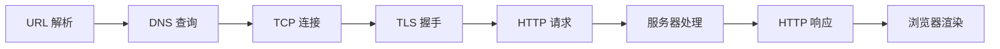

# 从输入 URL 到页面渲染完全指南

当你在浏览器地址栏输入一个 URL 并按下回车，背后会经历 URL 解析、DNS 查询、TCP 连接、TLS 握手、HTTP 请求与响应、服务器处理以及浏览器渲染等一系列步骤，最终将页面呈现在你眼前。

## 1. 概述

### 1.1 全局流程

从输入 URL 到页面渲染完成，整个过程可以用下面的流程图概括：



| 阶段       | 核心任务                         | 关键协议/技术    |
| ---------- | -------------------------------- | ---------------- |
| URL 解析   | 拆解协议、主机名、路径等信息     | URL 规范         |
| DNS 查询   | 将域名解析为 IP 地址             | DNS              |
| TCP 连接   | 建立可靠的传输通道               | TCP 三次握手     |
| TLS 握手   | 建立加密安全通道                 | TLS 1.2 / 1.3    |
| HTTP 请求  | 发送请求报文                     | HTTP/1.1、HTTP/2 |
| 服务器处理 | 路由、业务逻辑、数据库查询等     | 后端框架         |
| HTTP 响应  | 返回状态码、响应头和响应体       | HTTP             |
| 浏览器渲染 | 解析 HTML/CSS/JS，构建渲染树绘制 | 浏览器引擎       |

### 1.2 用 curl -v 观测全过程

`curl -v` 是观测网络请求全过程的利器。一条命令就能看到 DNS 解析、TCP 连接、TLS 握手、HTTP 请求与响应的完整细节：

```bash
curl -v https://httpbin.org/get
```

> **提示**：`-v`（verbose）标志会输出连接过程中每个阶段的详细信息，是理解网络请求流程最直观的方式。

完整输出如下，后续章节会逐段拆解分析：

```text
* Host httpbin.org:443 was resolved.
* IPv6: (none)
* IPv4: 198.18.0.40
*   Trying 198.18.0.40:443...
* Connected to httpbin.org (198.18.0.40) port 443
* ALPN: curl offers h2,http/1.1
* (304) (OUT), TLS handshake, Client hello (1):
*  CAfile: /etc/ssl/cert.pem
*  CApath: none
* (304) (IN), TLS handshake, Server hello (2):
* TLSv1.2 (IN), TLS handshake, Certificate (11):
* TLSv1.2 (IN), TLS handshake, Server key exchange (12):
* TLSv1.2 (IN), TLS handshake, Server finished (14):
* TLSv1.2 (OUT), TLS handshake, Client key exchange (16):
* TLSv1.2 (OUT), TLS change cipher, Change cipher spec (1):
* TLSv1.2 (OUT), TLS handshake, Finished (20):
* TLSv1.2 (IN), TLS change cipher, Change cipher spec (1):
* TLSv1.2 (IN), TLS handshake, Finished (20):
* SSL connection using TLSv1.2 / ECDHE-RSA-AES128-GCM-SHA256 / [blank] / UNDEF
* ALPN: server accepted h2
* Server certificate:
*  subject: CN=httpbin.org
*  start date: Jul 20 00:00:00 2025 GMT
*  expire date: Aug 17 23:59:59 2026 GMT
*  subjectAltName: host "httpbin.org" matched cert's "httpbin.org"
*  issuer: C=US; O=Amazon; CN=Amazon RSA 2048 M03
*  SSL certificate verify ok.
* using HTTP/2
* [HTTP/2] [1] OPENED stream for https://httpbin.org/get
* [HTTP/2] [1] [:method: GET]
* [HTTP/2] [1] [:scheme: https]
* [HTTP/2] [1] [:authority: httpbin.org]
* [HTTP/2] [1] [:path: /get]
* [HTTP/2] [1] [user-agent: curl/8.7.1]
* [HTTP/2] [1] [accept: */*]
> GET /get HTTP/2
> Host: httpbin.org
> User-Agent: curl/8.7.1
> Accept: */*
>
* Request completely sent off
< HTTP/2 200
< date: Sun, 01 Mar 2026 14:54:46 GMT
< content-type: application/json
< content-length: 256
< server: gunicorn/19.9.0
< access-control-allow-origin: *
< access-control-allow-credentials: true
<
{
  "args": {},
  "headers": {
    "Accept": "*/*",
    "Host": "httpbin.org",
    "User-Agent": "curl/8.7.1",
    "X-Amzn-Trace-Id": "Root=1-69a45336-01c9a5360d78dba746e05f2d"
  },
  "origin": "140.235.140.187",
  "url": "https://httpbin.org/get"
}
* Connection #0 to host httpbin.org left intact
```

在这段输出中，可以清晰地看到各阶段的对应关系：

| curl 输出标志             | 对应阶段       |
| ------------------------- | -------------- |
| `Host ... was resolved`   | DNS 查询       |
| `Trying ... Connected to` | TCP 连接       |
| `TLS handshake` 相关行    | TLS 握手       |
| `>` 开头的行              | HTTP 请求      |
| `<` 开头的行              | HTTP 响应      |
| JSON 响应体               | 服务器处理结果 |
