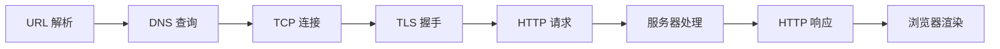
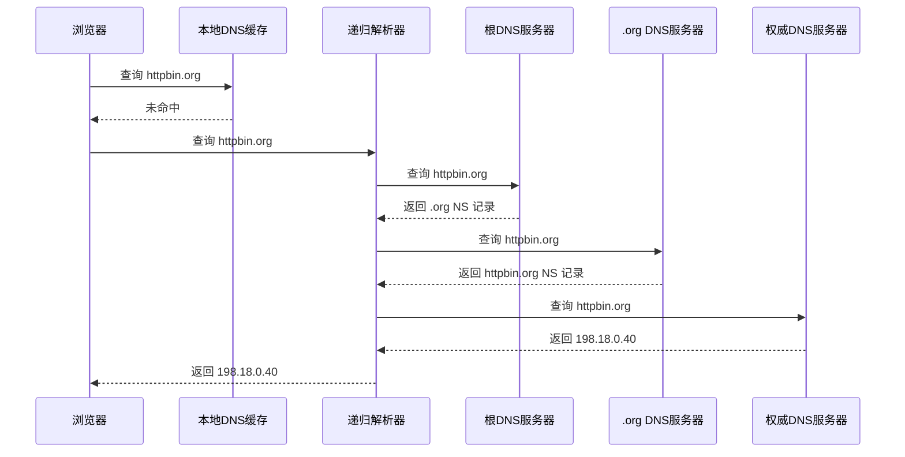
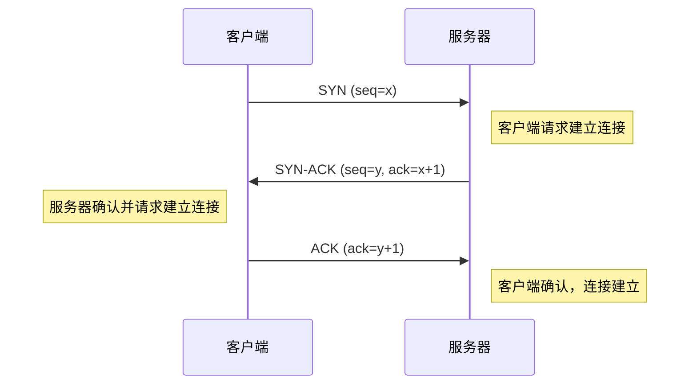

# 从输入 URL 到页面渲染完全指南

当你在浏览器地址栏输入一个 URL 并按下回车，背后会经历 URL 解析、DNS 查询、TCP 连接、TLS 握手、HTTP 请求与响应、服务器处理以及浏览器渲染等一系列步骤，最终将页面呈现在你眼前。

## 1. 概述

### 1.1 全局流程

从输入 URL 到页面渲染完成，整个过程可以用下面的流程图概括：



| 阶段       | 核心任务                         | 关键协议/技术    |
| ---------- | -------------------------------- | ---------------- |
| URL 解析   | 拆解协议、主机名、路径等信息     | URL 规范         |
| DNS 查询   | 将域名解析为 IP 地址             | DNS              |
| TCP 连接   | 建立可靠的传输通道               | TCP 三次握手     |
| TLS 握手   | 建立加密安全通道                 | TLS 1.2 / 1.3    |
| HTTP 请求  | 发送请求报文                     | HTTP/1.1、HTTP/2 |
| 服务器处理 | 路由、业务逻辑、数据库查询等     | 后端框架         |
| HTTP 响应  | 返回状态码、响应头和响应体       | HTTP             |
| 浏览器渲染 | 解析 HTML/CSS/JS，构建渲染树绘制 | 浏览器引擎       |

### 1.2 用 curl -v 观测全过程

`curl -v` 是观测网络请求全过程的利器。一条命令就能看到 DNS 解析、TCP 连接、TLS 握手、HTTP 请求与响应的完整细节：

```bash
curl -v https://httpbin.org/get
```

> **提示**：`-v`（verbose）标志会输出连接过程中每个阶段的详细信息，是理解网络请求流程最直观的方式。

完整输出如下，后续章节会逐段拆解分析：

```text
* Host httpbin.org:443 was resolved.
* IPv6: (none)
* IPv4: 198.18.0.40
*   Trying 198.18.0.40:443...
* Connected to httpbin.org (198.18.0.40) port 443
* ALPN: curl offers h2,http/1.1
* (304) (OUT), TLS handshake, Client hello (1):
*  CAfile: /etc/ssl/cert.pem
*  CApath: none
* (304) (IN), TLS handshake, Server hello (2):
* TLSv1.2 (IN), TLS handshake, Certificate (11):
* TLSv1.2 (IN), TLS handshake, Server key exchange (12):
* TLSv1.2 (IN), TLS handshake, Server finished (14):
* TLSv1.2 (OUT), TLS handshake, Client key exchange (16):
* TLSv1.2 (OUT), TLS change cipher, Change cipher spec (1):
* TLSv1.2 (OUT), TLS handshake, Finished (20):
* TLSv1.2 (IN), TLS change cipher, Change cipher spec (1):
* TLSv1.2 (IN), TLS handshake, Finished (20):
* SSL connection using TLSv1.2 / ECDHE-RSA-AES128-GCM-SHA256 / [blank] / UNDEF
* ALPN: server accepted h2
* Server certificate:
*  subject: CN=httpbin.org
*  start date: Jul 20 00:00:00 2025 GMT
*  expire date: Aug 17 23:59:59 2026 GMT
*  subjectAltName: host "httpbin.org" matched cert's "httpbin.org"
*  issuer: C=US; O=Amazon; CN=Amazon RSA 2048 M03
*  SSL certificate verify ok.
* using HTTP/2
* [HTTP/2] [1] OPENED stream for https://httpbin.org/get
* [HTTP/2] [1] [:method: GET]
* [HTTP/2] [1] [:scheme: https]
* [HTTP/2] [1] [:authority: httpbin.org]
* [HTTP/2] [1] [:path: /get]
* [HTTP/2] [1] [user-agent: curl/8.7.1]
* [HTTP/2] [1] [accept: */*]
> GET /get HTTP/2
> Host: httpbin.org
> User-Agent: curl/8.7.1
> Accept: */*
>
* Request completely sent off
< HTTP/2 200
< date: Sun, 01 Mar 2026 14:54:46 GMT
< content-type: application/json
< content-length: 256
< server: gunicorn/19.9.0
< access-control-allow-origin: *
< access-control-allow-credentials: true
<
{
  "args": {},
  "headers": {
    "Accept": "*/*",
    "Host": "httpbin.org",
    "User-Agent": "curl/8.7.1",
    "X-Amzn-Trace-Id": "Root=1-69a45336-01c9a5360d78dba746e05f2d"
  },
  "origin": "140.235.140.187",
  "url": "https://httpbin.org/get"
}
* Connection #0 to host httpbin.org left intact
```

在这段输出中，可以清晰地看到各阶段的对应关系：

| curl 输出标志             | 对应阶段       |
| ------------------------- | -------------- |
| `Host ... was resolved`   | DNS 查询       |
| `Trying ... Connected to` | TCP 连接       |
| `TLS handshake` 相关行    | TLS 握手       |
| `>` 开头的行              | HTTP 请求      |
| `<` 开头的行              | HTTP 响应      |
| JSON 响应体               | 服务器处理结果 |

## 2. URL 解析

### 2.1 URL 的组成部分

以 `https://httpbin.org/get` 为例，一个完整的 URL 可以拆解为以下几个组成部分：

| 组成部分 | 值            | 说明                                                               |
| -------- | ------------- | ------------------------------------------------------------------ |
| 协议     | `https`       | 指定使用的应用层协议，`https` 表示通过 TLS 加密的 HTTP 通信        |
| 域名     | `httpbin.org` | 目标服务器的主机名，后续需要通过 DNS 解析为 IP 地址                |
| 端口     | `443`（隐含） | HTTPS 默认端口为 443，HTTP 默认为 80，省略时使用协议对应的默认端口 |
| 路径     | `/get`        | 服务器上的资源路径，告诉服务器客户端请求的是哪个资源               |

> **面试提示**：完整的 URL 还可以包含查询参数（`?key=value`）、片段标识符（`#section`）等部分。面试时能完整说出 URL 的各组成部分，说明你对 HTTP 协议有扎实的理解。

### 2.2 浏览器的判断逻辑

当用户在地址栏输入内容并按下回车时，浏览器首先需要判断输入的是一个 URL 还是搜索关键词。判断逻辑大致如下：

1. **包含协议前缀**：如果输入以 `http://` 或 `https://` 开头，直接当作 URL 处理
2. **包含域名特征**：如果输入包含 `.`（如 `httpbin.org`），浏览器倾向于将其视为域名
3. **特殊字符判断**：包含 `://`、`/`、`:` 等 URL 特征字符时，优先作为 URL 处理
4. **其他情况**：将输入内容发送给默认搜索引擎进行搜索

> **面试提示**：这个判断逻辑看似简单，但它解释了为什么输入 `localhost` 会访问本地服务器，而输入一个普通单词会触发搜索。

### 2.3 HSTS 检查

在确定输入是 URL 之后，如果用户输入的是 `http://` 协议，浏览器会检查该域名是否在 **HSTS（HTTP Strict Transport Security）** 列表中。如果是，浏览器会在发出请求之前将 `http://` 强制替换为 `https://`。

HSTS 有两种生效方式：

- **响应头声明**：服务器通过 `Strict-Transport-Security` 响应头告知浏览器在指定时间内只使用 HTTPS 访问该域名。浏览器会将此信息缓存在本地
- **Preload List**：由浏览器厂商维护的内置列表，包含申请加入的域名。即使用户从未访问过该网站，浏览器也会强制使用 HTTPS

> **面试提示**：HSTS 的核心价值在于防止 **SSL 剥离攻击**（SSL Stripping）——攻击者在中间将 HTTPS 降级为 HTTP，从而窃取明文数据。Preload List 则解决了"首次访问"的安全盲区。

## 3. DNS 解析

### 3.1 curl 中的 DNS

回顾 `curl -v` 输出的第一段，可以看到 DNS 解析的结果：

```text
* Host httpbin.org:443 was resolved.
* IPv6: (none)
* IPv4: 198.18.0.40
```

这三行告诉我们：浏览器（或 curl）将域名 `httpbin.org` 解析为了 IP 地址 `198.18.0.40`，没有获取到 IPv6 地址。这个看似简单的结果，背后经历了一套完整的 DNS 查询流程。

### 3.2 DNS 查询流程

DNS 查询采用分层缓存和递归查询机制，完整流程如下：

**缓存层级**（按查询顺序）：

1. **浏览器 DNS 缓存**：浏览器自身维护的缓存，TTL 通常较短（Chrome 默认 60 秒）
2. **操作系统 DNS 缓存**：OS 级别的缓存，如 macOS 的 `mDNSResponder`、Linux 的 `systemd-resolved`
3. **路由器 DNS 缓存**：家用路由器通常会缓存 DNS 记录
4. **ISP DNS 服务器**：互联网服务提供商的 DNS 服务器
5. **递归查询**：如果以上缓存全部未命中，DNS 递归解析器会从根域开始逐级查询

当所有缓存未命中时，递归解析器会执行以下查询过程：



> **面试提示**：面试官常问"DNS 用的是 TCP 还是 UDP？"答案是 **默认使用 UDP**（端口 53），因为 DNS 查询报文通常很小，UDP 的无连接特性更高效。但当响应数据超过 512 字节（如区域传输）时会切换到 TCP。

### 3.3 DNS 优化

在实际开发中，有多种 DNS 优化手段可以提升页面加载速度：

- **DNS over HTTPS（DoH）**：将 DNS 查询通过 HTTPS 加密传输，防止 DNS 劫持和窃听。主流浏览器（Chrome、Firefox）已默认支持
- **dns-prefetch**：通过 HTML 标签提前解析第三方域名的 DNS，减少后续请求的延迟：

```html
<link rel="dns-prefetch" href="//cdn.example.com" />
<link rel="dns-prefetch" href="//api.example.com" />
```

- **preconnect**：比 `dns-prefetch` 更进一步，提前完成 DNS + TCP + TLS 的全部连接步骤：

```html
<link rel="preconnect" href="https://cdn.example.com" />
```

> **面试提示**：`dns-prefetch` 和 `preconnect` 是前端性能优化的常见考点。关键区别是 `dns-prefetch` 只做 DNS 解析，而 `preconnect` 会建立完整连接。对于关键资源用 `preconnect`，对于可能用到的资源用 `dns-prefetch`。

## 4. TCP 连接

### 4.1 curl 中的 TCP

DNS 解析拿到 IP 地址后，下一步就是建立 TCP 连接。`curl -v` 输出中对应的部分：

```text
*   Trying 198.18.0.40:443...
* Connected to httpbin.org (198.18.0.40) port 443
```

`Trying` 表示正在向目标 IP 的 443 端口发起 TCP 连接，`Connected` 表示三次握手已经成功完成，连接建立。

### 4.2 三次握手

TCP 使用三次握手（Three-Way Handshake）来建立可靠连接。这个过程确保通信双方都具备发送和接收数据的能力：



三次握手各步骤详解：

1. **SYN（同步）**：客户端发送 SYN 报文，携带一个随机初始序列号 `x`，表示请求建立连接。客户端进入 `SYN_SENT` 状态
2. **SYN-ACK（同步确认）**：服务器收到 SYN 后，回复 SYN-ACK 报文，携带自己的随机初始序列号 `y`，并将确认号设为 `x+1`。服务器进入 `SYN_RCVD` 状态
3. **ACK（确认）**：客户端收到 SYN-ACK 后，发送 ACK 报文，确认号为 `y+1`。双方进入 `ESTABLISHED` 状态，连接建立完成

### 4.3 为什么是三次握手

面试中经常会问："为什么 TCP 需要三次握手，两次不行吗？"

核心原因是**防止历史连接请求导致资源浪费**。考虑以下场景：

1. 客户端发送了一个 SYN 请求（第一次），但由于网络延迟，这个包在网络中滞留了
2. 客户端超时后重新发送了新的 SYN 并成功建立连接、完成通信、关闭连接
3. 此时那个滞留的旧 SYN 到达了服务器

如果只有两次握手，服务器收到旧 SYN 后会直接建立连接并分配资源，但客户端不会响应这个连接，导致服务器资源被白白占用。

有了三次握手，服务器回复 SYN-ACK 后需要等待客户端的 ACK 确认。客户端收到这个 SYN-ACK 后，发现不是自己发起的连接请求，会回复 RST（重置）报文，服务器随即释放资源。

> **面试提示**：三次握手的本质是**确认双方的发送和接收能力**。第一次握手确认客户端能发送，第二次确认服务器能接收和发送，第三次确认客户端能接收。这是建立可靠双向通信的最小次数。
