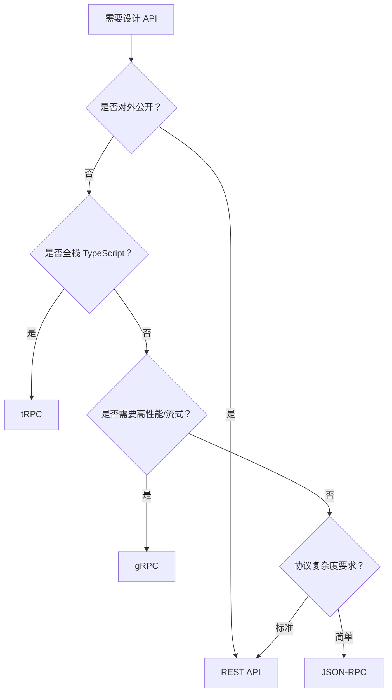

# RPC 与 HTTP 完全指南 Implementation Plan

> **For Claude:** REQUIRED SUB-SKILL: Use superpowers:executing-plans to implement this plan task-by-task.

**Goal:** 编写一篇面向全栈/前端开发者的技术指南，深入对比 RPC 与 HTTP 的设计思想、主流实现，并提供选型指南。

**Architecture:** 单文件 Markdown 文档，按章节线性展开，每章独立撰写后合并。概念驱动结构，从认知建立（HTTP/RPC 本质）到工具选型（gRPC/tRPC/JSON-RPC），最终提供决策矩阵。

**Tech Stack:** Markdown、Mermaid（流程图）、TypeScript/Node.js 代码示例

---

### Task 1：初始化文件结构

**Files:**

- Create: `docs/rpc-vs-http-guide.md`

**Step 1: 创建文件，写入标题和文档骨架**

```markdown
# RPC 与 HTTP 完全指南

## 1. 概述

## 2. HTTP 的设计哲学

## 3. RPC 的设计哲学

## 4. 主流 RPC 实现

## 5. 深度对比

## 6. 选型指南

## 7. 总结

## 参考资源
```

**Step 2: 确认文件已创建**

```bash
ls docs/rpc-vs-http-guide.md
```

**Step 3: Commit**

```bash
git add docs/rpc-vs-http-guide.md
git commit -m "docs: init rpc-vs-http-guide skeleton"
```

---

### Task 2：撰写第 1 章 — 概述

**Files:**

- Modify: `docs/rpc-vs-http-guide.md`

**Step 1: 撰写 1.1 为什么要了解 RPC**

解释当前前端/全栈开发者接触 RPC 的背景：微服务兴起、BFF 层需求、类型安全诉求。

**Step 2: 撰写 1.2 HTTP 与 RPC 的本质区别**

用一句话对比核心抽象：

- HTTP/REST：「资源」抽象 → `GET /users/1`
- RPC：「函数调用」抽象 → `getUser(1)`

包含对比表格：

| 维度     | HTTP/REST          | RPC              |
| -------- | ------------------ | ---------------- |
| 核心抽象 | 资源（名词）       | 函数调用（动词） |
| 接口描述 | URL + HTTP 方法    | 函数签名         |
| 数据格式 | JSON（通常）       | Protobuf / JSON  |
| 传输协议 | HTTP/1.1 或 HTTP/2 | HTTP/2、TCP 等   |

**Step 3: 撰写 1.3 典型使用场景概览**

| 场景                 | 推荐方式 | 原因               |
| -------------------- | -------- | ------------------ |
| 对外公开 API         | REST     | 通用性强，易于消费 |
| 微服务内部通信       | gRPC     | 高性能，强类型     |
| 全栈 TypeScript 项目 | tRPC     | 端到端类型安全     |
| 简单跨系统集成       | JSON-RPC | 轻量，易实现       |

**Step 4: Commit**

```bash
git add docs/rpc-vs-http-guide.md
git commit -m "docs(rpc-http): add chapter 1 overview"
```

---

### Task 3：撰写第 2 章 — HTTP 的设计哲学

**Files:**

- Modify: `docs/rpc-vs-http-guide.md`

**Step 1: 撰写 2.1 HTTP 协议基础**

覆盖：

- HTTP 方法语义（GET/POST/PUT/PATCH/DELETE）
- 常用状态码分类（2xx/4xx/5xx）
- Header 的作用（Content-Type、Authorization 等）

用表格展示方法语义：

| 方法   | 语义     | 幂等性 | 安全性 |
| ------ | -------- | ------ | ------ |
| GET    | 读取资源 | ✅     | ✅     |
| POST   | 创建资源 | ❌     | ❌     |
| PUT    | 全量更新 | ✅     | ❌     |
| PATCH  | 部分更新 | ❌     | ❌     |
| DELETE | 删除资源 | ✅     | ❌     |

**Step 2: 撰写 2.2 REST 六大约束**

Fielding 论文定义的六大约束：

1. 客户端-服务器（Client-Server）
2. 无状态（Stateless）
3. 可缓存（Cacheable）
4. 统一接口（Uniform Interface）
5. 分层系统（Layered System）
6. 按需代码（Code on Demand，可选）

**Step 3: 撰写 2.3 REST API 设计规范**

包含 TypeScript Express 代码示例：

```typescript
// ✅ RESTful 风格：资源导向，使用名词
app.get('/users/:id', async (req, res) => {
  const user = await UserService.findById(req.params.id)
  res.json(user)
})

// ❌ RPC 风格混入 REST：使用动词
app.post('/getUser', ...)
app.post('/createUser', ...)
```

URL 设计规范表格（名词复数、层级关系等）。

**Step 4: 撰写 2.4 REST 的局限性**

- 过度获取（Over-fetching）和获取不足（Under-fetching）
- 接口版本管理复杂
- 缺乏类型约束，前后端接口漂移
- HTTP/1.1 队头阻塞问题

**Step 5: Commit**

```bash
git add docs/rpc-vs-http-guide.md
git commit -m "docs(rpc-http): add chapter 2 HTTP design philosophy"
```

---

### Task 4：撰写第 3 章 — RPC 的设计哲学

**Files:**

- Modify: `docs/rpc-vs-http-guide.md`

**Step 1: 撰写 3.1 什么是 RPC**

RPC（Remote Procedure Call，远程过程调用）：让远程调用像本地函数调用一样自然。

```typescript
// 本地调用
const user = userService.getUser(1)

// RPC 调用（感觉和本地一样）
const user = await client.getUser({ id: 1 })

// REST 调用（需要手动拼 URL、处理响应）
const res = await fetch('/users/1')
const user = await res.json()
```

**Step 2: 撰写 3.2 接口定义语言（IDL）**

- 什么是 IDL：用于定义服务接口的语言，独立于编程语言
- gRPC 使用 `.proto` 文件

```protobuf
// user.proto
syntax = "proto3";

service UserService {
  rpc GetUser (GetUserRequest) returns (User);
  rpc ListUsers (ListUsersRequest) returns (ListUsersResponse);
}

message GetUserRequest {
  int32 id = 1;
}

message User {
  int32 id = 1;
  string name = 2;
  string email = 3;
}
```

**Step 3: 撰写 3.3 类型安全与代码生成**

通过 IDL 自动生成客户端/服务端代码，消除手写类型定义的需求。

**Step 4: 撰写 3.4 RPC 的工作机制**

ASCII 图解展示调用链：

```
客户端                        服务端
  │                             │
  │  client.getUser({id: 1})    │
  │──────────────────────────>  │
  │  序列化（Protobuf/JSON）     │
  │  HTTP/2 传输                │
  │                    反序列化  │
  │                  执行函数    │
  │  <──────────────────────── │
  │  反序列化响应                │
  │  返回 User 对象             │
```

**Step 5: Commit**

```bash
git add docs/rpc-vs-http-guide.md
git commit -m "docs(rpc-http): add chapter 3 RPC design philosophy"
```

---

### Task 5：撰写第 4 章 — 主流 RPC 实现

**Files:**

- Modify: `docs/rpc-vs-http-guide.md`

**Step 1: 撰写 4.1 gRPC**

背景：Google 开发，基于 Protobuf + HTTP/2。

包含完整示例：

- `.proto` 服务定义
- TypeScript 服务端实现（使用 `@grpc/grpc-js`）
- TypeScript 客户端调用

```typescript
// server.ts
import * as grpc from '@grpc/grpc-js'
import * as protoLoader from '@grpc/proto-loader'

// 加载 proto 定义
const packageDef = protoLoader.loadSync('user.proto')
const proto = grpc.loadPackageDefinition(packageDef) as any

// 实现服务
const server = new grpc.Server()
server.addService(proto.UserService.service, {
  getUser: (call: any, callback: any) => {
    const user = { id: call.request.id, name: 'Alice', email: 'alice@example.com' }
    callback(null, user)
  }
})
```

gRPC 特性总结表格（流式、双向流、拦截器等）。

**Step 2: 撰写 4.2 tRPC**

背景：TypeScript 生态专属，端到端类型安全，无需代码生成。

```typescript
// server/router.ts
import { initTRPC } from '@trpc/server'
import { z } from 'zod'

const t = initTRPC.create()

export const appRouter = t.router({
  // 定义 getUser 查询
  getUser: t.procedure
    .input(z.object({ id: z.number() }))
    .query(async ({ input }) => {
      return { id: input.id, name: 'Alice', email: 'alice@example.com' }
    }),
})

export type AppRouter = typeof appRouter
```

```typescript
// client/index.ts
import { createTRPCClient, httpBatchLink } from '@trpc/client'
import type { AppRouter } from '../server/router'

const client = createTRPCClient<AppRouter>({
  links: [httpBatchLink({ url: 'http://localhost:3000/trpc' })]
})

// ✅ 完整类型推导，无需手写类型
const user = await client.getUser.query({ id: 1 })
```

**Step 3: 撰写 4.3 JSON-RPC**

背景：轻量级 RPC 协议，使用 JSON 格式，规范简单。

```typescript
// JSON-RPC 2.0 请求格式
const request = {
  jsonrpc: '2.0',
  method: 'getUser',
  params: { id: 1 },
  id: 1
}

// JSON-RPC 2.0 响应格式
const response = {
  jsonrpc: '2.0',
  result: { id: 1, name: 'Alice' },
  id: 1
}
```

**Step 4: Commit**

```bash
git add docs/rpc-vs-http-guide.md
git commit -m "docs(rpc-http): add chapter 4 mainstream RPC implementations"
```

---

### Task 6：撰写第 5 章 — 深度对比

**Files:**

- Modify: `docs/rpc-vs-http-guide.md`

**Step 1: 撰写 5.1 性能对比**

| 维度       | REST/HTTP    | gRPC               | tRPC               | JSON-RPC   |
| ---------- | ------------ | ------------------ | ------------------ | ---------- |
| 序列化格式 | JSON（文本） | Protobuf（二进制） | JSON               | JSON       |
| 传输协议   | HTTP/1.1     | HTTP/2             | HTTP/1.1 或 HTTP/2 | HTTP       |
| 连接复用   | Keep-Alive   | 多路复用           | 取决于传输层       | 取决于实现 |
| 性能       | 中           | 高                 | 中                 | 中         |

**Step 2: 撰写 5.2 类型安全对比**

| 方案     | 类型安全        | 实现方式           | 前后端同步 |
| -------- | --------------- | ------------------ | ---------- |
| REST     | ❌ 无原生支持   | 手写类型 / OpenAPI | 需额外工具 |
| gRPC     | ✅ 强类型       | `.proto` 代码生成  | 自动同步   |
| tRPC     | ✅ 极致类型安全 | TypeScript 推导    | 自动同步   |
| JSON-RPC | ❌ 无原生支持   | 手写类型           | 需额外工具 |

**Step 3: 撰写 5.3 学习曲线与生态**

各方案的学习成本、社区规模、工具链成熟度对比表格。

**Step 4: 撰写 5.4 综合对比总表**

大型综合表格，覆盖所有维度。

**Step 5: Commit**

```bash
git add docs/rpc-vs-http-guide.md
git commit -m "docs(rpc-http): add chapter 5 deep comparison"
```

---

### Task 7：撰写第 6 章 — 选型指南

**Files:**

- Modify: `docs/rpc-vs-http-guide.md`

**Step 1: 撰写 6.1 场景矩阵**

| 场景                     | 推荐方案             | 理由                         |
| ------------------------ | -------------------- | ---------------------------- |
| 对外公开 API             | REST                 | 通用性强，任意客户端消费     |
| 微服务内部通信           | gRPC                 | 高性能，强类型，流式支持     |
| 全栈 TypeScript 单体     | tRPC                 | 端到端类型安全，无需代码生成 |
| 前后端分离（TypeScript） | tRPC 或 REST+OpenAPI | 根据团队规模决定             |
| 异构语言微服务           | gRPC                 | 跨语言代码生成               |
| 简单集成/脚本            | JSON-RPC             | 协议简单，易实现             |
| 移动端 API               | REST 或 gRPC         | REST 易调试，gRPC 省流量     |

**Step 2: 撰写 6.2 决策流程图（Mermaid）**



**Step 3: Commit**

```bash
git add docs/rpc-vs-http-guide.md
git commit -m "docs(rpc-http): add chapter 6 selection guide"
```

---

### Task 8：撰写第 7 章 — 总结与参考资源

**Files:**

- Modify: `docs/rpc-vs-http-guide.md`

**Step 1: 撰写速查表**

| 技术     | 协议      | 序列化   | 类型安全   | 适用场景   |
| -------- | --------- | -------- | ---------- | ---------- |
| REST     | HTTP/1.1+ | JSON     | 无原生     | 公开 API   |
| gRPC     | HTTP/2    | Protobuf | 强（IDL）  | 微服务内部 |
| tRPC     | HTTP      | JSON     | 极致（TS） | 全栈 TS    |
| JSON-RPC | HTTP/TCP  | JSON     | 无原生     | 简单集成   |

**Step 2: 撰写参考资源**

- gRPC 官方文档
- tRPC 官方文档
- JSON-RPC 2.0 规范
- Roy Fielding REST 论文
- HTTP/2 RFC

**Step 3: 运行格式化**

```bash
npm run format
```

**Step 4: 最终 Commit**

```bash
git add docs/rpc-vs-http-guide.md
git commit -m "docs(rpc-http): add chapter 7 summary and complete guide"
```

---

### Task 9：审校与内容验证

**Files:**

- Modify: `docs/rpc-vs-http-guide.md`（如有修改）

**Step 1: 自我审校**

检查项：

- [ ] 章节编号格式正确（`## 1.`、`### 1.1`）
- [ ] 代码块均标注语言类型
- [ ] 中文注释完整
- [ ] 表格对齐规范
- [ ] Mermaid 语法正确
- [ ] 无目录、无 `---` 分隔线

**Step 2: 通过 web fetch 验证关键技术信息**

- 验证 gRPC TypeScript API 准确性（`@grpc/grpc-js` 用法）
- 验证 tRPC 最新 API 用法（v11）
- 验证 JSON-RPC 2.0 协议规范

**Step 3: 最终格式化**

```bash
npm run format
```

**Step 4: 最终提交**

```bash
git add docs/rpc-vs-http-guide.md
git commit -m "docs(rpc-http): finalize guide with review fixes"
```
