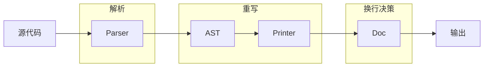
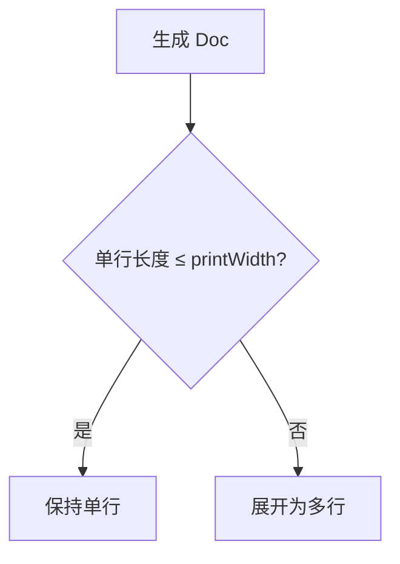

# Prettier 基础概念与原理

## 1. 概述

### 1.1 什么是 Prettier

Prettier 是一个「固执己见」（Opinionated）的代码格式化工具。它通过解析代码并按照自己的规则重新打印，强制执行一致的代码风格。

**核心特性：**

| 特性     | 说明                                            |
| -------- | ----------------------------------------------- |
| 固执己见 | 提供极少的配置选项，自动决定代码风格            |
| 多语言   | 支持 JavaScript、TypeScript、CSS、HTML、JSON 等 |
| 跨编辑器 | VS Code、WebStorm、Vim 等主流编辑器均有插件支持 |
| 零配置   | 开箱即用，无需繁琐配置                          |
| 集成友好 | 可与 ESLint、Git Hooks、CI/CD 等工具无缝集成    |

**格式化前后对比：**

```
❌ 格式化前：风格混乱
function example(  a,b,c){return a+b+c}
const obj={foo:1,bar:2,baz:3}
```

```javascript
// ✅ 格式化后：统一整洁
function example(a, b, c) {
  return a + b + c;
}
const obj = { foo: 1, bar: 2, baz: 3 };
```

### 1.2 Prettier vs Linter

Prettier 和 Linter（如 ESLint）是两种不同类型的工具，各有侧重。

| 对比维度   | Prettier（格式化工具） | ESLint（代码检查工具）         |
| ---------- | ---------------------- | ------------------------------ |
| 核心功能   | 代码格式化             | 代码质量检查                   |
| 关注点     | 代码「长什么样」       | 代码「有没有问题」             |
| 规则类型   | 纯格式规则             | 格式规则 + 代码质量规则        |
| 配置复杂度 | 极少选项               | 大量可配置规则                 |
| 自动修复   | 完全重写代码           | 部分规则可自动修复             |
| 典型场景   | 缩进、换行、引号、分号 | 未使用变量、类型错误、最佳实践 |

**Linter 规则分类：**

| 规则类型     | 说明                    | 示例                 | 建议工具 |
| ------------ | ----------------------- | -------------------- | -------- |
| 格式化规则   | 代码外观样式            | 缩进、空格、换行     | Prettier |
| 代码质量规则 | 可能导致 bug 的代码模式 | 未使用变量、无效比较 | ESLint   |

**最佳实践：Prettier + ESLint 配合使用**

```
Prettier 处理：格式问题
const x=1    →    const x = 1;

ESLint 处理：代码质量问题
const unused = 1;   ⚠️ 'unused' is defined but never used
if (x = 1) {}       ⚠️ Expected a conditional expression
```

> **提示**：使用 `eslint-config-prettier` 可以关闭 ESLint 中与 Prettier 冲突的格式化规则，让两者和平共处。

## 2. 设计哲学

Prettier 的设计基于两个核心理念，它们决定了 Prettier 与其他格式化工具的本质区别。

### 2.1 Opinionated：用约束换自由

Prettier 自称「固执己见」（Opinionated），有意只提供极少的配置选项。

| 传统工具             | Prettier                   |
| -------------------- | -------------------------- |
| 数十个风格选项需决定 | 仅 printWidth、tabWidth 等 |
| 团队争论每个细节     | 没有选择就没有争论         |
| 配置文件冗长复杂     | 几行配置开箱即用           |

这个设计的本质是**用约束换自由**：放弃对格式的控制权，换来不再需要思考格式的自由。团队不再争论「单引号还是双引号」，Code Review 专注于代码逻辑。

### 2.2 完全重写：抛弃原始格式

Prettier 不做局部修改，而是将代码解析后**完全重新打印**。

```
输入（三种不同格式）          输出（完全相同）
───────────────────────────────────────────
const x=1+2;            →
const x = 1 + 2;        →    const x = 1 + 2;
const x =    1    +  2; →
```

| 优势             | 代价                         |
| ---------------- | ---------------------------- |
| 输出 100% 一致   | 无法保留作者的手动对齐       |
| 实现简单可靠     | 某些「艺术性」排版会被重置   |
| 不受原始格式干扰 | 需要接受 Prettier 的审美判断 |

## 3. 工作原理

本节深入讲解 Prettier 的技术实现。

### 3.1 整体流程

Prettier 的格式化分为四个阶段：



| 阶段   | 职责                         |
| ------ | ---------------------------- |
| Parser | 将源代码转换为 AST           |
| AST    | 丢弃格式信息，只保留语义     |
| Doc    | 生成中间表示，描述可能的布局 |
| 输出   | 根据 printWidth 选择最终布局 |

### 3.2 解析阶段

Parser 将源代码字符串转换为抽象语法树（AST）。Prettier 根据文件类型自动选择对应的解析器（如 babel 处理 JS，typescript 处理 TS）。

**示例：代码到 AST**

```javascript
const x = 1 + 2;
```

```
Program
└── VariableDeclaration (const)
    └── VariableDeclarator
        ├── Identifier (x)
        └── BinaryExpression (+)
            ├── NumericLiteral (1)
            └── NumericLiteral (2)
```

AST 是一棵树，每个节点代表代码的一个语法单元。注意：AST 只记录「代码是什么」，不记录「代码长什么样」。

### 3.3 完全重写与 AST

这是「完全重写」策略的技术基础。AST 在解析时**丢弃了所有格式信息**：

| 保留         | 丢弃               |
| ------------ | ------------------ |
| 变量名、值   | 空格数量           |
| 运算符、语句 | 换行位置           |
| 代码结构     | 缩进风格           |
| 注释内容     | 原始的括号换行方式 |

这意味着无论输入的格式多么混乱，解析后得到的 AST 都是相同的：

```
const x=1+2;               ─┐
const x = 1 + 2;            ├── 同一个 AST ──→ const x = 1 + 2;
const x =    1    +    2;  ─┘
```

Prettier 从 AST「重新打印」代码，而不是修改原始字符串。这就是输出总是一致的原因。

### 3.4 中间表示与换行算法

Printer 不直接输出字符串，而是生成一种中间表示（Doc）。Doc 描述了代码**可能的布局方式**，让 Prettier 可以在输出前「测量」。

**换行决策过程：**



**实际效果：**

```javascript
// printWidth = 80，内容短 → 单行
const user = { name: "Alice", age: 30 };

// printWidth = 80，内容长 → 自动展开
const user = {
  name: "Alice",
  age: 30,
  email: "alice@example.com",
  address: "123 Main St",
};
```

| 场景       | Prettier 行为                       |
| ---------- | ----------------------------------- |
| 对象字面量 | 短则单行，长则每个属性一行          |
| 函数参数   | 短则单行，长则每个参数一行          |
| 链式调用   | 短则单行，长则每个 `.method()` 一行 |
| 数组       | 短则单行，长则每个元素一行          |

这就是为什么开发者无需手动决定何时换行——Prettier 会根据 `printWidth` 自动做出最佳选择。

## 4. 支持范围

### 4.1 内置支持的语言

Prettier 开箱即用支持以下语言，无需安装额外插件。

**JavaScript / TypeScript 系列**

| 语言       | 解析器               | 文件扩展名      |
| ---------- | -------------------- | --------------- |
| JavaScript | babel, espree        | .js, .mjs, .cjs |
| JSX        | babel                | .jsx            |
| TypeScript | typescript, babel-ts | .ts, .mts, .cts |
| TSX        | typescript, babel-ts | .tsx            |

**样式语言**

| 语言 | 解析器 | 文件扩展名 |
| ---- | ------ | ---------- |
| CSS  | css    | .css       |
| Less | less   | .less      |
| SCSS | scss   | .scss      |

**标记语言**

| 语言       | 解析器   | 文件扩展名      |
| ---------- | -------- | --------------- |
| HTML       | html     | .html           |
| Vue        | vue      | .vue            |
| Angular    | angular  | .component.html |
| Markdown   | markdown | .md, .markdown  |
| MDX        | mdx      | .mdx            |
| Handlebars | glimmer  | .hbs            |

**数据格式**

| 格式    | 解析器  | 文件扩展名     |
| ------- | ------- | -------------- |
| JSON    | json    | .json          |
| JSON5   | json5   | .json5         |
| YAML    | yaml    | .yml, .yaml    |
| GraphQL | graphql | .graphql, .gql |

### 4.2 插件扩展

以下语言需要安装社区或官方提供的插件。

| 语言/格式       | 插件名称                    | 安装命令                                   |
| --------------- | --------------------------- | ------------------------------------------ |
| PHP             | @prettier/plugin-php        | npm install -D @prettier/plugin-php        |
| Ruby            | @prettier/plugin-ruby       | npm install -D @prettier/plugin-ruby       |
| Java            | prettier-plugin-java        | npm install -D prettier-plugin-java        |
| XML             | @prettier/plugin-xml        | npm install -D @prettier/plugin-xml        |
| SQL             | prettier-plugin-sql         | npm install -D prettier-plugin-sql         |
| Blade (Laravel) | prettier-plugin-blade       | npm install -D prettier-plugin-blade       |
| Tailwind CSS    | prettier-plugin-tailwindcss | npm install -D prettier-plugin-tailwindcss |
| Svelte          | prettier-plugin-svelte      | npm install -D prettier-plugin-svelte      |
| Astro           | prettier-plugin-astro       | npm install -D prettier-plugin-astro       |

**插件使用示例：**

```javascript
// prettier.config.js
export default {
  plugins: ["prettier-plugin-tailwindcss"],
};
```

```bash
# 安装并使用 PHP 插件
npm install --save-dev prettier @prettier/plugin-php
npx prettier --write "**/*.php"
```

### 4.3 Prettier 的边界

Prettier 不是万能的，了解它的边界很重要。

**Prettier 能做什么：**

| 能力     | 说明                         |
| -------- | ---------------------------- |
| 统一格式 | 强制执行一致的代码风格       |
| 自动换行 | 根据行宽自动处理换行         |
| 缩进对齐 | 自动处理缩进和对齐           |
| 语法美化 | 括号、引号、分号等的统一处理 |

**Prettier 不能做什么：**

| 限制         | 说明                                                 |
| ------------ | ---------------------------------------------------- |
| 代码质量检查 | 不检测未使用变量、类型错误等（用 ESLint/TypeScript） |
| 代码逻辑优化 | 不会改变代码逻辑或性能优化                           |
| 命名规范检查 | 不检查变量、函数命名是否符合规范（用 ESLint）        |
| 导入排序     | 默认不排序 import 语句（需要插件或 ESLint 规则）     |
| 注释格式化   | 不格式化注释内容（保留原样）                         |
| 任意语言支持 | 只支持有 Parser 的语言                               |

**与其他工具的配合：**

```
┌────────────────────────────────────────────────┐
│                   代码质量保障体系                │
├────────────────────────────────────────────────┤
│                                                │
│  ┌──────────┐  ┌──────────┐  ┌──────────┐      │
│  │ Prettier │  │  ESLint  │  │TypeScript│      │
│  │          │  │          │  │          │      │
│  │  格式化   │  │ 代码质量  │  │ 类型检查   │      │
│  └──────────┘  └──────────┘  └──────────┘      │
│       │             │             │            │
│       └─────────────┴─────────────┘            │
│                     │                          │
│              ┌──────────────┐                  │
│              │   Git Hooks  │                  │
│              │  (Husky等)   │                  │
│              └──────────────┘                  │
│                                                │
└────────────────────────────────────────────────┘
```

## 5. 总结

### 5.1 核心要点回顾

| 要点     | 说明                                                       |
| -------- | ---------------------------------------------------------- |
| 定位     | 固执己见的代码格式化工具                                   |
| 设计哲学 | Opinionated（用约束换自由）、完全重写（抛弃原始格式）      |
| 工作原理 | 源代码 → Parser → AST → Printer → Doc → 输出               |
| 关键技术 | AST 丢弃格式实现「完全重写」；Doc 中间表示实现「智能换行」 |
| 支持范围 | 内置支持前端主流语言，其他语言通过插件支持                 |

### 5.2 适用场景

| 场景     | 建议                              |
| -------- | --------------------------------- |
| 新项目   | 直接引入 Prettier，越早越好       |
| 团队协作 | 统一配置，配合 Git Hooks 强制执行 |
| 个人项目 | 可选，但能提升编码体验            |
| 遗留项目 | 逐步引入，先格式化新代码          |

### 5.3 速查表

| 概念        | 说明                                    |
| ----------- | --------------------------------------- |
| Opinionated | 固执己见，有主张的                      |
| AST         | 抽象语法树（Abstract Syntax Tree）      |
| Doc/IR      | 中间表示（Intermediate Representation） |
| Parser      | 解析器，将代码转换为 AST                |
| Printer     | 打印器，将 AST 转换为格式化代码         |
| printWidth  | 行宽，超出后自动换行（默认 80）         |
| Plugin      | 插件，扩展 Prettier 支持新语言          |

## 参考资源

- [Prettier 官方文档](https://prettier.io/docs/)
- [Prettier vs. Linters](https://prettier.io/docs/en/comparison)
- [Option Philosophy](https://prettier.io/docs/en/option-philosophy)
- [Prettier Plugins](https://prettier.io/docs/en/plugins)
- [Prettier GitHub 仓库](https://github.com/prettier/prettier)
- [eslint-config-prettier](https://github.com/prettier/eslint-config-prettier)
